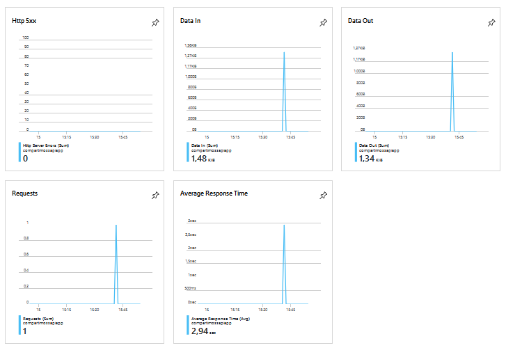

Cuando se desarrolla software es muy importante considerar la posibilidad de exponer su funcionalidad al mundo exterior, de tal forma que otros programas puedan acceder a la información y procesamiento de datos ofrecidos por el software. Las rutinas, protocolos de comunicación y herramientas para exponer la funcionalidad se conocen como APIs, Application Programming Interfaces. Aunque existen varios Frameworks para definir APIs, el mundo moderno se ha prácticamente unificado en el uso de APIs REST (REpresentational State Transfer). REST es popular debido a su simplicidad y el hecho de que se basa en los sistemas y características existentes del protocolo HTTP de Internet con el fin de lograr sus objetivos, a diferencia de la creación de nuevos estándares, Frameworks y tecnologías. Para encontrar más información sobre REST y SharePoint, revise los artículos publicados anteriormente en CompartiMOSS número 22 "REST, WebAPI 2 y SharePoint 2013 - Introducción" (http://www.compartimoss.com/revistas/numero-22/rest-webapi-2-sharepoint-2013-introduccion) y CompartiMOSS número 23 "REST, WebAPI 2 y SharePoint 2013 – WebAPI y Odata" (http://www.compartimoss.com/revistas/numero-23/rest-webapi-2-y-sharepoint-2013-webapi-y-odata).

El servicio de Azure API Apps ofrece toda la infraestructura de PaaS para alojar APIs de REST, de tal forma que solamente es necesario pensar en el diseño y desarrollo del código y no en la creación y mantenimiento de hardware. El servicio ofrece, fuera del hosting, soporte de autenticación por medio de Azure Active Directory y OAuth, acepta APIs escritos utilizando .NET, PHP, Node.js, Java o Python, proporciona soporte para CORS (Cross-Origin Resource Sharing), integración con Azure API Management y Azure Logic Apps y uso de Swagger para generar cross-platform SDKs (Software Development Kits).

Aunque Office 365 y, especialmente, SharePoint Online disponen de un set completo de APIs REST que cubre prácticamente toda la funcionalidad base, es necesario frecuentemente crear APIs personalizados para exponer funcionalidad especializada que no se encuentra por defecto en el sistema, para dar acceso a procesos específicos para una empresa, o para permitir la ejecución automatizada de métodos dentro de SharePoint inicializados por otros sistemas (integración con sistemas externos).

**Creación del Servicio de Azure API Apps**

Para poder utilizar el servicio es necesario primero crear una instancia en su suscripción de Azure. Utilice credenciales de administrador en el portal de Azure ([https://portal.azure.com](https://portal.azure.com/)) y cree o reutilice un Grupo de Recursos. Dentro del Grupo, agregue un "App Service Plan" indicando su nombre, sistema operativo (Windows), localización y nivel de precios, el que determina las características y costos de los recursos asociados a la aplicación. Existen múltiples planes para escoger, incluyendo uno gratis que ofrece infraestructura compartida, 1 GB de memoria y 60 minutos de tiempo de computación al día sin costos agregados, ideal para utilizar en el proceso de desarrollo.

Cuando el plan de servicios ha terminado de ser creado, agregue un servicio del tipo "API App" indicando su nombre y el plan de servicios creado anteriormente. Opcionalmente se le puede acoplar un servicio de "Application Insights" para colectar datos de monitoreo extendidos sobre el uso del API App; el servicio de API App recopila alguna información básica por defecto, y la muestra en la ventana de manejo del servicio:



**P****rogramación de una API REST**

Para programar una API REST utilice Visual Studio (versión 2019 utilizada en el siguiente ejemplo). Abra Visual Studio y cree una nueva solución del tipo "ASP.NET Web Application (.NET Framework)" que se puede encontrar filtrando las plantillas de proyectos por "C#", "Windows" y "Web":


Asígnele un nombre y localización a la Solución y luego seleccione "Web API" en el tipo de aplicaciones a elegir. La plantilla de Visual Studio crea una aplicación completamente funcional que se puede compilar y hacer funcionar sin cambiar nada de código.

En el siguiente ejemplo se va a crear un API que permite clonar Listas de SharePoint. Esta es funcionalidad que no existe por defecto en SharePoint: copiar todos los elementos de una Lista de origen a un destino. El ejemplo es básico, simplemente copia elementos de una Lista a otra sin hacer ningún tipo de chequeo de validación y no copia historial de versiones ni autorización. La cuenta que ejecuta el código debe tener permisos de leer/escribir en ambas Listas, y las Listas deben tener la misma estructura (y nombres) de campos y estar localizadas en la misma Colección de Sitios y sitio Web raíz de la Colección. Como se ha dicho, el ejemplo es muy básico y no dispone de código para atrapar errores, pero se puede tomar como punto de partida y extenderlo para crear software más robusto.

Una vez creada la Solución, añada el NuGet "SharePointPnPCoreOnline" para obtener los componentes necesarios para programar contra SharePoint Online, y el NuGet "Swashbuckle" que agrega los componentes para Swagger (más adelante se explica su uso).

En el proyecto de Visual Studio abra el panel de "Solution Explorer", expanda el nodo "Controllers" y agregue un nuevo controlador del tipo "Web API 2 Controller - Empty" llamado "ClonListController.cs". En la ventana de edición del nuevo controlador comience definiendo directivas a "using Microsoft.SharePoint.Client;" y "using System.Security;" al principio del código. Luego reemplace todo el código fuente dentro de la clase "ClonListController" que fue creado por defecto, con el siguiente código:

```
[HttpGet][System.Web.Http.Route("Api/CopyItems")]public void CopyItems(string SourceListName, string DestinationListName){    ClientContext spContext = null;     string myUserName = "usuario@dominio.onmicrosoft.com";    string myPassword = "ClaveMuySegura";    string BaseUrl = "https://dominio.sharepoint.com/sites/Test_AzureApiApps";     SecureString securePassword = new SecureString();    foreach (char oneChar in myPassword) securePassword.AppendChar(oneChar);    SharePointOnlineCredentials myCredentials = new SharePointOnlineCredentials(myUserName, securePassword);     spContext = new ClientContext(BaseUrl);    spContext.Credentials = myCredentials;     Web myWeb = spContext.Site.RootWeb;    List sourceList = myWeb.Lists.GetByTitle(SourceListName);    List destList = myWeb.Lists.GetByTitle(DestinationListName);    ListItemCollection sourceItems = sourceList.GetItems(CamlQuery.CreateAllItemsQuery());    FieldCollection sourceFields = sourceList.Fields;    spContext.Load(sourceList);    spContext.Load(destList);    spContext.Load(sourceItems);    spContext.Load(sourceFields);    spContext.ExecuteQuery();     foreach (ListItem oneSourceItem in sourceItems)    {        ListItemCreationInformation itemInfo = new ListItemCreationInformation();        ListItem oneDestItem = destList.AddItem(itemInfo);        foreach (Field oneSourceField in sourceFields)        {            if (!oneSourceField.ReadOnlyField && !oneSourceField.Hidden &&                oneSourceField.InternalName != "Attachments" && oneSourceField.InternalName != "ContentType")            {                oneDestItem[oneSourceField.InternalName] = oneSourceItem[oneSourceField.InternalName];                oneDestItem.Update();            }        }    }     spContext.ExecuteQuery();}
```

El método "CopyItems" comienza definiendo variables conteniendo el usuario, clave y URL de la Colección de Sitios en SharePoint donde están las dos Listas. Note que exponer la cuenta del usuario de esta forma NO es recomendable, y se hace aquí solo por ser código de prueba. Estos datos se utilizan para logarse en la Colección de Sitios de SharePoint y obtener el contexto utilizando el Modelo de Objetos de Cliente (CSOM). En una sola llamada "ExecuteQuery" se obtienen objetos conteniendo la Lista fuente, la de destino, los elementos en la Lista fuente y sus campos.

Inmediatamente después se ejecuta un bucle para obtener los elementos en la Lista fuente, se inicializa un objeto del tipo "ListItemCreationInformation" para crear un nuevo Item en la Lista de destino, y por medio de otro bucle se obtienen los valores para cada campo del elemento en la Lista fuente y se le asignan al Item de la Lista de destino. Finalmente, una llamada "ExecuteQuery" serializa toda la información en SharePoint.

Una vez compilado el proyecto para comprobar que no tiene errores, es necesario publicarlo en el servicio de Azure. Seleccione el proyecto en el Explorador de Soluciones de Visual Studio, abra el menú contextual (botón derecho del ratón) y haga clic sobre "Publish". En la ventana que abre automáticamente selección "App Service" - "Select Existing" y utilice el botón de "Publish". La nueva ventana permite seleccionar una suscripción de Azure o configurar una nueva si es necesario, y muestra una lista con los Servicios de API Apps disponibles:


**Manejo y uso del API**

Una vez publicado el proyecto en el Servicio de Azure, se abre automáticamente una ventana de navegador en el sitio de la App configurada. Este es el sitio que se ha programado desde la plantilla de Visual Studio, que incluye una página "Home" con contenido, y una página "API" que muestra los métodos definidos en los controladores del código:


Tanto el contenido como la organización y menús del sitio se pueden modificar fácilmente desde el código, o eliminar todo si es necesario. La sección de "API" muestra los APIs definidos en los controladores del código; note que aun existe un método "Values" que es el controlador creado por defecto por la plantilla de Visual Studio:


Haciendo clic sobre el vínculo del API "ClonList" se abre la página que muestra los parámetros de entrada, la respuesta que se puede esperar, y el URL que ha utilizar para llamar el método REST:​


Una mejor forma para ver la definición de los APIs, sus parámetros de llamada y las respuestas, es utilizando Swagger. Swagger es un framework de software de código abierto que ayuda a los desarrolladores a diseñar, compilar, documentar y consumir servicios web REST. El Framework proporciona una interfaz de usuario, un conjunto de herramientas para crear documentación automatizada, generación de código y generación de casos de prueba. Cuando se inició el proyecto de Visual Studio, se agregó el NuGet "Swashbuckle" que instala todo el Framework en la Solución y permite utilizar Swagger sin necesidad de más configuraciones. Para ver la interfaz de usuario de Swagger, agréguele "\swagger" al URL del Servicio utilizado anteriormente, de tal forma que debe quedar en la forma "https://dominio.azurewebsites.net/swagger":


Haciendo clic sobre el nombre del API "ClonList" se puede ver su definición, métodos, parámetros e iniciar una llamada REST utilizando el botón "Try it out!":


Por supuesto que el método se puede testear también desde cualquier navegador o herramienta utilizando el URL (porque es un API REST). En el ejemplo, utilice el URL:

http://compartimossapiapp.azurewebsites.net/Api/CopyItems?SourceListName=TestListSource&DestinationListName=TestListDestination

**Conclusiones**

Con frecuencia es necesario exponer funcionalidad personalizada de SharePoint por medio de un API. En el estado actual de tecnologías Web, la mejor forma para hacerlo es por medio de un API REST. El servicio de Azure API Apps permite alojar y hacer disponibles este tipo de APIs, sin necesidad de tener que manejar el hardware e infraestructura que lo hacen funcionar. Además, Visual Studio ofrece una plantilla para crear y programar APIs de forma rápida y sencilla.


**Gustavo Velez** <br />
 MVP Office Apps & Services <br />
 [gustavo@gavd.net](mailto:gustavo@gavd.net) <br />
 http://www.gavd.net 
 
import LayoutNumber from '../../../components/layout-article'
export default LayoutNumber
