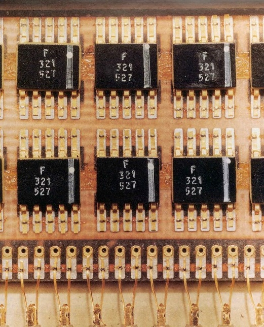
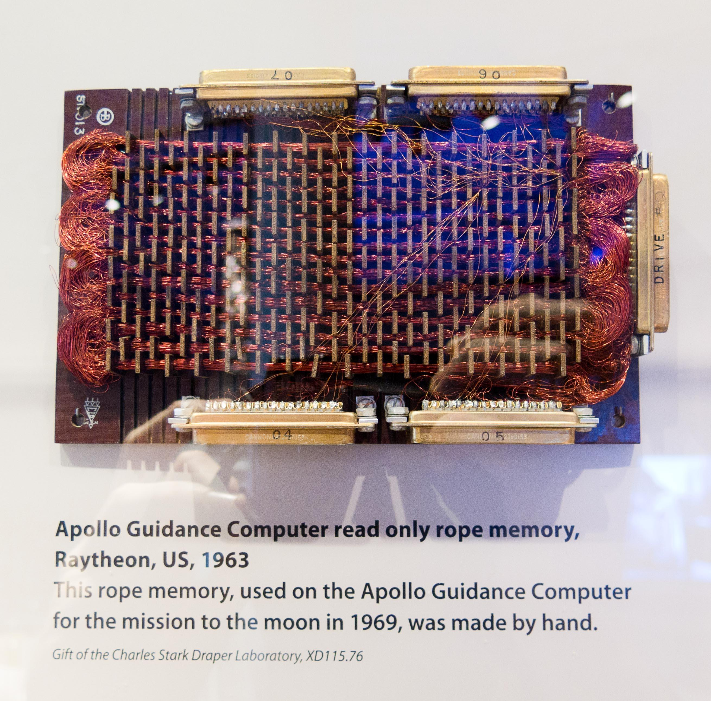
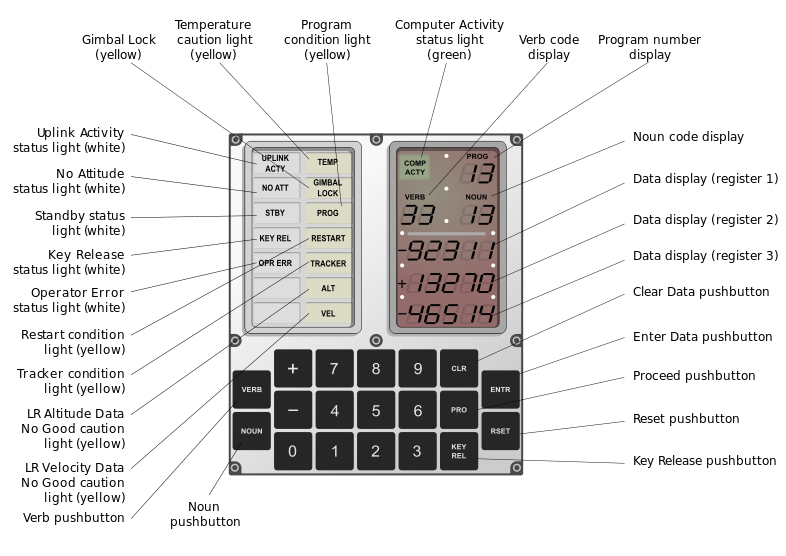

import ArticleHeader from '../../../components/article-header'

<ArticleHeader frontmatter={props.pageContext.frontmatter} />

​Este artículo no trata de SharePoint, Office 365, ni nada de lo habitualmente expuesto en CompartiMOSS. Trata sobre la computadora de guiado de las misiones Apolo, dado que en Julio se cumplieron 50 años del primer alunizaje.

Dentro de la gran hazaña que supuso el programa Apolo en muchísimos ámbitos de la ciencia y tecnología, este artículo se centra en una pequeña parte: la computadora AGC (Apollo Guidance Computer).

Si eres de los que piensa que esto nunca ocurrió, que el programa espacial es un montón de mentiras y que estoy a sueldo de los reptilianos extraterrestres sección illuminati… pasa al siguiente artículo.

Ya que has seguido leyendo, vamos a ello: La función principal de la AGC era proporcionar el sistema de guiado y navegación al módulo de mando (CM) y al módulo de excursión lunar (LEM). El CM disponía de 2 computadoras y el LEM de una.

La AGC estaba conectada a varios sistemas de instrumentación y control como radares, el sistema de navegación inercial (otra gran innovación desarrollada en la época), receptores de telemetría o el control del motor de descenso, entre otros.

Adicionalmente, la tripulación disponía de un sistema manual de navegación basado en la observación directa de estrellas (un sextante de toda la vida), ya que la NASA consideró que un sistema novedoso como la AGC podría fallar durante la misión.

Un poco de hardwareporn sobre la AGC:

**Frecuencia del oscilador:** 2,048 MHz.

**Memoria RAM:** 2 KPalabras en memoria de núcleos magnéticos.

**Memoria ROM:** 36 KPalabras en memoria de ferrita.

**Longitud de palabra:** 16 bits.

**Consumo:** 55 W.

**Peso:** 31,8 Kg.

**Dimensiones aprox:**61x32x17 cm

**Desarrollo**

El sistema de navegación fue de los primeros contratos que se adjudicaron en el programa Apolo, solamente dos meses después del inicio del programa. Tal era la importancia que la NASA daba a la navegación.

Se adjudicó al laboratorio de instrumentación del MIT en lugar de a una empresa privada, ya que había desarrollado en 1953 un sistema de navegación inercial capaz de guiar un avión en piloto automático.

Este sistema consistía en giroscopios y acelerómetros mecánicos muy precisos que eran capaces de mantener una plataforma de referencia fija y medir los cambios de posición del vehículo. Los datos obtenidos eran procesados por un sistema electromecánico para actuar sobre los mecanismos de vuelo.

Pero, para un viaje de 1,5 millones de Km, se requeriría algo mucho más sofisticado: una computadora digital.

En los años 60 las computadoras eran grandes monstruos que ocupaban salas enteras y consumían cantidades ingentes de electricidad… nada adecuado para llevar a bordo de una nave espacial.

Por ello el MIT recurrió a unos componentes novedosos: los circuitos integrados. Ligeros, de poco consumo y mucho más pequeños que las válvulas de vacío ofrecían las ventajas necesitadas… salvo por su confiabilidad. Al ser una tecnología en pañales se llevaron a cabo pruebas exhaustivas de cada lote para asegurar que soportarían las condiciones de vuelo.

La AGC fue la primera computadora construida con los novedosos circuitos integrados. Tal era la novedad que su construcción requirió el 60% de la producción total de circuitos integrados en EE.UU.

La AGC estaba formada por 2.800 de estos circuitos integrados, cada uno de ellos contenía 2 puertas NOR de 3 entradas. Los circuitos integrados eran interconectados mediante cableado para formar las unidades lógicas. Después de ser cableadas, se añadía un molde de epoxi para protegerlos de las vibraciones.

Otro problema que debieron afrontar fue la potencia de procesamiento requerida. No se disponía de la suficiente potencia de procesamiento para realizar todas las tareas necesarias por lo que se ideó otro novedoso sistema: Procesar las tareas de acuerdo con una prioridad asignando el tiempo de procesamiento de acuerdo con estas prioridades.

Una tarea de baja prioridad (por ejemplo, actualizar un display) podría no ejecutarse para permitir la ejecución de tareas más importantes (por ejemplo, mantener la posición de la nave).

La AGC permitía ejecutar hasta 8 tareas a la vez gestionadas por un rudimentario sistema operativo en tiempo real (Exec). Cada tarea debía devolver el control al Exec de forma periódica para que comprobara si había tareas pendientes y su prioridad.

La programación se realizaba en un lenguaje interpretado que proporcionaba pseudo instrucciones de aritmética trigonométrica, matricial y vectorial utilizadas para el cálculo de navegación, y era tan manual y lenta que podían pasar horas hasta tener el resultado impreso desde que se lanzaba el proceso de generación del programa.

Los programas eran almacenados en memorias de ferritas. Estas memorias debían ser "cosidas" literalmente, haciendo pasar o no cables por los núcleos de ferritas para representar los ceros y los unos.

Esta tarea llevaba meses y era realizada por un grupo de mujeres tejedoras que fueron contratadas para este difícil trabajo.

Una vez cableado el programa y probado, el módulo se protegía con un recubrimiento de epoxi.

**El interfaz de usuario**

Los astronautas utilizaban la AGC mediante un interfaz llamado DSKY (Display and Keyboard). Este interfaz disponía de un conjunto de luces indicadoras de estado, el teclado y un conjunto de displays de 7 segmentos.

Los comandos se introducían mediante una combinación de verbo y nombre. El verbo indicaba la acción a realizar y el nombre indicaba el dato afectado por la acción del verbo.

Por ejemplo, presionando **Verb 06 Noun 52 ENTR** la AGC mostraba en los data display los datos de velocidad actual, velocidad de ascenso y altitud. La tripulación debía memorizar verbos y nombres para cada procedimiento de vuelo.

**Las misiones Apolo**

La AGC fue probada durante las misiones Apolo tripuladas 7, 8, 9 y 10 que fueron avanzando en las pruebas hacia el viaje final a la luna.

La misión Apolo 7 probó los sistemas en órbita terrestre.

La misión Apolo 8 realizó el primer vuelo alrededor de la luna perdiendo la conexión con el control de misión durante los 45 minutos de vuelo por la cara oculta de la luna.

La misión Apolo 9 probó todos los acoplamientos y desacoplamientos del CM y LEM en órbita terrestre.

La misión Apolo 10 realizó un ensayo de alunizaje viajando a la luna.

Durante estas misiones la AGC funcionó correctamente y entonces…

**La alarma 1202**

En la misión Apolo 11, la primera en alunizar el 20 de Julio de 1969, se produjo una alarma en la AGC durante el descenso a la superficie lunar del LEM. Esta fase de la misión era la más exigente para la AGC en cuanto a procesamiento.

El descenso consistía en tres fases, controladas por la AGC:

- Una primera fase de frenado desde la órbita lunar a 14 km de altura. Para ello se encendía el motor de descenso del LEM para disminuir la velocidad y la altura. En esta fase la posición del LEM respecto a la superficie era de una inclinación considerable y con el motor hacia delante para permitir el frenado.
- Una segunda fase de aproximación al lugar del alunizaje cuando se descendía a unos 2.100 metros. El LEM continuaba disminuyendo su velocidad y altura, pero rotaba para ir quedando en la posición en la que se alunizaba.
- La tercera fase, el LEM estaba a unos 150 metros en su descenso final a la superficie lunar, la velocidad horizontal respecto a la superficie era muy baja y el comandante tenía el control del motor para posar la nave.

En la misión Apolo 11, durante este descenso, Aldrin empezó a informar a Houston que se producía la alarma 1202 y 1201 en la AGC.

En las simulaciones y el entrenamiento nunca se habían disparado estas alarmas, por lo que ni Armstrong ni Aldrin sabían que querían decir, aunque Aldrin se dio cuenta de que se producían al ejecutar el programa que calculaba la diferencia de altura entre la teórica calculada y la medida por el radar del LEM.

Desde Houston se dio el OK para continuar y finalmente el Águila alunizó ('*The Eagle has landed*', una de las frases famosas de esta misión).

¿Qué causó estos errores? Al consultar a los diseñadores descubrieron que eran alarmas por sobrecarga de procesamiento en la AGC.

Esta sobrecarga no se produjo por un mal diseño del hardware o el software si no por un problema con uno de los radares que provocó que, durante el descenso, la AGC recibiera datos erróneos de forma aleatoria sobre la posición de la antena de dicho radar causando un sobre procesamiento en el peor momento posible, de forma que la primera ley de Murphy se cumplió una vez más.

**La era post Apolo**

Después de las misiones Apolo se utilizó la AGC en programas experimentales de control de vuelo fly by wire en aviones a reacción y también fue usada para vehículos submarinos.

La AGC sirvió de predecesora para los sistemas de vuelo fly by wire, sus avances sentaron las bases de conceptos que hoy en día damos por sentados en un ordenador y supuso un salto enorme en las computadoras de la época. Todo ello dentro de un programa que permitió que 12 personas pisaran la luna tan solo 66 años después del primer vuelo a motor.

**Enlaces de interés**

- Emulador AGC OnLine: [http://svtsim.com/moonjs/agc.html](http&#58;//svtsim.com/moonjs/agc.html)
- Enlace de Wikipedia: [https://es.wikipedia.org/wiki/Apollo\_Guidance\_Computer](https&#58;//es.wikipedia.org/wiki/Apollo_Guidance_Computer)
- Video del descenso del Apolo 11. La alarma 1202 de produce a partir del min 10:20 [https://youtu.be/xc1SzgGhMKc](https&#58;//youtu.be/xc1SzgGhMKc)
- Esquemas lógicos de la AGC: [http://klabs.org/history/ech/agc\_schematics](http&#58;//klabs.org/history/ech/agc_schematics)
- Documental sobre la AGC: [https://www.youtube.com/watch?v=tTaZjyMApKY](https&#58;//www.youtube.com/watch?v=tTaZjyMApKY)
- Misión Apolo 11: [https://www.nasa.gov/mission\_pages/apollo/missions/apollo11.html](https&#58;//www.nasa.gov/mission_pages/apollo/missions/apollo11.html)

**Alberto Escola**  
Ingeniero de Sistemas y Cloud