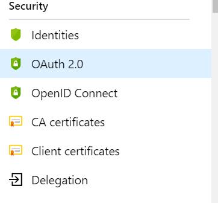
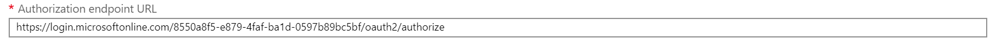

import ArticleHeader from '../../../components/article-header'

<ArticleHeader frontmatter={props.pageContext.frontmatter} />


​Seguramente todos hemos visto o probado a estas alturas Azure Api Management, y hemos podido observar toda la funcionalidad que nos aporta a nivel de Publicación de APIs, o lo que Microsoft denomina la funcionalidad de FACHADA. En este artículo nos queremos centrar en esa otra visión de Middleware que nos aporta APIM, y sobre todo en como autenticar nuestros servicios y validar los TOKEN que nos hacen llegar los clientes de nuestros servicios.


**Lo más básico, autenticación por Clave de Suscripción**

Antes de nada, tenemos que conocer cómo se estructura un catálogo de APIs en APIM. Lo primero que debemos hacer antes de publicar un API es crear un Producto, por defecto una instalación de APIM desde cero nos proporcionan dos productos Starter y Unlimited. A este producto le vamos a poder asignar Políticas, APIs, y Suscripciones.

****
Es muy importante el concepto Suscripción, ya que nos permita relacionar a los productos con los usuarios, y por tanto darles acceso a nuestros clientes a una serie de APIS en concreto. Para crear una suscripción por ejemplo en el producto Starter, accedemos al producto y posteriormente seleccionamos el apartado Suscription, tal cual vemos en la imagen.

Deberemos darle un nombre a la suscripción, y añadir un usuario propietario de esta suscripción. Evidentemente no debemos crear una suscripción por usuario, aunque es viable, podemos crear una suscripción por grupos de trabajo y entorno y así facilitar el gobierno de estas. Lo importante de crear esta suscripción, es que se van a generar un par de claves privadas y nominales a esta suscripción – usuario, que van a ser necesarias para poder llamar a las APIs de este producto.​


El último paso para securizar nuestro api por clave de suscripción, es acceder al apartado de APIs, y sobre un API en concreto en el apartado Settings, observamos que está marcada la opción "Subscription Required" en el apartado Suscription.


Si revisamos la imagen vemos que hemos marcado el api para que pida un suscription key válido y para ello en las cabeceras de la petición deberemos incorporar la clave de suscripción de la forma "Ocp-Apim-Subscription-Key : key", o fallará tal cual vemos en la siguiente imagen.


En la imagen anterior vemos una petición desde Postman a un api de nuestro catálogo, en este caso a un api por defecto que se genera en el servicio que se llama Echo API. Como vemos, no le hemos pasado ninguna clave de suscripción. Por el contrario, si añadimos una clave válida obtenemos el valor de forma correcta.

La forma más fácil de aprender a consultar nuestras APIS con las claves correctas es dentro de un API publicada, seleccionamos uno de sus métodos, y hacemos uso de la pestaña de test.


Aquí podremos elegir el producto con el que consultar el API, nos inserta el propio APIM la clave de suscripción correcta, y nos deja un ejemplo de petición y de respuesta que podemos simular posteriormente desde Postman o desde nuestra aplicación cliente.


**Algo más complejo, Azure AD y Oauth en APIM**

Como hemos visto con clave de suscripción podemos securizar de una forma mínima nuestras APIs, pero si queremos, por ejemplo, securizar nuestros APIS con OAuth y Azure AD también podemos hacerlo, e implantarlo como solución de seguridad base de nuestros servicios. Para comenzar debemos localizar en APIM el menú el apartado "Seguridad" y veremos que hay varias opciones, entre la que encontramos OAuth 2.0



Ahora vamos a configurar nuestro OAuth 2.0 rellenando el formulario que se nos presenta, teniendo en cuenta de donde ir sacando los parámetros de configuración:

- Display name: Campo libre, ponemos un nombre descriptivo para nosotros.
- Client registration URL: no vamos a permitir el registro de aplicaciones, así que dejaremos **htpp://localhost.**
- Marcamos la opción "Authorization code".


Hasta aquí todo fácil, pero los siguientes parámetros necesitan que demos de alta una Aplicación en nuestro directorio Activo, como sería mucho alargar este artículo os dejo un enlace de Microsoft para poder introducirnos en cómo hacerlo [https://docs.microsoft.com/es-es/azure/active-directory/manage-apps/](https&#58;//docs.microsoft.com/es-es/azure/active-directory/manage-apps/)

Del apartado Endpoints de nuestra Aplicación creada en Azure AD, vamos a obtener los datos para seguir configurando nuestro OAuth en APIM:


- **Autorization endpoint URL:​**


****

- **Token endpoint Url**


****

- **Client authentication mode**: Marcamos la opción "In the body".
- **Client Id**: Lo obtenemos de nuestra aplicación creada en AD, en Overview.
- **Client secret**: Lo obtenemos creando una clave privada, en el apartado Client & Secret de nuestra aplicación en AD.


Nos quedará una configuración parecida a la de la imagen siguiente, y si no hemos tenido problemas pulsamos en crear y se creará nuestro OAuth 2.0 en APIM.


**Probando la generación del token desde el Portal del desarrollador**

Para poder ver si se genera el Token de forma correcta, debemos acceder lo primero en un API, y, en la configuración, seleccionar la conexión OAuth 2.0 que hemos creado en el punto anterior.


Ahora si podemos acceder al Portal del desarrollador, buscar este API en concreto y probarla.

Nos encontraremos que además de la clave de suscripción que configuramos al inicio ahora además nos permite añadirle un token de OAuth.


Seleccionamos en OauthToken nuestro token y se nos abrirá una pantalla emergente que nos pedirá usuario y contraseña para logarnos contra nuestra aplicación de AD. Si las credenciales son válidas y no falla nada en la configuración veremos que se genera un token valido y que APIM le hará llegar en la cabecera Authorization a nuestras APIS.


En este punto APIM no valida el token, simplemente lo genera y se los hace llegar a nuestros servicios que, si están configurados en nuestro mismo tenant, podrá entender el token y autorizar las llamadas por OAuth. Si damos a enviar la petición y nos centramos en el apartado **Trace** en los datos de entrada veremos todo lo que le hacemos llegar a nuestro backend desde el portal del desarrollador, y vemos que le hacemos llegar un token generado por nuestra conexión de OAuth 2.0 en APIM


En el siguiente punto veremos cómo hacer que APIM si valide el token, y hace de proxy de seguridad entre nuestros backend y nuestras aplicaciones cliente.

**¿Qué nos falta para que APIM valide nuestro token? – Políticas de validación**

Como hemos adelantado, por defecto APIM no valida el token de nuestras APIS, simplemente se queda en generarlo de forma correcta y aportar a los equipos de trabajo las herramientas para poder autenticar las API, que no es poco porque antes proporcionar token de autenticación a distintos equipos de trabajo cuanto menos era costoso y en algunos casos imposible, por el mantenimiento que esto conllevaba.

Pero no nos queremos quedar aquí y vamos a añadir una política de validación de JWT que abra nuestro token y nos diga si viene de una aplicación de confianza. Para ello sobre el API que hemos configurado el OAuth, en la pestaña de design vamos a añadir una política de la siguiente forma:

1. Añadimos una nueva política en la parte de Inbound para que quede como la imagen:


2. Añadimos el siguiente código a nuestra política:​

```
<inbound>        <validate-jwt header-name="Authorization" failed-validation-httpcode="401" failed-validation-error-message="Unauthorized. Access token invalid" require-expiration-time="false" require-signed-tokens="false">            <openid-config url="https://login.microsoftonline.com//<DirectorytenantID>/v2.0/.well-known/openid-configuration" />            <issuers>                <issuer>https://sts.windows.net/<DirectorytenantID>            </issuers>        </validate-jwt>​
```

3. Validamos la política y si es correcto lo guardamos. Si analizamos el código que hemos añadido, necesitamos simplemente añadir el ID de nuestro tenant, y esta política validará contra nuestro tenant si el token es válido, si no lo es dará un 401.

Si volvemos al portal de desarrollador, y probamos el método al que hemos añadido la política veremos que, si no indicamos el token de OAuth, nos devuelve el error que hemos configurado en la política.


Con esto ya tenemos nuestro API securizado con clave de suscripción, y además con un token de Azure AD por OAuth 2.0

**Una seña más de que Azure Api Management ayuda al desarrollo y al desarrollador**

Siempre que programamos y más si somos la parte backend, no nos paramos mucho a pensar lo complejo que resulta generar un token válido, con los scope necesarios para que el usuario cliente pueda obtener contexto y sus datos desde nuestras APIS.  
 Con Azure Api Management, tenemos una herramienta más para que los clientes de nuestras APIS desde un portal 100% accesible para cualquiera, pueda obtener su token, simular las llamadas y llevárselas a su código y poder hacer las pruebas necesarias.

Sin duda para mí esto es un avance y un ahorro en coste, tiempo y, sobre todo, malentendidos entre los distintos equipos de trabajo de un proyecto.


**Sergio Hernandez Mancebo** <br />
Principal Team Leader en Encamina | Azure MVP