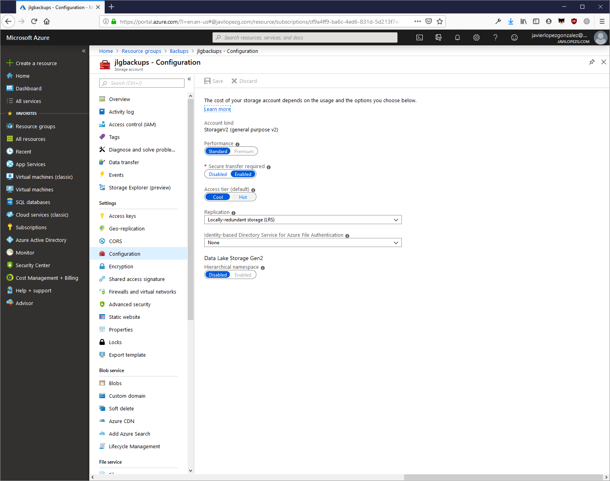
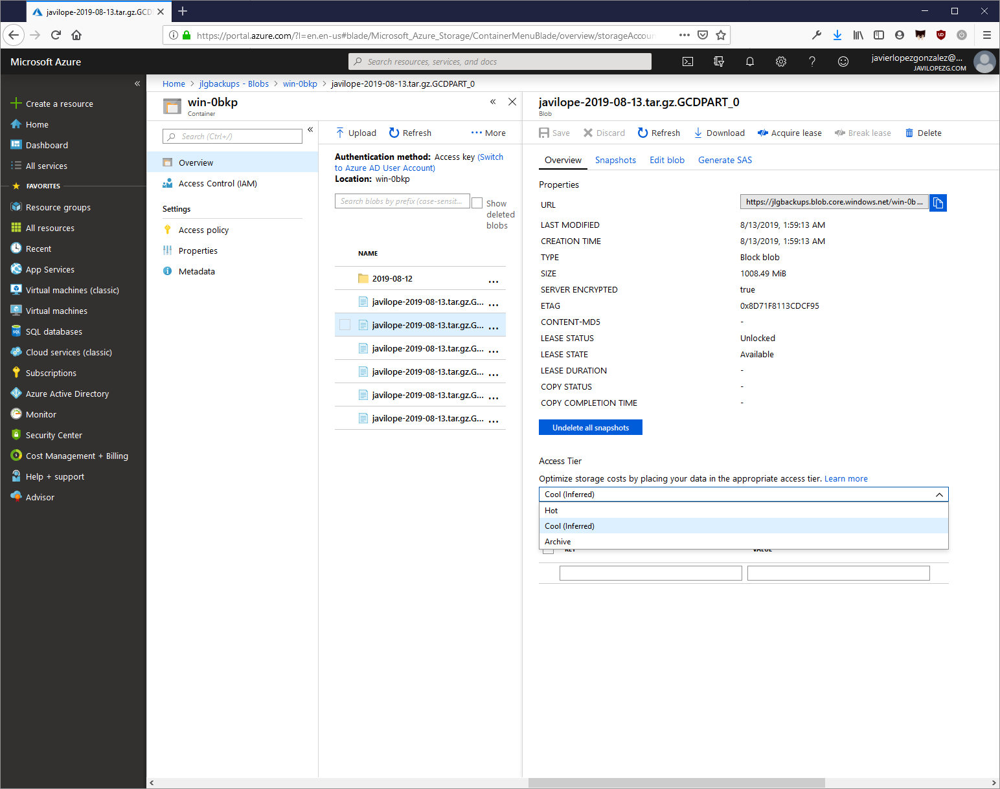
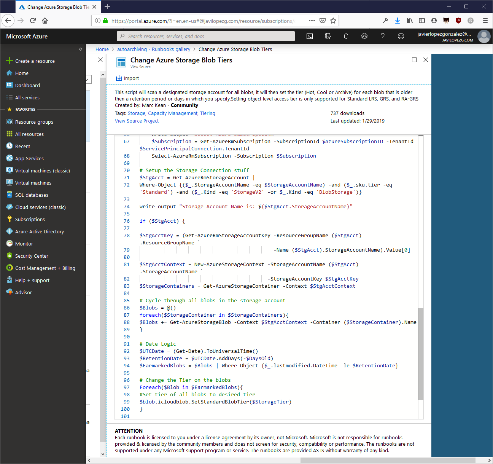

​En las cuentas de Storage en Azure, disponemos de varios elementos de configuración que influyen directamente en la disponibilidad de la información que vamos a almacenar, el precio de tenerlo guardado, el de acceder a los datos y la latencia que tendremos hasta poder leer el primer byte de información. Entre esos elementos está el propio tipo de cuenta y el nivel de rendimiento, así como el tipo de replicación. Para simplificar todo y no desviarnos del objetivo de este artículo, nos centraremos en las cuentas de tipo propósito general V2 (StorageV2) con nivel de rendimiento estándar y replicación LRS (Locally-redundant storage). De este modo nos podremos centrar en el elemento que nos interesa explicar hoy: el nivel de acceso.

El nivel de acceso es una propiedad a nivel de cuenta, que también se puede establecer a nivel de archivo individual.

Los tipos de nivel de acceso básicos son dos: Hot (frecuente) y Cool (esporádico). El primero te ofrece una mayor disponibilidad, un precio más alto por el almacenamiento y un precio más bajo por el acceso a los datos. El segundo ofrece un 9 menos en cuanto a disponibilidad, su precio de almacenamiento es más barato (un 25%) pero las operaciones con la información son más caras (más del doble en función del tipo de operación). Además, los ficheros almacenados con un nivel de acceso Cool deben pasar al menos 30 días en dicho estado, y de no ser así habrá repercusiones en tu factura.

Como decíamos, estos tipos de nivel básicos se pueden poner a nivel de cuenta o se puede modificar individualmente en cada archivo almacenado.

En ese caso, vemos que aparece un tercer nivel: Archive. Este nivel sólo se puede establecer en los ficheros individuales y no a nivel de cuenta, por lo que no es un nivel que se pueda heredar.

Los archivos en niveles Hot y Cool se almacenan en discos magnéticos online, pero los ficheros del nivel Archive se almacenan offline teniendo una gran repercusión tanto en el precio del almacenamiento (un 5% respecto a Hot), como de su disponibilidad (de 0%) y latencia (de horas vs los milisegundos de los otros niveles).

Las operaciones de escritura tienen el mismo coste que el nivel Cool, pero las de lectura son entre 500 y 2500 veces más caras en función de si te vale tener acceso a la información en hasta 15 horas o la necesitas cuanto antes (al menos en una hora).

El hecho es que al estar offline hace que no podamos acceder a estos archivos directamente. Para poder leer a su información tendremos que hacer una operación de "rehidratación" devolviéndolos a alguno de los otros niveles y esperando a que las unidades en las que estén almacenados se vuelvan a poner online para transferir la información.

Sin embargo, a pesar de estar offline, sí que podremos acceder a sus metadatos y por lo tanto listarlos y ver sus propiedades. Usando Powershell podremos usar los siguientes métodos de los blobs cuando estén en nivel Archive: GetBlobProperties, GetBlobMetadata, ListBlobs, SetBlobTier, and DeleteBlob.

Estas características los hacen ideales, por ejemplo, para escenarios donde se precisa guardar copias de seguridad que probablemente no vayan a ser accedidas nunca, por ejemplo, de un equipo o un servidor que no tenga muchos cambios ni muchos riesgos. Podríamos montar la cuenta de blobs como si fuese un disco más (en [Linux](https://javilopezg.com/montar-blobs-de-azure-en-linux/) o en [Windows](https://javilopezg.com/montar-blobs-de-azure-en-windows/)) e ir copiando ahí los archivos con los datos de tal modo que usando nuestro sistema de copia tradicional estaríamos explotando un medio de almacenamiento muy económico.

Una de las mayores pegas que tiene este nivel de acceso, es que no se puede heredar y por tanto hay que ir asignándolo a cada archivo individualmente. Esto se puede remediar creando una cuenta de Azure Automation y creando un Runbook que se ajuste a nuestras necesidades. Por ejemplo, en la galería podéis encontrar un Runbook de Powershell creado por [Marc Kean](https://marckean.com/2018/05/27/change-azure-storage-blob-tiers/) que permite archivar todos los blobs de una cuenta que sean más viejos de N días.

Del mismo modo, se podría crear un Runbook que cambiara el nivel de cada blob que se cree en una cuenta, o de todos los archivos de un container menos del que sea más actual, etc.

Al igual que pasaba con los archivos del nivel Cool, que precisaban estar en ese estado 30 días, en el caso del nivel Archive han de estar 180 días si no quieres tener repercusiones en tu factura.

Ahora, conociendo cómo funcionan, ya estamos preparados para usar este nivel de acceso y aprovecharnos del precio tan económico que ofrece sin llevarnos la gran sorpresa cuando queramos acceder a la información.

**Javi López**  
 Freelance  
 [mail@javilopezg.com](mailto:mail@javilopezg.com)  
 @javilopezg  
 [https://javilopezg.com](https://javilopezg.com/)

