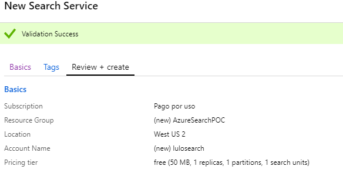
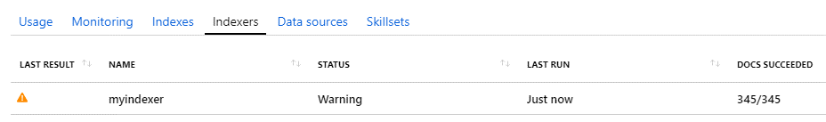

En este artículo se aprenden los conceptos básicos de Azure Search y el procedimiento para una configuración básica del servicio, desde el índice, indexador y fuente de datos, hasta la ejecución de consultas de prueba.

En el mundo de los desarrolladores .NET, casi en cualquier proyecto de desarrollo se tiene la obligación de implementar funcionalidades de búsqueda por algún requerimiento de los usuarios, desde los elementos sencillos como buscar documentos, registros de personas o de facturas, hasta otros tipos de contenido. Estas son funcionalidades básicas que el software desarrollado debe proveer a los usuarios.

Los desarrolladores .NET que están acostumbrados a utilizar *Azure SQL* o *SQL Server* como motor de base de datos, utilizan en su mayoría procedimientos almacenados, vistas o simples consultas para buscar registros en las tablas de la aplicación, sin embargo, si esta es más compleja y utiliza otras fuentes de datos como *CosmosDB*, *Azure Storage* para documentos de Office o algunas otras, entonces la búsqueda se vuelve un poco más compleja porque son de diferentes tipos.

Con Azure Search podremos buscar información en todas estas fuentes de datos con un API en común, independientemente de donde se halla indexado el contenido, si fue SQL Server, Cosmos DB, Blob Storage u otro, el API y el código implementado para realizar las búsquedas no tiene ninguna diferencia, esto presenta un beneficio para el desarrollador en termino de curvas de aprendizaje y en términos de productividad.

En este artículo se explican los conceptos necesarios para entender la arquitectura de Azure Search, al mismo tiempo se presenta un ejemplo de configuración de este, esto para mostrar los beneficios al utilizar este servicio. El texto está dividido en tres partes: en la primera se presenta los conceptos básicos para entender la arquitectura de Azure Search, en la segunda parte creamos y configuramos un ejemplo básico y se realiza la prueba del motor de búsqueda.

Los proyectos en Azure Search tienen un proceso similar en todos los casos: se crea el servicio – a través del portal, de Azure CLI o Powershell-, se crea el índice, se cargan datos y se realizan búsquedas. El crear el servicio y configurarlo es sencillo después de entender los conceptos necesarios de acuerdo con la aplicación que se vaya a desarrollar.

El primer concepto es el *índice*, definido como una estructura eficiente para almacenar y organizar palabras clave de búsqueda, estas son extraídas de documentos o registros en una fuente de datos externa, este es el componente principal para poder ejecutar las búsquedas. por ejemplo, si se tiene un libro sobre El Quijote, al ingresar su contenido, se pueden identificar palabras clave por medio de las cuales los usuarios podrían encontrar este libro.

Por otro lado, el "*query parser"*, es el componente que descompone las palabras que el usuario busca, de esta manera crea una estructura de consulta para ser enviada al motor de búsqueda, en otras palabras, traduce su cadena de búsqueda en instrucciones específicas para el motor de búsqueda. Se interpone entre usted y los documentos que está buscando, por lo que su papel en la recuperación de texto es vital. Por otra parte, el motor de búsqueda es el encargado de devolver los documentos o registros encontrados en base al índice, además de tomar en cuenta la jerarquización de los resultados encontrados.

Por último, es importante hablar sobre los analizadores, un analizador es el componente responsable de procesar el texto en cadenas de consulta y documentos indexados. Los diferentes analizadores transforman el texto de diferentes maneras según el escenario para obtener resultados deseados. Existen aquellos que analizan el lenguaje procesando texto por medio de reglas lingüísticas que mejoran la calidad de la búsqueda, otros analizadores realizan tareas como la conversión de caracteres a minúsculas, buscar sinónimos de las palabras consultadas, eliminación de palabras inútiles en una búsqueda (el, la, los, las), entre otros.

Por otro lado, las particiones son las que almacenan índices y dividen automáticamente los datos de búsqueda, dos particiones dividen su índice a la mitad, tres particiones lo dividen en tercios, y así sucesivamente. La capacidad de las particiones es importante ya que va a determinar el precio del servicio.

Las réplicas son instancias del servicio de búsqueda, cada réplica alberga una copia equilibrada de carga de un índice, por ejemplo, un servicio con seis réplicas tiene seis copias de cada índice cargado en el servicio.

Por ultimo las Unidades de Búsqueda, (Search Units), son la multiplicación entre particiones y replicas,

R x P = SU. (Search Units) El mínimo de unidades de búsqueda es uno y el máximo es 36 como resultado de la multiplicación, por ejemplo, no es válido tener 12 réplicas por 12 particiones, sin embargo si es válido tener 6 réplicas con 6 particiones.

****

Al entender los conceptos se procede a profundizar en el proceso de provisionamiento de Azure Search, una de las opciones es a través, del portal, comenzando con la siguiente pantalla.

Primero seleccionamos la suscripción y luego el grupo de recursos, que nos ayuda a mantener una mejor visibilidad de todo lo que tenemos en ejecución en Azure, además sirve para administrar los permisos y para controlar los gastos del grupo como tal. En la pantalla se observa la URL que es el identificador único de nuestro servicio, mediante la cual se identifica desde el código al realizar las consultas.

También se puede observar la escala de precios la cual define la capacidad de almacenamiento y procesamiento de nuestro servicio.

Los precios pueden ser consultados en el siguiente enlace:  [https://azure.microsoft.com/en-us/pricing/details/search/](https://azure.microsoft.com/en-us/pricing/details/search/)

En el enlace anterior se puede observar que hay muchas opciones para seleccionar la que más convenga, todo depende de la capacidad de almacenamiento y procesamiento que se necesite (cantidad de índices, cantidad de almacenamiento, rendimiento esperado etc.).

Una vez hemos seleccionado nuestro nivel de precios, procederemos a la validación y creación del recurso.

Después de haber creado el servicio de búsqueda se procede a los siguientes pasos:

a.       Crear índices e importar datos desde las fuentes que tenemos (por ejemplo, tabla de SQL Server). El portal de Azure permite inferir el índice a partir de una fuente de datos, es decir al darle clic a importar datos y especificar la conexión, Azure Search infiere que campos retorna nuestra consulta, y nos permite configurar cada campo como deseemos.

Al importar datos y seleccionar el tipo de conexión se puede realizar de Azure SQL, CosmosDB, Blob Storage u otros.

En este paso es importante definir la consulta, en mi caso en CosmosDB tengo una colección compartida, es decir,  almacene varios tipos de documentos dentro de la misma colección, utilizando un campo que se llama CosmosEntityName para poder identificar fácilmente el tipo de objeto, como pueden ver en la imagen busco solo entidades de tipo Rol, y luego Azure Search nos sugiere implementar una cláusula adicional en el WHERE, esta cláusula es para implementar re indexación de registros o documentos que han sido cambiados desde la última indexación.

b.       En el siguiente paso, Azure Search infiere los campos según los resultados de la consulta anterior y nos permite configurar cada campo por separado, para esto debemos definir los siguientes conceptos:

- **Retrievable:** Indica si el campo debe ser retornado o no al realizar la búsqueda.
- **Filterable:** Indica si el campo puede utilizarse en expresiones de búsqueda, por ejemplo, Rolename="Administrador"
- **Sortable:**  Indica si el campo se puede utilizar en una expresión para ordenar los resultados.
- **Searchable:** Indica si el campo puede ser "buscado", en este caso utilizamos el RoleName como campo para buscar.

c.       Y por último creamos el Indexador, en el cual podemos definir la recurrencia de indexación, Azure Search soporta hasta intervalos de 5 minutos, se puede ejecutar por demanda, o se puede crear un proceso para que se haga en tiempo real.

Una vez terminamos este paso, podremos revisar en el portal como se ha creado una fuente de datos:

El índice :

El indexador:

En este momento, el indexador no se ha ejecutado, como se puede ver en la pantalla tenemos cero documentos. Para solucionar esto, se selecciona el indexador y se ejecuta la consulta, este proceso agrega los documentos al índice, el tiempo de respuesta va a depender del tamaño de la consulta y los campos utilizados, es decir, de la cantidad de datos.

Después de ejecutar la consulta en la pestaña de indexadores, podríamos ver cuando se ejecutó y el número de documentos que devuelve:

Después de algunos segundos, podremos revisar la pestaña de Índices, y veremos cómo los documentos ya han sido indexados según la fuente de datos configurada.

**Parte 3. Prueba del motor de búsqueda**

La prueba del motor de búsqueda es importante mencionarla en este texto porque es necesario verificar que nuestro proceso de indexación fue realizado correctamente. Para esto, en la parte superior del portal le damos clic a Search Explorer y podremos probar la búsqueda en cualquier índice.

Es importante mencionar que se debe seleccionar el índice y luego digitar una consulta y presionar en el botón de búsqueda. En la parte inferior en JSON aparecerán los resultados según la configuración realizada anteriormente. Esto es una búsqueda sencilla que consulta en todos los campos indexados, sin embargo, es posible utilizar operadores de búsqueda más avanzados para buscar en campos específicos y también se pueden combinar con operadores AND, OR, entre otros.

**Conclusión**

En este articulo pudimos ver la facilidad con la cual el portal de Azure nos permite crear el servicio de búsqueda, configurar índices, indizadores y fuentes de datos, a su vez que entendimos todos los conceptos necesarios para poder realizar una configuración sencilla de todos estos componentes.  En este caso, este proceso no dura más de 10 minutos para terminar.   En otro número de esta revista, revisaremos ejemplos más prácticos de código, utilizando búsquedas básicas y con operaciones complejas.

**Luis Valencia**  
Office Development MVP 
 
import LayoutNumber from '../../../components/layout-article'
export default LayoutNumber
