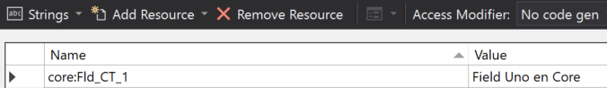

import ArticleHeader from '../../../components/article-header'

<ArticleHeader frontmatter={props.pageContext.frontmatter} />


En este artículo quiero enseñaros algo más de las tripas del *Provisioning framework* del PnP. A estas alturas, supongo que ya todos conocemos la librería PnP-Sites-Core, pero si no es el caso, que sepáis que esta librería de .NET nos ofrece utilidades y extensiones para trabajar con CSOM. Entre ellas, destaca por encima de todo el Framework de Provisioning, que nos permite provisionar artefactos en un site de SharePoint (ContentTypes, Listas, Ficheros, Páginas, etc), desde ficheros XML.

Tenéis más información, así como el código fuente de la librería, en la siguiente URL:

[https://github.com/SharePoint/PnP-Sites-Core](https&#58;//github.com/SharePoint/PnP-Sites-Core)

De igual modo, el Schema XML del que se basa el framework de provisioning, lo podemos encontrar en la siguiente URL:

[https://github.com/SharePoint/PnP-Provisioning-Schema](https&#58;//github.com/SharePoint/PnP-Provisioning-Schema)

Hoy nos centraremos en el TokenParser, veremos cómo funciona, que tokens existen ya predefinidos, y veremos la importancia de éste a la hora de Localizar nuestras plantillas de provisioning (de hecho, comentaremos un pequeño issue del TokenParser a la hora de resolver Localized strings, y veremos un workaround rápido, y como resolverlo más correctamente)

**Tu vecino y amigo, el TokenParser**

Como os adelantaba, el TokenParser es una clase pública dentro del proyecto, que nos va a permitir poder usar tokens en nuestras templates XML de provisioning. Dichos tokens serán resueltos en tiempo de ejecución. Por ejemplo, existe un Token que permite resolver la URL relativa de una lista, a partir del título de esa lista. De esta forma, podemos registrar una CustomAction apuntando a una lista concreta (imagina una spfx extensión con un botón que sólo quieres para una lista concreta):

```
<pnp:CustomAction Name="MY_CA"Title="Detail Panel Command Bar"RegistrationId="{listid:My List Title}"RegistrationType="List"Location="ClientSideExtension.ListViewCommandSet.CommandBar"ClientSideComponentId="…ClientSideComponentProperties="......" />
```

En tiempo de ejecución, el TokenParser sacará el ID de la lista con título "My List Title".

En la siguiente tabla, puedes encontrar algunos de los Tokens más utilizados:


| **Token** | **Description** | **Example** | **Returns** |
| --- | --- | --- | --- |
| {contenttypeid:[contenttypename]} | Returns the ID of the specified content type | {contenttypeid:My Content Type} | 0x0102004F51EFDEA49C49668EF9C6744C8CF87D |
| {fieldtitle:[internalname]} | Returns the title/displayname of a field given its internalname | {fieldtitle:LeaveEarly} | Leaving Early |
| {fileuniqueid:[siteRelativePath]} | Returns the unique id of a file which is being provisioned by the current template. | {fileuniqueid:/sitepages/home.aspx} | f2cd6d5b-1391-480e-a3dc-7f7f96137382 |
| {guid} | Returns a newly generated GUID | {guid} | f2cd6d5b-1391-480e-a3dc-7f7f96137382 |
| {keywordstermstoreid} | Returns a id of the default keywords term store | {keywordstermstoreid} | f2cd6d5b-1391-480e-a3dc-7f7f96137382 |
| {listid:[name]} | Returns a id of the list given its name | {listid:My List} | f2cd6d5b-1391-480e-a3dc-7f7f96137382 |
| {listurl:[name]} | Returns a site relative url of the list given its name | {listid:My List} | Lists/MyList |
| {localization:[key]} | Returns a value from a in the template provided resource file given the locale of the site that the template is applied to | {localization:MyListTitle} | My List Title |
| {masterpagecatalog} | Returns a server relative url of the master page catalog | {masterpagecatalog} | /sites/mysite/\_catalogs/masterpage |
| {now} | Returns the current date in universal date time format: yyyy-MM-ddTHH:mm:ss.fffK | {now} | 2018-04-18T15:44:45.898+02:00 |
| {parameter:[parametername]} | Returns the value of a parameter defined in the template | {parameter:MyParameter} | the value of the parameter |
| {site} | Returns the server relative url of the current site | {site} | /sites/mysitecollection/mysite |
| {sitecollection} | Returns the server relative url of the site collection | {sitecollection} | /sites/mysitecollection |
| {sitecollectiontermgroupid} | Returns the id of the site collection term group | {sitecollectiontermgroupid} | 767bc144-e605-4d8c-885a-3a980feb39c6 |
| {sitecollectiontermgroupname} | Returns the name of the site collection term group | {sitecollectiontermgroupname} | Site Collection - mytenant.sharepoint.com-sites-mysite |
| {sitecollectiontermsetid:[termsetname]} | Returns the id of the given termset name located in the sitecollection termgroup | {sitecollectiontermsetid:MyTermset} | 9188a794-cfcf-48b6-9ac5-df2048e8aa5d |
| {sitecollectiontermstoreid} | Returns the id of the given default site collection term store | {sitecollectiontermstoreid} | 9188a794-cfcf-48b6-9ac5-df2048e8aa5d |
| {termsetid:[groupname]:[termsetname]} | Returns the id of a term set given its name and its parent group | {termsetid:MyGroup:MyTermset} | 9188a794-cfcf-48b6-9ac5-df2048e8aa5d |
| {termstoreid:[storename]} | Returns the id of a term store given its name | {termstoreid:MyTermStore} | 9188a794-cfcf-48b6-9ac5-df2048e8aa5d |
| {themecatalog} | Returns the server relative url of the theme catalog | {themecatalog} | /sites/sitecollection/\_catalogs/theme |
| {viewid:[listname],[viewname]} | Returns a id of the view given its name for a given list | {viewid:My List,My View} | f2cd6d5b-1391-480e-a3dc-7f7f96137382 |
| {webpartid:[webpartname]} | Returns the id of a webpart that is being provisioned to a page through a template | {webpartid:mywebpart} | 66e2b037-f749-402d-90b2-afd643850c26 |


Y en esta URL tenéis la tabla completa con todos los tokens soportados:

[https://github.com/SharePoint/PnP-Sites-Core/blob/master/Core/ProvisioningEngineTokens.md](https&#58;//github.com/SharePoint/PnP-Sites-Core/blob/master/Core/ProvisioningEngineTokens.md)

Cada Token, posee su propia clase interna dentro del PnP, que hereda de una clase abstracta y pública llamada *TokenDefinition*. Cada Token definition, en su constructor recibe un string (o varios) con el token a sustituir:

```
[TokenDefinitionDescription(     Token = "{masterpagecatalog}",     Description = "Returns a server relative url of the master page catalog",     Example = "{masterpagecatalog}",     Returns = "/sites/mysite/_catalogs/masterpage")]    internal class MasterPageCatalogToken : TokenDefinition    {        public MasterPageCatalogToken(Web web)            : base(web, "{masterpagecatalog}")        {        }
```

Dentro de la clase, se sobrescribe el método GetReplaceValue, que es donde se aplica la lógica de reemplazo del token. Todas las definiciones de Token, se añaden a la clase TokenParser en su constructor:

```
        public TokenParser(Web web, ProvisioningTemplate template, ProvisioningTemplateApplyingInformation applyingInformation)        {            var tokenIds = ParseTemplate(template);            web.EnsureProperties(w => w.ServerRelativeUrl, w => w.Url, w => w.Language);            _web = web;            _tokens = new List<TokenDefinition>();            if (tokenIds.Contains("sitecollection"))                _tokens.Add(new SiteCollectionToken(web));
```

Posteriormente, los ObjectHandlers utilizan el TokenParser para reemplazar los tokens que necesitan. Por ejemplo, aquí tenemos el ObjectHandler que se encarga de provisionar los ContenTypes, y que para darle el Name al ContentType, utiliza el TokenParser (por si dicho Name, en la XML template, se ha especificado utilizando algún Token):

existingContentType.Name = parser.ParseString(templateContentType.Name);

Utilizando los Extensibility Handlers, podemos ampliar los Tokens y crear nuestros propios tokens, que serán resueltos en cualquier punto de la template. Podéis encontrar más información en un artículo que escribí para el número 29 de la revista:

[http://www.compartimoss.com/revistas/numero-29/custom-extensibility-handlers-para-el-framework-de-provisioning-del-pnp](/revistas/numero-29/custom-extensibility-handlers-para-el-framework-de-provisioning-del-pnp)

**Localizando nuestras templates**

Gracias al TokenParser, podemos localizar nuestras plantillas PnP en diferentes lenguajes. Existe un Token "localization" (también puedes usarlo como: loc, localize, resource, res) que nos permite utilizar un fichero típico de resources (.resx). Pare ello, en nuestra plantilla, hacemos referencia a los diferentes ficheros de resources que queremos usar:

```
<pnp:Localizations>     <pnp:Localization LCID="1033" Name="English" ResourceFile="MyTemplate-en.resx"/>     <pnp:Localization LCID="1043" Name="Dutch" ResourceFile="MyTemplate-nl.resx"/></pnp:Localizations>
```

Y a la hora de aplicar el *resource* concreto, lo podemos hacer de la siguiente manera:

```
<Field ID="{23203E97-3BFE-40CB-AFB4-07AA2B86BF45}" Type="Text" Name="ProjectID" DisplayName="{resource:Myfield}" Group="Foundation.Columns" MaxLength="255" AllowDeletion="TRUE" />
```

Hasta aquí todo genial. Sin embargo, en plantillas grandes, es bastante común que queramos utilizar más de un set de ficheros de resources, me explico. Imagina que tus literales para los ContentTypes, los tienes en un set de ficheros de resources, ejemplo:

- ContentTypes.en-us.resx
- ContentTypes.es-es.resx
- ContentTypes.nl-nl.resx


Y los resources para el resto de tu plantilla, están en:

- Core.en-us.resx
- Core.es-es.resx
- Core.nl-nl.resx


Pues bien, si atendemos al esquema del PnP, podemos ver que precisamente tenemos un Name en el nodo Localization, y podemos hacer algo como:

```
  <pnp:Localizations>    <pnp:Localization LCID="1033" Name="core" ResourceFile="core.en-us.resx" />    <pnp:Localization LCID="3082" Name="core" ResourceFile="core.es-es.resx" />    <pnp:Localization LCID="1033" Name="intranet" ResourceFile="intranet.en-us.resx" />    <pnp:Localization LCID="3082" Name="intranet" ResourceFile="intranet.es-es.resx" />      </pnp:Localizations>
```

Y luego, utilizar el Token de la siguiente manera:

```
<Field ID="{23203E97-3BFE-40CB-AFB4-07AA2B86BF45}" Type="Text" Name="ProjectID" DisplayName="{resource:core:Fld_CT_1}" Group="Foundation.Columns" MaxLength="255" AllowDeletion="TRUE" />
```

Sin embargo, el Código de provisioning, no va a funcionar correctamente, y no va a resolver el token. Esto es debido a que el TokenParser, cuando carga los tokens desde los ficheros de resources, asume que siempre va a haber un único "Name" en los nodos Localization.

Si necesitáis un workaround rápido, lo que podéis hacer es editar todas las Keys de cada fichero resx, y añadir el Name del fichero a cada key, por ejemplo:



Si en vuestro proyecto estáis usando el código del PnP, y queréis corregirlo ahí, entonces nos tenemos que ir a la clase TokenParser, y en el método:

```
private void AddResourceTokens(Web web, LocalizationCollection localizations, FileConnectorBase connector)
```

Donde hace lo siguiente (alrededor de la línea 300):

```
resourceEntries.Add(new Tuple<string, uint, string>($"{entry.Key}", (uint)localizationEntry.LCID, entry.Value.ToString().Replace("\"", "&quot;")));
```

Lo cambiamos para que cree el Token prefijado con el Name del fichero resx:

```
resourceEntries.Add(new Tuple<string, uint, string>($"{localizationEntry.Name}:{entry.Key}", (uint)localizationEntry.LCID, entry.Value.ToString().Replace("\"", "&quot;")));
```

Esto hará que se resuelvan correctamente las entradas de tipo "{resource:core:Fld\_CT\_1}"

Tened en cuenta, sin embargo, que si sólo tenéis un fichero de resources, con este cambio siempre tenéis que usar el token con el Name del resx, es decir, esto funcionará "{resource:core:Fld\_CT\_1}" pero esto no lo hará "{resource:Fld\_CT\_1}"

Podéis ver el siguiente Issue reportado en GitHub, que es exactamente lo que os estoy explicando aquí. Espero que, para la fecha de publicación del artículo, haya enviado una Pull Request con la solución que os comento, así que estad atentos al thread:

[https://github.com/SharePoint/PnP-Provisioning-Schema/issues/301](https&#58;//github.com/SharePoint/PnP-Provisioning-Schema/issues/301)

Hasta el próximo artículo!


Luis Mañez – SharePoint / Cloud Solutions Architect en ClearPeople LTD <br />
@luismanez <br />
[https://medium.com/inherits-cloud](https&#58;//medium.com/inherits-cloud)