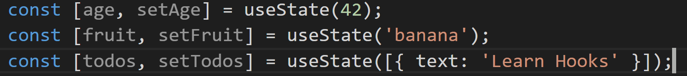
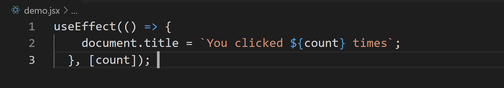

​La reciente versión del Yeoman de SPFx la versión 1.9.1 ha traído una multitud de novedades que van a mejorar mucho la vida del desarrollador. Para mí las dos novedades principales son:

- El poder utilizar la versión 16.8.5 de ReactJS, cuya principal novedad son los React Hooks de los cuales hablaremos a lo largo del artículo.
- La migración de las herramientas de compilación a la versión 4 de WebPack. Este cambio es transparente para el desarrollador, salvo que se tenga extendido este proceso. Sin embargo, el subir la versión da una mejora notable del tiempo de compilación, algo que para proyectos grandes y pesados podía suponer más de 10 minutos de compilación. Con este cambio el tiempo de compilación se llega a reducir en un 50% el tiempo de compilación.

Esta versión era una de las más esperadas debido a que en la versión 1.9 se introdujeron todas estas novedades sin embargo hubo una serie de issues y bugs en dicha versión que obligo al equipo de producto a retirar [la versión 1.9](https://github.com/SharePoint/sp-dev-docs/wiki) y volver a la versión 1.8.2.

**Introducción**

La primera pregunta que nos hacemos sobre los Hooks es: ¿qué son? Podemos definir un Hook como una función en la que podemos acceder a elementos propios de React como son su estado y su ciclo de vida.  Tras esta primera definición, muchos desarrolladores nos hacemos la siguiente pregunta: ¿pero eso no lo podemos hacer con Clases? La respuesta es que sí se puede hacer haciendo uso de las clases. Pero entonces: ¿Por qué viene la motivación de reemplazar las clases por funciones? El motivo no es otro de que por un lado mejorar legibilidad del código al poner los hooks en funciones aisladas de forma que el código queda más legible y mantenible. El otro motivo es la refactorización del código, es difícil reutilizar la lógica de estado entre componentes, React no nos ofrece una forma de reutilizar diversas acciones como puedan ser conectarse a un store. Sería posible hacerlo en base a utilizar diversos patrones, pero digamos que el resultado es una gran cantidad de líneas de código que encapsulan dicho comportamiento y que no son muy fáciles de leer. Con Hooks, puedes extraer lógica de estado de un componente de tal forma que este pueda ser probado y re-usado independientemente. Los Hooks te permiten reutilizar lógica de estado sin cambiar la jerarquía de tu componente.

Antes de continuar con los Hooks hay que dejar bien claro algunos aspectos:

- Los Hooks son opcionales el utilizarlo, aunque se recomienda su uso.
- React seguirá soportando las clases.
- Los Hooks no son un nuevo modelo de desarrollo sobre React sino que los afianza más, ya que dispones de una API más directa en la que se accede a elementos ya conocidos como props, state, ciclo de vida, etc
- No hace falta el migrar el código que tengamos ya implementado.

**Tipos de Hooks**

Los Hooks los podríamos agrupar en tres tipos:

- Hooks de estado =&gt; Cuando nuestro componente funcional se tiene la necesidad de hacer uso del state se podrá utilizar este tipo de Hook.
- Hooks de efecto =&gt; Agrega la capacidad de realizar efectos secundarios desde un componente funcional. Tiene el mismo propósito que componentDidMount, componentDidUpdate y componentWillUnmount en las clases React, pero unificadas en una sola API.
- Hooks Personalizado =&gt; En este tipo se puede ver la potencia que tienen los hooks, ya que este tipo de hooks se utilizan cuando se quiere reutilizar alguna lógica de estado entre componentes. Tradicionalmente, había dos soluciones populares para este problema: componente de orden superior y render props. Los Hooks personalizados te permiten hacer esto, pero sin agregar más componentes a tu árbol de jerarquía.

Para entender el funcionamiento de cada uno de ellos vamos a ver varios ejemplos de código que ayudan a entender mejor su funcionamiento.

**Hooks de estado**

Un Hook de estado podemos decir que su equivalente es una clase funcional en la que tienen que hacer uso en algún momento del state. Pongamos por ejemplo el típico botón que incrementa el contador haciendo uso de lo que estábamos acostumbrados pondríamos un código como el siguiente:

Ahora bien, como haríamos el mismo código utilizando Hooks:

Dentro de este código tenemos varios elementos que comentar. En primer lugar, centrémonos en la línea 3: ¿Qué hace la llamada al useState? Declara una "variable de estado". Nuestra variable se llama count, pero podemos llamarla como queramos, por ejemplo, banana. Esta es una forma de "preservar" algunos valores entre las llamadas de la función. useState es una nueva forma de usar exactamente las mismas funciones que this.state nos da en una clase. Normalmente, las variables "desaparecen" cuando se sale de la función, pero las variables de estado son conservadas por React. ¿Qué parámetro espera la llamada del useState? El parámetro que espera es el valor de la iniciación de dicha variable de estado, puede ser valor entero, string o el tipo que necesitemos.

Ahora bien, dentro de la línea 3 todavía nos queda un valor del que no hemos hablado es el segundo valor del array, setCount. Este valor se refiere al nombre de la función en la que se va a cambiar el valor del estado cuando lo invoquemos. En este mismo ejemplo tal y como vemos en la línea 7 cada vez que se llama a la función setCount esta incrementa el valor de la variable de estado count +1.

¿Cómo podríamos definir múltiples variables de estado? La respuesta puede parecer obvia, aunque pueda parecer que tenga más miga de la que parece. La recomendación oficial es que por cada variable de estado que vayamos a utilizar creemos una línea algo similar a esto:

Hay otras opciones como puede ser añadiendo todas las variables en un único objeto donde están todos los valores de cada variable, esta opción es más complicada y no es recomendada ni por tema de rendimiento ni por complejidad del código. Algo similar a este código:

**Hooks de efecto.**

El Hook de efecto te permite llevar a cabo efectos secundarios en componentes funcionales.  Hay dos tipos de efectos secundarios en los componentes de React: aquellos que no necesitan una operación de saneamiento y los que si la necesitan. Veamos la diferencia entre cada uno de ellos

**Sin saneamiento =&gt;** En ciertas ocasiones, queremos ejecutar código adicional después de que React haya actualizado el DOM. Peticiones de red, mutaciones manuales del DOM, y registros, son ejemplos comunes de efectos que no requieren una acción de saneamiento. Decimos esto porque podemos ejecutarlos y olvidarnos de ellos inmediatamente.

**Ejemplo:** Dado el ejemplo anterior queremos actualizar el título de nuestra página web con el valor del contador, para ello en un desarrollo tradicional añadiríamos el siguiente código:

Veamos ahora como podemos hacer lo mismo con el Hook useEffect:

De los dos códigos, vamos a centrarnos primero en el tradicional. Como podéis observar tenemos dos métodos que estamos duplicando el mismo código. Esto se debe a que en muchas ocasiones queremos llevar a cabo el mismo efecto secundario sin importar si el componente acaba de montarse o si se ha actualizado. Conceptualmente, queremos que ocurra después de cada renderizado, pero las clases de React no tienen un método que haga eso. Podríamos extraer un método, pero aun así tendríamos que llamarlo en los dos sitios.

En el segundo código (con Hooks) centremos en useEffect.  Al hacer uso de este Hook le estamos indicando a React que una vez termine de actualizar el DOM que realice la llamada a esta función. ¿Ahora bien, porque llamamos a useEffect dentro del propio componente? El motivo es que al estar en el mismo ámbito de la función podemos acceder directamente a la variable de estado y no hace falta utilizar ninguna API especifica.

Este hook viene a simular lo que anteriormente hacíamos con los métodos componentDidMount y componentDid Update, pero con una diferencia y que al hacer uso del hook no se bloquea la ejecución de la pantalla en el navegador. Eso si, con los hooks se ejecuta la función useEffect después de cada renderizado y de cada actualización del estado, aunque dicho comportamiento se puede modificar.

**Con saneamiento=&gt;**El saneamiento lo podemos definir como la acción necesaria una vez el componente se va a destruir para evitar algún fallo en la aplicación. Pongamos un ejemplo, estamos implementando un chat y en el momento de que el usuario abandone el mismo queremos saberlo para cambiarle su estado y de esta forma evitar un comportamiento incorrecto de la aplicación.  Veamos un ejemplo utilizando clases: ​

Como podéis observar controlamos tanto el evento cuando el componente se ha creado como cuando el componente se ha destruido. Ahora vamos a ver cómo nos quedaría haciendo uso de Hooks:

Como podéis ver en la función useEffect ahora nos devuelve una función tras ejecutar el código que se hace al montar. Este es un mecanismo opcional de los efectos. Todos los efectos pueden devolver una función que los sanea más tarde. Esto nos permite mantener la lógica de añadir/crear y eliminar suscripciones cerca la una de la otra, lo cual nos facilita mucho la legibilidad de este.  ¿Cuándo se ejecuta la devolución del useEffect? Naturalmente cuando el componente se va "desmontar/destruir", pero si el useEffect se ejecuta cada vez que el componente se renderiza es posible que tengamos problemas de rendimiento, ¿no?  Correcto si no controlamos que el useEffect se ejecute cuando se haya realizado alguna modificación nuestro componente se volverá a pintar cada vez. Esto era uno de los errores más comunes que penalizan nuestros desarrollos en React como pudimos ver en el [anterior artículo publicado en el número 38](/revistas/numero-38/spfx-performance).

¿Cómo podemos hacer esto con los Hooks? Dentro del useEffects se dispone de un parámetro opcional en el que le podemos indicar que solo ejecute este método en caso de que una determinada variable o condición se ejecute. Por ejemplo:

**Hooks Personalizado**

Una vez entendido el funcionamiento de los dos tipos de Hooks que disponemos, podremos crear nuestros propios Hooks con la finalidad de empezar a reutilizar la lógica entre los diversos componentes. Partiendo de la base del Hook de Efecto creado anteriormente vamos a extraer el código a un Hook Personalizado para poder reutilizarlo:

Los Hooks personalizados son más una convención que una funcionalidad. Si el nombre de una función comienza con "use" y llama a otros Hooks, decimos que es un Hook personalizado.

Ahora vamos a crearnos dos compontes que van a utilizar nuestro Hook personalizado:

En este ejemplo vemos como hemos podido aprovechar la lógica entre ambos componentes.

**Reglas de los Hooks**

Hooks son funciones de JavaScript, pero imponen dos reglas adicionales:

- Solo se pueden llamar Hooks en el nivel superior. No llames Hooks dentro de loops, condiciones o funciones anidadas.
- Solo llamar Hooks desde componentes funcionales de React. No llames Hooks desde las funciones regulares de JavaScript, salvo en los Hooks personalizados.

**Hooks y SPFx**

La verdad es que dentro del desarrollo en SPFx es el lugar idóneo para empezar a utilizar los Hooks. Como ya hemos comentado en anteriores ocasiones en los WebParts generalmente son aplicaciones pequeñas y más ligeras que vienen a extender alguna funcionalidad necesaria y puntual. Con lo que podemos decir que son aplicaciones más pequeñas y por regla general más sencillas (aunque no siempre sea así). Ahora bien, vamos a ver cómo podemos aprovecharnos de los beneficios que nos dan los Hooks.  Para ello, en primer lugar, vamos a crearnos un hook Personalizado llamado useAvengerCollection. El funcionamiento de este hook es que nos va a devolver los elementos de una lista de SharePoint filtrados por un determinado valor en caso de que sea necesario. Para ello podemos utilizar el siguiente código:

Del código en cuestión tenemos que ver cómo estamos gestionando el estado: por un lado, nos creamos la variable filter y setFilter para que se pueda utilizar desde otro Hook/artefacto que lo vaya a consumir. ¿De esta forma que beneficios obtenemos? El gran beneficio que obtenemos es que delegamos el control del ciclo de vida a nuestro componente y de esta forma evitamos que nuestro componente se vuelva a renderizar cada vez que haya una modificación del estado. Otro beneficio que tiene esto es que tenemos controlado cada elemento que se va a modificar y no se interfiere una modificación con otro.

La otra opción que tiene dicho código es que realizamos una llamada a la API REST de SharePoint (cuando estamos dentro de nuestro Sitio de SharePoint) y cuando obtenemos los datos de la API esta se almacena en el estado del componente.

¿Ahora ya veis que ganamos con todo esto? Tenemos un artefacto reutilizable y que gestiona el ciclo de React que se encarga de consumir datos de una lista de SharePoint y lo podemos reaprovechar y reutilizar en cualquier sitio de nuestra aplicación.

Una vez tenemos creado nuestro Hook, vamos a implementar un Hook de Efecto que lo consuma de forma que tengamos un componente que dado un campo sea capaz de realizar filtros sobre una lista de SharePoint para ello utilizaremos el useEffect. El código sería el siguiente:

De este Hook, que tenemos que comentar, pues en primer lugar consumimos las variables que tiene el Hook Personalizado que hemos creado anteriormente. Utilizaremos el Hook de Efecto que cuando la variable de estado filter (obtenida del hook personalizado) se modifique se lanza la función que consume los datos de SharePoint.

¿Como podemos consumir este Hook LoadList? Pues llamándolo directamente desde nuestra clase de React de una forma muy simple:

**Conclusión**

Los Hooks han levantado una gran cantidad de opiniones dentro de la comunidad de desarrolladores, aunque a primera vista pueda parecer que es una forma diferente de realizar las cosas. Creo que son una evolución natural de React para adaptarse a la potencia que ofrece JavaScript, siguiendo con los principios de React. Esto no quiere decir que no podamos usar nuestro desarrollo por clases de forma tradicional, sino que es una forma en el que el rendimiento de nuestra aplicación mejora y por otro parte nuestro código es más legible y mantenible.

Si nos ceñimos a los desarrollos en Spfx creo que los Hooks encajan como anillo al dedo dentro del ciclo de desarrollo. Dejan un código mucho más simple, más fácil de entender y sobre todo más mantenible.

**Adrián Diaz Cervera**  
**Lead Software Architect at Encamina**  
MVP Office Development  
[http://blogs.encamina.com/desarrollandosobresharepoint](http://blogs.encamina.com/desarrollandosobresharepoint)  
adiaz@encamina.com @AdrianDiaz81