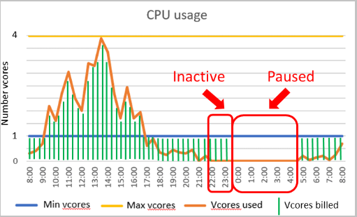

El ecosistema serverless de Azure tiene un nuevo servicio: SQL Azure Serverless. Esta opción está en preview y nos permite ahorrar costes ya qué cuando no está en uso no tenemos costes de cálculo.

**Características**

Dos de las características principales que tiene este tipo de Base de Datos son:

- Escalado automático. A medida que lo necesite escalará automáticamente hasta el número máximo de vCores especificados y se facturara por segundos.
- Si no hay actividad, la base de datos se detiene automáticamente y queda inactiva, por lo que ya no se factura el procesado. En este caso solo se factura por el almacenamiento. En el momento que se necesiten datos la base de datos se reiniciará automáticamente.

**Configuración**

Cuando creamos una Base de datos SQL Azure Serverless podemos configurarla de la siguiente manera:

- Configuración de los vCores mínimos y los máximos. Esta configuración nos permite definir el intervalo de proceso disponible.
- Antes de que la Base de datos se detenga, podemos configurar el tiempo que queremos. que la Base de datos esté inactiva antes de que se detenga.
- Por último, también podemos desactivar la pausa automática.

En el siguiente gráfico podemos ver como funciona el procesamiento de este tipo de Base de Datos con un mínimo de 1 vCore y un máximo de 4 vCores.

Las líneas verdes muestran cuándo y a qué velocidad se facturan los ciclos de cálculo, dependiendo de la demanda real de cálculo (línea naranja) en la base de datos.

**Costes**

- El coste es la suma del coste de proceso y el coste de almacenamiento.
- Cuando el uso de proceso es entre los límites mínimos y máximos configurados, el coste de proceso se basa en los vCores seleccionados y la memoria utilizada.
- Cuando el uso de proceso está por debajo de los límites mínimos configurados, el coste de proceso se basa en los vCores mínimos y la cantidad mínima de memoria configurada.
- Cuando se pausa la base de datos, el coste de proceso es cero y solo se incurre en costes de almacenamiento.
- El coste de almacenamiento se determina de la misma manera que el nivel de proceso aprovisionado.

Ahora vamos a crear una SQL Azure Serverless. Entramos en el portal y creamos una SQL Azure como siempre.

Como la versión está en preview solo tenemos disponible la versión serverless en General Purpose y con Gen5. Después seleccionamos los vCores mínimos y máximos.

Por último, seleccionamos el intervalo de inactivación y el tamaño de almacenamiento

Una vez lo hemos configurado todo tenemos la siguiente configuración.

Le damos a Review + create y ya la tendremos creada.

**Cuando usarlas**

Se debe tener en cuenta que al ser un servicio serverless cuando este está inactivo y parado al reiniciarse tiene un tiempo de arranque, llamado "calentamiento". Estos son los escenarios donde aplicaría este tipo de Base de datos:

- Base de datos donde su uso sea impredecible e intermitente, donde además haya períodos de inactividad.
- Base de datos donde haya frecuencia de cambios de escalado y queramos delegar el auto escalado al servicio.
- Cuando saber el uso y proceso de la base de datos no se sabe a priori.

**Robert Bermejo**  
Chapter Backend Lead in SCRM – Lidl Digital Hub| Microsoft Azure MVP  
bermejoblasco@live.com  
@robertbemejo  
[www.robertbermejo.com](http://www.robertbermejo.com/) 
 
import LayoutNumber from '../../../components/layout-article'
export default LayoutNumber
