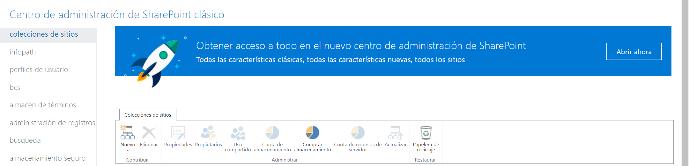
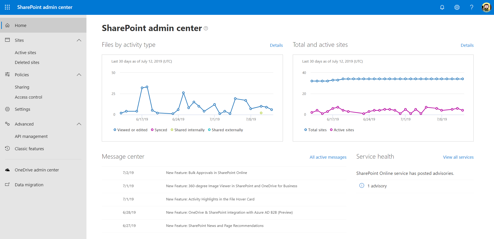
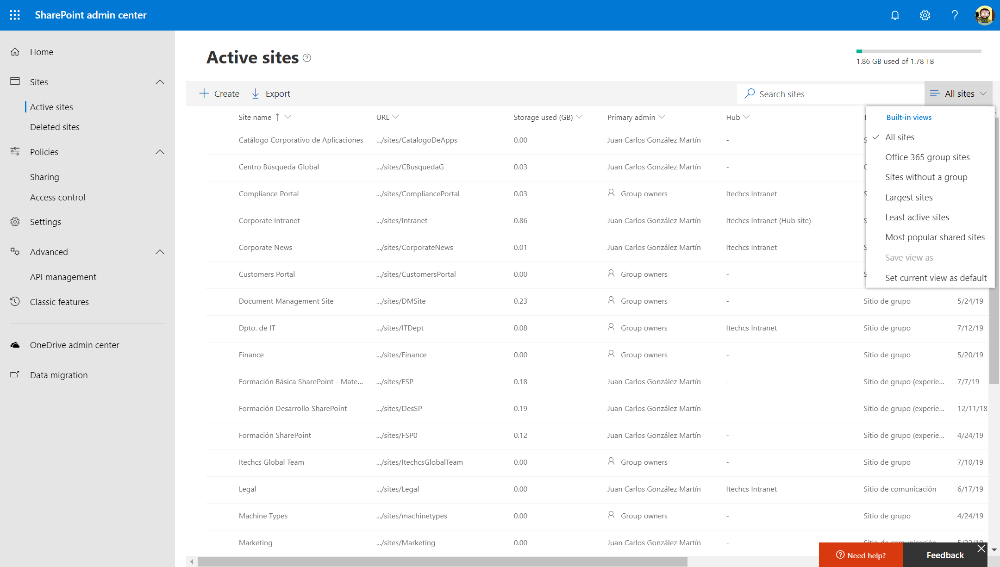
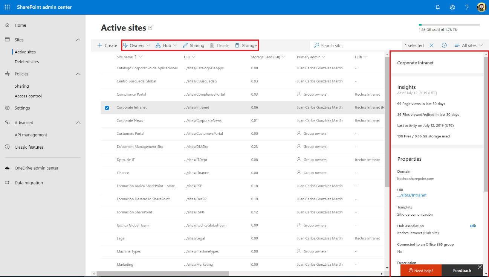
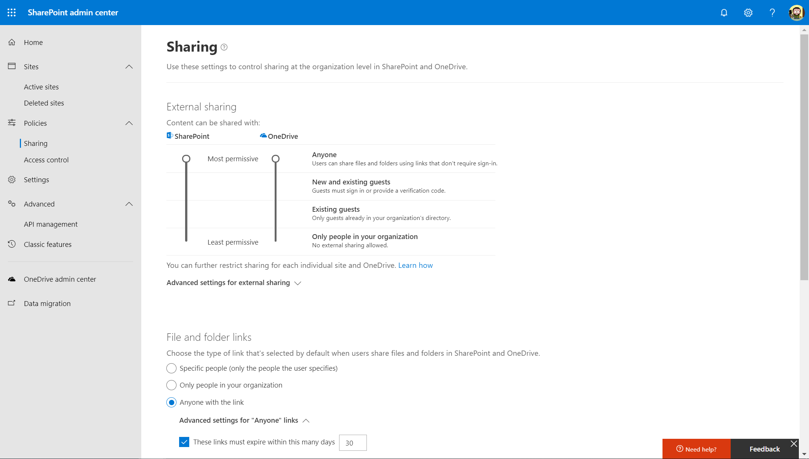
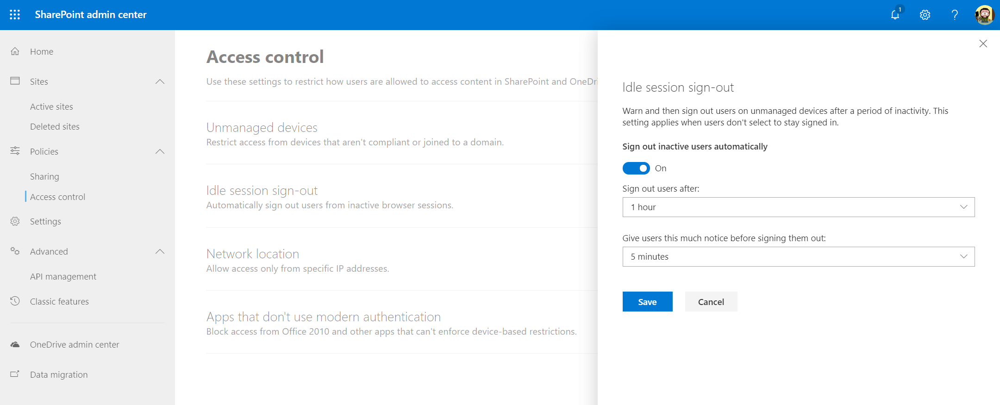
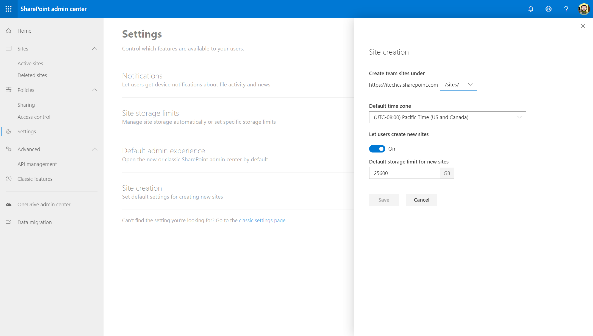
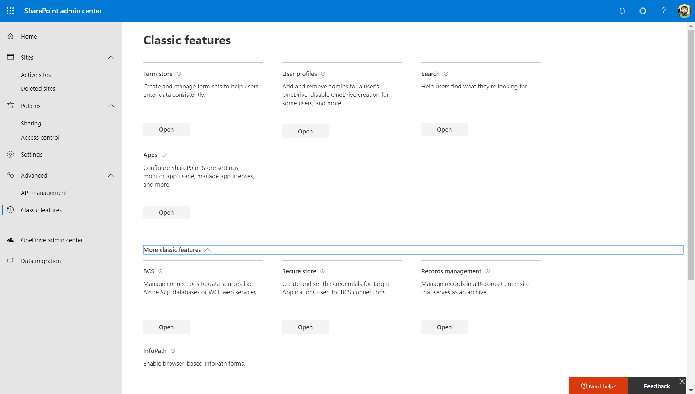

Tras las últimas funcionalidades añadidas al Modern Admin Center de SharePoint Online (SPO) por parte de Microsoft, podemos considerar que desde el punto de vista de administración del servicio proporciona todo lo necesario a los administradores de SPO para poder administrar y configurar la plataforma. En este artículo haremos un repaso al estado del arte actual (Julio de 2019) del Modern Admin Center de SharePoint Online

**Acceso al Modern Admin Center de SPO**

El acceso al Modern Admin Center de SPO es posible:

- Desde el enlace "SharePoint" disponible en la sección de Admin Centers del menú de navegación del Admin Center de Office 365 que proporciona, para tenants con menos de 50 usuarios, acceso directo al Modern Admin Center de SPO.
- Desde el botón "Abrir ahora" que se muestra en el banner informativo en el Admin Center clásico de SPO que sigue siendo la opción por defecto para tenants con más de 50 usuarios.

- Escribiendo la siguiente URL en el navegador: https://&lt;DominiO365&gt;-admin.sharepoint.com/\_layouts/15/online/AdminHome.aspx#/home

Cualquiera de las opciones nos lleva a la página principal del Modern Admin Center de SPO en el que se visualizan:

- Informes de uso de actividad en SPO relativos actividad con archivos en sitios de SPO y sitios activos frente al total de sitios en el tenant.
- Mensajes del centro de mensajes de Office 365 específicos para SPO.
- El estado de saludo del servicio de SPO.

A continuación, se detallarán cada una de las secciones principales del Modern Admin Center de SPO.

**Sección Sitios (Sites)**

Proporciona acceso tanto al listado de Colecciones de Sitios del tenant de SPO (Sitios activos) como a las Colecciones que se han borrado y se encuentran en la papelera de reciclaje bien para su borrado definitivo (manual o bien automático una vez transcurren 30 días desde que se borró un Sitio) o bien para que se puedan restaurar. En el caso de la página de Sitios activos, las principales funcionalidades que proporciona son las siguientes:

- Mostrar el listado completo de Sitios en el tenant, incluyendo Sitios de comunicación y Sitios de equipo moderno.  El listado se visualiza haciendo uso de la misma experiencia de usuario que tenemos para listas y bibliotecas modernas de SPO por lo que podemos aplicar filtros, ordenaciones, realizar búsquedas de Sitios, modificar vistas de Sitios existentes o bien crear nuevas vistas. La siguiente imagen muestra dicho listado en un tenant de prueba y también las vistas provistas por defecto.

- Crear nuevos Sitios ya sean modernos (Sitios de Comunicación o Sitios de equipo modernos) o clásicos.
- Si se selecciona un Sitio en el listado, se habilitan una serie de opciones en la barra de acciones y a través del icono de "i" se puede visualizar los detalles del Sitio seleccionado. Por ejemplo, para un Sitio de comunicación se muestran las siguientes acciones:
    - Owners, permite cambiar el administrador principal del Sitio o bien los administradores secundarios que estén configurados.
    - Hub, si el Sitio es un Hub site permite modificar las configuraciones del Hub o bien anular el registro como Hub del site. Si el Sitio no es un Hub, se muestra la opción de cambiar el Hub al que está asociado al Sitio o bien de registrar el Sitio como Hub site si no está asociado a un Hub.
    - Sharing facilita configurar la opción de "Compartir" para el sitio seleccionado indicando uno de los siguientes valores: Cualquiera, Invitados nuevos y existentes, Solo invitados existentes, Solo los miembros de su organización.
    - Storage, facilita administrar la cuota de almacenamiento del Sitio en el caso en el que las cuotas de SPO se hayan configurado para que se gestionen de forma manual.

**Directivas (Policies)**

Esta sección proporciona acceso a las directivas o políticas de SPO relativas a "Compartir" y "Control de Acceso".  La página de "Compartir" permite administrar el uso compartido externo para SPO y OneDrive For Business (ODFB):

- Por defecto, tanto en SPO como en ODFB está habilitada la posibilidad de compartir contenido (Documentos y Carpetas) con cualquier usuario sin que tenga que iniciar sesión para poder acceder a este. Partiendo de esta configuración base, se puede restringir para ambos servicios el uso compartido de acuerdo con las siguientes posibilidades: Invitados nuevos y existentes, Solo invitados existentes, Solo los miembros de su organización.
- Se pueden aplicar configuraciones avanzadas al uso compartido externo como por ejemplo limitar que solo se pueda compartir con usuarios externos que pertenezcan a ciertos dominios admitidos, forzar a que los usuarios invitados tengan que iniciar sesión con la misma cuenta a la que se le envío la invitación o bien permitir o no que los invitados puedan compartir contenidos de los que no son propietarios.
- Se puede configurar el vínculo por defecto para compartir de acuerdo con las siguientes posibilidades: Personas específicas, Solo los miembros de su organización, Cualquiera con el vínculo. Para este último caso, además se puede establecer por defecto el permiso por defecto para archivos y carpetas, así como el tiempo de expiración (Número de días) para el contenido que se ha compartido.

La sección de "Control de acceso" proporciona acceso a las siguientes configuraciones:

- Dispositivos no administrados: permite establecer la configuración de acceso condicional a aplicar para dispositivos no gestionados por la organización que acceden a contenidos almacenados en SPO y ODFB. Para poder aplicar una configuración de acceso condicional, se requiere disponer de una suscripción de EMS que permita establecer las configuraciones de acceso definidas a nivel corporativo.
- Cierre de sesión inactiva (Iddle Session Sign-out): permite configurar el cierre automático de sesiones de usuario una vez que ha transcurrido un período de tiempo sin actividad.
- Ubicaciones de red: facilita configurar las ubicaciones de red (direcciones IP o rango de direcciones IP) desde las que se permite el acceso a los servicios de SPO y ODFB.
- Aplicaciones que no usan autenticación moderna: permite configurar si se permite el acceso a contenidos de SPO y ODFB a aplicaciones que no usen autenticación moderna. Un ejemplo de dichas aplicaciones puede ser cualquiera de la suite ofimática Office 2010.​

**Configuración (Settings)**

Desde esta sección se pueden realizar las siguientes configuraciones:

- Notificaciones, opción activa por defecto de manera que los usuarios reciben notificaciones relativas a contenidos de SPO en aplicaciones móviles de Office.
- Límite de almacenamiento del sitio, permite establecer el modo por defecto para administrar el espacio de almacenamiento de cualquier Colección de Sitios del tenant: manual vs. automático.
- Experiencia de administración predeterminada, establece el Admin Center de SPO por defecto: clásico vs. moderno. Para tenants con menos de 50 usuarios, la opción por defecto es la del Modern Admin Center.
- Creación de sitios, permite establecer los siguientes parámetros relativos a creación de Sitios:
    - La ruta por defecto bajo la que se crearán nuevos Sitios.
    - La zona horaria por defecto para los nuevos Sitios a crear.
    - El espacio de almacenamiento máximo para los nuevos Sitios a crear.

**Avanzado**

Esta sección proporciona acceso a características avanzadas de administración de Office 365. A fecha de julio de 2019, únicamente existe una opción de configuración en esta sección: Administración de API. Esta opción muestra las APIs que se han habilitado para ser llamadas desde desarrollos para SPO.

**Características clásicas**

Proporciona un acceso directo a las opciones de administración clásicas que no han sido modernizadas todavía por Microsoft.

**Conclusiones**

Tras años de trabajo, podemos decir que el Modern Admin Center de SPO incorpora todas las funcionalidades que requiere un administrador de la plataforma para poder configurar y manejar de forma completa tanto los Sitios que se hayan creado como los servicios que conforman la plataforma.

**Juan Carlos González**  
Office Apps & Services MVP | Office 365 SME en RICOH  
@jcgm1978 
 
import LayoutNumber from '../../../components/layout-article'
export default LayoutNumber
