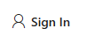
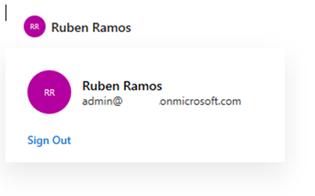
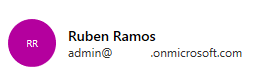
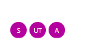
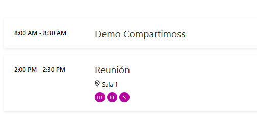
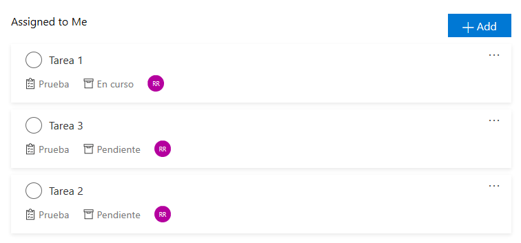

import ArticleHeader from '../../../components/article-header'

<ArticleHeader frontmatter={props.pageContext.frontmatter} />


En muchos proyectos nos piden funcionalidades como mostrar las tareas de Planner del usuario, o la agenda del usuario, y para ello utilizamos Microsoft Graph. Para facilitar el acceso a estas informaciones, Microsoft ha creado una serie de componentes que podemos utilizar en nuestras aplicaciones web y que de una forma muy sencilla permite implementar estas funcionalidades.

Lo bueno que tiene Microsoft Graph Toolkit es que lo podemos utilizar en aplicaciones web modernas, WebParts de SharePoint Framework (SPFx), tabs de Teams, etc. Y utilizando cualquier framework, ReactJS, Angular, etc.

**¿Cómo empiezo a trabajar con Microsoft Graph Toolkit?**

Tenemos 2 formas para poder utilizar Microsoft Graph Toolkit en nuestros desarrollos:

- Cargándolo directamente en nuestra aplicación referenciando un fichero JavaScript:


```
<script src="https://unpkg.com/@microsoft/mgt/dist/bundle/mgt-loader.js"></script>
```

- Mediante NPM, por lo que lo primero sería agregar el paquete NPM con:


```
npm install @microsoft/mgt
```

y luego ya podríamos referenciarlo:

```
<script src="node_modules/@microsoft/mgt/dist/es6/components.js"></script>
```

**Componentes**

- Inicio de sesión: Este componente facilita la autenticación del usuario. Tiene 2 estados:
    - Si el usuario no ha iniciado sesión, el control es un botón sencillo para iniciar el proceso de inicio de sesión.
    - Si el usuario ha iniciado sesión, el control muestra el nombre de usuario de la sesión actual, la imagen de perfil y el correo electrónico. Cuando se hace clic en él, se abre un control flotante con un comando para cerrar la sesión.


Para utilizarlo lo único que debemos hacer es incrustarlo en nuestro html:

```
<mgt-login></mgt-login>
```

Si no nos hemos autenticado, nos mostrará el botón para autenticarnos y una vez autenticado, nos mostrará nuestro nombre y nuestra imagen donde podemos pulsar donde nos mostrará nuestro email y un enlace para cerrar la sesión.​





Este componente tiene los siguientes eventos que podemos capturar:


| **Evento** | **Descripción** |
| --- | --- |
| **loginInitiated** | El usuario hizo clic en el botón iniciar sesión para iniciar el proceso de inicio de sesión. |
| **loginCompleted** | el proceso de inicio de sesión se realizó correctamente y el usuario ha iniciado sesión. |
| **loginFailed** | El usuario canceló el proceso de inicio de sesión o no pudo iniciar sesión. |
| **logoutInitiated** | El usuario empezó a cerrar sesión. |
| **logoutCompleted** | El usuario ha cerrado la sesión. |


- Contacto: Este componente se utiliza para mostrar datos de una persona. Para poder elegir el contacto que queremos mostrar tenemos 3 opciones distintas


| **Propiedad** | **Atributo** | **Descripción** |
| --- | --- | --- |
| **userId** | user-id | Obtener el usuario de Microsoft Graph mediante su identificador |
| **personQuery** | person-query | Buscar una persona determinada en Microsoft Graph. Elegirá la primera persona disponible y obtendrá los detalles de la persona |
| **personDetails** | person-details | Establecer manualmente los detalles de la persona |


Por ejemplo, si queremos mostrar los datos del usuario que se ha validado utilizaremos:

```
<mgt-person person-query="me" show-name show-email></mgt-person>
```

Y nos mostrará los datos del usuario autenticado:



También tiene una serie de propiedades con las que podemos indicar si queremos mostrar el nombre y/o el mail del contacto.


| **Propiedad** | **Atributo** | **Descripción** |
| --- | --- | --- |
| **showName** | show-name | Establecer marca para mostrar el nombre para mostrar de la persona |
| **showEmail** | show-email | Establecer marca para mostrar correo electrónico de la persona |


En la siguiente tabla vemos las llamadas que realiza a la API de Graph y los permisos que necesita para funcionar:


| **Recurso** | **Permiso/ámbito** |
| --- | --- |
| **/me** | User.Read |
| **$value/me/Photo/** | User.Read |
| **/me/People/? $search =** | People.Read |
| **/me/contacts/\*** | Contacts.Read |
| **$value/users/{ID}/Photo/** | User.ReadBasic.All |


- Contactos: Este componente se utiliza para mostrar datos de un grupo de personas. Este componente por defecto muestra los contactos frecuentes del usuario, es decir, realiza la llamada /me/people a la API de Graph, por ejemplo, si añadimos:


```
<mgt-people></mgt-people>​
```

Nos mostrará nuestros contactos recientes:



Este control lo podemos personalizar con las siguientes propiedades:


| **Propiedad** | **Atributo** | **Descripción** |
| --- | --- | --- |
| **showMax** | show-max | Indica el número máximo de usuarios que se van a mostrar. El valor predeterminado es 3. |
| **people** | people | Una matriz de personas para obtener o establecer la lista de personas que representa el componente. Utilice esta propiedad para tener acceso a las personas cargadas por el componente. Establezca este valor para cargar sus propios usuarios. |


En la siguiente tabla vemos las llamadas que realiza a la API de Graph y los permisos que necesita para funcionar:


| **Recurso** | **Permiso/ámbito** |
| --- | --- |
| **/me/people** | People.Read |


- Agenda: Este componente representa los eventos en un calendario de usuario o grupo. De forma predeterminada, el calendario muestra los eventos del usuario que ha iniciado sesión para el día actual, pero se puede modificar para mostrar los datos de otro endpoint que devuelva eventos, por ejemplo, /groups/{id}/calendar/calendarView




Este control lo podemos personalizar con las siguientes propiedades:


| Propiedad | Atributo | Descripción |
| --- | --- | --- |
| **groupByDay** | group-by-day | Un valor booleano para agrupar eventos por eventos por día de forma predeterminada no está agrupado. |
| **date** | date | Una cadena que representa la fecha de inicio de los eventos que se van a obtener de Microsoft Graph. El valor debe estar en un formato que se pueda analizar mediante la fecha el valor del constructor no tiene ningún event-query efecto si se establece el atributo. |
| **days** | days | Un número de días para obtener de Microsoft Graph: el valor predeterminado es 3-Value no tiene event-query efecto si se establece el atributo. |
| **eventQuery** | event-query | Cadena que representa una consulta alternativa que se va a usar al recuperar eventos de Microsoft Graph. Si lo desea, puede Agregar el ámbito delegado al final de la cadena mediante su delimitación con | ("/groups/GROUP-ID-GUID/calendar/calendarView | group.read.all"). |
| **events** | events | Una matriz de eventos para obtener o establecer la lista de eventos que representa el componente: Utilice esta propiedad para tener acceso a los eventos cargados por el componente.  |


En la siguiente tabla vemos las llamadas que realiza a la API de Graph y los permisos que necesita para funcionar:


| **Resource** | **permiso/ámbito** |
| --- | --- |
| **/me/calendarview** | Calendars.Read |


- Tareas: Con este control podemos visualizar, añadir, editar y eliminar las tareas que tengamos en Planner o Microsoft ToDo, dependiendo del datasource que le indiquemos. Para utilizarlo tendremos que añadir


```
<mgt-tasks></mgt-tasks>
```

Y nos mostrará las tareas que tengamos asignadas, por defecto, nos mostrará las que tengamos asignadas en Planner:



Este control lo podemos personalizar con las siguientes propiedades:


| **Propiedad** | **Atributo** | **Descripción** |
| --- | --- | --- |
| **dataSource** | data-source="todo/planner" | Establece el origen de datos para las tareas, ya sea Microsoft to-do o Microsoft Planner. El valor predeterminado es planner. |
| **readOnly** | read-only | Establece que la interfaz de tareas sea de solo lectura (sin agregar ni quitar tareas). El valor predeterminado es false. |
| **initialId** | initial-id="planner\_id/folder\_id" | Establece la carpeta o el planificador mostrado inicialmente en el identificador proporcionado. |
| **initialBucketId** | initial-bucket-id="bucket\_id" | Establece el depósito que se muestra inicialmente (sólo origen de datos de Planner) en el identificador proporcionado. |
| **targetId** | target-id="planner\_id/folder\_id" | Bloquea la interfaz de tareas con el planificador o identificador de carpeta proporcionado. |
| **targetBucketId** | target-bucket-id="bucket\_id" | Bloquea la interfaz de tareas con el identificador de depósito proporcionado (sólo origen de datos de Planner). |


En la siguiente tabla vemos las llamadas que realiza a la API de Graph y los permisos que necesita para funcionar


| **Recurso** | **Permiso/ámbito** |
| --- | --- |
| **/me/planner/plans** | Group.Read.All |
| **/Planner/Plans/$ {ID}** | Group.Read.All, Group.ReadWrite.All |
| **/planner/tasks** | Group.ReadWrite.All |
| **/me/outlook/taskGroups** | Tasks.Read |
| **/me/outlook/taskFolders** | Tasks.Read, Tasks.ReadWrite |
| **/me/outlook/tasks** | Tasks.ReadWrite |


**Proveedores**

Para poder realizar las llamadas a Microsoft Graph necesitamos un token de acceso. Microsoft Graph Toolkit proporciona una serie de proveedores que facilitan la adquisición del token necesario para realizar las estas llamadas a Microsoft Graph.

Para que los componentes usen un proveedor, se debe establecer la propiedad Providers.globalProvider con el proveedor que necesitamos. Debemos tener en cuenta que todos los componentes que incluyamos utilizarán ese proveedor.

Actualmente existen los siguientes proveedores:

- MsalProvider: Este proveedor utiliza msal.js para obtener el token de acceso, por ejemplo, podemos utilizar este proveedor si estamos desarrollando una aplicación SPA. Cuando utilizamos este proveedor lo primero que tenemos que hacer es registrar nuestra aplicación dentro de Azure AD. En este enlace explican cómo hacerlo [https://docs.microsoft.com/en-us/azure/active-directory/develop/quickstart-register-app](https&#58;//docs.microsoft.com/en-us/azure/active-directory/develop/quickstart-register-app)


Una vez registrada nuestra aplicación debemos inicializar el proveedor, para esto tenemos 2 opciones:

- ​Inicializando desde HTML usando el componente mgt-msal-provider y estableciendo el clientID que obtenemos después de registrar nuestra aplicación en Azure AD. Por ejemplo:​


```
<mgt-msal-provider client-id=" <YOUR_CLIENT_ID> "></mgt-msal-provider>
```

- Iniciando desde JavaScript/Typescript de la siguiente manera:


```
import {Providers, MsalProvider} from '@microsoft/mgt'import {UserAgentApplication} from "msal";Providers.globalProvider = new MsalProvider(config: MsalConfig);
```

Donde MsalConfig es:

```
interface MsalConfig {  clientId: string;  scopes?: string[];  authority?: string;  loginType?: LoginType;  options?: Configuration; }
```

- SharePointProvider: Utilizaremos este proveedor si lo que estamos desarrollando es un WebPart de SharePoint. Para utilizarlo debemos inicializar el proveedor dentro del método onInit.


```
import {Providers, SharePointProvider} from '@microsoft/mgt';protected async onInit() {    Providers.globalProvider = new SharePointProvider(this.context);
```

Una vez inicializado podemos añadir nuestro componente en el método render. Debemos tener en cuenta que Microsoft Graph Toolkit requiere Typescript 3.x, por lo que necesitamos estar utilizando como mínimo, la versión 1.8 de SPFx donde se añadió soporte a esta versión de Typescript ([https://github.com/SharePoint/sp-dev-docs/wiki/SharePoint-Framework-v1.8-release-notes#support-for-typescript-27-29-and-3x](https&#58;//github.com/SharePoint/sp-dev-docs/wiki/SharePoint-Framework-v1.8-release-notes#support-for-typescript-27-29-and-3x) )

- TeamsProvider: Utilizaremos este proveedor si estamos desarrollando una pestaña para Teams. Para utilizarlo lo primero que tenemos que hacer es asegurarnos que tenemos referenciado el SDK de Teams y luego inicializamos el proveedor.​


```
<script src="https://unpkg.com/@microsoft/teams-js/dist/MicrosoftTeams.min.js" crossorigin="anonymous"></script><script src="https://unpkg.com/@microsoft/mgt/dist/bundle/mgt-loader.js"></script><mgt-teams-provider   client-id="<YOUR_CLIENT_ID>"  auth-popup-url="https://<YOUR-DOMAIN>.com/AUTH-PATH"></mgt-teams-provider>
```
También podemos utilizarlo mediante paquetes NPM, para ello necesitamos instalar los paquetes de Microsoft Graph Toolkit y el SDK de Teams.

```
npm install @microsoft/mgt @microsoft/teams-js
```

Una vez instalado podremos inicializarlo de la siguiente manera:

```
import '@microsoft/teams-js';import {Providers, TeamsProvider} from '@microsoft/mgt'; Providers.globalProvider = new TeamsProvider(config);
```

Donde config es:

```
export interface TeamsConfig {  clientId: string;  authPopupUrl: string;  scopes?: string[];  msalOptions?: Configuration;}
```

- Próximamente estará disponible un proveedor para complementos de Office.
- También podemos crear nuestro proveedor personalizado si necesitamos algo más específico. Podemos crearlo de 2 formas:
    - Creando un SimpleProvider que obtenga el token de acceso.
    - Ampliando la clase abstracta IProvider.


**Cambiando el estilo**

Cada componente posee sus propias propiedades CSS personalizadas que podemos modificar, por ejemplo, para el componente mgt-people podemos modificar las siguientes propiedades.

```
mgt-people {  --list-margin: 8px 4px 8px; /* Margin for component */  --avatar-margin: 0 4px 0 0; /* Margin for each person */}
```

Si necesitamos más personalización en los componentes tendremos que hacer plantillas.

**Plantillas**

Para todos los componentes podemos utilizar plantillas personalizadas para modificar la forma de mostrar la información. Para hacerlo lo que tendremos que hacer es añadir el elemento &lt;template&gt; dentro del componente que queremos modificar. Por ejemplo, para modificar la plantilla en el componente mgt-agenda lo haríamos de la siguiente manera:

```
<mgt-agenda>      <template data-type="event">        <div>{{event.subject}}</div>        <div data-for='attendee in event.attendees'>          <mgt-person person-query="{{attendee.emailAddress.name}}">            <template>              <div data-if="person.image">                              </div>              <div data-else>                {{person.displayName}}              </div>            </template>          </mgt-person>        </div>      </template>    </mgt-agenda>​
```

Cuando creamos plantillas tenemos que tener en cuenta varias cosas:

- Debemos usar llaves dobles ({{expression}}) para expandir una expresión.
- Podemos usar los atributos data-if y data-else y para la representación condicional.
- Podemos usar el atributo data-for para repetir un elemento.
- Podemos usar el atributo data-type para especificar la parte del componente a la que se va a plantilla. Si no se especifica el tipo, la plantilla se aplicará a todo el componente.


**Conclusión**

Microsoft Graph Toolkit nos proporciona una serie de elementos web reutilizables que podemos utilizar en nuestros desarrollos en distintos escenarios bastante comunes cuando trabajamos con Microsoft Graph. Además, podemos utilizarlo en cualquier framework que estemos utilizando.

Debemos tener en cuenta que es una versión preview y que no es aconsejable que se utilice en entorno de producción. Recientemente se ha liberado la versión 0.2.0, incluyendo un control PeoplePicker y solucionando algunos errores.

Si quieres más información puedes ver la documentación oficial en [https://docs.microsoft.com/es-es/graph/toolkit/overview](https&#58;//docs.microsoft.com/es-es/graph/toolkit/overview) y en el proyecto de GitHub [https://github.com/microsoftgraph/microsoft-graph-toolkit](https&#58;//github.com/microsoftgraph/microsoft-graph-toolkit)


**Rubén Ramos Mateo** <br />
Technical Architect en Ricoh <br />
[ruben\_rm@outlook.com](mailto&#58;ruben_rm@outlook.com) <br />
@rubenr79 <br />
https://rubenrm.com