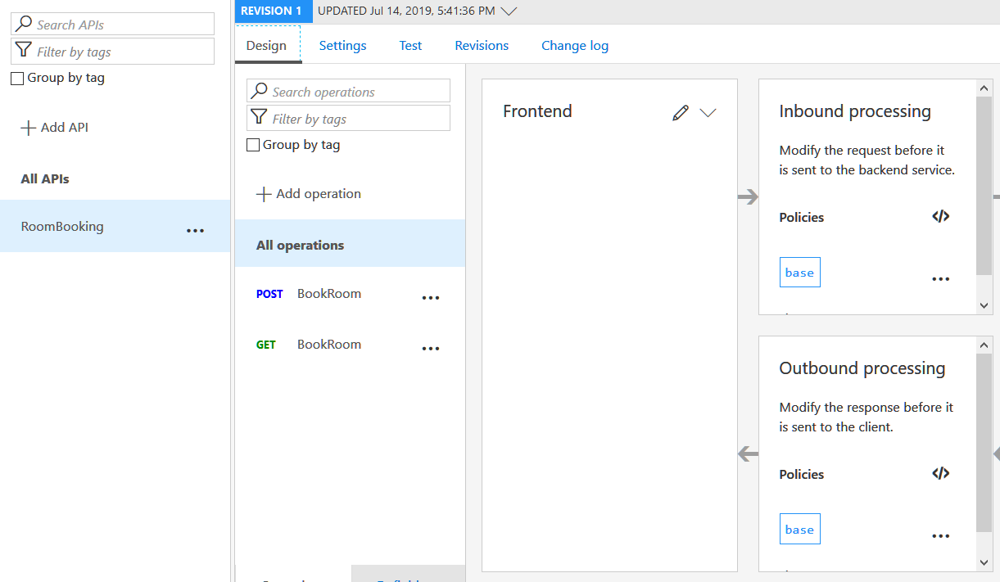

Flow es la implementación que Microsoft ha creado para integrar el motor de flujos de trabajo de Azure, Logic Apps, en Office 365. A su vez, PowerApps es un intento para facilitar la creación de aplicaciones sin necesidad de programación, que pueden ser utilizadas por sí mismas, o integradas en SharePoint Online. Ambos sistemas, aunque fáciles de utilizar y bastante poderosos en cuanto a funcionalidad, carecen de la flexibilidad para agregar nuevas posibilidades de cálculo y procesamiento. Esta falta de los dos sistemas se puede solucionar por medio de las Funciones de Azure utilizando la posibilidad de "conectores" para Flow y PowerApps.

Esta es la primera parte de una serie de tres artículos:

1. Como crear Funciones de Azure para que puedan ser utilizadas por Flow y PowerApps (CompartiMOSS No. 41).
2. Usando Funciones de Azure con Office Flow (CompartiMOSS No. 42).
3. Usando Funciones de Azure con PowerApps (CompartiMOSS No. 43).


**Introducción**

Microsoft Office Flow es el motor de flujos de trabajo creado por Microsoft en base a Azure Logic Apps. Los flujos que se pueden crear están totalmente basados en componentes estándar que ofrecen una lógica interna de trabajo (loops, estamentos, etc.) y conexión a otros sistemas (Exchange, SharePoint y muchos otros conectores, internos y externos a Microsoft). El principal problema de esta forma de trabajo es que no se puede crear ("programar") nueva funcionalidad dentro del sistema mismo. Lo mismo se puede decir de PowerApps: aunque ofrece conectividad con muchos otros tipos de sistemas, no es posible definir capacidades de cálculo dentro de la aplicación misma.

Para solucionar el problema, ambos sistemas permiten la utilización de "OpenAPI" para crear "conectores". OpenAPI es un estándar internacional que fue creado por un consorcio de industrias que se propuso unificar la forma cómo se describen los APIs de REST, creando un formato de descripción neutral y no controlado por cualquier proveedor comercial ([https://www.openapis.org](https://www.openapis.org/)). OpenAPI está basado a su vez en "Swagger", una manera conocida desde hace mucho tiempo para describir APIs de REST.

Aunque REST (REpresentational State Transfer) es una forma unificada para crear y utilizar APIs por medio de internet, la forma de usarlo es más un Framework que un estándar. Por tal motivo, los APIs de REST, como varían de uno a otro, se deben describir mediante una definición de OpenAPI para que otros sistemas "entiendan" como usar el API. Esta definición (OpenAPI) contiene información sobre qué operaciones están disponibles en una API y cómo se deben estructurar sus datos de solicitud y respuesta. Haciendo que Flow y PowerApps puedan utilizar OpenAPI hace que, a su vez, los dos sistemas estén abiertos a usar cualquier clase de funcionalidad proporcionada por cualquier tipo de sistemas externos.

Por su lado, las Funciones de Azure proporcionan toda la infraestructura técnica para poder crear funcionalidad "serverless", es decir, que los desarrolladores se pueden enfocar en crear el código que se necesita, sin necesidad de ocuparse de servidores, redes, rendimiento bajo carga, etc.

Las funciones de Azure se pueden programar en una variedad de idiomas de programación (C#, PowerShell, Python, etc.), utilizando Visual Studio, Visual Studio Code o directamente desde un navegador en el sitio de diseño de Funciones del portal de Azure. El problema, a su vez, con Funciones es que la definición Swagger que generan no es OpenAPI, ni utilizable directamente por Flow o PowerApps.

Microsoft ha publicado parches para poder crear Funciones de Azure para que puedan ser utilizadas directamente desde Flow y PowerApps, pero es requerido que tanto Azure como Office 365 utilicen el mismo Directorio Activo, lo que generalmente no es el caso en aplicaciones Enterprise. La forma para solucionar el problema es utilizar el Azure API Management, un servicio de Azure que permite exponer APIs al mundo externo por medio de OpenAPI.

En este primer artículo de la serie de tres, se indica como crear una Función de Azure que expone su API por medio de un OpenAPI del Azure API Management, que, a su vez, puede ser utilizado desde Flow y/o PowerApps. El ejemplo a continuación es un sistema de reserva de salas de conferencias en una empresa: empleados pueden reservar una sala de conferencias desde una Lista de SharePoint; un Flow acoplado a la Lista pasa los datos de la reserva a una Función de Azure que calcula si la reservación es posible, o si el sitio está ocupado y retorna una indicación al respecto al Flow, el que retransmite la información a SharePoint y al usuario. Todo el sistema de reserva se puede utilizar también desde una aplicación independiente de PowerApps. El algoritmo para determinar si una sala está ocupada o no, no está implementado, solamente se ha simulado por medio de un generador random. Pero el ejemplo indica claramente el potencial que ofrece la combinación de los cuatro sistemas.

**Creación de la infraestructura en Azure**

1. Abra el portal de Azure ([https://portal.azure.com](https://portal.azure.com/)) utilizando una cuenta con suficientes derechos para crear servicios. Una cuenta temporal puede ser creada desde el mismo sitio.

2. Cree un Grupo de Recursos: abra la sección de Grupos de Recursos (Resource Groups) y utilice el botón de "+Add" para crear uno nuevo.

3. Después de que el grupo ha sido creado, ábralo y agregue un servicio de storage: use el botón de "+Add" en el grupo de recursos, introduzca en la casilla de búsqueda "storage account", haga clic sobre el bloque de resultados correspondiente y haga clic sobre "Create". Introduzca los datos pedidos sobre la suscripción y el Grupo de Recursos creado anteriormente. Defina un nombre para el servicio y la localización de su centro de datos. Seleccione "Standard" para "Performance", "StorageV2" en "Account kind", "Read-acces geo-redundant" en "Replication" y "Hot" en "Access tier". Use el botón de "Review + create" y luego "Create" para crear el servicio.


4. Cree un App Service para alojar la Función de Azure: Regrese al Resource Group creado en el punto 2, use el botón de "+Add" y busque esta vez por "function app". Haga clic sobre el bloque correspondiente en los resultados y también sobre el botón de "Create". Defina el nombre para el servicio en la siguiente ventana, seleccione la suscripción y el Grupo de Recursos creado anteriormente. Seleccione "Windows" como "OS", "Consumption Plan" en "Hosting Plan", la localización de su centro de datos, ".NET Core" en "Runtime Stack" y el storage creado anteriormente. Si desea, remueva el servicio de "Application Insights" al final.


5. Cree un servicio de API Management que es el que se va a encargar de convertir la Función en un recurso de OpenAPI: Regrese al Grupo de Recursos, use el botón de "+Add" y busque por "api management". Haga clic sobre el bloque de "API Management" y el botón de "Create". Defina un nombre para el servicio, seleccione la suscripción y el Grupo de Recursos, la localización de su centro de datos y defina un nombre para la organización y su email (estos dos datos no son validados, pero son obligatorios). Seleccione "Consumption (99.9 SLA, %)" en el "Pricing tier". Si desea, seleccione la creación de un servicio de Application Insights.


6. Cambie la definición de las funciones a versión 1. Funciones de Azure pueden ser configuradas como versión 1 o 2. La versión 1 funciona con el .NET Framework de Microsoft y la versión 2 con el .NET Core Framework. Como todos los APIs de SharePoint no son (todavía) compatibles con el .NET Core Framework, todas las Funciones de Azure que tengan que trabajar (o que potencialmente vayan a trabajar) con SharePoint tienen que ser de versión 1. Regrese al Grupo de Recursos y haga clic sobre el "App service" creado en el punto 4. Haga clic sobre "Platform features" y luego sobre "Function app settings" (sección "General Settings"). En la sección de "Runtime version" seleccione "-1".

7. Cree la función. Desde la ventana del App service, haga clic sobre el botón "+" al lado derecho de "Functions" para crear una nueva función. Haga clic sobre "C#" en el bloque "HTTP Trigger". Seleccione "C#" en "Language", defina un nombre para la función y seleccione "Function" en "Authorization level". Cree la nueva función.


8. Codificación de la función. La función es creada con algo de código por defecto que permite capturar los parámetros de entrada, sea que se hayan enviado por medio del QueryString o en el Body de la llamada. En el ejemplo se va a utilizar solamente el QueryString porque Flow y PowerApps tiene problemas haciendo llamadas REST que utilizan el Body para enviar parámetros.

Reemplace todo el código original por el siguiente fragmento:

```
using System;using System.Net;public static async Task<HttpResponseMessage> Run(HttpRequestMessage req, TraceWriter log){    log.Info("Request for a Conference Room is arrived");    // Parse query parameters    string roomname = req.GetQueryNameValuePairs()        .FirstOrDefault(q => string.Compare(q.Key, "roomname", true) == 0)        .Value;    log.Info("roomname = " + roomname);    string persons = req.GetQueryNameValuePairs()        .FirstOrDefault(q => string.Compare(q.Key, "persons", true) == 0)        .Value;    log.Info("persons = " + persons);    HttpResponseMessage myResponse = null;    if(string.IsNullOrEmpty(roomname) == true || string.IsNullOrEmpty(persons) == true)    {        myResponse = req.CreateResponse(HttpStatusCode.BadRequest, "roomname and number of persons are obligatory");    }    else    {        // Faking a room algorithm ...        string[] roomState = { "Free", "Occupied" };        Random myRnd = new Random();        int stateIndex = myRnd.Next(roomState.Length);        myResponse = req.CreateResponse(HttpStatusCode.OK, roomState[stateIndex]);    }    log.Info("Returning - " + myResponse);    return myResponse;}
```


​Testee la función para comprobar que no hay errores de compilación.

9. Configuración del API Management para exponer la función como un OpenAPI. Regrese al Grupo de Aplicaciones y haga clic sobre el servicio del API Management creado en el punto 5. En la nueva ventana, haga clic sobre "APIs" (menú vertical izquierdo) y luego sobre el botón de "Function App" en la sección de "Add a new API". En la nueva ventana, use el botón de "Browse" y luego el de "Function App", el que abre una ventana con una lista con todas las Function Apps en la suscripción. Elija la Function App correcta, lo que produce a su vez una lista con las funciones dentro de ella. Seleccione la función creada en el punto 8, y luego el botón "Select". Los nombres para utilizar aparecen automáticamente, extraídos del nombre del Function App, pero pueden ser configurados a discreción.

Nota: Una función puede ser exportada directamente a un servicio de API Management (desde la ventana de "Platform features" del App Service, vinculo "API Management" en la sección "API"), pero se pierde el control sobre nombres y configuración del servicio, por lo que es mejor hacerlo siguiente este procedimiento. Igualmente, desde esta sección hay un botón para exportar la definición directamente a Flow y PowerApps, pero, como se indicó inicialmente, solamente funciona si tanto Azure como Office 365 comparten el mismo Directorio Activo (AD).


Utilice el botón de "Create". La ventana de "Operations" aparece con toda la configuración del API para la función:



Haga clic sobre el método "POST" (bajo "All operations"). En el panel de "Frontend" haga clic sobre el botón con el lápiz para configurar los parámetros de entrada del QueryString. Seleccione la pestaña de "Query" y agregue (botón "+Add parameter") los nombres de los dos parámetros del QueryString que la función espera encontrar ("roomname" y "persons"). En la misma ventana se puede configurar el tipo de parámetro y un valor por defecto, pero solamente el nombre es obligatorio. Después de guardar los cambios, la ventana de configuración aparece de nuevo mostrando los dos nombres de los parámetros.

Para comprobar que el API funciona correctamente, seleccione la pestaña de "Test" con el método "POST" seleccionado, suministre valores para los dos parámetros, y use el botón de "Send". En la respuesta debe aparecer "Free" o "Occupied". La función presenta su funcionalidad desde este momento al mundo externo en forma de un método REST que es compatible con la definición de OpenAPI que se va a generar. En el siguiente artículo de la serie veremos cómo exportar la definición del método y como utilizarlo en Microsoft Flow.

**Conclusión**

Para darle más flexibilidad y capacidad de interacción con otros sistemas, Microsoft Flow y PowerApps pueden utilizar "conectores" a procedimientos externos. Azure Functions es el método ideal para crear esa funcionalidad. En esta serie de tres artículos se indica como crear funciones de Azure y hacerlas funcionar bajo el estándar de OpenAPI (primer artículo), como conectar Flow con la función (segundo articulo) y como PowerApps puede utilizar la misma función (tercer articulo).


**Gustavo Velez** <br />
 MVP Office Apps & Services <br />
gustavo@gavd.net <br />
 http://www.gavd.net 
 
import LayoutNumber from '../../../components/layout-article'
export default LayoutNumber
