import ArticleHeader from '../../../components/article-header'

<ArticleHeader frontmatter={props.pageContext.frontmatter} />

Casi siempre a la hora de buscar información dentro del ámbito empresarial acabamos con dos resultados:

- Perdiendo muchísimo tiempo sin dar con un buen resultado.
- Frustrados y al rato dejar de buscar y pedirlo a algún compañero.

¿Y si existiese una tercera opción que nos facilite las cosas y que la búsqueda de información no se convierta en un total fracaso?

Esa solución tiene nombre, es **Microsoft Bot Framework y Office 365**.

En este articulo vamos a detallar más a fondo desde un **enfoque funcional, técnico y sin perder de vista el lado de negocio** las funcionalidades que **Azure y Office 365** en conjunto, nos ofrecen para distribuir información en un formato unificado que casi siempre llamamos "**intranet corporativa**".

Para comprender mejor este enfoque debemos hacer un inventario de las herramientas tecnológicas a usar y separarlas en dos grandes bloques:

**Azure**:

- Azure BotFramework V4 (Node.js usando TypeScript): es donde crearemos y alojaremos nuestro Bot.
- Azure Active Directory (registro de aplicaciones): plataforma de identidad desde la cual podremos conceder permisos al ChatBot para acceder a los recursos necesarios.
- Cognitive Services (LUIS y QnAMaker): como fuente de datos y entrenamiento para el Bot.

**Office 365**:

- Office 365 (SharePoint Online): plataforma base sobre la cual esta alojada nuestra Intranet.
- Extensión de SharePoint Framework en SharePoint Online: canal principal para conversación directa con el Bot.
- Microsoft Teams: como canal añadido de comunicación e interacción con el Bot.

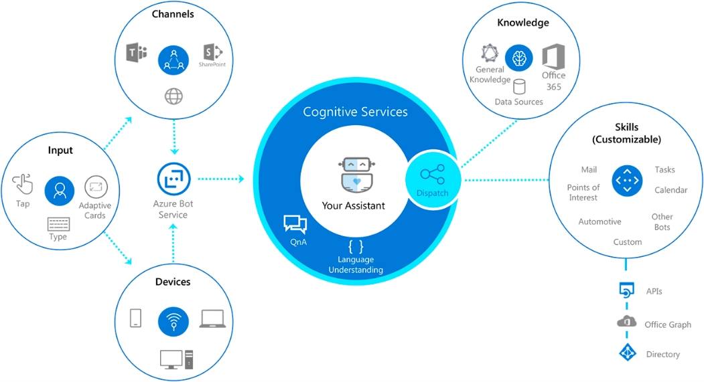

**Bot Services**

Dentro del portal de Azure, encontraremos bajo la categoría de "Bot Services" la forma de crear un nuevo "Web App Bot" con la configuración que mejor se ajuste a nuestras necesidades.

Dentro de las configuraciones disponibles tenemos un apartado muy importante, la **plantilla con la que crearemos el Bot**. Como base **tenemos varias opciones en función del lenguaje** SDK que queremos utilizar (C# o Node.JS). En ambos casos podemos crear un Bot vacío **(Echo Bot)** desde cero o un Bot que nos facilitará el enlace con los servicios cognitivos de LUIS y QnAMaker **(Basic Bot).**

En este caso vamos a utilizar la plantilla basada en Node.JS y Basic Bot. Por defecto este Bot se creará en lenguaje JavaScript, teniendo **la posibilidad de descargar el código completo** del mismo y empezar a añadirle funcionalidades según se necesiten.

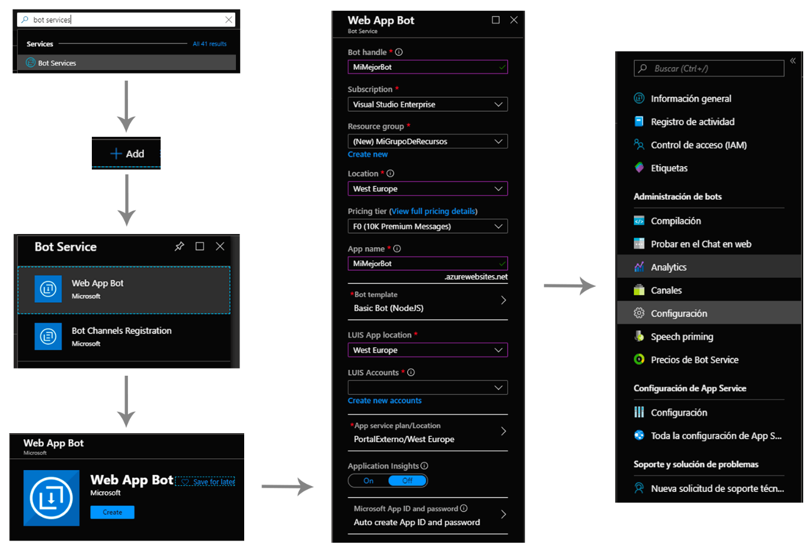

Después de la creación podremos acceder a los apartados de **Canales, Configuración del Bot en sí, Configuración del App Service** que hay por debajo, etc. En definitiva, **nuestro Bot realmente será un App Service con una API Rest** a la que haremos peticiones a través de un endpoint del tipo "/api/messages" y este endpoint nos devolverá las respuestas en "formato conversación".

**(\*)** En nuestro caso hemos optado por darle un poco más de "emoción" al asunto y hemos empezado con un proyecto vacío de Bot Framework y poco a poco bajo los patrones de la versión 4 del mismo, hemos ido añadiéndole las partes necesarias, así como endpoint Rest como punto de entrada del Bot, diálogos, clases de ayuda y demás. Como preferencia en cuanto al lenguaje de programación hemos usado TypeScript (que al final se convertirá en JavaScript después del compilado final).

Como último paso después de la creación del Web App Bot necesitamos ir al apartado de "Registro de aplicaciones" en Azure Active Directory y otorgar permisos de acceso a los diferentes recursos, así como Graph API y SharePoint Online. Como veíamos antes, nuestro bot es una App Service, por lo tanto, esta App se registra automáticamente en Azure AD al crear el Bot.

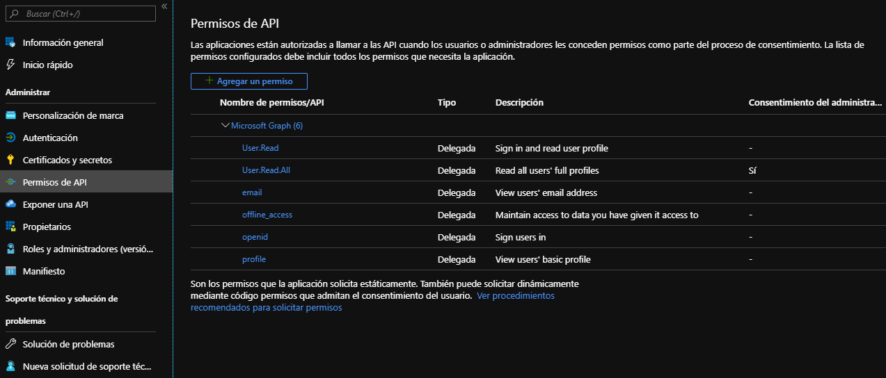

**Office 365**

Nuestra **intranet corporativa estará alojada en SharePoint Online**, sirviendo este como repositorio de noticias, documentación y punto de enlace con las aplicaciones empresariales ad-hoc. Como ejemplo vamos a utilizar un **sitio de comunicación con varias páginas y noticias contribuidas**, siendo este la fuente de información principal para el Bot que luego conectaremos con esta fuente de datos mediante el servicio de búsqueda de SharePoint Online y MS Graph.

Uno de los puntos fuertes de SharePoint Online es la **segmentación de los datos mediante permisos** en bibliotecas, documentos o páginas. De esta manera **el Bot nos dará solo información a la que tenemos acceso,** es decir, **trabajará para nosotros** como si fuéramos nosotros mismo buscada información. Esto lo vamos a conseguir "delegando" al Bot nuestros accesos a la información, mediante tokens **de forma segura y transparente para el usuario**.

**SharePoint Framework**

Desde una **extensión de SharePoint Framework** presente en todo momento en cualquier página (en la parte inferior derecha) abriremos un panel lateral dentro del cual vamos a realizar la conexión con el Bot. Gracias a la librería de "**botframework-webchat**" podemos integrar el componente de **ReactWebChat** que nos proporcionará el **canal de comunicación rápido y directo con nuestro Bot desde el lado de Office365.**

Nuestro código dentro de la extensión de SPFx quedará de la siguiente manera:

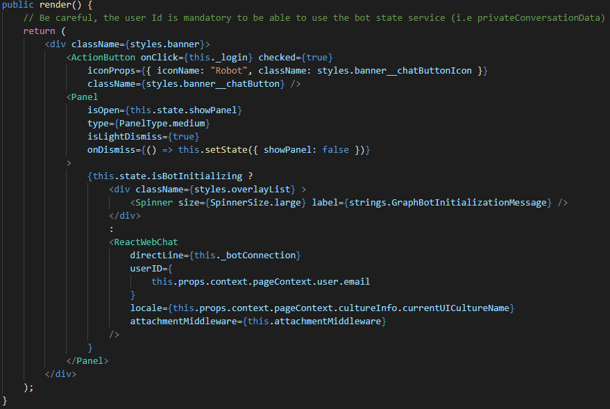

Podemos observar en la anterior captura, el parámetro "directLine={this.\_botConnection}", responsable de la **creación del canal de comunicación** con nuestro Bot. En esta misma variable, vamos a definir el **evento mediante el cual le enviaremos al Bot nuestro token de acceso,** nada más pulsar el botón del Bot y abrir el panel de conversación.

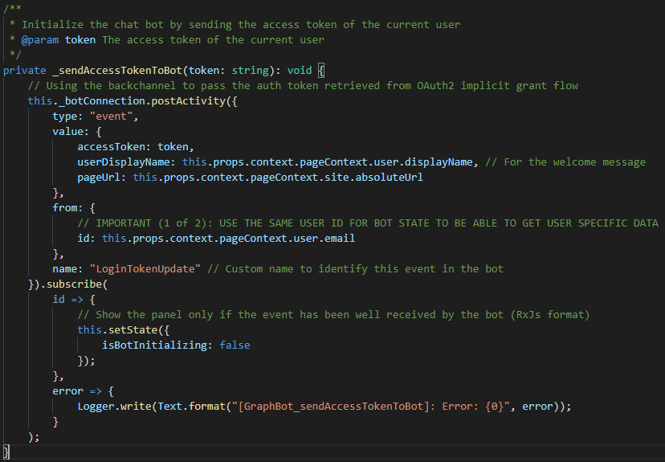

Aprovechando las **variables de contexto de las extensiones SPFx** utilizaremos el AadTokenFactoryProvider **para crear un nuevo token de acceso** a través del método ".getToken()" pasándole como parámetro nuestra aplicación (el Client ID del Bot) registrada en Azure AD.

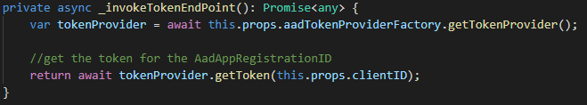

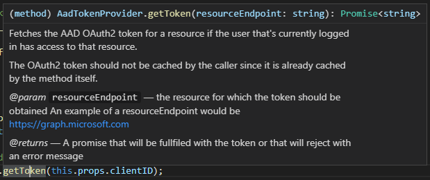

Si nos fijamos en la definición de este método, nos indica que el usuario debe tener permisos sobre la aplicación registrada (nuestro Bot). Estos permisos los conseguiremos a la hora de desplegar la extensión en el **catálogo de aplicaciones de SharePoint Online**. Será necesaria la aprobación de estos permisos por parte de un administrador del tenant de Office365.

Con los siguientes parámetros en el fichero "package-solution.json" de nuestra extensión podremos crear una solicitud de permisos al desplegar la extensión:

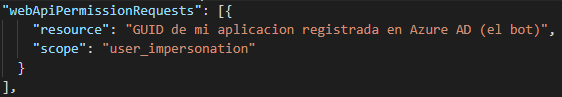

Gracias a estos pasos **hemos conseguido conectarnos al Bot desde la extensión de SPFx**. Ya tenemos el canal DirectLine abierto con el Bot. El siguiente paso será ir al código del Bot y adaptarlo para que sepa hacer uso de toda la información que le estamos enviando.

**Bot Framework V4**

En el proyecto de Bot Framework, tendremos una **estructura de archivos bastante común**, con un **punto de entrada de las peticiones hacia la API Rest**, unos **eventos** dentro de los cuales procesaremos esas peticiones y la **devolución de la respuesta** hacia el usuario en diferentes formatos: texto, imagen, AdaptiveCard, carrousel con contenidos, etc. El procesado de las peticiones se realizará dependiendo del tipo de las mismas. Identificaremos el tipo de evento que ha desencadenado la petición y procedemos a darle una respuesta.

En este ejemplo hemos identificado varios tipos de eventos (existen más) y les hemos intentado dar un procesado especifico:

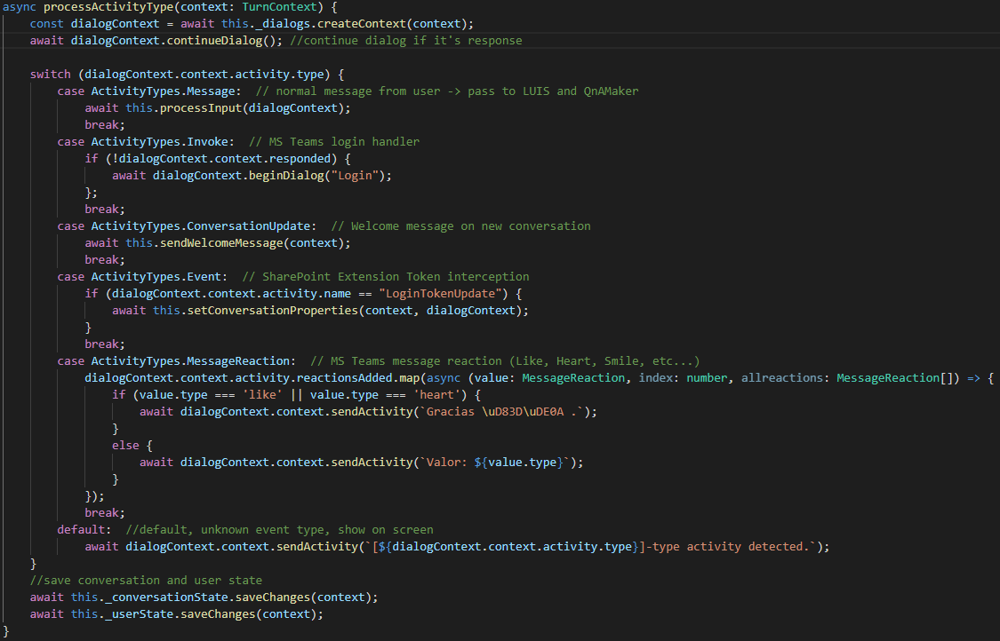

En el anterior código, una de las partes interesantes es el evento personalizado que hemos interceptado y a través del cual **recibimos el token del usuario** desde la extensión de SharePoint Online. Este token **lo iremos pasando a los diferentes diálogos** que lo necesiten para realizar las peticiones oportunas. Como ayuda hemos utilizado la librería de "@pnp/js" y asi poder facilitar las llamadas desde el Bot hacia las APIs de Office 365 (búsqueda de SharePoint y MS Graph).

Gracias a los servicios cognitivos **podemos entrenar un modelo que reconozca las peticiones del usuario**, para que nuestro Bot tenga la capacidad de entender que se le esta pidiendo y recuperar palabras clave de cada una de esas solicitudes.

Como ejemplo podemos pensar en una solicitud del tipo "quiero ver las ultimas noticias". LUIS **mediante entrenamiento previo**sabrá que el usuario quiere conocer las ultimas noticias y **le devolverá al Bot la intención del usuario**. El Bot a su vez realizará las llamadas necesarias a SharePoint Online para recuperar las ultimas noticias (siempre respetando el token del usuario y a su vez los permisos del mismo). De esta manera el usuario solo recibirá la información que va dirigida hacia él.

Veamos el resultado final en un entorno integrado:

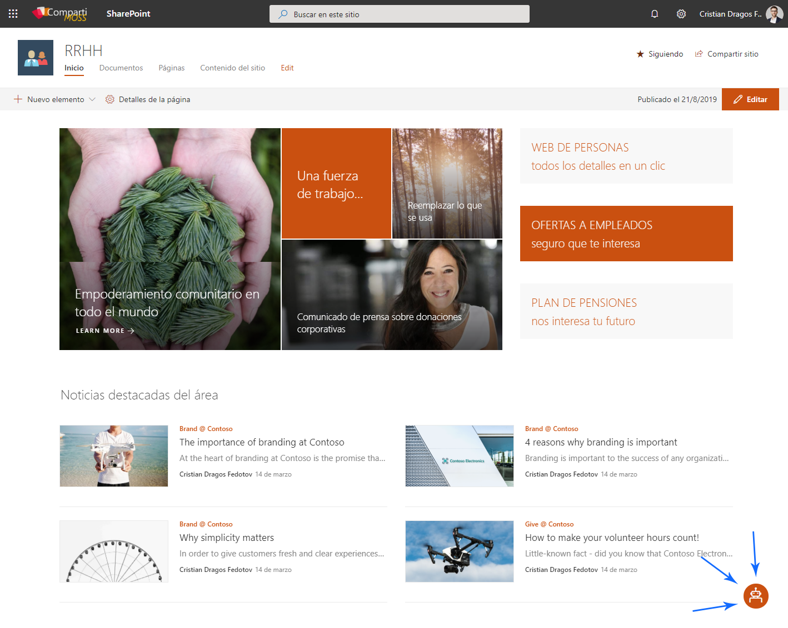

En este caso vamos a poner **varios casos de uso**, expuestos en las siguientes capturas de pantalla:

- **Petición de información genérica** tipo preguntas frecuentes (fuente de datos de QnAMaker).
- **Petición de las últimas noticias** presentes en la intranet con respuesta en formato carrousel de AdaptiveCards (interpretación por LUIS y recuperación de información desde servicio de búsqueda de SharePoint Online).
- **Petición de la/las últimas nóminas** del usuario (interpretación por LUIS y petición de datos a servicio ad-hoc dentro del entorno empresarial).
- **Petición de vacaciones** con respuesta en Adaptative Card (envío de formulario al usuario y registro de datos introducidos en sistema interno de la empresa).
- 

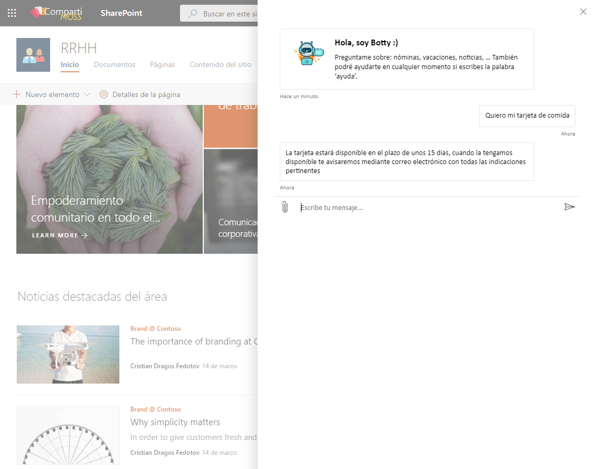

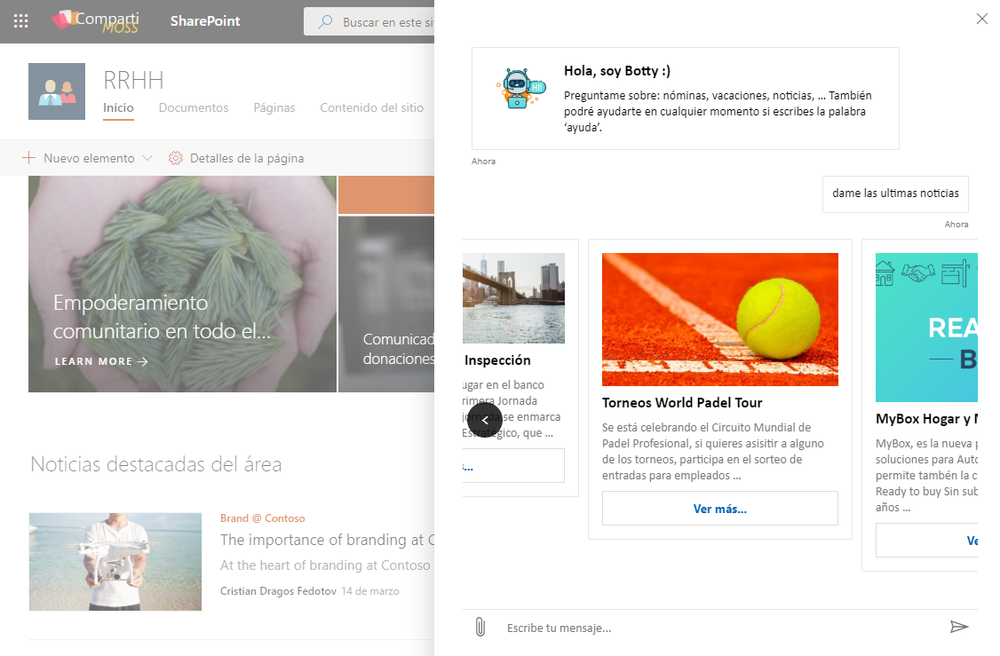

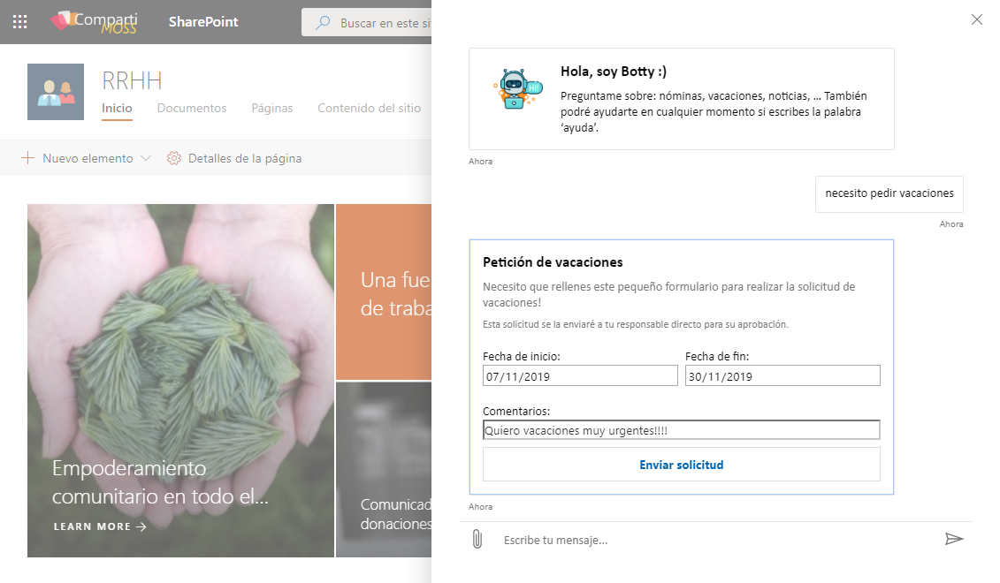

**Otro canal de comunicación**podría ser **Microsoft Teams**, desplegando el Bot dentro del entorno empresarial a través del App Studio de Teams. **El formato seguirá siendo el mismo y las conversaciones se mantendrán de la misma manera**, incluso podremos interactuar con los mensajes mediante Likes y otras emociones disponibles en Teams.

En este ejemplo podemos ver la misma conversación mantenida con el Bot y la interacción con uno de los mensajes recibidos dándole al botón de Like y la respuesta del Bot de agradecimiento a esa interacción.

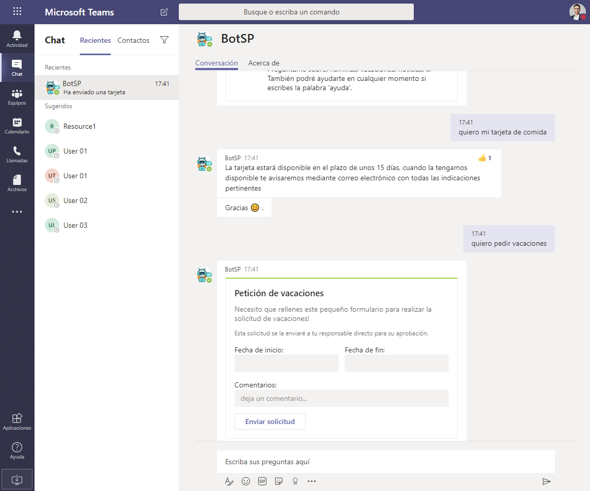

**Conclusiones**

Como hemos visto, es posible crear herramientas que complementen el uso de Office 365 y quizás nos facilite el trabajo en el día a día. En este articulo se describen varios casos de uso más comunes fácilmente ampliables y adaptables a las necesidades de nuestros clientes y usuarios, gracias a las herramientas que ofrece Office 365 en conjunto con Microsoft Azure.

**Cristian Dragos Fedotov**  
 Solutions Architect / Office365 & SharePoint at Everis  
 cristianfedotov@gmail.com  
 [https://www.linkedin.com/in/cristianfedotov/](https&#58;//www.linkedin.com/in/cristianfedotov/)