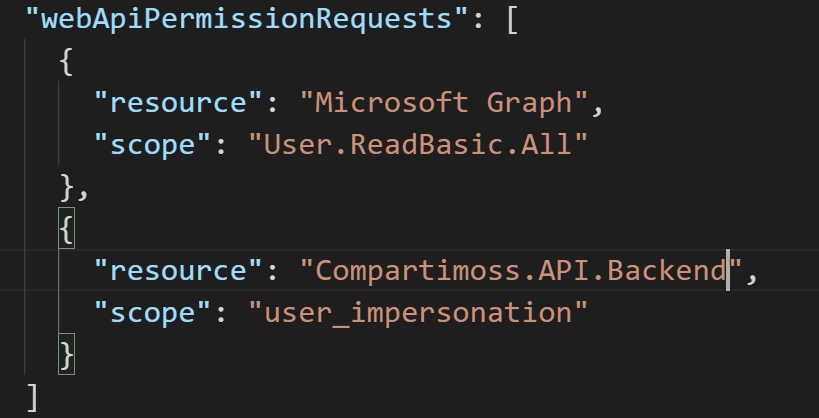
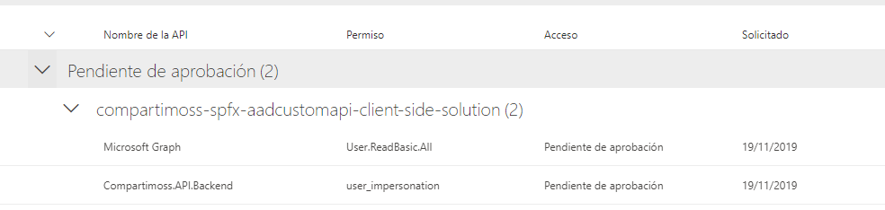

Las posibilidades dentro del desarrollo en SharePoint han cambiado mucho y nos permite un amplio abanico de opciones. En muchos artículos podemos ver como empezar con el desarrollo de SPFx y entender toda la solución que se plantea. Ahora bien, dentro de esta nueva forma de desarrollar, se es cada vez más habitual tener que consumir un servicio de terceros para poder mostrar información. El abanico de servicios de terceros puede ser muy amplio: aplicaciones tipo Facebook, Twitter, LinkedIn, o bien un servicio de la propia compañía en el que utilice una autenticación contra el mismo Azure Active Directory.  En este articulo vamos a centrarnos en este último punto tenemos una API que esta securizada mediante el Azure Active Directory y como la podemos consumir desde nuestro desarrollo en Spfx sin que el usuario tenga que volver a autenticarse.

**Creando la API Custom en .NET Core con la autenticación contra el Azure Active Directory**

En primer lugar, crearemos una API. Para este ejemplo vamos a utilizar .NET Core (pudiéndose utilizar la tecnología que el lector requiera). Para ello lo haremos desde la línea de comando de .NET Core y con poner la siguiente instrucción tendremos un "template" listo para empezar a desarrollar una API.

Para las personas que no están muy relacionadas con el desarrollo en .NET Core, con el nuevo Framework una de sus principales características es su modularidad y la forma en la que vamos inyectando las necesidades a nuestros proyectos a través de añadir diversos pipelines a nuestro desarrollo. Por ello vamos a añadirle por un lado que nuestra API va a usar autenticación y esta va a ser contra el Azure Active Directory.  Para hacerlo de una forma "automática" podemos hacerlo desde el propio Visual Studio=&gt; Seleccionamos el proyecto=&gt; Botón derecha y seleccionamos "Add"-&gt; "Connected Services" tal y como se muestra en la siguiente imagen.

Se muestra una pantalla como la siguiente y seleccionamos la opción de "Authentication with Azure Active Directory"

Al pulsar sobre esta opción quedará pendiente por un lado ver qué tipo de autenticación vamos a tener:  Autenticación mediante login por parte del usuario o bien mediante un token de autorización. Para el caso de una API es casi un estándar el uso de un token de autorización y por lo tanto seleccionamos esta opción.

Una vez seleccionada esta opción el siguiente paso es seleccionar el Tenant sobre el que se va a registrar la Aplicación en el directorio activo.

Una vez tenemos todos estos datos cumplimentados, al darle a finalizar el proceso nos creará una aplicación en el directorio Activo de Azure.   Ademas nos añade una carpeta Extensions donde creará un Metodo AddAzureAddBearer para permitir establecer la autenticación del Azure Active Directory mediante un token Jwt en la petición.  Este método lo tiene añadido en la configuración del StartUp para establecer que las llamadas a la API que requieran autenticación lo van a realizar mediante esta configuración.

La creación de la App en el directorio activo de Azure tambien la podemos realizar directamente desde el propio Portal de Azure y obtener el clientId, tentant y secret de nuestra aplicación. El ejemplo mostrado es en modo ilustrativo para ahorrar tiempo al desarrollador.

Antes de continuar con el desarrollo de la API, vamos a configurar el CORS de la aplicación para permitir las llamadas que se realicen desde SharePoint. En este ejemplo y al tratarse de una ejemplo vamos a permitir cualquier llamadas, esto NO se debe de realizar ninguna circunstancia en entornos productivos. Nota el orden en el que se inyectan los pipilines en el fichero de arranque es importante, si no se ponen en el orden adecuado es posible que no funcione correctamente, recomiendo leer la documentación para saber el motivo [https://docs.microsoft.com/en-us/aspnet/core/fundamentals/middleware/?view=aspnetcore-3.0](https://docs.microsoft.com/en-us/aspnet/core/fundamentals/middleware/?view=aspnetcore-3.0). El fichero Startup tendra la siguiente estructura:

El siguiente paso que realizaremos es crearnos un método en la API que nos devuelva los datos que requieres la aplicación. En este caso vamos a realizar una API que nos devuelve una lista de Avengers. Al tratarse de un ejemplo vamos a leer los datos de un fichero json que se encuentran en la misma API.  Para ellos podemos crearnos un controlador como el siguiente:

Una vez ya tenemos nuestra API implementada y securizada contra el Azure Active Directory vamos a crearnos nuestro componente SPFx y ver todos los aspectos de configuración que nos hacen falta para establecer el Single Sign On del desarrollo.

**Creando el SPFx**

Con el generador de plantilla de Yeoman generaremos una nueva solución , tal y como hemos mostrado en anteriores articulos. Para este caso seleccionaremos ReactJs como Frameworks JS para los desarrollos.

Una vez la solución se haya creado, en primer lugar tendremos que modifciar el fichero package-solution.json que se encuentra dentro de la carpeta config. En este fichero tendremos que añadir un nuevo nodo dentro de "solution" llamado "WebAPIPermissionRequests" donde tendremos que indicar que permisos vamos a solicitar.  Por ejemplo pediremos permisos de lectura a Graph y permisos a nuesta api tendriamos que añadir el siguiente código:

El nombre del recurso de de nuestra API coincide con el nombre de nuestro proyecto cuando registramos la aplicación en Azure, en caso de que no saber de donde obtenerlo se puede consultar el nombre desde el propio portal de Azure donde se registro la aplicación.

Con todo esto el siguiente paso es ver como  vamos a consultar nuestra API. Generalmente en cualquier desarrollo utilizando ADAL o MSAL para la obtención del token lo realizaba siguiendo el flujo de autenticación de OAuth establecido. Ahora bien tras varios intentos el equipo de SPFx ha implementado un "Factoria" para que la autenticación sea transparente para el usuario.  Para ello en primer lugar dentro del contexto del propio WebPart existe un objeto addHttpClientFactory que indicandole el clientID de nuestra aplicación del directorio activo nos devuleve un metodo AAHttClient en el que le incoporamos la petición a la API y le añade un token valido para poder consultar la API securizada.  El codigo seria el siguiente:

Este código lo podriamos poner bien cuando se vaya a cargar nuestro componente, bien vincularlo a una acción del reducer (en caso de que lo usemos). O dependiendo de las necesidades que tenga el cliente. Para simplificar, en este caso vamos a invocarlo dentro del componentWillMount y guardaremos los datos en el propio estado del componente. A continuación en el componente Render mostraremos los datos que nos devuelve la API con el siguiente método:

Una vez ya hemos terminado el desarrollo, vamos a desplegar el paquete de la solución en el catalago de aplicaciones. Al desplegarlo en primer lugar indica que esta aplicación requiere que se aprueben los permisos solicitados anteriormente en el manifiesto.

Una vez la solución esta implementada el siguiente paso es ir a la Administración de SharePoint para la aprobación de dichos permisos.

Si ahorra arrancamos el Workbench en SharePoint Online (https://nuestrositio/\_layouts/15/workbench.aspx) y añadimos el WebPart podemos visualizar un componente que muestra una lista de Avengeres con la estructura que nosotros hemos definido en el HTML.

Es importante indicar que en el Workbench de localhost no funciona la llamada AADHttpclientFactory seria intererante en los desarrollos optar por inyección de dependendicas dependiendo del entorno en el que se encuentre obtenga los valores de un sitio o de otro.

**Declaración implicita de los permisos**

Para las personas un poco curiosas les recomendamos ver las aplicaciones del Directorio activo que se crean en Azure. A pesar de todo este automatismo el flujo cuando instalas/desinstalaas/acutalizas la aplicación en el Catalago de aplicaciones va creando apps nuevas y dejan muchas aplicaciones que no se utilizan dentro de nuestro Directorio Activo.  El equipo de SPFx ha montando un sistema de permisos para cumplir los requerimientos del SSO sin embargo en organizaciones grandes o por lo menos en aquellas en las que la gobernanza de todos los artefactos que tiene Azure es algo importante para ellos no les hace mucha "gracia" este comportamiento a la hora de dar permisos. Uno de las persosas más relevantes dentro del desarrollo en SPFx Andre Connell escribio un articulo de como dar permisos directamente y el porque no utilizar esta forma de dar permisos.  [https://www.andrewconnell.com/blog/consider-avoiding-declarative-permissions-with-azure-ad-services-in-sharepoint-framework-projects/](https://www.andrewconnell.com/blog/consider-avoiding-declarative-permissions-with-azure-ad-services-in-sharepoint-framework-projects/) Resumiendo un poco lo que indica este articulo es que hay una instrucción en el Office 365 CLI en el que podemos dar permisos a SharePoint Online para acceder a nuestra API sin tener que desplegar nada en el Catalogo de soluciones. Esta opción para entornos de desarrollo donde el componente no se ha desarrollado es algo bastante importante y asi facilita mucho la depuración de las aplicaciones.  Para ello tendriamos que poner la siguiente linea

**Conclusión**

Uno de los grandes problemas que se plantean en muchos desarrollos dentro de Office y por ello en SharePoint es la autenticación de nuestras aplicaciones dentro del marco de ejecución de Office. En algunas plataformas se necesita una doble autenticación, mostrar al usuario un login y contraseña para poder empezar a consumir dichos servicios. Esto hace que muchos desarrollos no tengan una experiencia de usuario del todo satisfactoria y bien se busquen otras alternativas o incluso otras plataformas. Aunque esto parezca algo raro en Microsoft Teams  no se podía hacer de serie. Con el uso de esta clase es un gran alivio para el desarrollador: se encarga de consumir el servicio de Office 365 solamente dando permisos y hacienda uso del objeto habilitado para ello. También de cara al cliente de la aplicación que tiene la seguridad integrada y tiene una experiencia normal cuando está en el desarrollo.

**Adrián Diaz Cervera -- Architect Software Lead at Encamina**  
MVP Office Development  
[http://blogs.encamina.com/desarrollandosobresharepoint](http://blogs.encamina.com/desarrollandosobresharepoint)  
adiaz@encamina.com @AdrianDiaz81