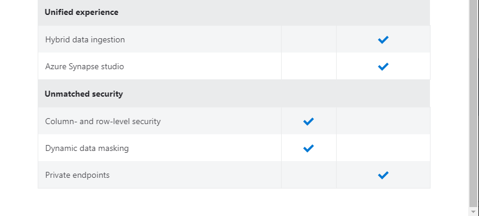
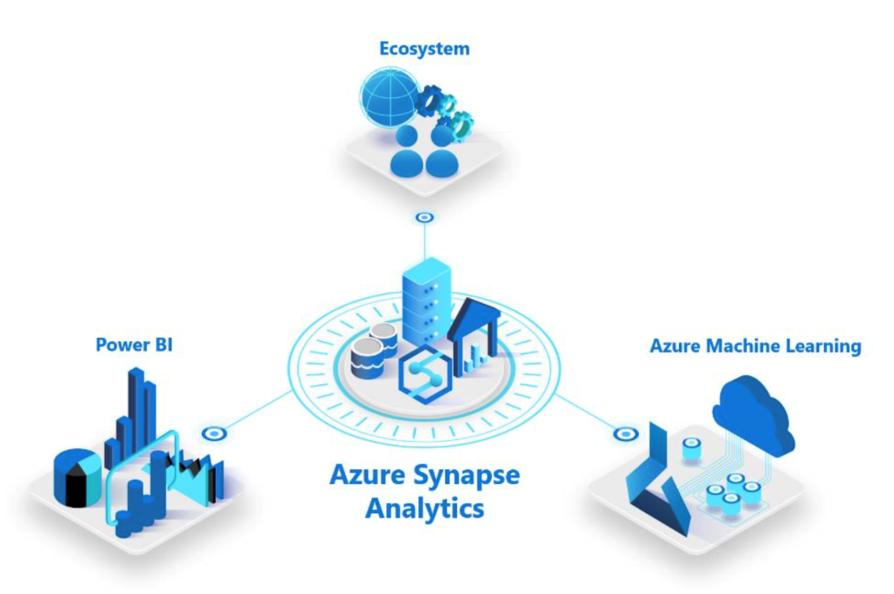
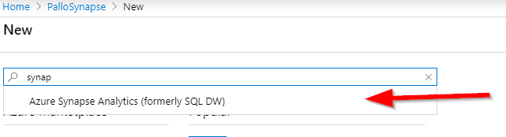
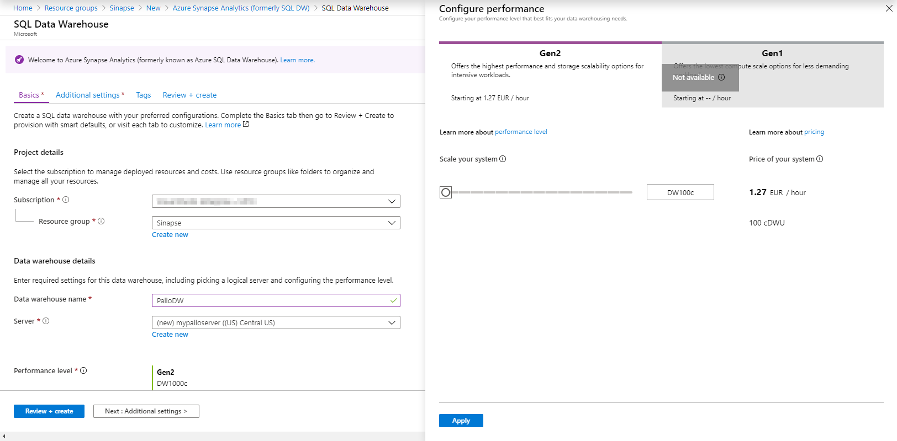
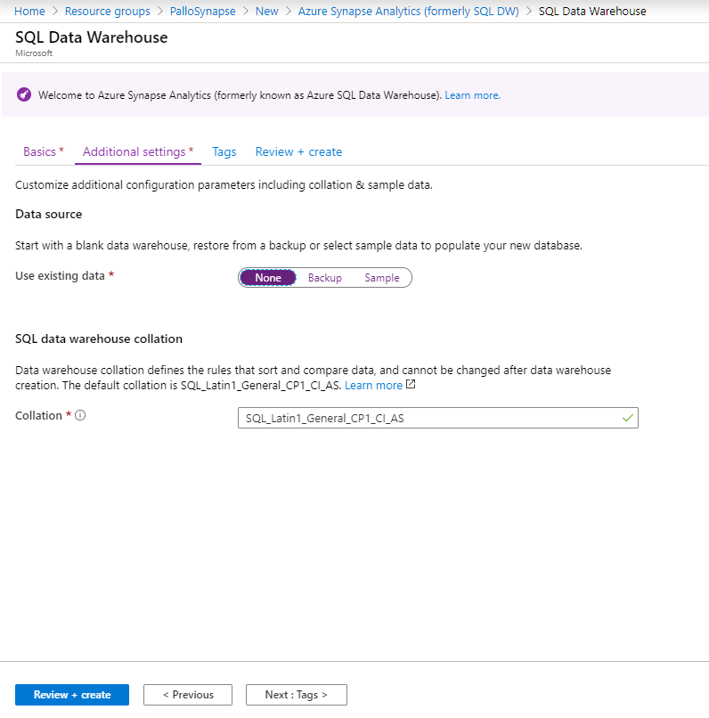
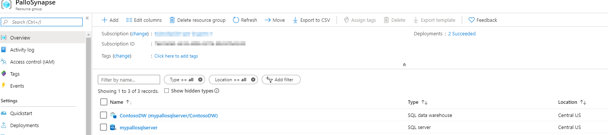
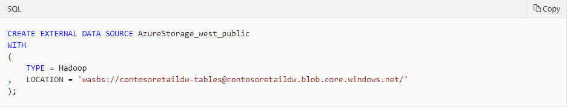
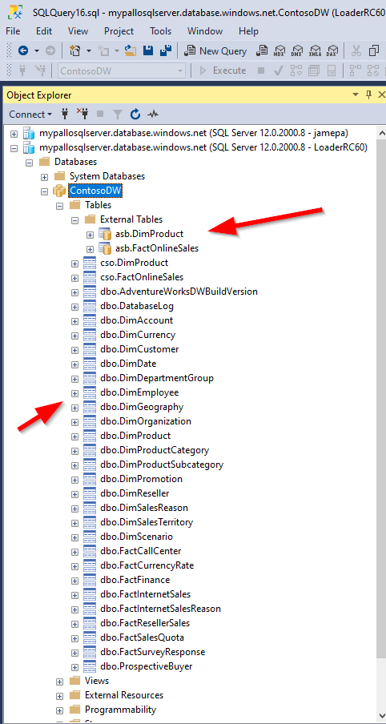
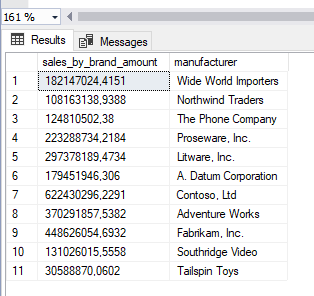

En los últimos días se está hablando mucho de este nuevo lanzamiento de Microsoft: Azure Synapse Analytics.

El objetivo de estas líneas es arrojar un poco de luz sobre qué es Synapse, para qué nos va a servir y conocer si ya está disponible para su utilización. Intentaré en próximos artículos traer más novedades sobre este tema.

**¿Qué es Synapse?**

Synapse es un nuevo servicio de análisis de Azure, evolución de SQL Data Warehouse, cuyo objetivo es unir las capacidades del datawarehousing empresarial con las capacidades de análisis de Big Data. En otras palabras, hablamos de hacer consultas donde mezclamos los recursos propios y/o aprovisionados con otros que pueden no ser propios y/o no queremos aprovisionar. Obviamente, el plus principal es hacer esto cuando queramos, pagar solo según demanda y todavía poder escalar. Eso es Synapse. La guinda del pastel es que podremos realizar las consultas, sea cual sea el origen, utilizando Transact-SQL además de poder integrar los resultados con Power BI o aplicar el Machine Learning que queramos.

La base de Synapse y alguna ventaja.

En realidad, Synapse es la evolución de lo que en Azure conocíamos con SQL Datawarehouse, por lo que tenemos una ventaja principal: recoge y aumenta características que ya teníamos harto probadas. Por ello, podríamos decir que es una muy buena herramienta para implementar rápidamente Data Warehouse de forma global y segura. Otro punto para tener muy en cuenta es poder escalar la capacidad de cómputo por un lado y la capacidad de almacenamiento por otro, y obviamente: en caliente.

Para conocer las capacidades actuales y lo que se viene basta con darle un vistazo a la tabla de funcionalidades (tener en cuenta que este artículo se ha escrito a mediados Nov 2019 y unos días antes de la publicación de la revista, por lo que podríais ya tener muchas funcionalidades en GA que ahora aparecen en Preview):



**Los tres pilares principales que lo diferenciarán de SQL DataWarehouse**

Básicamente los 3 pilares en los que se ha basado la re-escritura desde SQL Data Warehouse son:

- Acelerar el core del motor de almacenamiento, que ahora es capaz de diferenciar y acomodar cargas de trabajo (workloads) según la infraestructura previamente provista o (por el lado contrario) gestionarlas exclusivamente bajo demanda.
- La integración entre los Data Lakes y Apache Spark en un solo punto.
- Azure Synapse studio, una nueva interfaz, unificada que nos permite gestionar juntos los Data Warehouses y los Data Lakes.


Hay una cosa que es lo que realmente me ha llamado más la atención que no es otra que poder tirar querys sobre un entorno NO SQL en un formato 100% Transact-SQL, o dicho de una forma más bonita: querys contra un Apache Spark (por ejemplo) simplemente agregándolo a nuestra zona de trabajo de Synapse.

**La integración**

Obviamente, unir dos mundos cercanos pero dispares como el de los Data Warehouses y los Data Lakes nos han obligado siempre a utilizar herramientas para su explotación que no se casan entre sí o los hacen difícilmente. Ahora esta barrera se rompe y las primeras herramientas que forman parte de la integración "nativa" con Synapse serán Power Bi y Azure Machine Learning. Pero ahí no termina la cosa, otros servicios de terceros también están en la cola de la integración como ser Databricks, Panoply o Pragmatic Works.



**Veamos cómo funciona**

No quería terminar este artículo sin mostraros algo de funcionamiento, por lo que ¡vamos a por ello!.

Lo primero que necesitarás para jugar un poco con Synapse es obviamente un Tenant de Azure, en el que te recomiendo crearte un grupo de recursos exclusivamente para las cosas que vamos a crear. Daré por supuesto que estás familiarizado con el portal de Azure, por lo que una vez creado tu Grupo de Recursos para este ejercicio agregaremos a ese grupo un nuevo recurso llamado Azure Synapse Analytics.



Verás que la creación es muy similar (o idéntica) a crearte un SQL Database, aunque más específicamente un SQL Data Warehouse. Te recomiendo seguir los pasos clásicos del wizard de creación, pero por favor presta atención a este pantallazo ya que hay cosas importantes a tener en cuenta:



- Cuando vayas a crear el servidor donde está alojado te recomiendo que la zona coincida con la zona de tu grupo de recursos.
- Otra cosa muy importante es el nivel de Performance… ten cuidado porque el nivel por defecto está en un escalado medio, y en nuestro caso de testing puedes contar con que el mínimo es suficiente. Obviamente a mayor escalado más caro.
- Otra cosa a tener en cuenta, en la pestaña de configuración adicional, es la pre-carga de algunos modelos. Lo dejo a tu criterio, pero para jugar te recomiendo que hagas la precarga de "Sample" lo que cargará tu modelo con AdventureWorksDW. Y por supuesto, cuidado con la collation: ​




El tiempo de creación del recurso puede variar según la zona, hasta 17 minutos el algún caso.  Terminado lo anterior te encontrarás en tu grupo de trabajo con los dos elementos importantes: el servidor y la base de datos DW:



Ahora lo importante es la carga de información (data interna) y la integración con información exterior (data externa). Tienes varios ejemplos sobre cómo hacer esa carga, y prepárate un café y las zapatillas porque en todos ellos podrás llegar a estar unas horas esperando por la finalización de los querys. Para que elijas:

- Si quieres realizar la carga de Data de Taxis de Nueva York sigue este tutorial: [https://docs.microsoft.com/en-us/azure/sql-data-warehouse/load-data-from-azure-blob-storage-using-polybase](https://docs.microsoft.com/en-us/azure/sql-data-warehouse/load-data-from-azure-blob-storage-using-polybase)
- Si quieres realizar la carga de Data del modelo de Importaciones WideWorldImporters sigue este tutorial: [https://docs.microsoft.com/en-us/azure/sql-data-warehouse/load-data-wideworldimportersdw](https://docs.microsoft.com/en-us/azure/sql-data-warehouse/load-data-wideworldimportersdw)
- Si quieres realizar la carga del modelo de Contoso Retail sigue este: [https://docs.microsoft.com/en-us/azure/sql-data-warehouse/sql-data-warehouse-load-from-azure-blob-storage-with-polybase](https://docs.microsoft.com/en-us/azure/sql-data-warehouse/sql-data-warehouse-load-from-azure-blob-storage-with-polybase)


En mi caso los he hecho todos, pero si estás impaciente por ver resultados te recomiendo el de Contoso ya que es más simple y rápido, o el de los Taxis si quieres ver más cosillas. Para este artículo he elegido el de Contoso.

Una vez terminado el tutorial hay dos cosas importantes que debes tener en cuenta:

- En la instrucción del pantallazo has agregado un blob externo a tu base de datos, en este caso el Blob público de Data de Contoso, que no es otra cosa que un Hadoop. ​




- Y la segunda cosa a tener en cuenta es que le des un vistazo a lo que tienes en la base de datos que puedes ver a través del Management Studio: tablas externas (enlazadas) y tablas internas (parte de las cuales han creado a partir de las externas):




Llegamos ahora a la parte más guapa que es verificar como funciona todo esto. Intenta ejecutar este query:

```
SELECT  SUM(f.[SalesAmount]) AS [sales_by_brand_amount] , p.[manufacturer]
FROM    [cso].[FactOnlineSales] AS f
JOIN    [asb].[DimProduct]      AS p 
 ON f.[ProductKey] = p.[ProductKey]
GROUP BY p.[manufacturer]
```

Y verás que el resultado es:


¿Y qué es lo curioso de ese query?: pues que acabas de tirar un Join de tablas externas (léase Hadoop) con tablas internas de SQL, escrito en Transact-SQL.

Nada más, hasta el siguiente número!

**Javier Menendez Pallo | @JavierPallo​** 
 
import LayoutNumber from '../../../components/layout-article'
export default LayoutNumber
