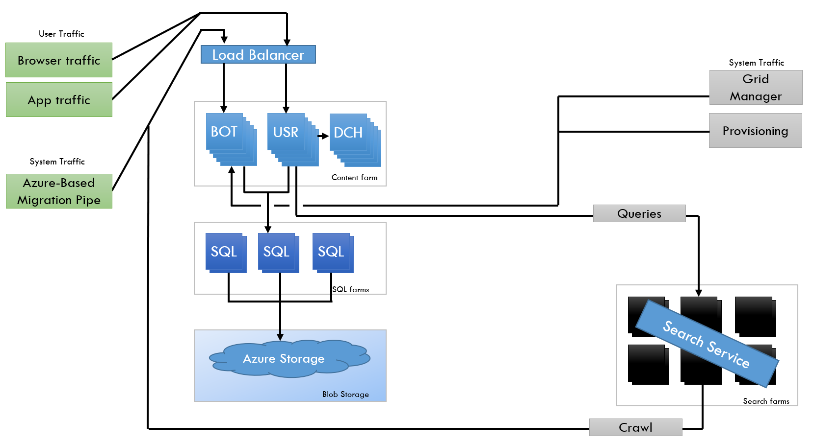

​Siempre he sido un enamorado de la arquitectura de SharePoint Server, sobre todo cuando en la versión 2010 nació el concepto de aplicación de servicio.

Gracias a esta arquitectura, podíamos ejecutar diferentes instancias de un servicio en diferentes servidores, podíamos escalar horizontalmente las aplicaciones de servicio. Para que esto funcionara, cada aplicación web de SharePoint ejecutaba un proxy que se encargaba de enrutar las peticiones al servidor más adecuado que estuviera ejecutando la instancia de la aplicación de servicio. Simplemente, una revolución para nuestro servidor favorito.

En 2011, Microsoft empieza a construir Office 365 y SharePoint Online hereda esta arquitectura desde la versión SharePoint 2013. Todo administrador de SharePoint se puede hacer la idea de lo que significa esto para Microsoft, tener que administrar granjas gigantescas de SharePoint con una topología que no es monolítica pero no está pensada ni diseñada para ejecutarse en el cloud, lo que implica grandes esfuerzos en administración para mantener los sistemas con el nivel de SLA que se le exigía.

Entre 2015 y 2016, el equipo de producto de SharePoint empieza a trabajar en la primera versión de SharePoint diseñada para ejecutarse en cloud y SharePoint 2016 (OnPremises) fue la primera versión que pudimos instalar en nuestros servidores que nacía de una rama del código de SharePoint Online, y no al revés. ¿Esto que implicaciones tenía? Pues a nivel de servicios clásicos de SharePoint no mucho, porque simplemente no han cambiado, más bien, se deprecaron algunos que no iban a llevar ni nuevas funcionalidades ni más soporte por parte de Microsoft. Lo relevante es que ya veíamos servicios en SharePoint Online que no íbamos a tener en SharePoint Server, por ejemplo, Delve.

Como podemos ver en la imagen anterior, se empezaron a desarrollar servicios fuera del core de SharePoint, como puede ser el servicio de búsqueda, y la granja se distribuía en tres roles:

- BOT. donde se administraba todo el tráfico que se produce en background.
- USR. encargado de todo el tráfico del usuario que usa SharePoint.
- DCH. un servidor de caché en memoria.

Con esta topología, los SQL Server eran más independientes, los documentos se almacenaban en un Blob Storage y los servicios eran más independientes para escalar y más fiables en ejecución. Lo que permitía incorporar nuevos servicios de forma totalmente transparente a SharePoint.

La nueva generación de la arquitectura de SharePoint viene a partir de esta entrega de 2016, una nueva generación preparada para ejecutarse en más de 50 datacenters en 20 localizaciones diferentes en todo el mundo. Una evolución de la versión anterior, con componentes mucho más desacoplados entre ellos y con ejecución en un clúster de Service Fabric como microservicios.

Los servicios específicos de SharePoint Online se ejecutan como microservicios con una topología parecida a la versión 2016, con los roles de BOT, USR, Cache. Los nuevos servicios específicos se desarrollan y ejecutan con esta arquitectura en un rol de Microservicio, y todo se almacena en SQL Azure (servicio PaaS) o en Azure Storage, pero esta vez ya de forma independiente uno del otro, son los servicios los que se encargan de ir a los datos relacionales o al almacenamiento de blobs de Azure.

Con esta misma arquitectura, el resto de los servicios que se desarrollan para Office 365 que no son específicos de SharePoint, son implementados en SharePoint usando el rol de BOT o el de USR, lo que permite incluir, de una forma muy simple y estándar, cualquier servicio como Microsoft Search o que se puedan consumir servicios de SharePoint en el resto de los productos, como, por ejemplo, el propio SharePoint.

Por último, pero no menos importante, tenemos Microsoft Front Door, el encargado de dar un punto de entrada seguro a todos los clientes que usan SharePoint Online y enrutador de forma adecuada al servicio correspondiente.

Uno de los puntos fuertes de SharePoint se basa en la capacidad de personalización que hemos tenido, no sólo de la interfaz de usuario, pensad en le cantidad de líneas de código que existen para integrar SharePoint con otras plataformas, para generar aplicaciones de negocio a partir del modelo de objetos de SharePoint. Todo esto siempre ha sido posible gracias al modelo de objetos, gracias a la API REST o a los servicios ASMX que nos permitían hacer cualquier tipo de consulta, independientemente del esquema que el usuario había pensado. Si, lo sé, la tabla AllDocuments sufría de lo lindo con estas consultas y el DBA siempre maldecía a SharePoint porque su SQL Server no podía con esas mega-consultas no optimizadas adecuadamente. La recomendación es que usemos Microsoft Graph porque nos abstrae de la API de SharePoint y sus consultas están optimizadas para que, por ejemplo, no hagamos un GetByTitle si podemos hacer un GetById que es muchísimo más eficiente.

SharePoint Online seguirá evolucionando, seguro que ya están trabajando en mejorar esta arquitectura que ha conseguido atender a millones de usuarios que usan la plataforma y las aplicaciones que hemos desarrollado usando su API. Personalmente, me ha parecido una buena aplicación de microservicios, algo que en SharePoint 2010 se venía venir, pero no estaba madura la tecnología.

**Alberto Diaz Martin**  
 MVP Azure  
 adiazcan@hotmail.com  
 @adiazcan  
[http://blogs.encamina.com/por-una-nube-sostenible/](http://blogs.encamina.com/por-una-nube-sostenible/)