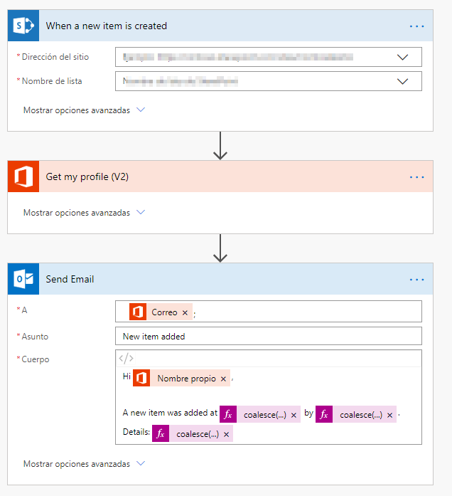

Con la aparición de la *Power Platform* Microsoft apostó fuerte por los servicios destinados al *Citizen Developer*. Entre estos servicios podemos encontrar *Microsoft Power Automate*, cuyo objetivo es facilitar a los usuarios finales la automatización de procesos e integración de datos entre aplicaciones.

En el último año se ha producido un incremento notable en el uso de la *Power Platform*, propiciando que Microsoft anunciase una serie de cambios en el licenciamiento de *PowerApps* y *Power Automate*, anunciados el pasado 25 de julio, y que pasaron a ser vigentes el 1 de octubre del presente año.

En este artículo se pretende mostrar las características de los nuevos planes de Microsoft Power Automate, qué factores se deben tener en cuenta en el momento de elegirlos y qué debemos hacer para adecuar nuestros flujos actuales a los nuevos planes.

Antes de la aparición de los nuevos planes, el licenciamiento en Power Automate era bastante claro y sencillo, tal y como se muestra en la siguiente tabla:

Las características de la mayoría de los planes se pueden resumir en:

1. La cantidad de flujos que puede crear un usuario es ilimitada.
2. El número máximo de ejecuciones mensuales (la suma de ejecuciones de todos los flujos) depende del plan, pasando de las 750 (*Power Automate free*) a las 15.000 (*Power Automate plan 2*).
3. La frecuencia de ejecución de los flujos depende del plan, pasando de los 15 minutos (*Power Automate free*) a 1 minuto (*Power Automate plan 2*). Cabe recordar que la ejecución de los flujos se añade a una cola, y éstos se ejecutan en bloques (*batches*) cada cierto tiempo, el cual depende del plan del usuario.
4. Existen una serie de conectores Premium, con lo que se necesita un plan P1 o P2 si se quieren usar (por ejemplo, conectores con SalesForce, Jira o MailChimp).

En cualquier caso, cabe destacar que un usuario de *Office 365* y/o *Dynamics 365* ya tiene una licencia de Power Automate incluida con las características arriba indicadas, independientemente de las tareas que ejecute el mismo, y solo teniendo en cuenta la frecuencia máxima de ejecución y el número máximo de ejecuciones mensuales.

**Nuevos planes**

El 1 de octubre entraron en vigor los nuevos planes, que quedan resumidos en la siguiente figura:

Antes de entrar en detalle en cada uno de los planes, cabe mencionar especialmente un aspecto muy importante, que no es más que el cambio en el modelo de "facturación" o "contabilización" de los flujos. Anteriormente, en Power Automate se contabilizaban los flujos por unidades de ejecución, y era una de las diferencias importantes con *Azure Logic Apps*. Con la entrada en vigor de los nuevos planes, este modelo queda obsoleto, y a partir de este momento, en cualquier tipo de flujo se tendrá en cuenta el número de llamadas a APIs, o lo que es lo mismo, todas aquellas acciones que impliquen una consulta o modificación de datos (ya sean en Office 365, Azure, AWS, Dynamics 365, etc.) o uso de un servicio (SendGrid, Adobe Docusign, etc.) que se llamen al ejecutar un flujo.

Vamos a verlo con un ejemplo: Imaginemos que tenemos un flujo que se ejecuta al crear un ítem en SharePoint y envía un correo, y que tendría un aspecto como el siguiente:

Con el antiguo modelo de ejecución se contabilizaría 1 ejecución, mientras que con el nuevo modelo se contabilizarían 2 llamadas a APIs (la acción *Get my profile*, y la acción *Send mail*). Por lo tanto, si tenemos un flujo relativamente complejo, con distintas condiciones, solo se tendrán en cuenta las llamadas a APIs que se haya realizado en la ejecución.

En los siguientes apartados vamos a detallar cada uno de los planes indicados anteriormente.

**Plan *Power Automate por Usuario* **

Las características de este plan se pueden resumir de la siguiente manera:

| **Plan *Power Automate por Usuario* ** | ​ |
| --- | --- |
| Objetivo | Productividad personal y procesos de negocio |
| Precio | 13,00 € /mes |
| Unidades mínimas | 20 licencias |
| Número de ejecuciones | Sin límite |
| Límite de llamadas diarias a APIs |  2.000 ​ |

Cabe destacar que tanto el número de flujos que un usuario puede crear, así como el número de ejecuciones de los flujos es ilimitado, pero deberemos tener en cuenta en este último caso el límite de llamadas diarias a las APIs. Por otra parte, si se quiere elegir este modelo, se deberán adquirir un mínimo de 20 licencias.

**Plan *Power Automate por Proceso de Negocio* **

En este tipo de licenciamiento podríamos decir que el enfoque está centrado más en el flujo que en el propio usuario. Es decir, en este caso se podrán crear hasta 5 flujos corporativos, pero los podrá utilizar cualquier usuario de la organización sin necesitar algún otro plan adicional.

| **Plan *Power Automate por Proceso de Negocio* ** | ​ |
| --- | --- |
| Objetivo | Procesos de negocio transversales a equipos o departamentos |
| Precio | 500 € |
| Número máximo de flujos | 5 |
| Número de ejecuciones | Sin límite |
| Límite de llamadas diarias a APIs |  75.000 (entre los 5 flujos) ​ |

Así, en caso de que necesitemos flujos corporativos que deben usar todos los usuarios (por ejemplo, flujos de solicitudes de vacaciones o reservas de salas u otro equipamiento), esta opción de licenciamiento seria la adecuada (obviamente, teniendo en cuenta el tamaño de la organización).

Podríamos resumir las diferencias entre ambos planes mediante la siguiente tabla:

| **Funcionalidad** | ​ | **Usuario** | **Proceso de Negocio** |
| --- | --- | --- | --- |
| Ejecutar flujos | Compra mínima | 20 licencias | 5 flujos |
| ​ | Número de ejecuciones mensuales | Ilimitada | Ilimitada |
| Uso de conectores | Uso de conectores predefinidos | P | P |
| ​ | Uso de conectores customizados y on-premise | P | P |
| Capacidades y límites | Número máximo diario de llamadas a API | 2.000 | 75.000​ |

Podemos concluir que ambos licenciamientos tienen una orientación claramente diferenciada. El plan de Power Automate por Usuario puede servir para que un conjunto de empleados pueda crear y ejecutar flujos a nivel de equipo o departamento, mientras que la opción de Power Automate por Proceso de Negocio está más orientada a flujos que puedan ser usados por todos los miembros de la organización. En este punto cabrá tener en cuenta el tamaño de la misma, y qué opción es económicamente más rentable.

**Plan *Seeded Power Automate* **

Este plan es el que tenemos incluido con una licencia de Office 365 y/o Dynamics 365, y apenas ha sufrido algún cambio. Sí que es destacable que algunos conectores que estaban como *Standard* han pasado a ser *Premium*, con lo que necesitaremos uno de los dos planes presentados anteriormente si los queremos usar. La lista de conectores que han pasado de *Standard* a *Premium* es la siguiente:

Por otra parte, se han eliminado las restricciones en el número de ejecuciones y la frecuencia de ejecución, con lo que únicamente se tiene en cuenta el número de llamadas a APIs diaria, y que se puede resumir en la siguiente tabla:

Finalmente, hay que indicar que en el caso de licencias de *Dynamics 365*, solo se podrán crear flujos asociados con el servicio. Es decir, se deberán disparar desde orígenes de datos con derecho de uso por parte de aplicaciones licenciadas con *Dynamics 365*, tal y como se indica en esta nota de Microsoft:

**Transición a los nuevos planes**

Microsoft ha establecido un periodo de transición a los nuevos planes, que podemos resumir de la siguiente manera:

1. Desde el 01/10/2019 solo se pueden contratar los nuevos planes.
2. Los usuarios con planes Power Automate P1 y Power Automate P2 pueden renovarlos hasta el 31/03/2020.
3. A partir del 31/03/2020 no se podrán renovar los planes Power Automate P1 y P2 y se deberá elegir alguno de los planes de Power Automate indicados.

**Conclusión**

En este artículo hemos visto los nuevos planes de licenciamiento de Power Automate, y lo que parece ser la visión que tiene Microsoft sobre el servicio: Orientación a procesos de negocio de toda la organización, y no tanto a nivel de productividad personal.

Ciertamente aparecen dudas de si Power Automate​ puede ser el servicio adecuado, o si es mejor optar por *Azure Logic Apps* y *Azure Functions*, por ejemplo, aunque en este caso la orientación es más para usuario de TI y no usuario final.

Probablemente en próximos meses surgirán dudas y disyuntivas sobre qué planes utilizar llegado el caso (sobre todo en caso de necesitar conectores *Premium*), con lo que tendremos que esperar un tiempo para ver si estos cambios han sido para bien.

Ferran Chopo Garcia  
*IT Consultant & Trainer*  
[ferran@ferranchopo.com](mailto:ferran@ferranchopo.com)  
@fchopo  
 [http://www.ferranchopo.com](http://www.ferranchopo.com/)