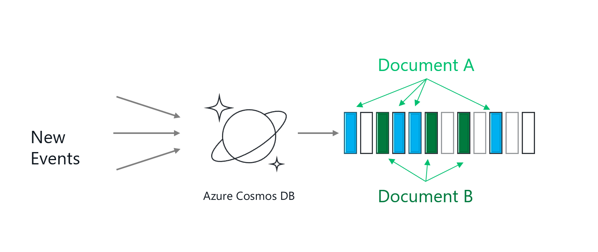
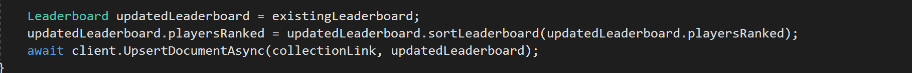

Para los que no lo conozcan, aunque creo serán cada vez menos, Cosmos DB es un servicio de base de datos en Azure, que se distribuye globalmente en las distintas regiones, nos permite a golpe de clic un escalado elástico y es la máxima representación de un modelo de datos no relacional dentro del mundo Azure.

**¿Cómo entender a tu Cosmos DB y modelar de forma correcta?**

Cosmos DB puede llevar a mucha confusión la primera vez que lo usas, y yo creo que es porque proporciona diferentes API para comunicarnos con nuestros datos.

No debemos olvidarnos de que Cosmos DB almacena la información en documentos y que además tiene una serie de particularidades en cuanto a cómo almacena la información, es decir por mucho que podamos atacar a nuestro Cosmos DB con un API SQL, y tirar una sentencia SQL, no es un SQL y no se organiza la información en tablas.

Cosmos DB modela los datos como hemos dicho por Documentos, y los almacena en un contenedor.

Hasta ahora nada muy diferente a lo que podríamos hacer en un Mongo DB por ejemplo, que almacena documentos desnormalizados también, por lo que para mí la clave para hacer diferencial a tu Cosmos DB, es entender como "distribuye" esos documentos. Cosmos DB distribuye la información por particiones Lógicas, en función de una clave de partición que debemos escoger en la fase de modelado, y estas a su vez se distribuyen en N particiones físicas.

Por ejemplo, si almacenamos en nuestra base de datos coches, y los distribuimos con una clave de partición "COLOR", vamos a tener en una partición por ejemplo de coches rojos, y en otra coches verdes, coches negros…, con tantas particiones como colores tengamos.

Todos los documentos de una partición lógica que tienen una misma clave de partición, Cosmos DB asegura que se almacenan en una misma partición física, gracias a una función HASH, que permite localizar rápidamente a los documentos. Es muy importante que escojamos una clave de partición que nos permita tener particiones similares en tamaño, para poder distribuir la carga de forma uniforme, porque de lo contrario crearemos particiones Activas o Calientes que nos penalizarán en rendimiento.

**Caso práctico de consulta sobre tu Cosmos DB – Leaderboard**

Una vez entendido como se distribuye la información, y la mejor forma para optimizar nuestro Cosmos DB, nos daremos cuenta de que, aunque se exponga una API de SLQ no es un proceso sencillo subir la información de nuestro SQL a Cosmos DB, sino que hay que tener una estrategia de modelado para desnormalizar la información de la forma más correcta y escoger una partición idónea. Aun así, vamos a ver un ejemplo que ni con el mejor modelado del mundo podemos optimizar una consulta sin recurrir a otras alternativas de procesado.

Vamos a imaginar que, de inicio, tenemos un modelo de datos en el que almacenamos los accesos de usuario de una aplicación, y la clave de partición es el "USERNAME".

Este modelado va a provocar que tengamos un documento por login para un usuario, teniendo una partición lógica por nombre de usuario, por lo que si hacemos una consulta del tipo **SELECT \* From Logins WHERE username = "Sergio",**vamos a tener un rendimiento muy bueno, obteniendo todos los accesos de Sergio en un tiempo muy bueno, con un consumo de RU's (Request Units - medida de Cosmos DB para medir el rendimiento y el consumo de nuestra BBDD) muy bajo.

Vamos a imaginar que ahora queremos trasformar nuestro modelo, y usar esta base de usuarios para guardar las puntaciones de un videojuego, sería muy sencillo guardar un documento por cada nueva puntuación de partida jugada. Ahora vamos a imaginar que queremos sacar los 10 jugadores con más puntuación en el juego, lo cual nos implicaría comparar los distintos usuarios, o lo que es lo mismo traernos todas las puntuaciones de un usuario, hacer un sumatorio y traernos los 10 elementos de mayor suma.

Esto es posible hacerlo con Cosmos DB, ya que hay juegos que usan tablas de ranking sobre Cosmos para sacar esta información como The Walking Dead.

¿Pero cómo lo hacemos?, si fuéramos a la forma sencilla sería mediante el modelado anterior, sería hacer una consulta para traernos la puntuación de cada jugador, y luego calcular el ranking total en base a la puntuación de los 10 con mayor puntuación. Esto nos implica lectura de muchos usuarios por clave de partición que podemos estimar en 50 RU's y visualización de este leaderboard que se puede disparar a 100 RU's. Además, para esta consulta, a mayor número de puntuaciones, menor rendimiento obtendremos, disparando el consumo de RU's de nuestro Cosmos DB o lo que es lo mismo sobrecargando la base de datos.

**Change Feed Processer y Vistas Materializadas**

Vamos a pensar en que la mejor forma de reducir el consumo de RU'S para este caso de uso del ranking, puede pasar por tener una tabla o vista resumen, que almacene simplemente los 10 jugadores de mayor ranking, y que se actualice por cada entrada de una nueva puntuación.

Para conseguir esto necesitamos poder capturar los eventos o cambios que sufre nuestro modelo por cada inserción y actualizar la vista materializada que va a contener nuestra tabla de ranking. Esto lo vamos a conseguir con Change Feed, que no es más que la pila de cambios de todo lo que sucede en nuestro Cosmos DB, al cual podemos conectar nuestros procesos tales como una Azure Function o un código a medida mediante la librería Change Feed Processer.

Mediante Change Feed vamos a poder obtener los cambios de cada documento en tiempo real, lo que nos va a permitir capturar esas nuevas puntuaciones y almacenarlas en nuestro documento de resumen, que vamos a denominar LeaderBoard.

Si además nos centramos en Change Feed Processor, podemos definir un código a medida que, mediante esta librería, podamos controlar los cambios de nuestro Cosmos DB y procesarlos bajo de manda.

Change Feed Processor necesita de un segundo contendor que denominamos Lease Container, para poder comparar que cambios aún no han sido procesados. Hemos escogido CFP para procesar los cambios porque para el ejemplo nos permite definir entre otras cosas, la frecuencia de cada cuantos segundos queremos chequear la pila de cambios, lo cual permite controlar un poco más el proceso que con un trigger con Azure Function.

**Bajando a código nuestro caso, un proceso de Consola que genere nuestro LeaderBoard**

Para poder construir esa vista materializada con el ranking de nuestros jugadores, vamos a construir una aplicación de consola en Visual Studio, y vamos a utilizar el paquete [**Microsoft.Azure.DocumentDB.ChangeFeedProcessor**](https://www.nuget.org/packages/Microsoft.Azure.DocumentDB.ChangeFeedProcessor/)**,** que tiene las siguientes dependencias tal y como se ve en la imagen.

Posiblemente la pega más grande ahora mismo respecto a construir un trigger con Azure Function es que dependemos de Net Framework y no podemos utilizar Net Core.

*Program.cs*

Si revisamos el código que he dejado en mi [Github](https://github.com/tbsng15/CompartimossCosmosDB) personal, debemos analizar lo primero el fichero Program de nuestra consola y que es el que va a ejecutarse por cada cambio de nuestro Cosmos DB. Lo primero es definir las colecciones de datos para nuestros dos contenedores, en este caso el contenedor del ranking (origen) y por otro lado el contenedor del Lease, donde almacenamos los cambios procesados.

Después de esto solo nos queda definir el proceso de ejecución para nuestro CFP, en base a la clase ChangeFeedObserver.

Si revisamos el Código, debemos indicarle al proceso cada cuanto tiempo debemos chequear los cambios, y darle un nombre al proceso con HostName, y pasarle las colecciones que hemos definido previamente como FeedCollection (donde obtener los cambios) y LeaseCollection (donde llevar un histórico para poder comparar los cambios pendientes).

***ChangeFeedObserver.cs***

En esta clase definimos "que hace" nuestro proceso, para cada cambio recibido, esta clase se encarga de gestionar los hilos del proceso y las tareas de cambio.

El resto del código se basa en una clase **UpdateMateralizedView**, que se encarga de obtener el ranking actual y ver si se debe actualizar o no con la entrada de una nueva puntuación. La forma de hacerlo no puede pasar por leer todos los documentos y sumar puntuaciones, por lo que en este caso nos traemos la última puntuación sumada de un jugador y la actualizamos con la nueva entrada.

Esa puntuación actualizada la vamos a añadir al ranking, bien como una nueva entrada o actualizando una existente si ya estaba entre los 10 primeros jugadores.

Este código lo que hace es añadir al jugador actual al raking, lo que puede dejar la lista en 10 o más jugadores. (en este punto gana fuerza el usar CFP ya que tenemos un único hilo que toca el fichero leaderboard, si lo lleváramos a un escalado con Functions deberíamos buscar otra estrategia de añadir al ranking usuarios). Ya solo nos queda ordenar el ranking, y actualizar el fichero LeaderBoard con únicamente 10 miembros.

El resto del código se basa en modelos de clases y configuraciones de Cosmos DB que no explico en este artículo pero que podéis encontrar en la documentación oficial de Microsoft.

**Analizando que hemos conseguido**

En resumen, lo que conseguimos es optimizar nuestro Cosmos DB y en concreto evitar consultas que nos lleven a retorcer a nuestros modelos. Posiblemente esto es un choque cultural y el nombre SQL API lleve a pensar que, optimizando las consultas podemos mejorar nuestro rendimiento, pero cuando eso os pase por la mente volver al punto uno y recordar como almacena los documentos Cosmos y como particiona la información, ya que no toda consulta es optimizable para Cosmos.

Por norma debemos siempre filtrar por la clave de partición y a ser posible evitar hacer cruces sobre distintas claves; y en vez de eso sacar vistas de agregados ya que el rendimiento mejora mucho.

Por concluir vamos a ver que la consulta que estamos utilizando para traer la vista materializada es muy sencilla, tal y como muestra la siguiente imagen.

Haciendo una vista materializada que resuma nuestro ranking, tenemos una simple consulta por Clave de partición en este caso "LeaderBoard", reduciendo en mucho el consumo de RU's.

Con una vista materializada tenemos un consumo 2,280 RU's en media, para obtener el leaderboard del juego y la lectura de una nueva puntuación, en cambio sin vista materializada nos implica 150 RU's de media. Debemos tener en cuenta que cada RU's que podamos ahorrarnos significa que implica un mayor rendimiento de nuestro base de datos, y sobre todo ahorro económico por escalados innecesarios.

Por todo esto necesitamos por un lado un modelado inteligente de inicio y sobre todo escoger la mejor estrategia para extraer nuestra información, bien por consulta o bien por proceso de desnormalización y vistas agregadas.

**Conclusión final**

Es muy cierto que el rendimiento de las consultas de Cosmos DB mejora día a día, que además presenta una gran variedad de APIS para poder atacar a la información, haciendo a Cosmos DB un producto muy atractivo para muchos tipos de desarrolladores y de administradores de base de datos.

Pero también es cierto que aún tiene mucho por mejorar, que puede ser confuso para una persona que viene de SQL el tener que pensar en modelado por particiones, y más aun el no poder hacer cualquier tipo de consulta libremente sin pensar en particiones o claves de partición.

Pero también es muy cierto que esto corre y mucho, por ejemplo, cuando preparé el material para este artículo, la mejor forma para hacer un **GROUP BY** (que no es otra cosa que lo que hace esta vista materializada), era el pensar en un proceso en backend para crear esta vista de resumen. Pues desde el pasado mes de octubre tenemos posibilidad de hacer consultas con **GROUP BY** y con un rendimiento muy similar al obtenido por la vista materializada, igual aun un poco por encima pero que puede compensar si en el equipo no tenemos desarrolladores de backend o no tenemos tiempo para afinar tanto el consumo de RU's.

Por ejemplo, para obtener el Leaderboard podríamos plantear una consulta muy parecida a esto:

SELECT TOP 10 c.IdPlayer, (SELECT SUM(c.Score) FROM c GROUP BY c.IdPlayer) as total FROM c

SELECT \* From c WHERE c.IdPlayer = "leaderboard"

Y el consumo de RU's no sería muy por encima de 3 – 4 RU's para obtener el ranking, lo que sin duda habla de que en pocos meses mejora mucho el sistema de consultas, y si lo unimos a un entendimiento de como modela los datos Cosmos DB, en poco tiempo podemos estar ante una máquina de triturar datos y de fácil inserción (como cualquier modelo no relacional que se precie).

**Sergio Hernández Mancebo**  
Azure MVP | @shmancebo  
shernandez@encamina.com 
 
import LayoutNumber from '../../../components/layout-article'
export default LayoutNumber
