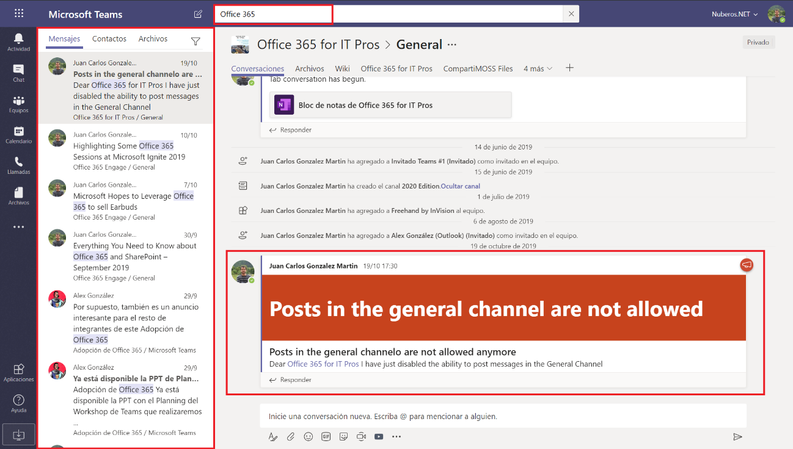

Este artículo es el primero de una serie de artículos sobre Tips en el uso de Microsoft Teams que faciliten al usuario tareas habituales con la herramienta de Teamwork por excelencia de Microsoft. En este primer artículo vamos a revisar como buscar información en Teams.

**Buscando información en Teams: Por donde empiezo**

Para buscar información en Teams, lo único que tenemos que hacer es indicar la palabra clave a buscar en la barra de línea de comandos que también se utiliza para ejecutar búsquedas:

Como se puede apreciar en la Imagen 1, a medida que se indica un criterio de búsqueda se sugieren Teams que estén relacionados con dicho criterio bien en el propio nombre de un Team, en conversaciones que tienen lugar en un Team en concreto o en archivos almacenados en un Team.

Para que se muestren resultados de un criterio de búsqueda, simplemente pulsamos la tecla "Intro" en nuestro equipo o bien hacemos clic en el icono de buscar que se muestra bajo la barra de comandos de Teams. A continuación, en la parte derecha de Teams se muestran los resultados que coinciden con dicho criterio de búsqueda.

**Analizando los resultados de una búsqueda en Teams**

Como se puede apreciar en la Imagen 2, los resultados de una búsqueda en Teams se organizan de acuerdo con tres ámbitos diferentes:

- Mensajes, es decir, se muestran todas las conversaciones que han tenido lugar en distintos Teams y que contienen la palabra clave de búsqueda introducida. Al hacer click en uno de los resultados, se muestra el mensaje concreto que contiene dicha palabra clave.
- Contactos, es decir, aquellos contactos en Teams que contienen la palabra clave indicada.
- Archivos, es decir, se muestran todos los archivos que contiene en su nombre o contenido la palabra clave indicada. Como en el caso del ámbito de Mensajes, al hacer clic en un resultado se visualiza el archivo concreto que contiene dicha palabra clave.

**Aplicando filtros a las búsquedas en Teams**

Cada ámbito de búsquedas en Teams cuenta con su propio juego de filtros que son propios de este y que permiten acotar las búsquedas.

- Para el ámbito de "Mensajes", tendremos los filtros que se muestran en la Imagen 4:
    - Asunto, para indicar un asunto concreto en los mensajes que contengan la palabra clave.
    - Intervalo de fecha, para indicar uno de los siguientes valores: Hoy, Ayer, Esta semana, Semana pasada, Este Mes, Mes pasado, Este año, Último año.
    - Equipo, para indicar un Team concreto en el que realizar la búsqueda. No es posible seleccionar más de un Team.
    - Canal, para indicar un canal concreto en el Team. No es posible seleccionar más de un canal.
    - De para indicar el nombre de la persona que ha escrito un mensaje conteniendo dicha palabra clave.
    - Incluir/Excluir los mensajes en los que se mencione al usuario
    - Incluir/Excluir los mensajes que contengan archivos adjuntos.​

- Para el ámbito "Contactos" no hay filtros definidos y la experiencia de usuario en los resultados de las búsquedas es la que se muestra en la Imagen 5.

- Para el ámbito "Archivos", los filtros disponibles son los siguientes:
    - Equipo, permite indicar el "Team" en el que localizar los archivos que cumplen con el criterio de búsqueda.
    - Tipo de archivo, permite indicar el tipo de archivo a buscar. Los formatos incluidos en este filtro son: Excel, PowerPoint, Word, Imágenes, OneNote, Archivo de texto, PDF.
    - Modificado por, permite indicar el nombre del usuario que modificó el archivo a buscar.

**Conclusiones**

En este artículo hemos visto como los usuarios en Teams pueden realizar búsquedas de palabras clave en la plataforma. Los resultados de las búsquedas se pueden agrupar en tres ámbitos diferenciados (Mensajes, Contactos y Archivos) en los que es posible aplicar filtros de búsqueda para acotar más los resultados.

**Juan Carlos González**  
Office 365 SME en RICOH | Office Apps & Services MVP  
@jcgm1978 | [https://www.linkedin.com/in/juagon/](https&#58;//www.linkedin.com/in/juagon/)