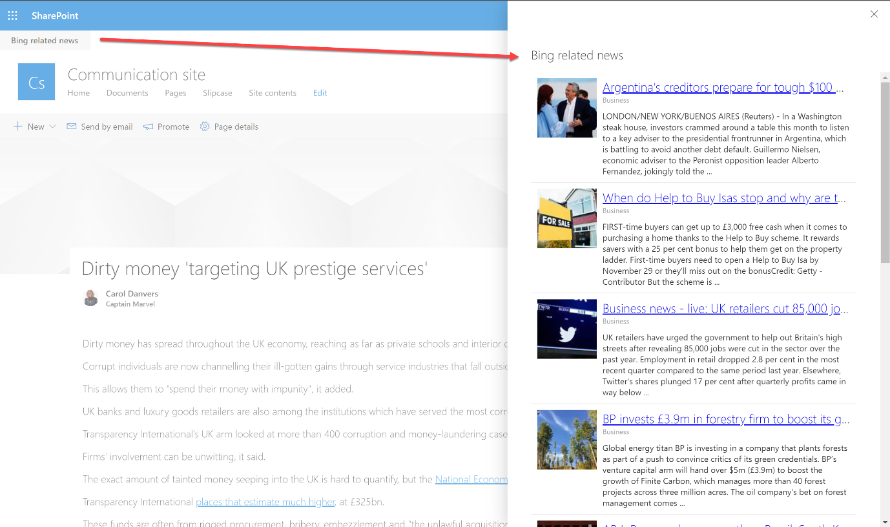
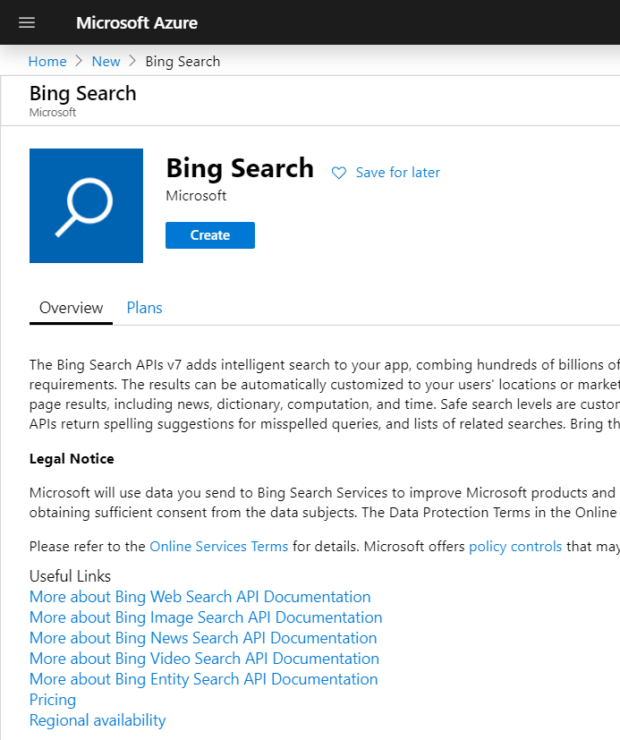
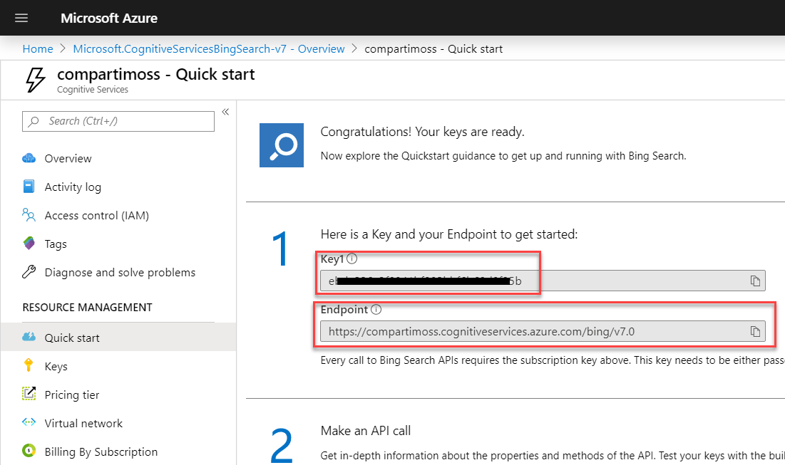
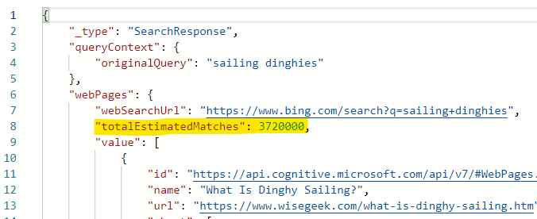
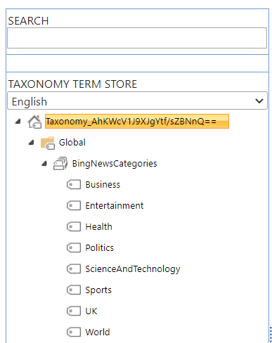

import ArticleHeader from '../../../components/article-header'

<ArticleHeader frontmatter={props.pageContext.frontmatter} />


En este artículo vamos a hacer uso de la Bing News API desde una extensión de SPFx. El caso de uso, bastante común en muchas organizaciones, es poder sacar información relacionada, publicada en la web, con el artículo publicado en nuestra Intranet. Imagina un artículo que habla sobre un cliente concreto, o un sector de nuestra organización, y queremos ofrecer noticias publicadas recientemente y relacionadas con ese cliente o sector.

Antes de entrar en materia, aquí podéis ver el resultado final, de lo que vamos a ver en el artículo, en la imagen siguiente:



**Registrando el servicio en el portal de Azure**

Lo primero para poder utilizar la Bing News Search API, es registrar el servicio en el portal de Azure:



Una vez creado el servicio, tendremos nuestra típica API Key con la que ya podremos llamar a la API:



**Nota**: Como ves en la imagen anterior, además de la Key, se crea un Endpoint. Dicho endpoint lo puedes usar para hacer la llamada a la API, pero también funciona con el endpoint genérico: [*https://api.cognitive.microsoft.com/bing/v7.0*](https&#58;//api.cognitive.microsoft.com/bing/v7.0)
 Aconsejo utilizar el endpoint genérico, ya que al moverte entre diferentes entornos, tendrás menos cosas que configurar en tu código.

**Consultando Bing News Search API**

Existen diferentes queries que podemos lanzar a la Search API.

**Obteniendo News "en general"**

Esto equivaldría a la búsqueda más común de cualquier portal de búsquedas (Bing, Google…), donde se lanza un query a todo el motor, y éste nos devuelve los resultados. Para hacer una búsqueda de este tipo, haríamos la siguiente request (en este ejemplo, el término de búsqueda sería: *sharepoint framework*):

```
GET https://api.cognitive.microsoft.com/bing/v7.0/news/search?q=sharepoint framework&mkt=en-us HTTP/1.1Ocp-Apim-Subscription-Key: 123456789ABCDEUser-Agent: Mozilla/5.0 (compatible; MSIE 10.0; Windows Phone 8.0; Trident/6.0; IEMobile/10.0; ARM; Touch; NOKIA; Lumia 822)X-Search-ClientIP: 999.999.999.999X-Search-Location: lat:47.60357;long:-122.3295;re:100X-MSEdge-ClientID: <blobFromPriorResponseGoesHere>Host: api.cognitive.microsoft.com​
```

Como podemos ver, usamos el endpoint ***search*** y pasamos en la *querystring* el parámetro **q**, con el término a buscar "…/search?q=sharepoint framework".

En el término de búsqueda, también podemos especificar un dominio específico sobre el que se buscará. Ejemplo: "…/search?q=sharepoint framework site:compartimoss.com"

Fijaros como en las cabeceras de la petición, debemos especificar una cabecera Ocp-Apim-**Subscription-Key**, con el valor de la Key que hemos obtenido al registrar el servicio en Azure

En todas las peticiones, también podemos especificar un market sobre el que se acotará la búsqueda, por ejemplo, podemos especificar como market, el local de España, y obtener así las noticias de España. Ejemplo: https://api.cognitive.microsoft.com/bing/v7.0/news?q=&mkt=es-es

**Obteniendo noticias por categoría**

Podemos acotar la búsqueda a una categoría concreta. Ahora mismo Bing News ofrece diferentes categorías, que van a depender del market. En este enlace tenéis los listados de cada categoría según su market: [https://docs.microsoft.com/en-us/rest/api/cognitiveservices-bingsearch/bing-news-api-v7-reference#news-categories-by-market](https&#58;//docs.microsoft.com/en-us/rest/api/cognitiveservices-bingsearch/bing-news-api-v7-reference#news-categories-by-market)

De momento no todos los markets tienen disponible esta funcionalidad. Así mismo, las categorías varían según el market. Por ejemplo, USA, tiene un listado de categorías muy completo (e incluso jerárquico en 2 niveles), sin embargo, las categorías para el market australiano, son muy reducidas, y otros markets, como el español, no tienen disponible esta búsqueda.

Para ver todas las posibles tipos de Queries, podéis visitar el siguiente artículo: [https://docs.microsoft.com/en-us/azure/cognitive-services/bing-news-search/concepts/search-for-news](https&#58;//docs.microsoft.com/en-us/azure/cognitive-services/bing-news-search/concepts/search-for-news#get-general-news)

**Paginando resultados**

Para realizar paginación, primero tenemos que fijarnos en el campo de la respuesta **totalEstimatedMatches**



Al realizar la query, podemos usar el parámetro count, para especificar el número máxima de elementos retornados que queremos, así como el parámetro offset para empezar los resultados a partir de ese valor. Ejemplo:

https://api.cognitive.microsoft.com/bing/v7.0/search?q=sharepoint&count=5&offset=45&mkt=en-us

**Invocando la API desde SPFx**

Una vez entendido qué tipo de queries podemos ejecutar contra la API, podemos ya ver cómo hacerlo desde una extensión de SPFx.

Para el ejemplo, vamos a usar la búsqueda basada en una categoría y market. El market lo estableceremos como un valor fijo para el mercado de UK, mientras que la categoría, la sacaremos de un campo de la página, que será informado en el momento de crear la página en SharePoint. Este campo es de tipo Taxonomy, y estará vinculado a un TermSet que contiene la lista de posibles categorías que tenemos disponibles en el mercado de UK.



A continuación, os muestro las partes de código más importantes.

Primero de todo, necesitamos saber qué Categoría tiene la página actual. Para ello, haremos una consulta a la API REST de SharePoint:

```
const getItemByIdEndpoint: string =      `${this._baseUrl}/_api/web/lists('${this._listId}')/GetItemById(${this._listItemId})?$select=id,title,NewsCategory`;const response: SPHttpClientResponse = await this._spHttpClient.get(getItemByIdEndpoint, SPHttpClient.configurations.v1);const responseJson: any = await response.json();
```

​Una vez obtenida la categoría, ya podemos llamar a la Bing News Search API:

```
const bingEndpoint: string = `https://api.cognitive.microsoft.com/bing/v7.0/news?mkt=en-GB&category=${category}`;
```

Preparamos las Headers de la petición para que incluyan la API Key

```
const requestHeaders: Headers = new Headers();requestHeaders.append("Content-type", "application/json");requestHeaders.append("Cache-Control", "no-cache");requestHeaders.append("Ocp-Apim-Subscription-Key", this.props.bingSearchApiKey);
```

Finalmente, utilizaremos el HttpClient del framework para lanzar la petición

```
const response: HttpClientResponse = await this._httpClient.get(      bingEndpoint,      HttpClient.configurations.v1,      httpOptions);const responseJson: any = await response.json();
```

El resultado de la petición (JSON), lo mapeamos a una interfaz custom que nos hemos definido con la información del artículo que más nos interesa:

```
const relatedNews: INewsArticle[] = responseJson.value.map((item: any) => {      const article: INewsArticle = {        name: item.name,        category: item.category,        description: item.description,        thumbnailUrl: item.image.thumbnail.contentUrl,        datePublished: new Date(item.datePublished),        url: item.url      };      return article;    });
```


Tenéis todo el ejemplo completo en el repositorio de GitHub del PnP

[https://github.com/SharePoint/sp-dev-fx-extensions/tree/master/samples/react-application-page-related-bing-news](https&#58;//github.com/SharePoint/sp-dev-fx-extensions/tree/master/samples/react-application-page-related-bing-news)

¡Hasta el próximo artículo!


Luis Mañez – Cloud Architect en ClearPeople LTD <br />
 @luismanez <br />
 [https://medium.com/inherits-cloud](https&#58;//medium.com/inherits-cloud)