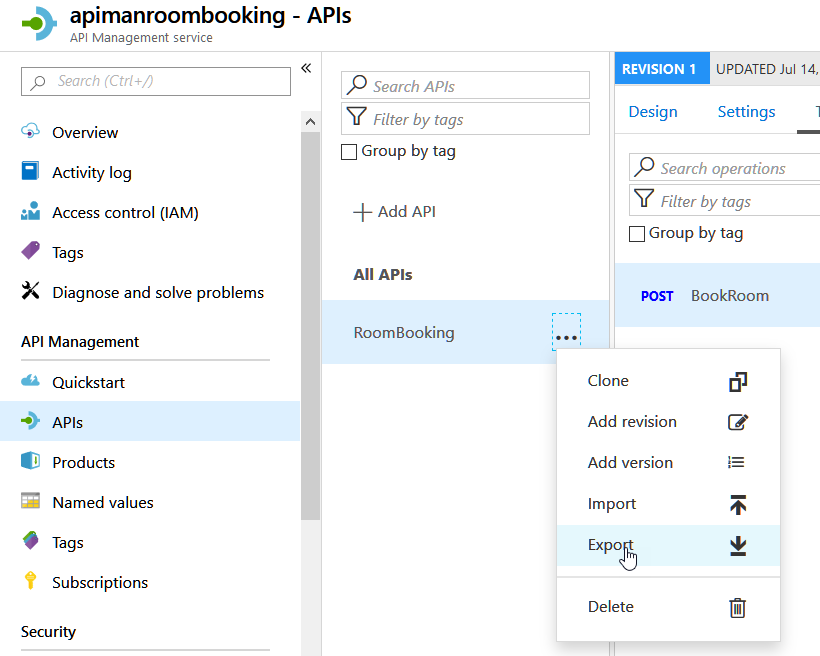
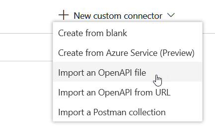
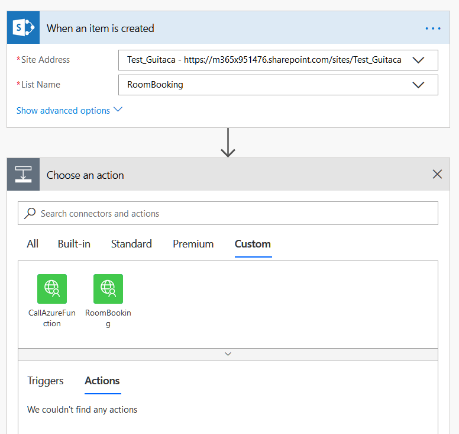
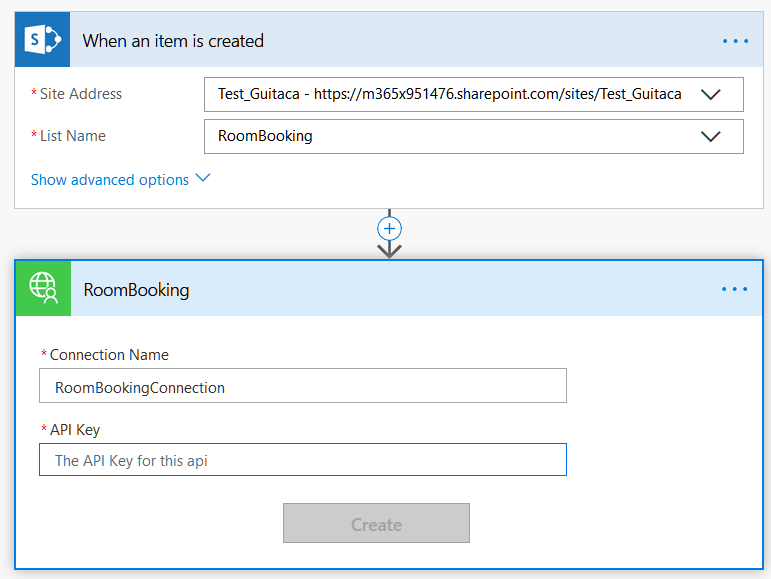
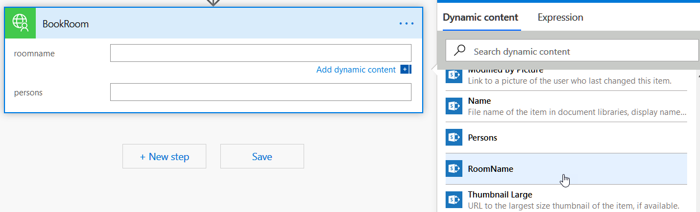
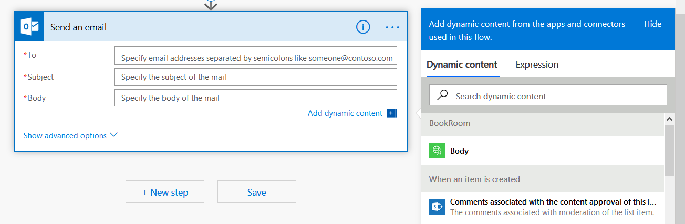
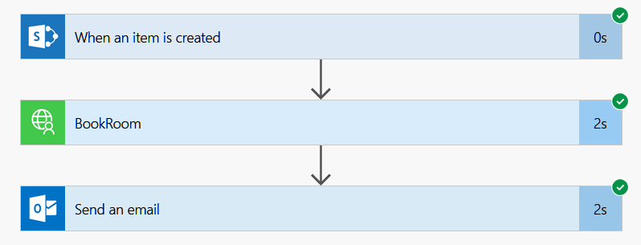
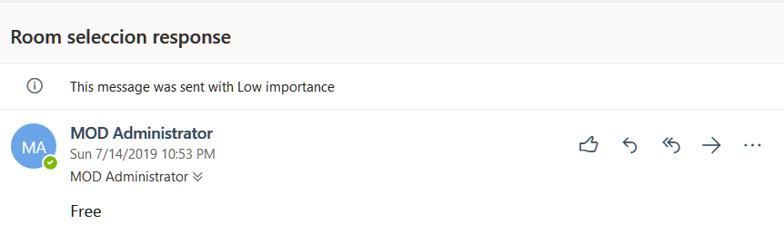

PowerAutomate (conocido originalmente como Microsoft Flow) es la implementación que Microsoft ha creado para integrar el motor de flujos de Azure, Logic Apps, en Office 365. A su vez, PowerApps es un intento para facilitar la creación de aplicaciones sin necesidad de programación, que pueden ser utilizadas por sí mismas, o integradas en SharePoint Online. Ambos sistemas, aunque fáciles de utilizar y bastante poderosos en cuanto a funcionalidad, carecen de la flexibilidad para agregar nuevas posibilidades de cálculo y procesamiento. Esta falta de los dos sistemas se puede solucionar por medio de las Funciones de Azure.

Esta es la segunda parte de una serie de tres artículos:

1. Como crear Funciones de Azure para que puedan ser utilizadas por PowerAutomate y PowerApps (CompartiMOSS No. 41, [http://www.compartimoss.com/revistas/numero-41/uso-de-funciones-de-azure-con-flow-y-powerapps-part-1](/revistas/numero-41/uso-de-funciones-de-azure-con-flow-y-powerapps-part-1)).
2. Usando Funciones de Azure con PowerAutomate (CompartiMOSS No. 42).
3. Usando Funciones de Azure con PowerApps (CompartiMOSS No. 43).

**Introducción**

Microsoft Office PowerAutomate es el motor de flujos de trabajo creado por Microsoft en base a Azure Logic Apps. Los flujos que se pueden crear están totalmente basados en componentes estándar que ofrecen una lógica interna de trabajo (loops, estamentos, etc.) y conexión a otros sistemas (Exchange, SharePoint y muchos otros conectores, internos y externos a Microsoft). El principal problema de esta forma de trabajo es que no se puede crear ("programar") nueva funcionalidad dentro del sistema propiamente dicho. Lo mismo se puede decir de PowerApps: aunque ofrece conectividad con muchos otros tipos de sistemas, no es posible definir capacidades de cálculo dentro de la aplicación misma.

Para solucionar el problema, ambos sistemas permiten la utilización de "OpenAPI", un estándar internacional que fue creado por un consorcio de industrias que se propuso unificar la forma cómo se describen los APIs de REST, creando un formato de descripción neutral y no controlado por cualquier proveedor comercial ([https://www.openapis.org](https&#58;//www.openapis.org/)). OpenAPI está basado a su vez en "Swagger", una manera conocida desde hace mucho tiempo para describir APIs de REST.

Aunque REST (REpresentational State Transfer) es una forma unificada para crear y utilizar APIs por medio de internet, la forma de usarlo es más un Framework que un estándar. Por tal motivo, los APIs de REST, como varían de uno a otro, se deben describir mediante una definición de OpenAPI para que otros sistemas "entiendan" como usar el API. Esta definición (OpenAPI) contiene información sobre qué operaciones están disponibles en una API y cómo se deben estructurar sus datos de solicitud y respuesta. Haciendo que PowerAutomate y PowerApps puedan utilizar OpenAPI hace que, a su vez, los dos sistemas estén abiertos a usar cualquier clase de funcionalidad proporcionada por cualquier tipo de sistemas externos.

Por su lado, las Funciones de Azure proporcionan toda la infraestructura técnica para poder crear funcionalidad "serverless", es decir, que los desarrolladores se pueden enfocar en crear el código que se necesita, sin necesidad de ocuparse de servidores, redes, rendimiento bajo carga, etc. Las Funciones de Azure se pueden programar en una variedad de idiomas de programación (C#, PowerShell, Python, etc.), utilizando Visual Studio, Visual Studio Code o directamente desde un navegador en el sitio de diseño de Funciones del portal de Azure. El problema, a su vez, con las Funciones de Azure es que la definición Swagger que generan no es OpenAPI ni utilizable directamente por PowerAutomate o PowerApps.

Microsoft ha publicado parches para poder crear Funciones de Azure para que puedan ser utilizadas directamente desde PowerAutomate y PowerApps, pero es requerido que tanto Azure como Office 365 utilicen el mismo Directorio Activo, lo que generalmente no es el caso en aplicaciones Enterprise. La forma para solucionar el problema es utilizar el Azure API Management, un servicio de Azure que permite exponer APIs al mundo externo por medio de OpenAPI.

En este segundo artículo de la serie de tres, se indica como crear la definición OpenAPI de la función de Azure, que es expuesta al mundo externo por medio del servicio de Azure de API Management, y como utilizarla desde Office PowerAutomate. Este ejemplo se base en toda la información dada en el primer artículo de la serie. El ejemplo a continuación es un sistema de reserva de salas de conferencias en una empresa: empleados pueden reservar una sala de conferencias desde una Lista de SharePoint; un flujo acoplado a la Lista pasa los datos de la reserva a la Función de Azure que calcula si la reserva es posible, o si el sitio está ocupado y retorna una indicación al respecto al flujo, el que retransmite la información a SharePoint y al usuario. Todo el sistema de reserva se puede utilizar también desde una aplicación de PowerApps, como se verá en el siguiente artículo. El algoritmo para determinar si una sala está ocupada o no, no está implementado, solamente se ha simulado por medio de un generador random. Pero el ejemplo indica claramente el potencial que ofrece la combinación de los cuatro sistemas.

**Exportar la definición de OpenAPI**

1. Abra el portal de Azure ([https://portal.azure.com](https&#58;//portal.azure.com/)) donde se creó el Grupo de Recursos que contiene la función y la definición del API Management.

2. Abra el Grupo de Recursos (Resource Groups) donde se crearon los servicios del sistema.

3. Haga clic sobre el servicio de API Management y luego sobre el vínculo de "APIs" (menú vertical izquierdo). Seleccione el API creado y, haciendo clic sobre el botón de elipse ("…"), seleccione "Export".

Haga clic sobre el botón "OpenAPI v2 (JSON)". La ventana de descargas por defecto de Windows abre para guardar el archivo de descarga localmente. El archivo es en formato JSON y contiene todos los parámetros para poder hacer una llamada al servicio REST, el que, a su vez, manda la llamada a la Función de Azure. El archivo se puede abrir con cualquier editor ASCII.

**Crear una Lista de SharePoint**

4. Para el ejemplo, el flujo se inicia desde una Lista de SharePoint. Desde alguna colección de sitios de SharePoint Online cree una Lista Personalizada con dos campos de texto sencillo, uno llamado "RoomName" y el otro "Persons".

**Conectar el servicio a****PowerAutomate**

5. Abra el sitio de PowerAutomate desde el portal de Office ([https://portal.office.com](https&#58;//portal.office.com/)), o desde el portal de PowerAutomate mismo ([https://powerautomate.microsoft.com](https&#58;//powerautomate.microsoft.com/)) y lóguese con credenciales que tengan permisos suficientes para crear y utilizar flujos.

6. Expanda el menú de "Data" (menú vertical al lado izquierdo) y haga clic sobre "Custom connectors". Use el botón "+New custom connector" en la esquina superior derecha para expandir un nuevo menú. Haga clic sobre "Importar an OpenAPI file"

Defina un nombre para el conector y seleccione el archivo descargado desde Azure en el punto 3.

Casi toda la información necesaria para configurar el conector es extraída automáticamente del archivo JSON e insertada en los campos del conector. Solamente hay que agregar el URL del host del servicio API. Regrese al portal de Azure, abra el Grupo de Aplicaciones donde están los servicios del proyecto, abra el servicio del API Management, clic sobre "APIs", seleccione el API indicado y seleccione la pestaña "Settings". Copie el dominio de la casilla "Base URL", es decir, si en la casilla aparece un URL de "https://apimanroombooking.azure-api.net/roombooking", copie solamente la parte de "apimanroombooking.azure-api.net".

Ahora regrese a la configuración que se tenia abierta en PowerAutomate y copie este dominio en la casilla "Host" de la pestaña "Settings". Todas las otras configuraciones se pueden dejar por defecto. Utilice el botón de "Create connector" en la esquina superior derecha de la ventana. Haga clic sobre "Custom connectors" de la sección "Data" de nuevo, y el nuevo conector debe aparecer en la lista de conectores disponibles.

7. Seleccione el vínculo "My flows" y luego cree un nuevo flujo por medio del botón "+New" - "Automated-from blank". Asígnele un nombre al flujo y seleccione "When an ítem is created SharePoint" en la casilla de "Choose your flow's trigger". Uso el botón de "Create". Seleccione la dirección del sitio en la primera casilla del trigger, y el nombre de la Lista.

8. Clic sobre el botón "+New step" y seleccione la pestaña de "Custom". La lista de custom connectors aparece. Seleccione el conector creado en el punto 6.​

9. Después de seleccionar el conector aparece su ventana de configuración para crear una conexión con el conector:​

Cuando se creó la función de Azure, se seleccionó que su autorización debería ocurrir por medio de una llave (punto 7 del primer articulo de la serie, "Authorization level" = "Function"). Esta llave es indispensable para que las llamadas a la función sean aceptadas. Si se hubiera seleccionado "Anonymous", la llave no sería necesaria, y no aparecería en la ventana de la imagen 4, pero cualquier llamada al servicio seria aceptada sin validación. El API Management mantiene la llave, y expone otra llave que es necesaria para hacer llamadas a la función.

Para encontrar el valor de la llave, desde el portal de Azure abra el servicio del API Management y use el vínculo de "Subscriptions" en el menú vertical izquierdo. Utilice el botón de elipse ("…") al lado derecho de "Buit-in-all-access" y seleccione "Show/hide keys". Use el botón con un icono de copiar de la "Primary key". Regrese al flujo y pegue el valor copiado en la casilla de "API key" de la imagen 4. Guarde los cambios en el flujo con el botón de "Create".

Note que este paso es necesario solamente la primera vez que se utiliza el conector. Si el conector ya ha creado una conexión anteriormente, este procedimiento inicial no es necesario. También es posible crear primero la conexión directamente desde la ventana de "Connections" en el portal de PowerAutomate, y usar el botón de "+New connection" para crear una conexión con el conector manualmente. En cualquiera de los dos casos, el procedimiento para encontrar la llave es igual al descrito.

Si los valores son aceptados (es decir, la llave es válida), la ventana cambia para mostrar los valores de las dos propiedades que la función va a recibir a través del API Management. Haciendo clic sobre "roomname" se abre la ventana de "Dynamic content" con las columnas de la Lista que contienen el valor a enviar. Seleccione "RoomName". Haga la misma operación para el campo de "persons":

10. Agregue otro nuevo paso en el flujo. Utilice el botón de "+New step", use el botón de "Office 365 Outlook" y seleccione la acción de "Send an email". Configure las casillas de "To" y "Subject". Clic sobre la casilla de "Body" para abrir el "Dynamic content" y seleccione "Body" del conector. La respuesta de la función de Azure es enviada al API Management, y este la retransmite al flujo en el body de la respuesta de HTTP:

Use el "Flow Checker" (esquina superior derecha) para comprobar que el flujo no tiene errores, y guarde todo el flujo con el botón de "Save".

11. Para testear el funcionamiento de todo el sistema, cree un nuevo elemento en la Lista de SharePoint. Al crear el elemento se dispara el flujo, lo cual se puede seguir en la ventana de detalles del flujo mismo:

El flujo hace una llamada REST al Azure API Management, y este a su vez llama a la función. El funcionamiento de la función se puede seguir abriendo la función misma y su ventana de Logs:

Finalmente, el flujo envía un Email a la cuenta configurada indicando el valor generado por la función:

**Conclusión**

Para darle mas flexibilidad y capacidad de interacción con otros sistemas, Microsoft PowerAutomate y PowerApps pueden utilizar conectores a procedimientos externos. Azure Functions es el método ideal para crear esa funcionalidad. En esta serie de tres artículos se indica como crear funciones de Azure y hacerlas funcionar bajo el OpenAPI estándar (primer artículo), como conectar PowerAutomate con la función (segundo articulo) y como puede utilizar PowerApps la misma función (tercer articulo).

**Gustavo Velez**  
 MVP Office Apps & Services  
gustavo@gavd.net  
 http://www.gavd.net