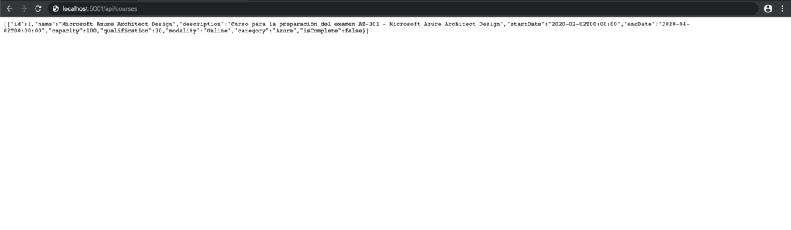
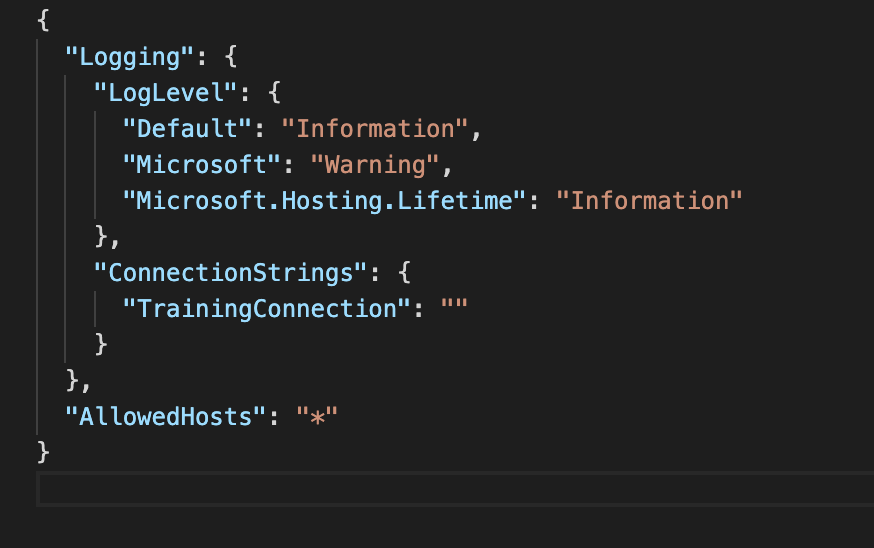

En este articulo quiero explicaros como podemos desplegar nuestro entorno de desarrollo de una forma fácil y segura. Para ello vamos a usar docker para poder crear un contenedor con nuestra aplicación "API NET Core 3.1" que conecta contra nuestra base de datos Azure SQL de forma segura sin tener que exponer nuestras credenciales.  Docker es una plataforma para desarrolladores y sysadmins (utilizando la filosofía DevOps) que nos permite desarrollar, desplegar y ejecutar aplicaciones en contenedores de una forma fácil y sencilla.

Para ello vamos a empezar creando nuestra API en [.NET Core 3.1](https://dotnet.microsoft.com/download), pare ello usaremos el siguiente comando:

```
dotnet new API -n Azuretraining
```

Esto nos creara la estructura de nuestro proyecto con el nombre que le hemos asignado «Azuretraining» tal y como podemos observar en la siguiente imagen:


Ahora vamos a agregar el nuget para poder trabajar con SQL:

```
dotnet add package Microsoft.EntityFrameworkCore.SqlServer 
```

```
dotnet add package Microsoft.EntityFrameworkCore.InMemory
```

Incorporaremos una nueva clase al modelo, para este ejemplo definiremos un modelo de ejemplo llamado «Courses» dentro de nuestra carpeta Models:

```
namespace Azuretraining.Models
{
    public class Course
    {
        public long Id { get; set; }
        public string Name { get; set; }
        public string Description { get; set; }
        public DateTime StartDate { get; set; }
        public DateTime EndDate { get; set; }
        public int Capacity {get; set;}
        public double Qualification {get; set;} 
        public string Modality {get; set;}
        public string Category {get; set;}
        public bool IsComplete { get; set; }
    }
}
```

Una vez tenemos nuestro modelo incorporaremos el contexto de base de datos, será la clase principal que coordina la funcionalidad de Entity Framework para un modelo de datos. Para ello agregaremos a nuestra carpeta Models un nuevo fichero llamado «CourseContext.cs» con el siguiente formato:

```
using Microsoft.EntityFrameworkCore;
namespace Azuretraining.Models
{
    public class CourseContext : DbContext
    {
        public CourseContext(DbContextOptions<CourseContext> options)
            : base(options)
        {
        }
        public DbSet<Course> Courses { get; set; }
    }
}
```

Ahora deberemos de modificar nuestro fichero «Startup.cs» agregando las referencias necesarias para usar los servicios:

```
using Microsoft.EntityFrameworkCore;
using Azuretraining.Models;
```

Y modificaremos nuestra función «ConfigureServices» para que tenga el siguiente aspecto:

```
public void ConfigureServices(IServiceCollection services)
{
    services.AddDbContext<CourseContext>(opt =>
        opt.UseInMemoryDatabase("CourseList"));
    services.AddControllers();
}
```

Esto nos proporcionará poder usar una BD en memoria para realizar unas primeras pruebas antes de atacar a nuestra BD en la nube. Una vez lo tenemos todo preparado vamos a agregar los Nugets necesarios para poder hacer el scaffolding y generar de forma automática nuestro Controller con las siguientes instrucciones:

```
dotnet add package Microsoft.VisualStudio.Web.CodeGeneration.Design
```

```
dotnet add package Microsoft.EntityFrameworkCore.Design
```

```
dotnet tool install --global dotnet-aspnet-codegenerator
```

```
dotnet aspnet-codegenerator controller -name CoursesController -async -api -m Course -dc CourseContext -outDir Controllers
```

Veremos que en la carpeta Controller nos ha generado el archivo «CoursesController.cs» donde tendremos definida todas las acciones de nuestra API. Ahora ejecutaremos nuestra aplicación y en un explorador introducimos la siguiente URL: [https://localhost:5001/api/courses.](https://localhost:5001/api/courses)​



Ahora vamos a modificar nuestra aplicación para que conecte directamente con nuestra BD de Azure SQL. Para ello previamente deberemos haber creado nuestra instancia, podemos usar Azure CLI para poder hacerlo como se muestra en el siguiente ejemplo:

```
az sql server create --subscription "NOMBRE DE LA SUSCRIPCIÓN" --name trainginappDB --resource-group TrainingApp --location "West Europe" --admin-user "NOMBRE DE USUARIO" --admin-password "PASSWORD"
```

```
az sql server firewall-rule create --subscription "NOMBRE DE LA SUSCRIPCIÓN"  --resource-group TrainingApp --server trainginappdb --name AllowAllIps --start-ip-address 0.0.0.0 --end-ip-address 0.0.0.0
```

```
az sql db create --subscription "NOMBRE DE LA SUSCRIPCIÓN" --resource-group TrainingApp --server trainginappdb --name TrainingApp --service-objective S0
```

Una vez tenemos creada nuestra instancia de BD en Azure SQL, vamos a preparar nuestra solución para «dockerizar», para ello generaremos un fichero. Dockerfile con el siguiente contenido:

```
# https://hub.docker.com/_/microsoft-dotnet-core
FROM mcr.microsoft.com/dotnet/core/sdk:3.1 AS build
  WORKDIR /app
# copy csproj and restore as distinct layers
  COPY *.csproj ./
  RUN dotnet restore
# copy everything else and build app
  COPY . ./
  RUN dotnet publish -c release -o out --no-restore
# final stage/image
  FROM mcr.microsoft.com/dotnet/core/aspnet:3.1
  WORKDIR /app
  COPY --from=build /app/out .
  ENTRYPOINT ["dotnet", "azuretraining.dll"] 
```

Y un fichero «.dockerignore» en nuestra solución con el siguiente contenido:

```
# directories
**/bin/
**/obj/
**/out/
# files
Dockerfile*
**/*.md
```

Para nuestra cadena de conexión usaremos Azure KeyVault para poder proteger nuestro «secretos», para ello iremos al portal de Azure y crearemos un nuevo Azure KeyVault. Una vez creado vamos a Secrets -&gt; Generate/Import como se puede apreciar en la siguiente captura:​


En la siguiente pantalla deberemos de indicar que es una entrada manual, le damos un nombre a nuestro secreto, en este caso «ConnectionStrings–TrainingConnection» esto se debe a que en nuestro fichero «appsettings.json» tenemos la definición de nuestro ConnectionStrings de la siguiente forma y para que el KeyVault pueda insertar el valor en tiempo de ejecución debemos de separarlos con «–» el nombre concatenando la relación padre-hijo:



Ahora añadimos la cadena de conexión hacia nuestro Azure SQL que nos facilita cuando creamos el servicio, como se puede apreciar en la siguiente captura:


Una vez que ya tenemos nuestro KeyVault para poder proteger nuestros «secretos» vamos a modificar nuestro proyecto para poder usarlo, para ello necesitaremos añadir los siguiente Nugets:

```
dotnet add package Microsoft.Azure.KeyVault
```

```
dotnet add package Microsoft.Azure.Services.AppAuthentication
```

```
dotnet add package Microsoft.Extensions.Configuration.AzureKeyVault
```

Modificaremos nuestro archivo «Program.cs» añadiremos los imports necesarios:

```
using Microsoft.Azure.KeyVault;
using Microsoft.Azure.Services.AppAuthentication;
using Microsoft.Extensions.Configuration;
using Microsoft.Extensions.Configuration.AzureKeyVault;
```

Sustituiremos el método IHostBuilder para poder obtener la información de nuestro KeyVault y asignarlo el siguiente formato:

```
public static IHostBuilder CreateHostBuilder(string[] args) =>
    Host.CreateDefaultBuilder(args)
        .ConfigureAppConfiguration((ctx, builder) =>
        {
            var keyVaultEndpoint = GetKeyVaultEndpoint();
            if (!string.IsNullOrEmpty(keyVaultEndpoint))
            {
                var azureServiceTokenProvider = new AzureServiceTokenProvider();
                var keyVaultClient = new KeyVaultClient(
                    new KeyVaultClient.AuthenticationCallback(
                        azureServiceTokenProvider.KeyVaultTokenCallback));
                builder.AddAzureKeyVault(
                    keyVaultEndpoint, keyVaultClient, new DefaultKeyVaultSecretManager());
            }
        })
        .ConfigureWebHostDefaults(webBuilder =>
        {
            webBuilder.UseStartup<Startup>();
        });
static string GetKeyVaultEndpoint() => Environment.GetEnvironmentVariable("KEYVAULT_ENDPOINT");
```

Ahora agregaremos en el environment (todo esto lo hacemos para que la acción se realice en tiempo de ejecución), para ello nos fijaremos que en la última linea de nuestro «Program.cs» indicábamos obtener de la variable «KEYVAULT\_ENDPOINT» en ella declararemos la URL de nuestro Azure KeyVault, esta información la deberemos de añadirla a nuestro fichero «launch.json» con el siguiente formato:

```
{
   // Use IntelliSense to find out which attributes exist for C# debugging
   // Use hover for the description of the existing attributes
   // For further information visit https://github.com/OmniSharp/omnisharp-vscode/blob/master/debugger-launchjson.md
   "version": "0.2.0",
   "configurations": [
        {
            "name": ".NET Core Launch (web)",
            "type": "coreclr",
            "request": "launch",
            "preLaunchTask": "build",
            // If you have changed target frameworks, make sure to update the program path.
            "program": "${workspaceFolder}/bin/Debug/netcoreapp3.1/trainingapp.courses.dll",
            "args": [],
            "cwd": "${workspaceFolder}",
            "stopAtEntry": false,
            // Enable launching a web browser when ASP.NET Core starts. For more information: https://aka.ms/VSCode-CS-LaunchJson-WebBrowser
            "serverReadyAction": {
                "action": "openExternally",
                "pattern": "^\\s*Now listening on:\\s+(https?://\\S+)"                
            },
            "env": {
                "ASPNETCORE_ENVIRONMENT": "Development",
                "KEYVAULT_ENDPOINT": "https://NOMBREDENUESTROKEYVAULT.vault.azure.net/"
            },
            "sourceFileMap": {
                "/Views": "${workspaceFolder}/Views"
            }
        },
        {
            "name": ".NET Core Attach",
            "type": "coreclr",
            "request": "attach",
            "processId": "${command:pickProcess}"
        }
    ]
}
```

Por último, sustituiremos en nuestro fichero «Startup.cs» la conexión de la BD en memoria por la conexión hacia nuestro Azure SQL con la configuración que hemos preparado en los pasos anteriores, y quedará de la siguiente forma:​


Este primer servicio es la conexión que realizamos para conectar con nuestra «Cadena de conexión» securizada:

```
services.AddDbContext(options =>
                 options.UseSqlServer(Configuration.GetConnectionString("TrainingConnection")));
```

Este segundo servicio nos permitirá crear las tabla y estructura iniciales en caso de que no lo tengamos:

```
services.BuildServiceProvider().GetService().Database.Migrate();
```

Ahora lanzamos nuestra aplicación y vemos que nos ha funcionado correctamente:​


**ATENCIÓN:** Como hemos podido ver hasta aquí lo único que hemos hecho es indicar la url de nuestro Azure KeyVault para poder recuperar la información de la cadena de conexión, pero el «truco» es que si no estamos logados en nuestro azure CLI en local no podremos usarlo y nos devolverá el siguiente error:

```
Startup.cs(34,13): warning ASP0000: Calling 'BuildServiceProvider' from application code results in an additional copy of singleton services being created. Consider alternatives such as dependency injecting services as parameters to 'Configure'. [/Users/msanchez/Projects/Azuretraining/Azuretraining.csproj]  Unhandled exception. System.ArgumentNullException: Value cannot be null. (Parameter 'connectionString')     at Microsoft.EntityFrameworkCore.Utilities.Check.NotEmpty(String value, String parameterName)     at Microsoft.EntityFrameworkCore.SqlServerDbContextOptionsExtensions.UseSqlServer(DbContextOptionsBuilder optionsBuilder, String connectionString, Action1 sqlServerOptionsAction)    at Azuretraining.Startup.<ConfigureServices>b__4_0(DbContextOptionsBuilder options) in /Users/msanchez/Projects/Azuretraining/Startup.cs:line 32    at Microsoft.Extensions.DependencyInjection.EntityFrameworkServiceCollectionExtensions.<>c__DisplayClass1_02.b__0(IServiceProvider p, DbContextOptionsBuilder b)     at Microsoft.Extensions.DependencyInjection.EntityFrameworkServiceCollectionExtensions.CreateDbContextOptions[TContext](IServiceProvider applicationServiceProvider, Action2 optionsAction)    at Microsoft.Extensions.DependencyInjection.EntityFrameworkServiceCollectionExtensions.<>c__DisplayClass10_01.b__0(IServiceProvider p)     at Microsoft.Extensions.DependencyInjection.ServiceLookup.CallSiteRuntimeResolver.VisitFactory(FactoryCallSite factoryCallSite, RuntimeResolverContext context)     at Microsoft.Extensions.DependencyInjection.ServiceLookup.CallSiteVisitor2.VisitCallSiteMain(ServiceCallSite callSite, TArgument argument)    at Microsoft.Extensions.DependencyInjection.ServiceLookup.CallSiteRuntimeResolver.VisitCache(ServiceCallSite callSite, RuntimeResolverContext context, ServiceProviderEngineScope serviceProviderEngine, RuntimeResolverLock lockType)    at Microsoft.Extensions.DependencyInjection.ServiceLookup.CallSiteRuntimeResolver.VisitScopeCache(ServiceCallSite singletonCallSite, RuntimeResolverContext context)    at Microsoft.Extensions.DependencyInjection.ServiceLookup.CallSiteVisitor2.VisitCallSite(ServiceCallSite callSite, TArgument argument)     at Microsoft.Extensions.DependencyInjection.ServiceLookup.CallSiteRuntimeResolver.VisitConstructor(ConstructorCallSite constructorCallSite, RuntimeResolverContext context)     at Microsoft.Extensions.DependencyInjection.ServiceLookup.CallSiteVisitor2.VisitCallSiteMain(ServiceCallSite callSite, TArgument argument)    at Microsoft.Extensions.DependencyInjection.ServiceLookup.CallSiteRuntimeResolver.VisitCache(ServiceCallSite callSite, RuntimeResolverContext context, ServiceProviderEngineScope serviceProviderEngine, RuntimeResolverLock lockType)    at Microsoft.Extensions.DependencyInjection.ServiceLookup.CallSiteRuntimeResolver.VisitScopeCache(ServiceCallSite singletonCallSite, RuntimeResolverContext context)    at Microsoft.Extensions.DependencyInjection.ServiceLookup.CallSiteVisitor2.VisitCallSite(ServiceCallSite callSite, TArgument argument)     at Microsoft.Extensions.DependencyInjection.ServiceLookup.CallSiteRuntimeResolver.Resolve(ServiceCallSite callSite, ServiceProviderEngineScope scope)     at Microsoft.Extensions.DependencyInjection.ServiceLookup.DynamicServiceProviderEngine.<>c__DisplayClass1_0.b__0(ServiceProviderEngineScope scope)     at Microsoft.Extensions.DependencyInjection.ServiceLookup.ServiceProviderEngine.GetService(Type serviceType, ServiceProviderEngineScope serviceProviderEngineScope)     at Microsoft.Extensions.DependencyInjection.ServiceLookup.ServiceProviderEngine.GetService(Type serviceType)     at Microsoft.Extensions.DependencyInjection.ServiceProvider.GetService(Type serviceType)     at Microsoft.Extensions.DependencyInjection.ServiceProviderServiceExtensions.GetService[T](IServiceProvider provider)     at Azuretraining.Startup.ConfigureServices(IServiceCollection services) in /Users/msanchez/Projects/Azuretraining/Startup.cs:line 34     at System.RuntimeMethodHandle.InvokeMethod(Object target, Object[] arguments, Signature sig, Boolean constructor, Boolean wrapExceptions)     at System.Reflection.RuntimeMethodInfo.Invoke(Object obj, BindingFlags invokeAttr, Binder binder, Object[] parameters, CultureInfo culture)     at Microsoft.AspNetCore.Hosting.ConfigureServicesBuilder.InvokeCore(Object instance, IServiceCollection services)     at Microsoft.AspNetCore.Hosting.ConfigureServicesBuilder.<>c__DisplayClass9_0.g__Startup|0(IServiceCollection serviceCollection)     at Microsoft.AspNetCore.Hosting.ConfigureServicesBuilder.Invoke(Object instance, IServiceCollection services)     at Microsoft.AspNetCore.Hosting.ConfigureServicesBuilder.<>c__DisplayClass8_0.b__0(IServiceCollection services)     at Microsoft.AspNetCore.Hosting.GenericWebHostBuilder.UseStartup(Type startupType, HostBuilderContext context, IServiceCollection services)     at Microsoft.AspNetCore.Hosting.GenericWebHostBuilder.<>c__DisplayClass12_0.b__0(HostBuilderContext context, IServiceCollection services)     at Microsoft.Extensions.Hosting.HostBuilder.CreateServiceProvider()     at Microsoft.Extensions.Hosting.HostBuilder.Build()     at Azuretraining.Program.Main(String[] args) in /Users/msanchez/Projects/Azuretraining/Program.cs:line 19
```

Este error nos dará si intentamos ejecutar nuestro contenedor de docker, para solventarlo deberemos de aplicar un *«work around»* que nos permita poder trabajar sin problemas y a la vez que subimos el código a cualquier repositorio de código no tengamos que mostrar nuestras cadenas de conexión o información sensible. Para ello lo que vamos a hacer es añadir un nuevo fichero llamado docker-compose.yml con la siguiente composición:

```
version: "3.7"
networks:
    azuretraining.services.network:
        driver: bridge
services:
    azuretraining.services.courses:
        container_name: Azuretraining.Services
        build:
          context: ../
          dockerfile: ./Azuretraining.Dockerfile   
        ports:
            - "8001:80"
        networks:
            - azuretraining.services.network
        volumes:
            - ~/.azure:/root/.azure   
        environment: 
            - KEYVAULT_ENDPOINT=https://NOMBREDENUESTROKEYVAULT.vault.azure.net/ 
```

En nuestro docker-compose hemos definido la estructura de ejecución de nuestro servicio, en este caso solo tenemos un contenedor, donde le indicamos el network, puerto, nombre del contenedor, etc. En este caso lo más importante son las propiedades volumes y environment. En el environment agregaremos nuestra url del Azure KeyVault, y en volumes lo que vamos a hacer es crear un volumen compartido donde copiaremos nuestra carpeta local de Azure para que podamos hacer sin ningún problema login con Azure CLI. Lo más importante es que, aunque esta carpeta se suba no compromete nuestra seguridad pues no tiene nada vinculante.

Ahora modificaremos nuestro fichero .dockerfile para incluirle el Azure CLI y que podamos consumir la conexión hacia nuestro Azure KeyVault desde nuestro contenedor:

```
# https://hub.docker.com/_/microsoft-dotnet-core
FROM mcr.microsoft.com/dotnet/core/sdk:3.1 AS build
  WORKDIR /app
# copy csproj and restore as distinct layers
  COPY *.csproj ./
  RUN dotnet restore
# copy everything else and build app
  COPY . ./
  RUN dotnet publish -c release -o out --no-restore
# final stage/image
  FROM mcr.microsoft.com/dotnet/core/aspnet:3.1
# install azure cli
ENV DEBIAN_FRONTEND noninteractive
RUN apt-get update \
    && apt-get -y install --no-install-recommends apt-utils dialog 2>&1 \
    #
    # Verify git, process tools, lsb-release (common in install instructions for CLIs) installed
    && apt-get -y install git openssh-client iproute2 procps apt-transport-https gnupg2 curl lsb-release \
    && echo "deb [arch=amd64] https://packages.microsoft.com/repos/azure-cli/ $(lsb_release -cs) main" > /etc/apt/sources.list.d/azure-cli.list \
    && curl -sL https://packages.microsoft.com/keys/microsoft.asc | apt-key add - 2>/dev/null \
    && apt-get update \
    && apt-get install -y azure-cli; 
  WORKDIR /app
  COPY --from=build /app/out .
  ENTRYPOINT ["dotnet", "azuretraining.dll"] 
```

Por último, solo nos queda lanzar el siguiente comando para ejecutar nuestra aplicación en local «dockerizada» y «securizada»:

```
docker-compose up
```

De esta forma tendremos nuestro proyecto completamente securizado pudiendo trabajar de forma fácil y sencilla, sin preocuparnos de que subamos información sensible a nuestro repositorio de código.


**Conclusiones**

Pienso que Azure KeyVault nos permite centralizar el almacenamiento de los secretos de aplicación. Esto nos permite controlar su distribución. Una de las grandes ventajas es que reduce en gran medida las posibilidades de que se puedan filtrar por accidente los secretos. Al no tener que almacenar información de seguridad en las aplicaciones elimina la necesidad de que esta información sea parte del código.


**Manuel Sánchez Rodríguez** <br />
[Manuss20@gmail.com](mailto:Manuss20@gmail.com) <br />
@manuss20 <br />
 https://manuss20.com