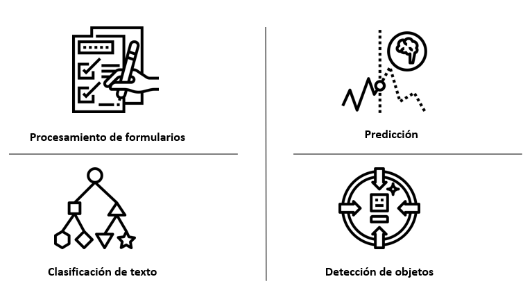
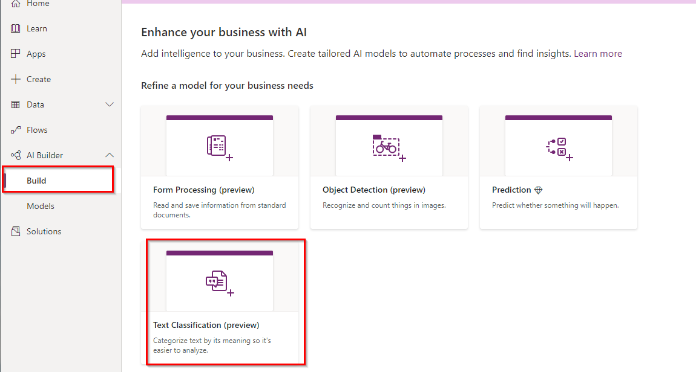

​En AI Builder existen cuatro tipos de modelos que podemos elegir según nuestras necesidades:

- *Procesamiento de formularios:* Modelo capaz de extraer pares *clave-valor* de un documento. Por ejemplo, para un modelo de factura de un proveedor específico, podríamos extraer la fecha, los conceptos y/o el importe total.
- *Predicción:* Modelo capaz de detectar predicciones en base a patrones históricos de resultados. Este modelo puede ser especialmente útil en los casos que queramos obtener respuestas de tipo sí/no o aprobar/suspender. Un ejemplo de este modelo sería el de analizar si una persona asistirá o no a un evento de comunidad.
- *Clasificación de texto:* Con este modelo podemos clasificar cualquier tipo de contenido textual (correos electrónicos, documentos, *posts* en redes sociales, etc.), de forma que podemos asignarlo a un conjunto de etiquetas o metadatos en base un aprendizaje previo. Esto nos podría servir, por ejemplo, para enrutar una petición o queja realizada en *Twitter* hacia un departamento específico de nuestra compañía a partir del texto del mismo.
- *Detección de objetos*: Este modelo de IA es capaz de detectar los objetos que aparecen en una imagen en base a un aprendizaje previo. Esto nos podría ser útil, por ejemplo, para fotografiar una máquina que se encuentra en una fábrica, reconocerla y obtener sus especificaciones técnicas que se encuentran almacenadas en un documento en SharePoint.

Cabe destacar que, exceptuando en el caso del modelo de Predicción, actualmente estos tipos de modelos de IA se encuentran en versión preliminar.

**Caso práctico: Uso del modelo de Clasificación de Texto**

La mejor manera de ver cómo nos pueden ayudar estos tipos de modelos de IA es el de verlos en acción con un caso práctico. Imaginemos que queremos mejorar la atención a los pacientes en un hospital a partir de sus valoraciones sobre la atención recibida. Para ello, podríamos seguir el siguiente esquema:

El objetivo es que, a partir de los comentarios introducidos en la encuesta, la misma llegue al departamento o equipo al que le puede interesar para llevar a cabo las acciones que considere necesarias.

**Creación del modelo**

Antes de crear nuestro flujo en *Power Automate*, deberemos crear y entrenar un modelo de IA de clasificación de texto. Para este caso práctico hemos utilizado los datos de ejemplo que nos proporciona Microsoft para hacer algunos laboratorios en AI Builder[\[1\]](file:///C:/CompartiMOSS/43-202-03/Ferr%C3%A1n%20Chopo/Ferran%20Chopo%20-%20AI%20Builder.docx#_ftn1). Concretamente vamos a usar el fichero pai\_healthcare\_feedbacks.csv, que contiene textos y etiquetas con las deberemos entrenar al modelo:

Como podemos ver, disponemos de una columna (pai\_tags) con las etiquetas que queremos asignar sobre el texto (pai\_text). Cabe tener en cuenta que, aunque el texto está en inglés, actualmente se soportan otros idiomas, como el español. Cabe mencionar algunos aspectos importantes sobre el fichero en el que se basará el aprendizaje:

- *Número de entradas*: Actualmente, para poder entrenar al modelo necesitamos 100 o más entradas de texto por etiqueta.

- *Idioma*: Todas las entradas de texto deberían estar en el mismo idioma.
- *Distribución de valores*: Debería haber el mismo número de entradas para cada una de las etiquetas. Obviamente el aprendizaje es mucho más difícil si hay muchas etiquetas de un tipo y pocas de otro y, en definitiva, los resultados obtenidos tendrán una baja fiabilidad.

Para crear el modelo, desde nuestro entorno de Power Platform, seleccionaremos el tipo de modelo que queremos crear, y en el que deberemos indicar un nombre para el mismo:

Como podemos ver, disponemos de una columna (pai\_tags) con las etiquetas que queremos asignar sobre el texto (pai\_text). Cabe tener en cuenta que, aunque el texto está en inglés, actualmente se soportan otros idiomas, como el español. Cabe mencionar algunos aspectos importantes sobre el fichero en el que se basará el aprendizaje:

- *Número de entradas*: Actualmente, para poder entrenar al modelo necesitamos 100 o más entradas de texto por etiqueta.

- *Idioma*: Todas las entradas de texto deberían estar en el mismo idioma.
- *Distribución de valores*: Debería haber el mismo número de entradas para cada una de las etiquetas. Obviamente el aprendizaje es mucho más difícil si hay muchas etiquetas de un tipo y pocas de otro y, en definitiva, los resultados obtenidos tendrán una baja fiabilidad.

Para crear el modelo, desde nuestro entorno de Power Platform, seleccionaremos el tipo de modelo que queremos crear, y en el que deberemos indicar un nombre para el mismo:

Seguidamente el sistema nos preguntará en qué entidad del Common Data Service y columna se encuentra el texto a analizar, así como el campo que contiene la etiqueta (nos preguntará por el carácter que separa a cada una de ellas). Es decir, antes de poder crear el modelo deberemos importar nuestros datos (el fichero Excel mostrado previamente) en una nueva entidad del Common Data Service.

Finalmente seleccionaremos el idioma en el que están los textos y procederemos a entrenar al modelo, proceso que puede tardar más o menos en función del volumen de los datos de aprendizaje (en nuestro caso, éste finalizó en 3 minutos aproximadamente). Cuando el modelo ha finalizado el entrenamiento, éste se puede probar antes de publicarlo, tal y como se muestra en la siguiente figura, donde hemos introducido nosotros el texto:

Podemos comprobar como el resultado de analizar la frase "The doctors and nurses are extremely skilled" nos devuelve por resultado la etiqueta "Staff", con una confiabilidad del 73% en el resultado obtenido (cuanto mejor esté entrenado el modelo, mayor confiabilidad obtendremos en el resultado).

**Uso del modelo en Power Automate**

Como indicamos previamente, implementaremos un flujo que se ejecutará cuando un paciente rellene la encuesta que se le enviará cuando haya finalizado su atención o estancia en el centro, que podría tener el siguiente aspecto:

Un elemento muy importante a tener en cuenta: Para poder utilizar los modelos de IA desde Power Automate, deberemos crear nuestros flujos desde una nueva solución  El aspecto del flujo que crearemos es el siguiente:

En definitiva, lo que hacemos es obtener los datos de la respuesta a la encuesta y enviarlos a nuestro modelo de IA de clasificación de texto (en este ejemplo, llamado Patient Feedback model). Concretamente, enviaremos el texto introducido en el campo Comments de la misma.

Después de realizar el análisis del texto, el modelo nos devuelve el resultado: las etiquetas y la confiabilidad en el resultado, que no deja de ser un valor entre 0 y 1, y donde tendremos en cuenta los valores más cercanos a este último (en nuestro caso solo admitimos aquellos resultados donde el *score* es superior al 60%). Si el resultado es positivo, guardaremos el elemento en una lista de SharePoint y enviaremos un mensaje de Teams al equipo correspondiente, tal y como se puede comprobar en esta figura:

Donde Facilities y Check-in son algunas de las etiquetas que se incluían en el fichero Excel, mediante el cual se ha entrenado el modelo de IA de clasificación de texto que hemos creado.

**Conclusión**

En este artículo hemos introducido al lector en el uso de los modelos de AI Builder, y concretamente en el de clasificación de texto. Mediante un ejemplo práctico hemos visto cómo podemos dotar de inteligencia a un proceso de feedback de forma rápida y sencilla, hecho que nos permite mejorar nuestra respuesta a determinadas situaciones.

La apuesta de Microsoft hacia el uso de AI en todos nuestros ámbitos (personal y laboral) es ya indudable, y el hecho de que se facilite el acceso y su uso permitirá agilizar y mejorar muchos de los procesos que se llevan a cabo actualmente en distintos sectores.

Ahora únicamente nos queda practicar, probar y, en definitiva, apostar por ellos. ¿Te subes al tren de la IA en la Power Platform?

**Ferran Chopo Garcia**  
*IT Consultant & Trainer*  
[ferran@ferranchopo.com](mailto:ferran@ferranchopo.com)  
@fchopo  
[http://www.ferranchopo.com](http://www.ferranchopo.com/)