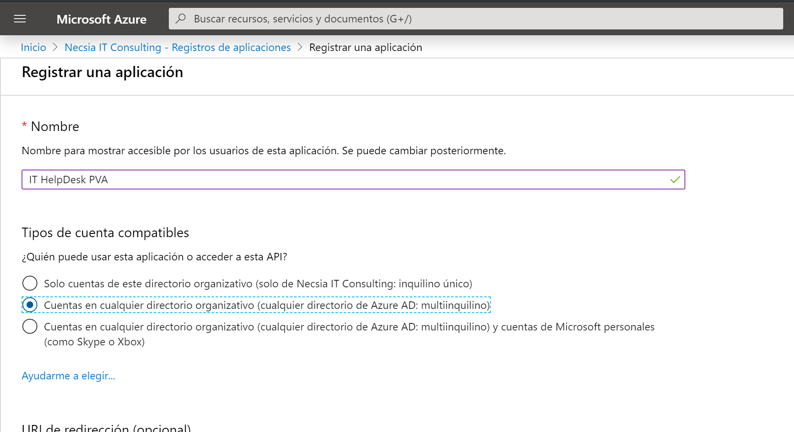

Como sabréis Microsoft Power Virtual Agent es el nuevo miembro de la familia de la Power Platform. Microsoft ha creado una herramienta fantástica para crear interfaces conversacionales de una forma rápida y fácil. Esta plataforma está construida sobre Azure Bot Service y permite una extensibilidad muy grande utilizando toda la potencia de Power Platform.

Aquí es donde radica todo su valor, los usuarios de negocio podrán crear una interfaz conversacional a medida dotándole de un flujo de conversación adaptado al contexto del usuario. Podrán integrar el ChatBot con las" Flow Actions". Acciones de llamada a Power Automate que nos permiten extender la lógica e integrar con sistemas externos mediante API. Si aun así, estas acciones no cubren todas las necesidades podrán agregar "Bot Framework Skills" a sus ChatBots para dotarles de funcionalidad extra.

Una de las ventajas principales que tiene Power Virtual Agent es la Autenticación. La documentación existente sobre este tema es escasa y difusa. De modo que voy a tratar de explicar paso a paso como configurar la autenticación de Power Virtual Agent y espero que sirva de guía para los demás.  Antes hay que decir que únicamente podemos configurar un único endpoint de autenticación por Bot y que Power Virtual Agents es compatible con cualquier proveedor de identidad que cumpla con el estándar OAuth2.

Para configurar la autenticación de Power Virtual Agent:

- Dirígete a la sección "Manage" y selecciona "Authentication" [https://powerva.microsoft.com/#/manage/authentication](https://powerva.microsoft.com/#/manage/authentication).
- Veras un formulario vacío. Según la documentación de Microsoft estos son los valores que debemos introducir: [https://docs.microsoft.com/en-us/power-virtual-agents/configuration-end-user-authentication](https://docs.microsoft.com/en-us/power-virtual-agents/configuration-end-user-authentication)

- Para ello necesitamos registrar una aplicación en el AAD. Dirígete a [https://portal.azure.com/#blade/Microsoft\_AAD\_IAM/ActiveDirectoryMenuBlade/RegisteredApps](https://portal.azure.com/#blade/Microsoft_AAD_IAM/ActiveDirectoryMenuBlade/RegisteredApps) y inicia un nuevo registro de aplicación. Define un nombre y elige la opción de "Multitenant".

- Una vez la tengas creada debes configurar la URI de redirección:

1. Selecciona en el menú "Autenticación".
2. Agrega plataforma "Web".
3. Escribe [https://token.botframework.com/.auth/web/redirect](https://token.botframework.com/.auth/web/redirect).
4. Selecciona la opción de "Access tokens".
5. Selecciona "Configurar".

- Lo siguiente que debes hacer es dar permisos de Graph para la App. Para ello selecciona "API Permissions" en el menú lateral:

1. Añade un permiso.
2. Elige "Microsoft Graph".
3. Elige la opción de "Delegated permisión".
4. Selecciona la opción "openid".
5. Selecciona "Agregar permiso".​

- Por último, dirígete a "Certificados y secretos" y crea un nuevo secreto de cliente:

- Con esto estaría la aplicación registrada en el AAD. Ahora debes copiar los valores del Client ID y Client Secret en la configuración de Autenticación de Power Virtual Agent y listo.

- Agregamos una acción de Autenticación al flujo de conversación. Cuando lo ejecutes y el ChatBot solicite autenticación, te saldrá un recuadro de Login que pedirá un One Time Code. Introdúcelo en el chat de conversación y el Bot procederá a Autenticarse.

- Una vez este autenticado, verás dos variables que devuelve el Bot, y que podemos usar después:

    - **IsLoggedIn** – Booleano devuelve si el usuario esta logado o no.
    - **AuthToken** – Bearer Token generado para el usuario.

Eso es todo, espero que os haya servido de ayuda para no volveros locos con la autenticación en Power Virtual Agent.

**Imanol Iza**  
Cloud Operations Manager, NECSIA | Microsoft MVP  
@imaiza  
[Imanol.iza@gmail.com](mailto:Imanol.iza@gmail.com)  
[www.imanoliza.com](http://www.imanoliza.com/)  