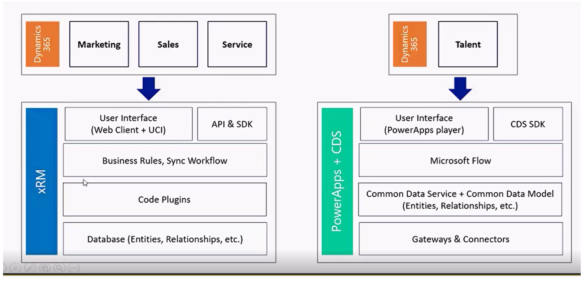
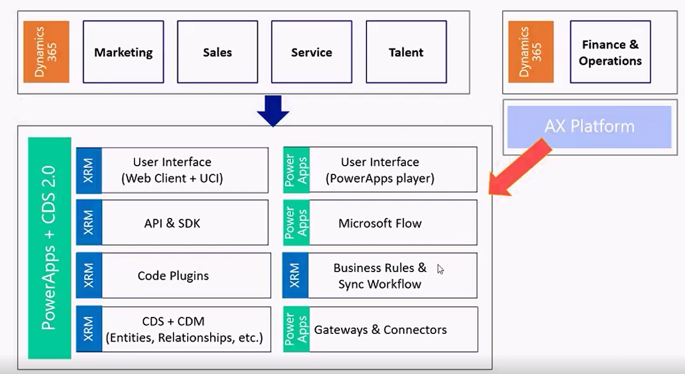
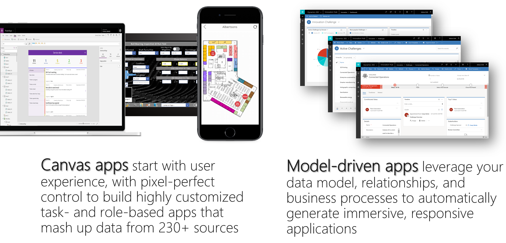
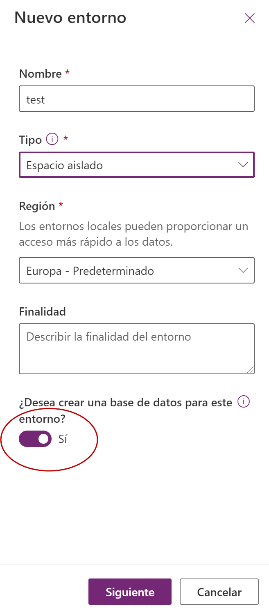
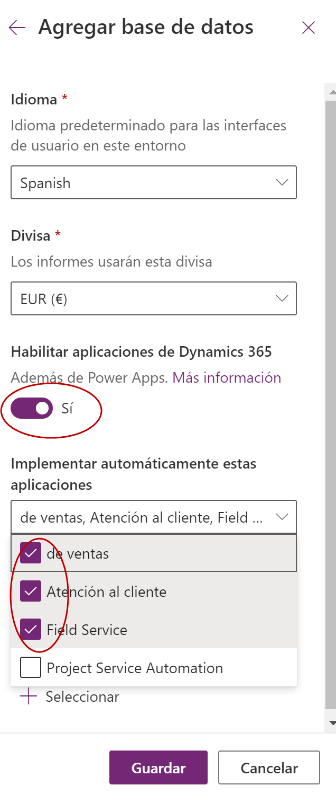

Las soluciones de negocio están de moda. Una vez consolidada la ola del salto al Cloud, ya casi nadie la discute. Es el momento de apuntar hacia el nuevo hito. Ahora mismo buena parte de la industria ve la oportunidad de negocio en las soluciones de negocio. Creo que es la evolución natural, ya que los equipos de I+D de los diferentes fabricantes tienen más y mejor control de las nuevas soluciones, lo que permite implementar soluciones de forma muchísima más acelerada.

Según muchas consultoras internacionales, Microsoft se encuentra en la punta de lanza de la innovación y desarrollo de estas nuevas plataformas que permiten mejorar procesos de negocio mediante la implementación de plataformas tecnológicas. A pesar de que considero que Microsoft dispone de una de las plataformas mas solventes y abiertas en cuanto a las aplicaciones de negocio, creo los cambios de nombres y la aparición de nuevas soluciones, puede provocar algo de confusión en algunos casos.

**Un poco de historia**

Microsoft ha entrado en el mundo del CRM en 2003 con la compra de una empresa que disponía de una solución de este tipo. A partir de allí ha tenido una evolución mantenida durante muchos años hasta su llegada a la versión cloud.  Durante este tiempo, la evolución de la solución ha llevado dos caminos que siempre fueron unidos en cada nueva release:

- Funcionalidades relacionadas con propiedad intelectual (IP), como por ejemplo requerimientos típicos de departamentos de marketing, de ventas o de atención al cliente. Estas funcionalidades permiten que dichos departamentos dispongan de una serie de funcionalidades de forma estándar que les permite trabajar desde el día uno.
- Funcionalidades relacionadas con la plataforma, que permiten extender la misma, y crear procesos de negocio propios a cada tipo de cliente. En este punto vemos funcionalidades como integraciones con toda la plataforma de Office365, herramientas para implementar automatismos o validaciones configurables, procesos de negocio a golpe de click.

Con la compra del "CRM", se adquiría toda la solución, que permitía aprovecharse de todo lo descrito, tanto de la IP como de la plataforma.

**Separación de la IP - Plataforma**

En muchas implementaciones tradicionales de Dynamics, los clientes no hacen uso de las funcionalidades derivadas de la IP, sino que utilizaban simplemente la plataforma para implementar procesos de negocio nuevos, nada que ver con los procesos estándar que traía la solución. De esta manera muchos hemos utilizado durante años en proyectos la plataforma de Dynamics 365 for Customer Engagement como un acelerador para la implementación de cualquier tipo de desarrollo o para digitalizar cualquier tipo de proceso de negocio.

Microsoft tomó nota de esto y comenzó a separar estos dos mundos, de cara a conseguir que incluso existan roadmaps diferentes entre uno y otro. Esto ha permitido que requerimientos de evolución de IP, generen nuevas funcionalidades de plataforma, y así existan sinergias entre ambas. Se seguía estando en el mismo mundo del Dynamics 365 for Customer Engagement (que era la plataforma), y la cual disponía de Apps como Sales, Marketing, Customer Service, Field Service, etc.

El reflejo técnico de este enfoque fue que todas estas Apps, se convirtieron en Soluciones que se instalaban sobre la plataforma, al igual que cualquier App o vertical que se puede conseguir en el Appsource. La "única" diferencia es que estas Apps las licenciaba y desarrollaba directamente Microsoft.

**PowerApps + CDS**

Microsoft identificó claramente que las plataformas de soluciones negocio y "low code" serían el siguiente escalón al cual se dirigía la industria. De esta manera comenzó a crear una nueva plataforma que llamó PowerApps, con un sitio donde crear entidades y campos que llamo Common Data Service (CDS 1.0). Inicialmente permitía crear aplicaciones rápidas con muchos conectores, y la posibilidad de crear entidades y campos. El rápido crecimiento de esta plataforma llevó a que sean necesarias nuevas funcionalidades más "Enterprise ready", como por ejemplo despliegues entre entornos, una SDK potente, portales de administración gestión avanzada de licencia y posibilidades de extensibilidad y personalización mucho más avanzadas.

En este punto es donde Microsoft decide detener este desarrollo y mirar hacia la plataforma de Dynamics 365 for Customer Engagement. Allí encontró que había muchos elementos comunes y así se tomó la decisión de unificar estos dos mundos:

Con esta decisión, todos los consultores de Dynamics 365 (CRM) se convirtieron en expertos en el nuevo CDS, ya que en realidad se tratan de la misma solución. Con esta unión nos quedan algunos temas algo duplicados. Por ejemplo, tenemos dos formas de crear aplicaciones, las Canvas Apps, y las Model Driven Apps:

También disponemos de los "antiguos" Workflows de Dynamics 365, y los nuevos Power Automate. Adicionalmente se ha añadido a todo el set de soluciones conocidos como PowerPlatform (que incluye Power BI, Power Apps, y Power Automate).

**CDS Platform**

Finalmente, hoy en día lo conocido como Dynamics 365 for Customer Engagement pasó a llamarse CDS Platform. Cuando alguien crea un entorno de CDS con su base de datos, se refiere a la plataforma de "CRM" tradicional pero solamente con las funcionalidades de extensibilidad de la plataforma y unas pocas (mínimas) entidades, como por ejemplo Cuenta, Contacto, actividades y poco más. Cuando creamos un entorno de Power Apps nos pregunta si queremos crear una base de datos. Esto quiere decir, un entorno de CDS.

Y una vez que tenemos ese entorno, podemos añadirle o no Apps de Dynamics 365.

Hoy en día es posible adquirir la plataforma por separado de las soluciones de Dynamics 365 CE, pero estas siguen siendo construidas sobre la misma plataforma. Esto nos permite comprar otras licencias de "PowerApps" para que en el mismo entorno convivan las Apps de Dynamics 365 con nuestras propias Apps personalizadas. Adicionalmente, al crear un portal (Power Apps Portal), lo que realmente se crea es un entorno de CDS con las Apps que anteriormente se llamaban Dynamics 365 Portals. Finalmente, aquí es donde podemos ver que un entorno por ejemplo con Dynamics 365 for Sales, lo que en realidad quiere decir es que se dispone de un entorno de CDS, con la App de Sales instalada.

**El futuro del CDS y Power Apps**

La evolución del CDS y las Power Apps, está provocando una auténtica revolución tecnológica en Microsoft. Nuevas soluciones como Talent o el nuevo Project ya están implementadas desde el inicio y de forma nativa con CDS, y ojalá venga más. Para seguir la evolución de Dynamics 365 CE y de la plataforma CDS ya disponemos de dos documentos por separado, uno para el CDS y otro para Dynamics 365:

- [https://docs.microsoft.com/en-us/dynamics365-release-plan/2020wave1/](https://docs.microsoft.com/en-us/dynamics365-release-plan/2020wave1/)
- [https://docs.microsoft.com/en-us/power-platform-release-plan/2020wave1/](https://docs.microsoft.com/en-us/power-platform-release-plan/2020wave1/)

Sin duda se nos vienen tiempos emocionantes en el mundo de las aplicaciones de negocio y en especial a los que trabajamos con Dynamics 365 y la Power Platform.

**Demian Raschkovan**  
Microsoft Dynamics CRM MVP