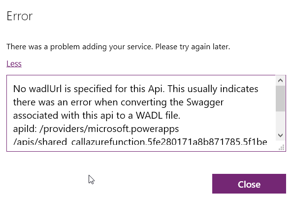
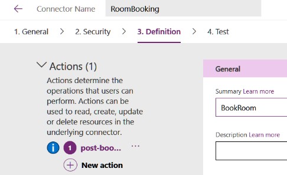
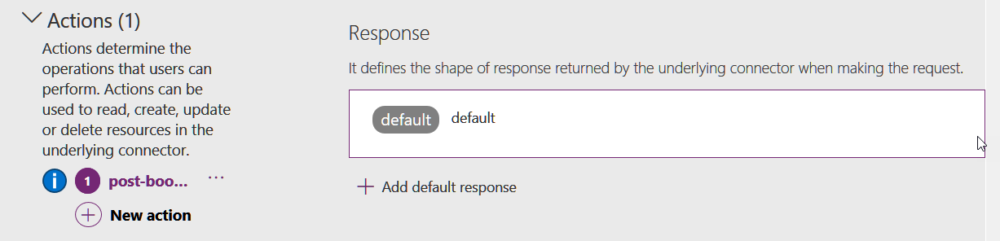
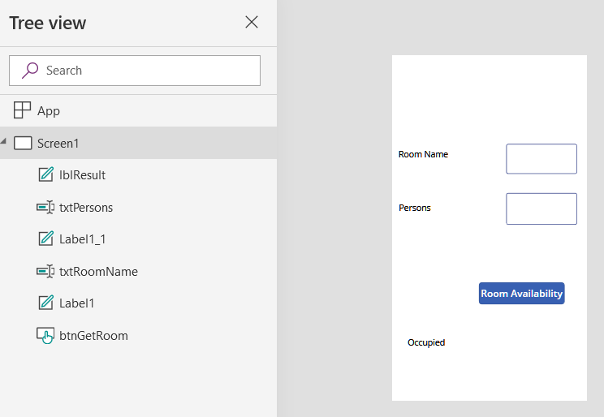
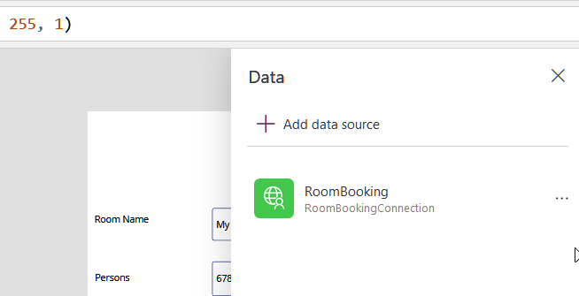
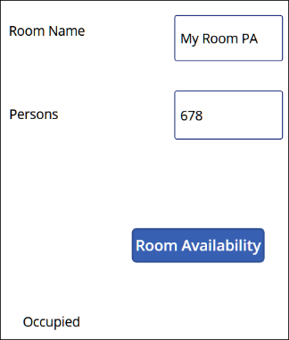
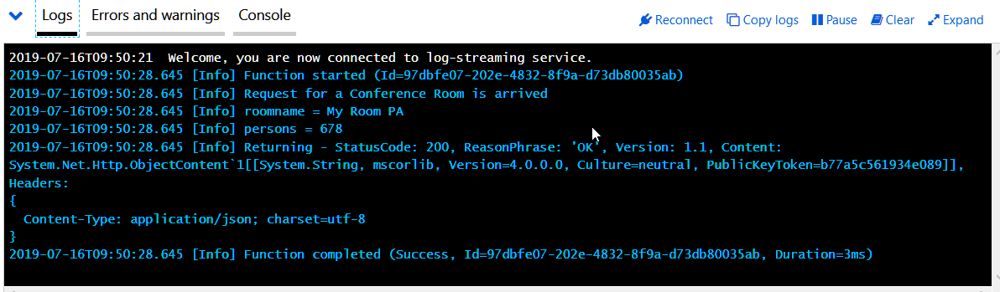

import ArticleHeader from '../../../components/article-header'

<ArticleHeader frontmatter={props.pageContext.frontmatter} />

Flow es la implementación que Microsoft ha creado para integrar el motor de flujos de Azure, Logic Apps, en Office 365. A su vez, Power Apps es un intento para facilitar la creación de aplicaciones sin necesidad de programación, que pueden ser utilizadas por sí mismas, o integradas en SharePoint Online. Ambos sistemas, aunque fáciles de utilizar y bastante poderosos en cuanto a funcionalidad, carecen de la flexibilidad para agregar nuevas posibilidades de cálculo y procesamiento. Esta falta de los dos sistemas se puede solucionar por medio de las Funciones de Azure.

Esta es la tercera parte de una serie de tres artículos:

1. Como crear Funciones de Azure para que puedan ser utilizadas por Flow y PowerApps (CompartiMOSS No. 41, [http://www.compartimoss.com/revistas/numero-41/uso-de-funciones-de-azure-con-flow-y-powerapps-part-1](/revistas/numero-41/uso-de-funciones-de-azure-con-flow-y-powerapps-part-1)).
2. Usando Funciones de Azure con Office Power Automate (CompartiMOSS No. 42, [http://www.compartimoss.com/revistas/numero-42/uso-de-funciones-de-azure-con-powerautomate-y-powerapps-parte-2-usando-openapi-en-powerautomate](/revistas/numero-42/uso-de-funciones-de-azure-con-powerautomate-y-powerapps-parte-2-usando-openapi-en-powerautomate)).
3. Usando Funciones de Azure con Power Apps (CompartiMOSS No. 43).

**Introducción**

Microsoft Office Flow es el motor de flujos de trabajo creado por Microsoft en base a Azure Logic Apps. Los flujos que se pueden crear están totalmente basados en componentes estándar que ofrecen una lógica interna de trabajo (loops, estamentos, etc.) y conexión a otros sistemas (Exchange, SharePoint y muchos otros conectores, internos y externos a Microsoft). El principal problema de esta forma de trabajo es que no se puede crear ("programar") nueva funcionalidad dentro del sistema mismo. Lo mismo se puede decir de Power Apps: aunque ofrece conectividad con muchos otros tipos de sistemas, no es posible definir capacidades de cálculo dentro de la aplicación misma.

Para solucionar el problema, ambos sistemas permiten la utilización de "OpenAPI", un estándar internacional que fue creado por un consorcio de industrias que se propuso unificar la forma cómo se describen los APIs de REST, creando un formato de descripción neutral y no controlado por cualquier proveedor comercial ([https://www.openapis.org](https&#58;//www.openapis.org/)). OpenAPI está basado a su vez en "Swagger", una manera conocida desde hace mucho tiempo para describir APIs de REST.

Aunque REST (REpresentational State Transfer) es una forma unificada para crear y utilizar APIs por medio de internet, la forma de usarlo es más un Framework que un estándar. Por tal motivo, los APIs de REST, como varían de uno a otro, se deben describir mediante una definición de OpenAPI para que otros sistemas "entiendan" como usar el API. Esta definición (OpenAPI) contiene información sobre qué operaciones están disponibles en una API y cómo se deben estructurar sus datos de solicitud y respuesta. Haciendo que Power Automate y Power Apps puedan utilizar OpenAPI hace que, a su vez, los dos sistemas estén abiertos a usar cualquier clase de funcionalidad proporcionada por cualquier tipo de sistemas externos.

Por su lado, las Funciones de Azure proporcionan toda la infraestructura técnica para poder crear funcionalidad "serverless", es decir, que los desarrolladores se pueden enfocar en crear el código que se necesita, sin necesidad de ocuparse de servidores, redes, rendimiento bajo carga, etc. Funciones de Azure se pueden programar en una variedad de idiomas de programación (CSharp, PowerShell, Python, etc.), utilizando Visual Studio, Visual Studio Code o directamente desde un navegador en el sitio de diseño de Funciones del portal de Azure. El problema, a su vez, con Funciones es que la definición Swagger que generan no es OpenAPI ni utilizable directamente por Power Automate o Power Apps.

Microsoft ha publicado parches para poder crear Funciones de Azure que puedan ser utilizadas directamente desde Power Automate y Power Apps, pero es requerido que tanto Azure como Office 365 utilicen el mismo Directorio Activo, lo que generalmente no es el caso en aplicaciones Enterprise. La forma para solucionar el problema es utilizar el Azure API Management, un servicio de Azure que permite exponer APIs al mundo externo por medio de OpenAPI.

En este tercer artículo de la serie de tres, se indica como modificar la definición OpenAPI de la función de Azure, que es expuesta al mundo externo por medio del servicio de Azure de API Management, para que pueda ser utilizada desde Power Apps. El ejemplo a continuación es un sistema de reserva de salas de conferencias en una empresa: empleados pueden reservar una sala de conferencias desde una Lista de SharePoint; un Power Automate acoplado a la Lista pasa los datos de la reserva a la Función de Azure que calcula si la reservación es posible, o si el sitio está ocupado y retorna una indicación al respecto al flow, el que retransmite la información a SharePoint y al usuario. Todo el sistema de reserva se puede utilizar también desde una aplicación de Power Apps, como se muestra en este artículo. El algoritmo para determinar si una sala está ocupada o no, no es implementado, solamente se ha simulado por medio de un generador random. Pero el ejemplo indica claramente el potencial que ofrece la combinación de los cuatro sistemas.

**Modificar la definición de OpenAPI**

Si se intenta utilizar el conector creado en el segundo artículo de la serie con la definición OpenAPI de la función, Power Apps lo rechaza con un error:

El error es bastante críptico y no da ninguna indicación sobre el problema con la definición de OpenAPI. Para poder usar el conector en Power Apps, es indispensable solucionar primero el problema, como se indica a continuación.

1. Abra el sitio de Power Apps desde el portal de Office ([https://portal.office.com](https&#58;//portal.office.com/)), o desde el portal de Power Apps mismo ([https://powerapps.com](https&#58;//powerapps.com/)) y lóguese con credenciales que tengan permisos suficientes para crear y utilizar aplicaciones.

2. Expanda el menú de "Data" (menú vertical al lado izquierdo) y haga clic sobre "Custom connectors". Use el botón con el icono de un lápiz al lado del conector creado en el punto 6 del segundo artículo de la serie (conectores son iguales para Power Automate y Power Apps). Esto abre la configuración del conector en forma de edición. Haga clic sobre "3. Definition".

3. Primero haga clic sobre el botón de elipse al lado derecho del método "get-" y use "Delete". Este método no es utilizado y, además, contiene errores que impiden usarlo en Power Apps.

4. Luego seleccione el método "post-" y desplace la ventana hacia abajo, hasta la sección de "Response". Note que no hay una respuesta definida porque el OpenAPI exportado desde Azure API Management no detecta que haya una respuesta desde la función, y no crea una respuesta en la definición (esto hace que la definición no sea conforme al estándar de OpenAPI, y que Power Apps rechace el conector). Para solucionar el problema, use el botón de "+Add default response", acepte los valores por defecto y haga un update del conector. El resultado es una respuesta por defecto definida en el conector:

**Crear la aplicación de Power Apps**

5. Desde el portal de Power Apps haga clic sobre "Apps" y sobre "+Create an app" - "Canvas" - "Start with a blank canvas" - "Phone layout" para crear una nueva Power App.

6. Agregue dos labels ("Room Name" y "Persons"), dos text boxes ("txtRoomName" y "txtPesons"), un botón ("btnGetRoom") y un label ("lblResult") para mostrar el resultado.​

7. Agregue el conector. Seleccione la pestaña de "View" (menú horizontal superior) y "Data sources". En la nueva ventana use "+Add data source", busque el conector y haga clic sobre él. Si las modificaciones han sido correctas, el conector aparecerá en la lista de "Data" sin mostrar errores:​

8. Cierre la ventana de "Data" y haga clic sobre el botón de la aplicación. En el método "OnSelect" utilice el siguiente fragmento de código:

UpdateContext({RoomAvailable: RoomBooking.postbookroom({roomname:txtRoomName.Text, persons:txtPersons.Text})})

En este fragmento se crea una variable llamada "RoomAvailable" por medio del método "UpdateContext". A la variable se le asigna el resultado de llamar el método "RoomBooking.postbookroom", que utiliza dos parámetros de entrada: "txtRoomName.Text" para "roomname" y "txtPesons.Text" para "persons". Note que "RoomBooking" es el nombre del conector y "postbookroom" el nombre de la operación (sin "-") que indica la definición del conector. De igual forma, "roomname" y "persons" son los dos parámetros de entrada que el OpenAPI ha definido en el QueryString de entrada del conector.

9. Haga clic sobre el label para mostrar los resultados en la aplicación, y en su propiedad de "Text" seleccione "RoomAvailable". Esta es la variable que el botón crea y asigna un valor cuando la función de Azure es llamada

10. Use el "App Checker" (esquina superior derecha) para comprobar que la aplicación no tiene errores

11. Para testear el funcionamiento de la aplicación, use el botón de "Preview the app" en la esquina superior derecha, o use F5. Inserte dos valores en las dos casillas de texto y use el botón. El resultado deberá aparecer en el label de resultados:

La aplicación hace una llamada REST al Azure API Management, y este a su vez llama a la función. El funcionamiento de la función se puede seguir abriendo la función misma y su ventana de Logs:

12. Note que también es posible crear una aplicación de Power Apps para la Lista de SharePoint utilizada en el segundo artículo. Pero en ese caso, la aplicación no es más que un reemplazo de la interfaz por defecto de la Lista en SharePoint, que lo que hace es crear un elemento en la Lista, el que dispara el flujo acoplado a ella. En este articulo hemos visto como crear una aplicación de Power Apps que puede funcionar totalmente independiente de SharePoint y Power Automate.

**Conclusión**

Para darle más flexibilidad y capacidad de interacción con otros sistemas, Microsoft Power Automate y Power Apps pueden utilizar conectores a procedimientos externos. Azure Functions es el método ideal para crear esa funcionalidad. En esta serie de tres artículos se indica como crear funciones de Azure y hacerlas funcionar bajo el OpenAPI estándar (primer artículo), como conectar Power Automate con la función (segundo articulo) y como puede utilizar Power Apps la misma función (tercer articulo).

**Gustavo Velez**
 MVP Office Servers & Services

gustavo@gavd.net
 http://www.gavd.net

