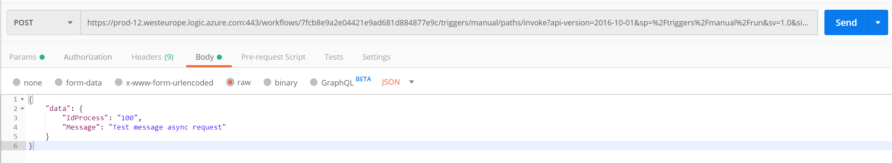

Primero debemos analizar el problema de Http Time Out, Logic App tiene más potencia de la que parece. Es de todos sabido, que Azure Logic App es una herramienta potente, que no se ciñe solo a procesos de integración, sino que podemos usarlo como verdaderos orquestadores, que complementen de una forma óptima a nuestras queridas Azure Functions.

Pero en la práctica, los desarrolladores optan siempre por ir a Azure Functions o Durable Functions, porque parece que los flujos se complican demasiado o bien porque no se sienten cómodos. Nos llevaría muchas líneas demostrar toda la potencia de Logic App en realidad, pero vamos a intentar ver al menos uno de los problemas posiblemente más bloqueantes para mucha gente, y es ¿Qué hago cuando Logic App llama a procesos muy pesados por HTTP y que exceden los 2 minutos límite de tiempo? ¿Qué hago con las llamadas async por HTTP en Logic App, como las controlo?

**Llamadas a procesos pesados y llamadas Async, patrón Pollling**

En el caso general, hacer una llamada a una API externa o a otro sistema desde Logic App no supone ningún problema, simplemente debemos hacer uso de la action HTTP y obtenemos el resultado de la petición.

Pero claro, ¿Qué sucede si la petición tarda más de 2 minutos en responder? Si acudimos a limitaciones de Logic App, expuestas por Microsoft, nos queda muy claro que una petición de salida Http no puede superar nunca los 120 segundos, y por ello debemos bien implementar un patron "async polling pattern" o bien anidar otras LogicAapp, con el coste y la complejidad que esto conlleva.

Pues bien estamos ante el primer gran motivo para irnos a Azure Function, pero claro si estas leyendo esto seguro que eres una persona con mucha inquietud, y te preguntarás ¿Cómo es posible algo tan sencillo no se pueda resolver con Logic App y además si una Logic App tiene una duración máxima de 90 días?

Pues si se puede resolver, y como hemos ido anticipando la primera gran opción es implementar un flujo que siga el patrón Polling que vemos en la siguiente imagen:

Antes de entrar a "destripar" el diagrama anterior, debemos pensar en el escenario ideal para poner en practica este ejemplo. Por ejemplo, pensemos en un sistema de "Compra online", en la cual hay un servicio que aprovisiona la compra, pero que tarda varios minutos, incluso horas en tramitar nuestro pedido. Evidentemente aquí ya no es un problema de Async o no, es un problema de que el proceso en background puede tardar no se pongamos 15 minutos, tiempo suficiente para despreciar por ejemplo una Azure Function con un plan de consumo básico.

Siguiendo ahora sí, el diagrama anterior, nuestra Logic App va a realizar una petición HTTP al sistema de Compra, y este le va a devolver una cabecera de respuesta 202 confirmando que se ha tramitado la petición, e incluso un tiempo o intervalo de tiempo estimado de respuesta al pedido.

A partir de aquí en la Logic App, deberemos implementar un "check status", que podemos hacer con un **do until y un timer** para ir ganando tiempo en el proceso. Recordar que tenemos hasta 90 días por flujo, y si o si queremos capturar que el pedido es correcto, porque necesitamos anotar esta transacción en nuestro sistema.

Pongamos que hemos configurado el intervalo para que cada 5 minutos, se evalué la petición, nuestra Logic App hará peticiones HTTP al sistema de Compras preguntando por ejemplo con un Identificador de pedido, para comprobar si ha concluido o no la transacción, en este caso podemos obtener dos posibles resultados:

- Trabajo pendiente con un 202.
- Trabajo finalizado con 200 y un cuerpo de respuesta.

Como veis, con un simple timer y un poco de ingenio ya no solo podemos soportar peticiones asíncronas que igual para eso es mejor ir por código y Azure Function, sino que podemos implementar procesos duraderos en el tiempo, que se queden esperando y reciban lo antes posible la transacción, pudiendo anotar en todos los sistemas necesarios la operación y dejarlos así sincronizados. He de adelantar que este diagrama habla a muy bajo nivel de como se implementa un patrón Polling, que no es más que un sistema de "check status" cada cierto tiempo, mediante un temporizador, como veremos en el siguiente ejemplo, las Acciones HTTP de Logic App y de Response ya tienen implementado este patrón de base y podemos hacer uso de el sin tener que implementarlo a mano, aunque es bueno saberlo si tenemos un sistema que no acepta este patrón.

**Ejemplo, Logic App con respuesta Async y Logic App con patrón Polling**

Vamos a simular el patrón Polling anteriormente definido, con dos Logic App, de forma que una Logic App va a devolver una respuesta de forma Async, y tendrá activado el patron polling de respuesta y que desde ahora será "Response Worflow", y una segunda Logic App que va a replicar exactamente el comportamiento del temporizador que hemos visto anterior mente y que vamos a llamar "Request Polling Workflow".

**Implementar Response Workflow**

Vamos a implementar un proceso que permita simular un proceso de más de 2 minutos, y provocar así que se implemente un patron polling en los procesos que lo instancien o no podrán obtener el dato de salida.

Este workflow contará de cuatro pasos, que serán los siguientes:

1. Desencadenador por Http:

2. Mapeo de body de entrada, a un JSON entendible por Logic App con "Parse Json":

3. Delay de 3 minutos, para simular un time out en los procesos que consuman a este proceso.

4. Acción de respuesta que tenga activa el modo Async para poder implementar el patron polling.​

Esta acción responderá un 200 ok pasados los 3 minutos, con el IDProceso de entrada y el mensaje obtenido en la petición. Para poder configurar la salida como asíncrona deberemos pulsar en las propiedades de la respuesta y marcar la opción "**asynchronus response**", para que devuelva en el acto un 202. Junto con el 202 Accepted, el proceso va a devolver una URL en una cabecera llamada "Location", que va a permitir al sistema que ha realizado la petición obtener el resultado final del proceso pasados los 3 minutos de delay.

Para comprobar que la Logic App, va a permitir preguntar a cualquier sistema por el "status" del proceso, podemos realizar una petición vía Postman a la Logic App que acabamos de crear. En la caja de descadenador por HttpTrigger, podemos copiar el campo "HttpPost Url". Debemos crear una petición post en Postman tal cual se ve en la siguiente imagen:

Si todo va como debe nos deberá devolver un 202 Accepted, y una serie de cabeceras entre la que tenemos la cabecera Location, que contiene la URL para hacer seguimiento del proceso.

Pasados los 3 minutos de duración del Timer de nuestra Logic App, podemos hacer una petición GET a la URL que contenía la cabecera Location, y obtendremos el resultado que esperábamos, devolviendo el id de proceso 100, y el mensaje de Test que le pasamos al inicio de la prueba.

**Implementar Request Polling Workflow**

Una vez tenemos un sistema que acepta llamadas asíncronas, vamos a implementar este patron polling en una Logic App, para simular esa espera de más de **2 minutos** y solventar así el problema que tenemos con los procesos pesados. Debemos recordar que una Logic App tiene una duración máxima de **90 días** por lo que es el límite que nos ofrece el servicio para implementar estos procesos. En la definición del proceso hablamos de crear un timer que evaluara el proceso asíncrono para ver si había terminado o no la petición, cada cierto tiempo. He de decir que lo podemos hacer, y es un proceso 100% optimo, pero también es un patrón que ya nos implementa la acción HTTP de Logic App, y que se encarga de ir consultando por la cabecera Location cada cierto tiempo por nosotros.

Vamos a crear un proceso con HttpTrigger, sencillo que reciba el mismo json en el body que en el caso anterior, así se lo enviaremos a la Logic App que creamos antes.

Si vemos el workflow con perspectiva no hace más que hacer una petición a la Logic App anterior, que devuelve un 202 en la primera petición, y que mediante el patrón polling de las llamadas asíncronas se va a esperar a que termine el otro workflow para devolver el resultado.

Debemos recordar que la petición **Http** a nuestra **Logic App Response Workflow** tiene un retardo de **3 minutos**, por eso debemos indicarle en las propiedades que cumple un patrón asíncrono. Si no es así no esperará a que termine el proceso.

El resultado de respuesta podemos devolver por ejemplo lo que de vuelve nuestro Response Workflow, en este nuevo Polling Workflow y así comprobamos que la propia Logic App simula nuestra petición a la cabecera Location, y por tanto nos podemos olvidar de implementar a mano el patrón. Si lanzamos la nueva Logic App podremos ver que se queda esperando el tiempo necesario haciendo polling sobre la segunda Logic App, en este caso algo más de 4 minutos.

Si por ejemplo tuviéramos que el proceso pesado no es una Logic App, si no que debe ser un API Rest o una Functions, podemos tener dos opciones:

- Simular el patrón Pulling, desde Logic App mediante temporizadores y do until (poco recomendable porque puede ser foco de control de errores, más coste y peor rendimiento que usando el patrón que nos aporta HTTP Action)
 Implementar nuestra Function o API con este patrón, tal y como refleja en este enlace ([https://docs.microsoft.com/es-es/archive/blogs/logicapps/long-running-tasks-in-logic-apps](https://docs.microsoft.com/es-es/archive/blogs/logicapps/long-running-tasks-in-logic-apps)). Al final, es controlar un ID de proceso que llevaremos mediante la cabecera Location ,que sí entiende nuestra Logic App y ofrecer los métodos de "check status" necesarios, para poder obtener el resultado final del proceso.

**Conexiones Webhook, una forma más refinada de controlar las llamadas Async**

La verdad que debemos de admitir que el patrón Polling está muy evolucionado en las HTTP Actions, pero en mi opinión me sigo quedando con el patron Webhook para realizar estas llamadas Async, incluso procesos que requieran muchas pausas como puede ser construir una máquina de estados, que requiere de eventos externos para ir cambiando el estado del proceso.

Si bien para un sistema por ejemplo de Pedido de nuestra tienda Online, nos puede servir de sobra el patrón polling, imaginaros ahora un proceso que tenga 3, 4 cuatro pasos encadenados como puede ser el seguimiento de un pedido desde que se compra hasta que se envía en la vivienda. Para esto necesitamos ahora sí:

- Varios eventos por proceso (uno por cada cambio de estado).
- Controlar el callback de cada estado, ¿Puedo pasar al siguiente estado?​

Para mi este escenario ya se va de las manos al patrón Polling y las acciones HTTP, porque al final si vamos a tener varias HTTP Actions, haciendo polling al sistema, estamos sobrecargando al sistema de seguimiento del pedido. Imaginaros que tenemos "100 pedidos lanzados", no dejamos de estar haciendo 100 peticiones concurrentes por cada estado, o lo que es lo mismo si el proceso es largo en este caso ya de días, vamos a estar sobrecargando el API de seguimiento sin motivo aparente.

Si nos vamos al ejemplo anterior, y vemos sobre el terreno, para un delay de 4 minutos, se le evalúa a la Logic App Response desde la Logic App Request Polling , un total de 4 veces sin necesidad o lo que es lo mismo 4 skipped Actions, que sin duda tiene un coste mínimo, pero un coste tanto en rendimiento con en la factura al fin de mes.

Si nos centramos en "vamos a intentar" reducir el número de peticiones no necesarias al sistema, podemos optar por implementar una suscripción Webhook.

A diferencia del patrón Polling, si suscribimos por Webhook una Action de Logic App, esta solo se va a invocar justo cuando el sistema haya terminado su proceso. Por ejemplo, para nuestro caso del pedido, solo se va a invocar la Acción Webhook, cuando el API de pedidos, quiera indicar a nuestra Logic App que debe cambiar de estado.

Nuestro API de pedidos debe admitir una suscripción vía webhook (podemos ver ejemplos en [https://github.com/logicappsio/LogicAppTriggersExample/blob/master/LogicAppTriggers/Controllers/WebhookTriggerController.cs](https://github.com/logicappsio/LogicAppTriggersExample/blob/master/LogicAppTriggers/Controllers/WebhookTriggerController.cs)) de como montar nuestro Cliente Webhook en un Azure Functions o un App Service.

Cada vez que se produzca un evento al cual mi Logic App está suscrito, esta acción HTTP Webhook se disparará, y mientras eso no suceda el flujo seguirá en ejecución. Una vez se ejecute la acción de Webhook, esta se de-suscribe para este evento, y permite continuar al flujo, es importante configurar correctamente esta caja, para que pueda continuar el flujo de forma correcta.

Si volvemos a nuestro flujo anterior, ya no tenemos un polling para cada uno de los estados, sobrecargando al proceso, si no que el propio flujo con la acción webhook se suscribe en tiempo real al evento que le interese para ese estado, y una vez finalizado deja de escuchar ese estado.

Además, los eventos por estado los recibe la Logic App en tiempo real, y los proporciona el API de Pedidos, por lo que el API de pedidos solo recibe 2 peticiones por cada estado de un flujo la de suscribirse y la de desuscribirse al evento correcto.

**Conclusiones, ¿Por qué nos rendimos tan pronto?**

Este servicio es un "avión", es super potente, pero por mi experiencia con él, los equipos de trabajo y los arquitectos tienen a rendirse muy muy pronto y acuden a otras vías más "familiares". Estas derivan en soluciones a medida o un catálogo de funciones en Azure en Net Core, que sin duda son muy capaces pero igual no idóneas si las comparamos en algunos casos de orquestación o integración, donde Logic App puede tener mucho que hablar.
 
En este artículo solo hemos visto un poco de su poder, pero tiene mucho más, tiene un gran poder de integración entre sistemas, de autenticación, de orquestación…, que sin duda algún día iremos explotando, y en combinación con App Service o Azure Functions en función del tipo de aplicación que tengamos, podremos ir orquestando procesos muy muy solidos que además tienen un coste muy bajo comparado con programar workflows a medida, tanto en servicios de Azure como en horas de implementación.

Animo a que "valoremos" un poco más a este servicio que sin duda nos puede aportar mucho en muchos escenarios.

**Sergio Hernández Mancebo**  
Azure MVP 
 
import LayoutNumber from '../../../components/layout-article'
export default LayoutNumber
