​Con la llegada del "nuevo" framework de .NET Core, la forma en la que se desarrollaban las aplicaciones dio un vuelco totalmente. Un framework monolítico que solo se podía ejecutar en entornos Windows, por un nuevo framework modular, multiplataforma y orientado al Cloud.  A lo largo de este articulo vamos a ver que opciones nos permite para configurar y administrar la seguridad en nuestros desarrollos.

Antes de empezar a entrar en materia con el detalle, hay que tener claro los conceptos autenticación y autorización, aunque puedan ser similares no lo son, sino que se complementan el uno al otro. La autenticación es un proceso en el que un usuario proporciona credenciales que después se comparan con las almacenadas en un sistema operativo, base de datos, aplicación o recurso. Si coinciden, los usuarios se autentican correctamente y, después, pueden realizar las acciones para las que están autorizados durante un proceso de autorización. La autorización se refiere al proceso que determina las acciones que un usuario puede realizar.

**Autenticación**

Una vez tenemos claro que es cada cosa vamos a empezar con la autenticación. ¿Como vamos a autenticar nuestra API?  En primer lugar, debemos tener claro como nos vamos a autenticar. El método más común que se está utilizando ahora mismo es utilizando JWT.

¿Qué es JWT? JSON Web Token es un estándar abierto basado en JSON propuesto por IETF para la creación de tokens de acceso que permiten la propagación de identidad y privilegios o claims. ¿Quién nos puede generar ese token? Cualquier proveedor de identidad como pueda ser Azure, Amazon, Google, Twitter o LinkedIn (por citar algunos) disponen de un servidor de token en el que podemos autenticar a un usuario en nuestra aplicación.  También es posible la implementación de un servidor que nos devuelve estos tokens en base a la lógica de negocio que nosotros consideremos oportuna.  La ventaja de introducir algún proveedor de los citados anteriormente es que casi todo el mundo ya dispone de un usuario en dichas plataformas y por lo tanto muchos usuarios no les haría falta registrarse en ningún otro sistema, ni tener que recordar otra clave más.

Talk is cheap, show me the code … Toda esta parte teórica está muy bien, pero vemos ver como se le añade esta funcionalidad a nuestra aplicación de .NET Core. Cuando creamos una solución en .NET Core tiene una clase de arranque de StartUp.cs que está compuesta de dos métodos ConfigureServices y Configure. En el primer método se tienen que configurar añadir la configuración de todos los servicios/middlewares que se van a utilizar y en el segundo se le añade que lo utilice. Para el tema de la autenticación, por ejemplo, para una autenticación contra el Azure Active Directory, dentro del ConfigureServices tenemos que añadir el siguiente código.

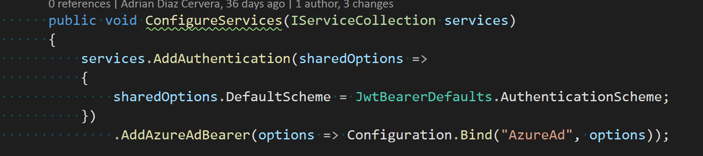

El método AddAzureAdBearer se inyecta como un paquete de Nuget incluido dentro de ASP.NET Core pero también en versiones anteriores se añadía como un middeware a la aplicación. El código que tiene es relativamente sencillo y lo que debe se encarga es de mapear las propiedades del servidor de seguridad con los datos que llevan en el token de cada petición. El código es el siguiente:

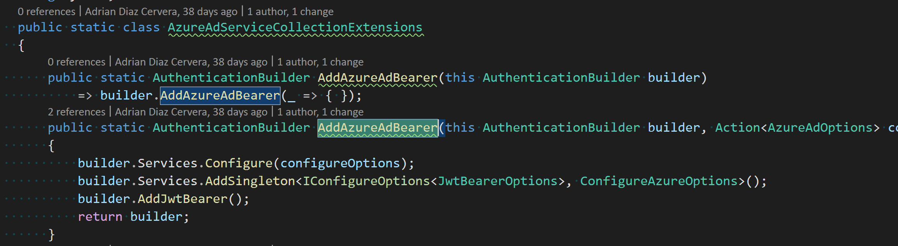

Para indicarle los valores por los que tiene que autenticar nuestra aplicación, en el servicio que utilicemos (app.setings, KeyVault) tendremos que introducir los siguientes valores, que se obtienen al dar de alta la aplicación en el Azure Active Directory:

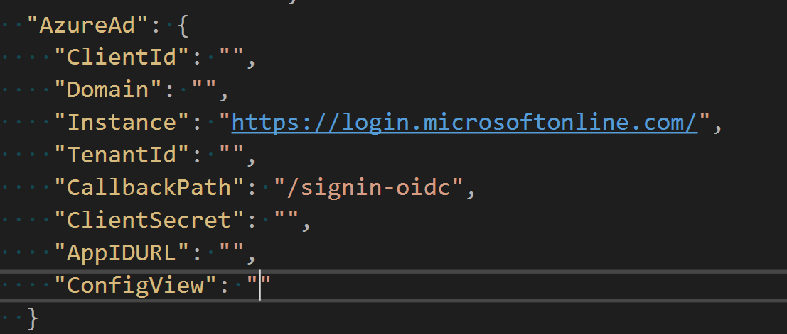

Una vez tenemos ya se ha añadido el método en el que indicamos que podemos utilizar este tipo de autenticación, el siguiente paso es en método Configure indicarle que nuestra aplicación requiere autenticación. Para ello hay que añadir el siguiente código:

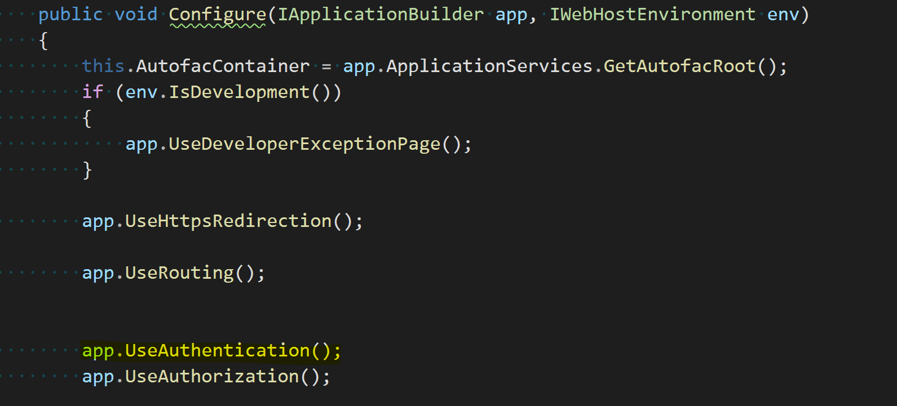

**Nota:**Es bastante importante el orden en el que se añade cualquiera de estos elementos, es decir, si indicamos que usemos Authorization antes que Autenticación nuestra API no tendrá ni una cosa ni la otra. Resumiendo, el orden en el que añadimos dichos elementos el pipeline tiene su importancia.

**Autorización**

Esta es la parte sencilla, ahora bien, que tipos de autorización nos proporciona .NET Core.  Para indicar que uno de los controladores de la API que estamos desarrollando nos bastaría con poner en el decorador del controlador el Atributo "Authorize". Algo como el siguiente código:

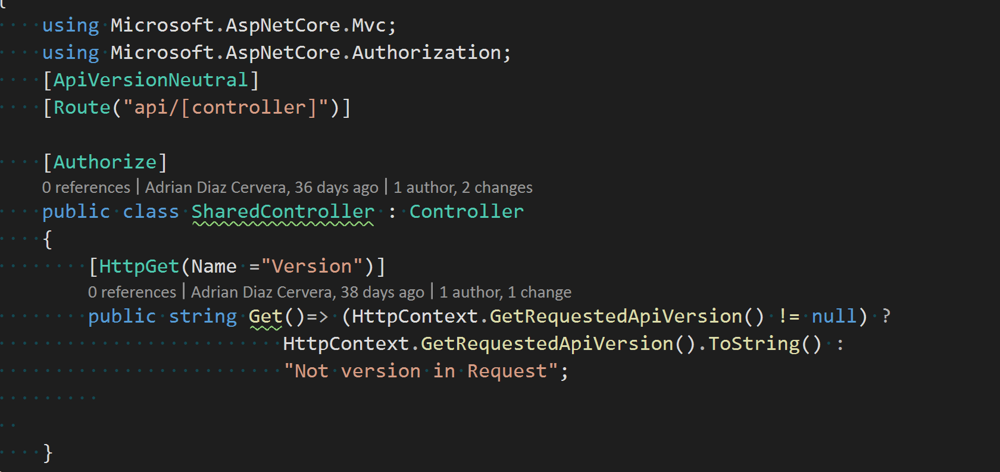

**Autorización basada en roles**

Hasta este punto nada del otro jueves, pero está claro que en otras versiones de ASP.NET nos creábamos una autenticación basada en Roles. El típico Rol Provider en que se consultaba en una base de datos que rol tenía el usuario que se había autenticado y se encargaba de indicar si podía acceder a dicho método o no. Los tiempos cambian, ahora tenemos un Claim y en la misma se puede indicar que Rol/es tiene dicho usuario y con el mismo token podemos empezar a construir nuestra lógica. Como se puede comprobar el tema de rendimiento entre ambas opciones es bestial.

**Ejemplo:**Poner el caso que tenemos una aplicación de los Vengadores en el que a cada usuario le asignamos un Rol (el avenger al que pertenece), imaginaros que tenemos unos métodos en el que tenemos que invocar el poder de cada vengador. ¿Cómo lo haríamos?

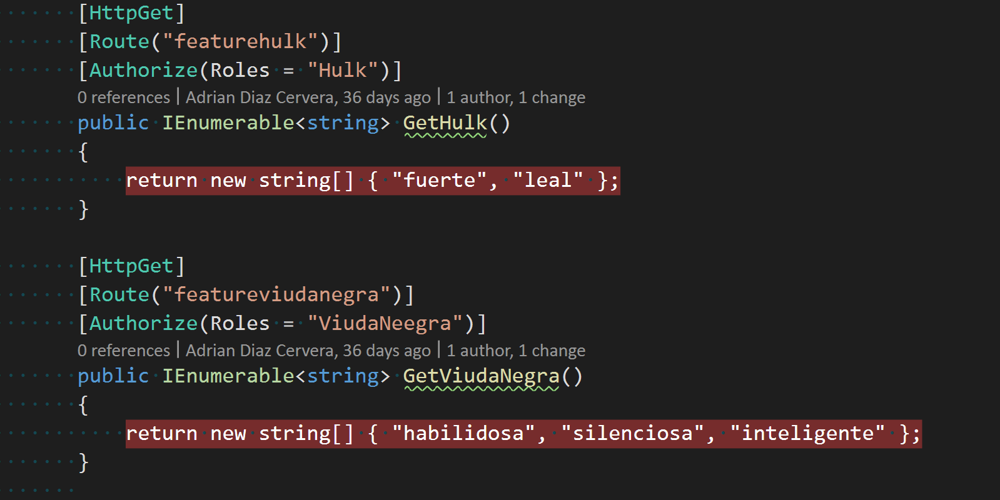

Dentro del atributo Authorize indicamos el Rol o Roles que tienen autorización para llamar a cada método. En este caso el primer método solo lo podrán invocar los usuarios que pertenezcan al Rol Hulk, mientras que en el segundo solamente lo pueden invocar los usuarios que pertenezcan al Rol Viuda Negra.

Si queréis saber cómo añadir estos roles en la aplicación del Azure Active Directory podéis seguir este enlace en el que se detallan todos los pasos para hacerlo [https://docs.microsoft.com/en-us/azure/active-directory/develop/active-directory-enterprise-app-role-management](https&#58;//docs.microsoft.com/en-us/azure/active-directory/develop/active-directory-enterprise-app-role-management)

El Rol del usuario es algo que también podemos acceder dentro del controlador. Igual necesitamos que el desarrollo funcione de una forma diferente dependiendo del rol que acceda, por ejemplo, no es lo mismo que cuando acceder un Administrador que cuando acceder un responsable de una delegación u otro usuario con menos privilegios. Pues esta opción también está permitida porque se dispone del método IsInRole dentro de la Claim que se envía.  Este ejemplo lo podríamos hacer tal que así:

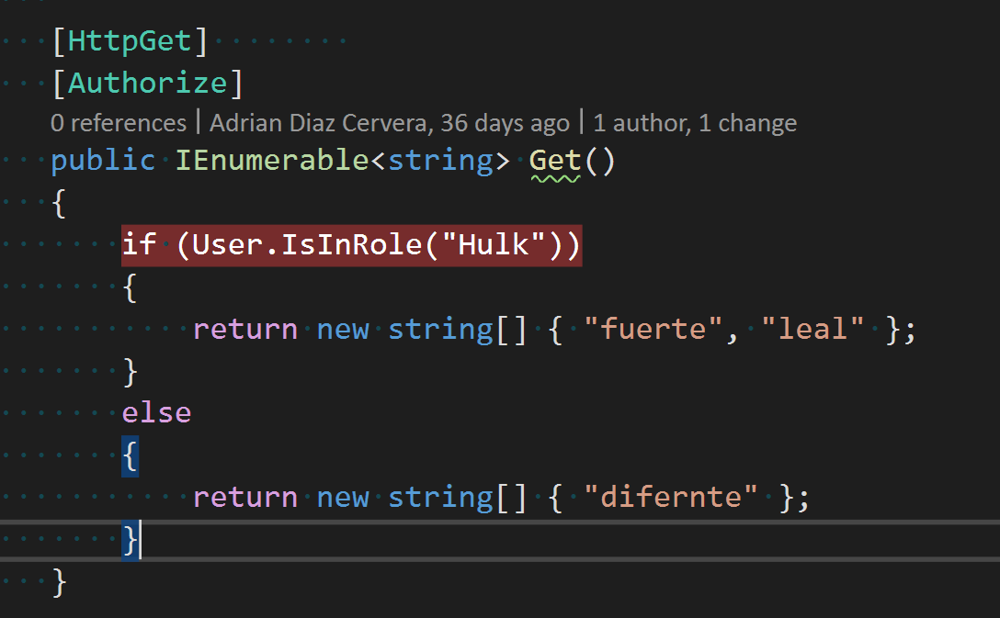

**Autorización basada en directivas**

En la gran mayoría de las ocasiones es posible que con los dos tipos de autorizaciones tengamos más que suficientes, pero vamos a pensar en otros casos posibles. Imaginemos que tenemos una API en el que los métodos que tenemos diversos tipos de licenciamiento en el que dependiendo de si el usuario ha adquirido un tipo de licencia o no puede invocar a determinados métodos o no. Está claro que esta opción no es recomendable tenerla en una Claim, sino que esta consulta implica una lógica o unas determinadas acciones propias de la lógica de negocio.

Manos a la obra, una directiva Una directiva de autorización se compone de uno o varios requisitos. En primer lugar, nos vamos a crear un Requerimiento. En nuestro caso es si se le aplica licencia o no. Para ello tendremos el siguiente método:

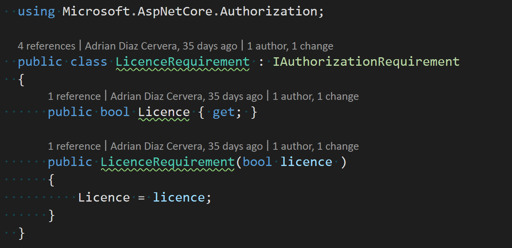

Una vez tenemos el Requerimiento creado, el siguiente paso es implementar el Handler que es el encargado de hacer cumplir dicho requerimiento. Para ello se tendrá que implementar una clase que implemente la interfaz IAuthorizationHandler

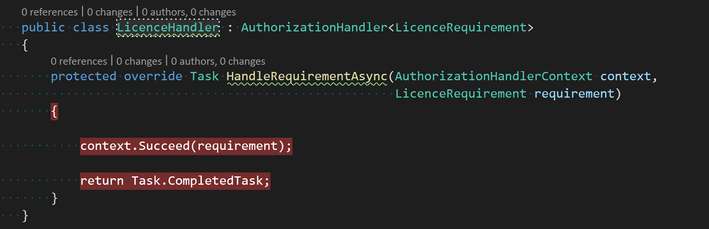

En el método HandleRequirement deberemos de implementar la lógica de negocio que queramos aplicar a dicho método. En este caso todo lo que entra en el requerimiento es aprobado ya que no se ha añadido ninguna condición.

Una vez tenemos implementado el método el siguiente paso es añadirlo en el arranque de la aplicación para que tengamos dicha Política y utilizarla cuando dentro del controlador o método que consideremos oportuno. Para ello en el ConfigureService tendremos que añadir este código:

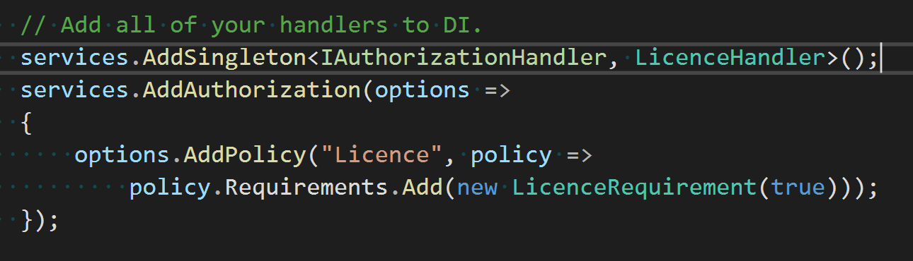

Ahora casi como en el resto de los atributos en el controlador, ponemos Policy junto con el nombre de la política en nuestro caso Licence. Y en caso de que el usuario tenga licencia podrá lanzar dicho método.

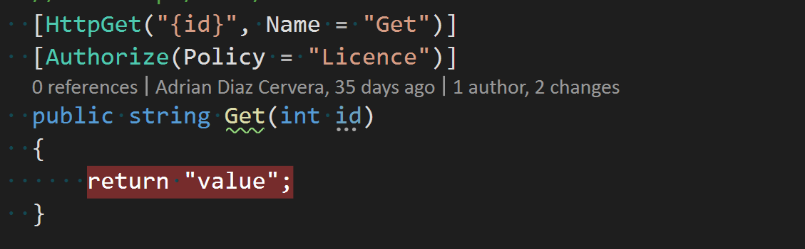

**Resumen**

La seguridad es algo lo suficientemente importante como para tenerlo en cuanta desde el minuto uno que empezamos a realizar un desarrollo. ASP Net Core es un framework lo suficientemente bien pensado, y con una comunidad enorme que lo sustenta como para tener multitud de opciones para poder añadir seguridad en base a los requerimientos que se necesiten.

La construcción de una API es algo lo suficientemente importante como para tener claro cada uno de los elementos de los que se compone: Seguridad, Nomenclatura, versionado, testing … a lo largo de siguientes artículos iré desgranando algunos de dichos aspectos.

El código fuente mostrado en el ejemplo está disponible en este repositorio de GitHub [https://github.com/AdrianDiaz81/NetCorenf-BCN-2020](https&#58;//github.com/AdrianDiaz81/NetCorenf-BCN-2020)

Happy coding!!

**Adrián Diaz Cervera -- Architect Software Lead at Encamina**  
MVP Office Development  
[http://blogs.encamina.com/desarrollandosobresharepoint](http&#58;//blogs.encamina.com/desarrollandosobresharepoint)  
adiaz@encamina.com @AdrianDiaz81  