import ArticleHeader from '../../../components/article-header'

<ArticleHeader frontmatter={props.pageContext.frontmatter} />

Los canales privados en Microsoft Teams están pensados para facilitar escenarios exclusivos de colaboración dentro de un Team a un subconjunto de sus integrantes. La reserva de un canal privado es tal que ni siquiera los propietarios de un Team que no formen parte del canal pueden acceder a sus conversaciones y archivos. En este artículo vamos a hacer un repaso a las características de los canales privados en cuanto a cómo se crean, como se proporciona acceso, como se administran y como se pueden extender por medio de aplicaciones.

**Escenarios de uso de los Canales Privados**

Antes de meternos en detalle con los Canales Privados de Teams, comentaremos en primer lugar algunos de los escenarios y casos de uso en los que tienen encaje:

- Un grupo de personas en un Team quieren un espacio particular para colaborar sin tener que recurrir a crear un nuevo Team.
- Un subconjunto de los integrantes de un Team quiere disponer de un entorno privado en el que hablar sobre información sensible (Presupuestos, Recursos, Estrategia, etc.).

**Creación de Canales Privados**

Por defecto, en un tenant de Office 365 la creación de Canales Privados está habilitada y tanto Propietarios (Owners) como Miembros (Members) de un Team pueden crear Canales Privados (Nota: El número de Canales Privados que se puede crear en un Team está limitado a 30). La creación de canales privados se puede restringir a dos niveles:

A nivel global en el Teams Admin Center un Administrador Global o bien un Administrador de Teams puede deshabilitar la creación de Teams a nivel de política (Nota: Como alternativa al Teams Admin Center, se puede administrar la creación de Canales Privados a nivel de tenant con el cmdlet New-CsTeamsChannelsPolicy y el atributo AllowPrivateChannelCreation):

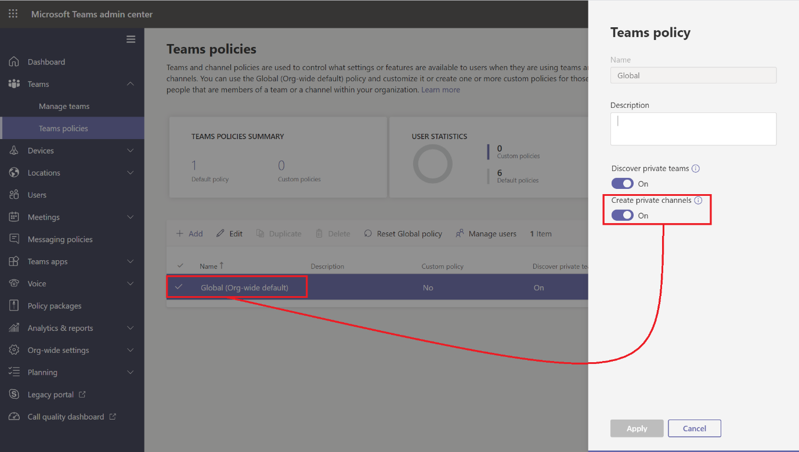

- A nivel de un Team concreto, un usuario de tipo propietario puede deshabilitar que los miembros pueden crear canales privados quitando los permisos correspondientes:

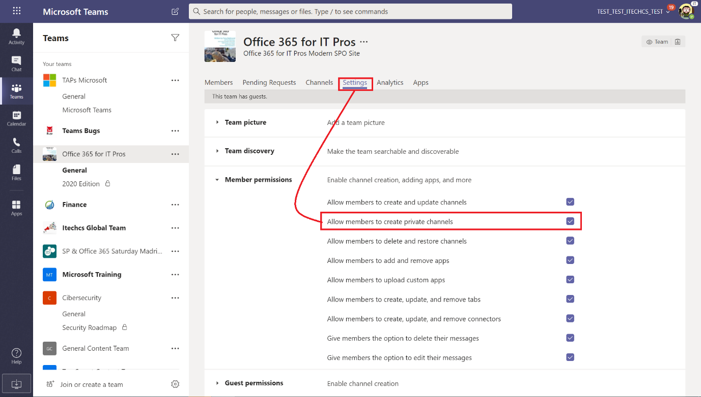

Para crear un Canal Privado, un propietario o miembro del Team (**Nota:** Los usuarios invitados no pueden crear canales privados) únicamente tiene que seguir el siguiente proceso:

- A través de las opciones de menú a nivel de Team, hacer clic en la opción para crear un nuevo canal:

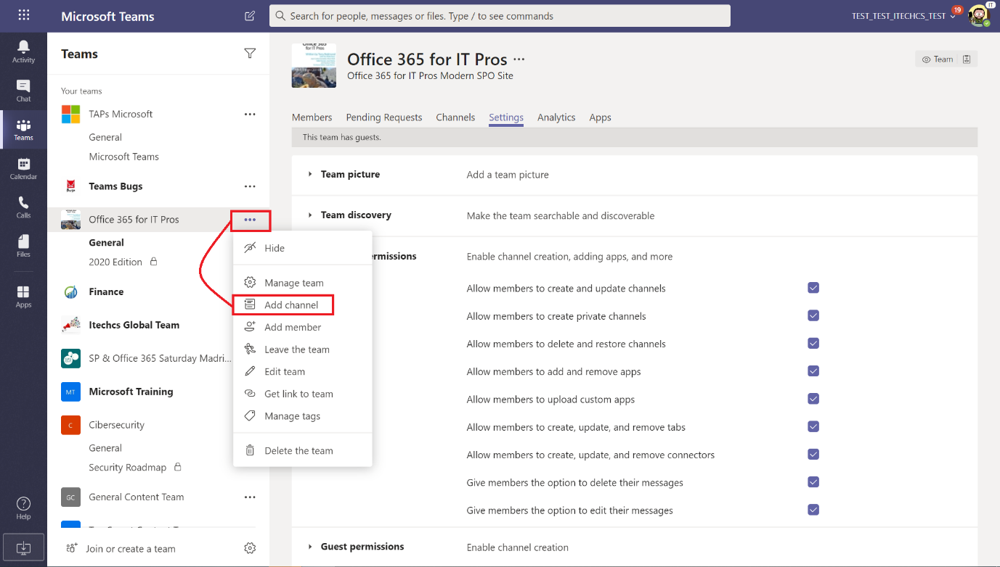

- En la ventana de creación del canal, se tiene que indicar un nombre, opcionalmente una descripción y a continuación el tipo de canal a crear. En este caso, elegiremos privado como tipo de canal a crear y hacemos clic en Siguiente (Next). Hay que tener en cuenta que una vez una Canal se crea como Privado, no es posible posteriormente convertirlo en un Canal estándar.​

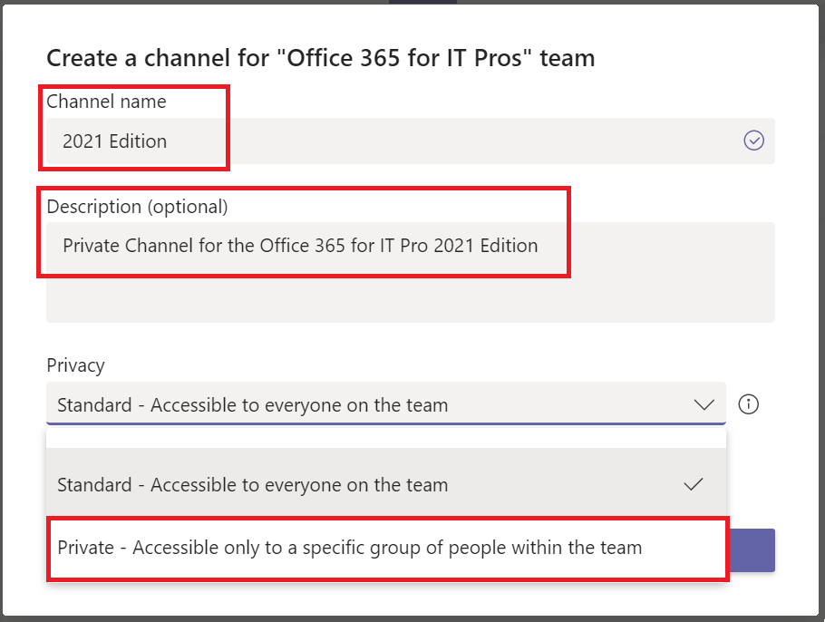

- A continuación, de forma opcional podemos indicar los integrantes del Canal Privado que pueden tener tres roles al igual que sucede en un Team: Propietarios (Owners), Miembros (Members) o Invitados (Guests). Cualquier integrante que añadamos tiene que ser también integrante del Team, es decir, no es posible añadir otros usuarios que no formen parte del Team.

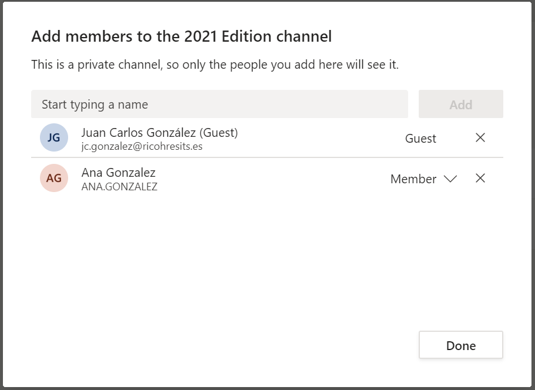

**Nota**: El número máximo de integrantes de un Canal Privado es de 250.

- Una vez el Canal Privado se crea, aparece como un Canal más en el Team, pero identificado con un candado.

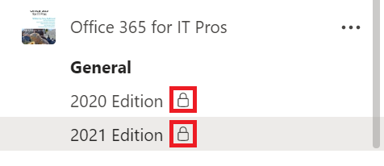

**Administración de un Canal Privado**

Los Canales Privados, como los estándares, cuenta con sus propias funciones de administración. Para acceder a estas funciones:

- Hacemos clic en los "…" al lado del nombre del Canal Privado o bien hacemos clic con el botón derecho del ratón.
- En el menú contextual que se abre, hacemos clic sobre "Administrar canal" (Manage channel):

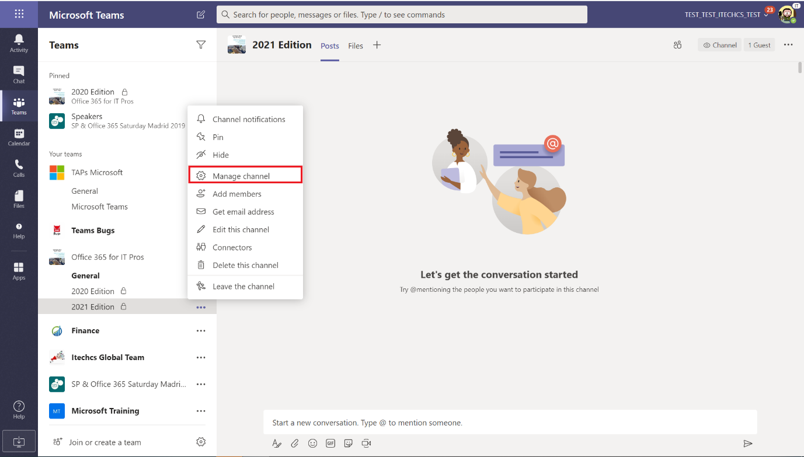

- La sección de Integrantes (Members) muestra todos los usuarios del Canal Privado y permite añadir nuevos usuarios.

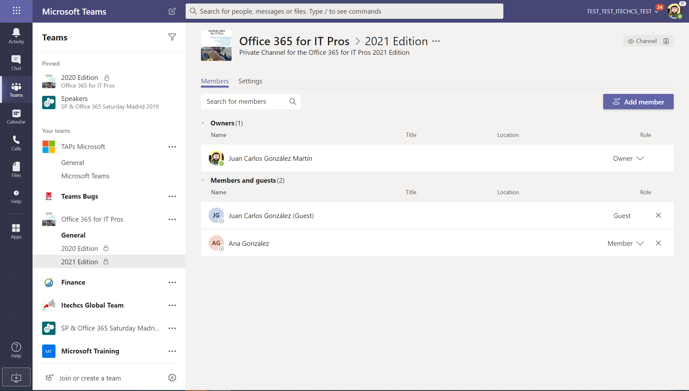

- La sección "Settings" muestra las configuraciones relativas al Canal Privado en cuanto a permisos de integrantes, si se permite mencionar al canal con "@" y configurar el material divertido en las conversaciones que tengan lugar en el Canal Privado.

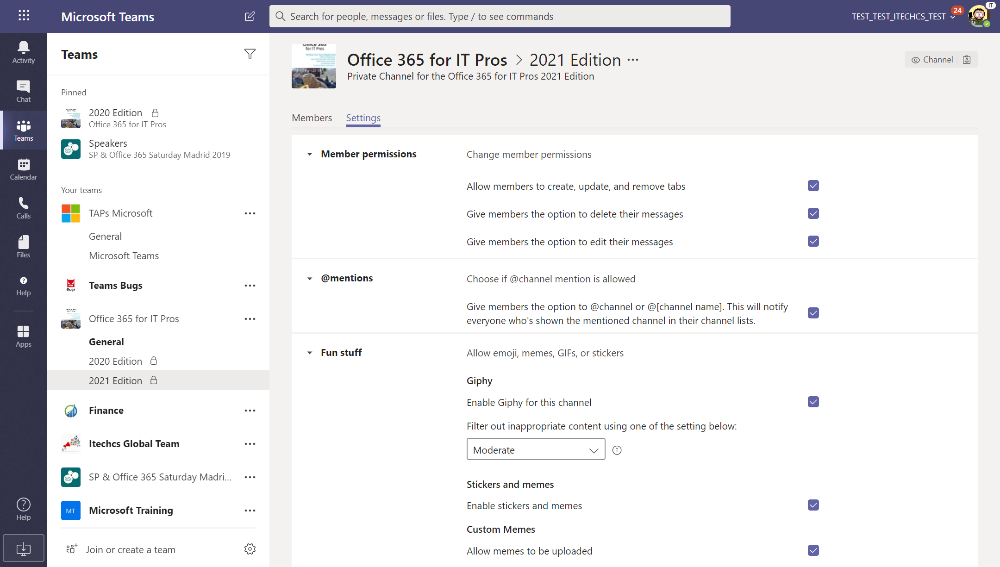

**Aplicaciones en Canales Privados**

En los Canales Privados, al igual que en los estándares, se pueden añadir Aplicaciones de Teams. En concreto:

- Se pueden añadir Conectores y Pestañas (Tabs).
- No es posible por el momento añadir Bots o Extensiones de Mensajes.

Las Aplicaciones que se pueden añadir en un Canal Privado se tienen que haber instalado primero en el Team al que pertenece. Por ejemplo, para añadir una nueva Pestaña en un canal privado hacemos clic en la acción "+" de forma que se muestra la ventana con las Tabs que se pueden instalar en el Canal:

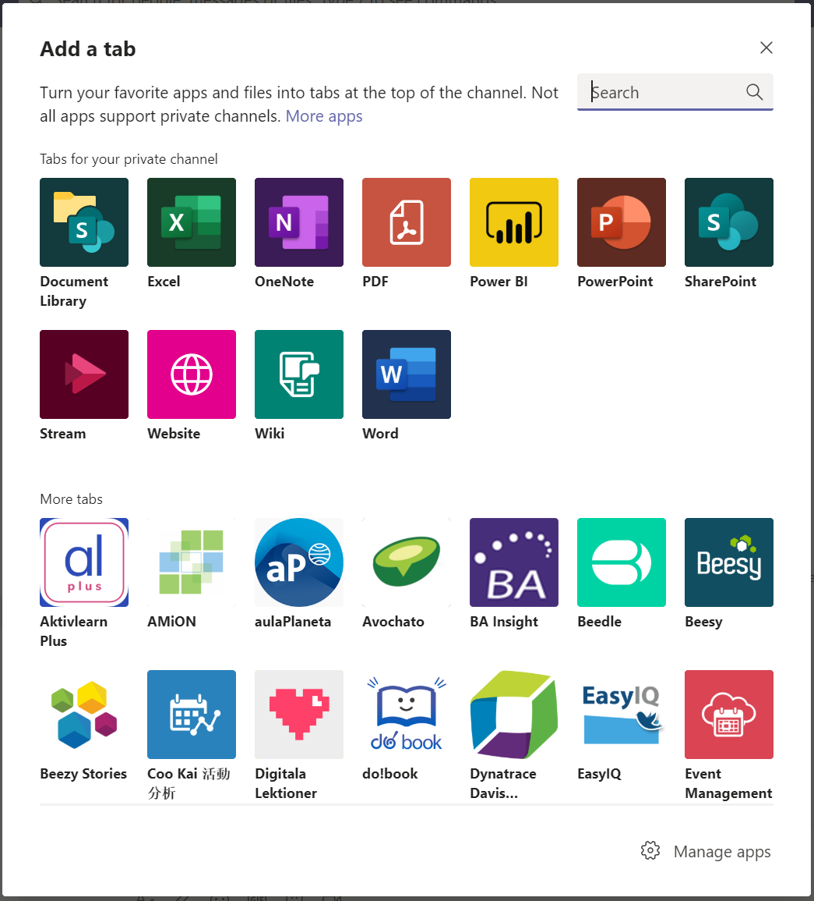

**Nota**: No todos los tipos de Tabs que se pueden añadir a un Canal Estándar se pueden añadir a un Canal Privado. Por ejemplo, por el momento no es posible añadir un Plan de Planner como pestaña de un Canal Privado.

**Gestión y Almacenamiento de Archivos en Canales Privados**

Los Canales Privados, como los estándares, permiten que se puedan almacenar todo tipo de documentos, estructurarlos en carpetas y en general sacar partido a la integración de SharePoint Online con Microsoft Teams.

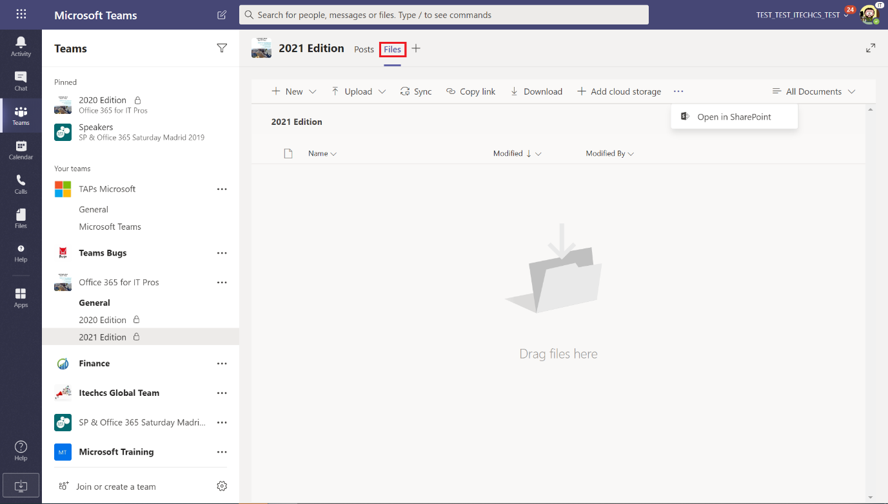

Ahora bien, los archivos en un Canal Privado se gestionan de forma diferente a los archivos de un Canal Estándar ya que cada Canal Privado cuenta con su propio Sitio de SharePoint que tiene las siguientes características:

- La URL del Sitio es de la forma /sites/&lt;Nombre del Team&gt;-&lt;Nombre del Canal Privado&gt;.
- Los Sitios de Canales Privados se crea con una plantilla de sitio específica: TeamChannel#0.
- Los Sitios de Canales Privados no se muestran en el Modern Admin Center de SharePoint Online.
- A los Sitios de Canales Privados se les pueden añadir nuevas Listas y Bibliotecas, pero no se soportan en cambio páginas modernas.

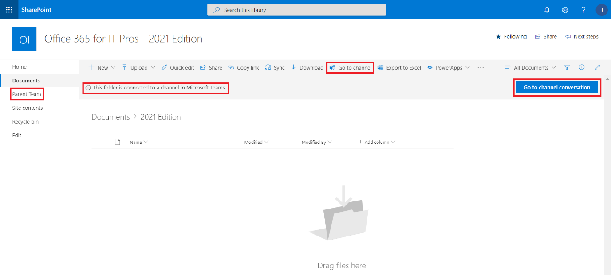

- Desde la Biblioteca del Canal Privado se puede acceder a las conversaciones del Canal y desde la navegación del Sitio se puede acceder al Sitio del Team al que pertenece el Canal Privado.

**Conclusiones**

Los Canales Privados en Microsoft Teams permite que parte de los integrantes de un Team puedan disponer de un espacio privado de colaboración y en el que trabajar con información confidencial sin riesgo a que otros usuarios del Team padre (incluyendo Propietarios) puedan acceder y visualizar su actividad. En un Team se pueden crear hasta 30 Canales Privados y en cada Canal Privado podemos tener hasta 250 integrantes. Los Canales Privados se pueden extender con Aplicaciones y cada vez que se crea un Canal Privado, se crea una Colección de Sitios para almacenamiento y gestión de la documentación del canal.

**Juan Carlos González Martín**  
Office Apps and Services MVP | Office 365 SME  
@jcgm1978