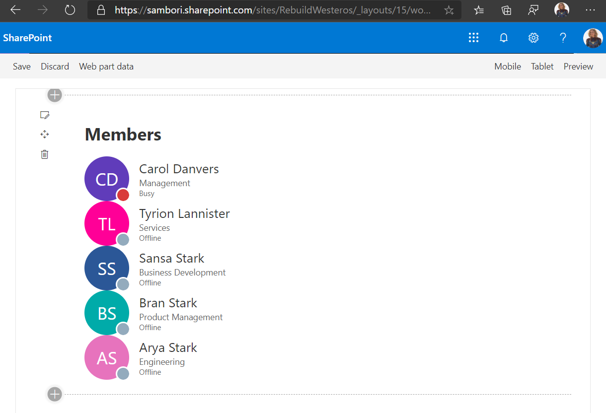
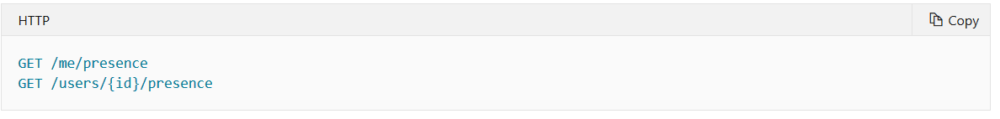
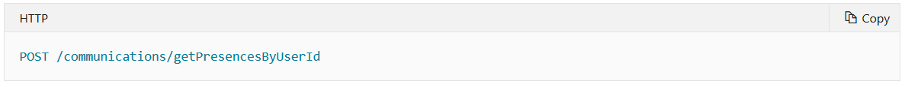
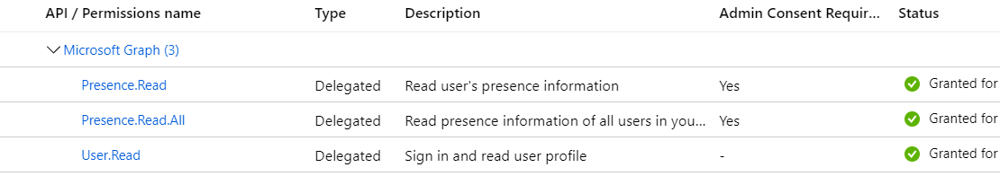
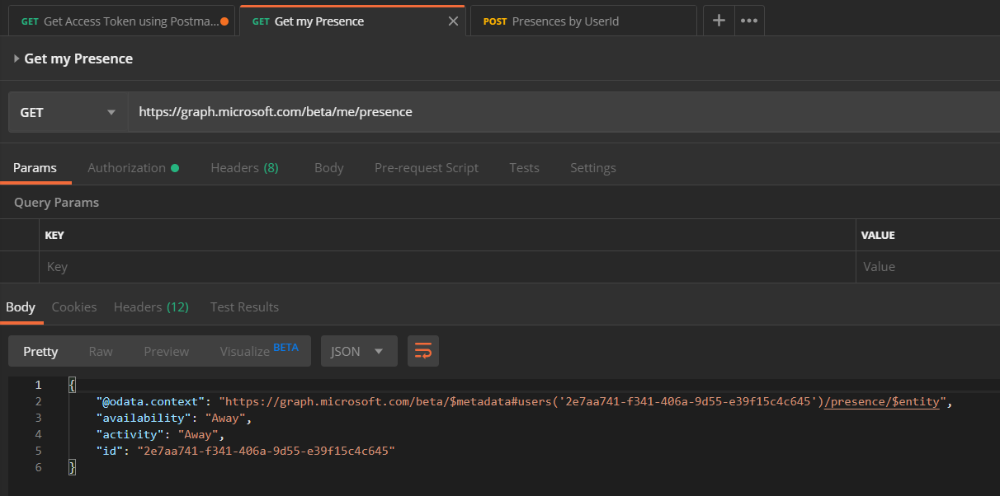
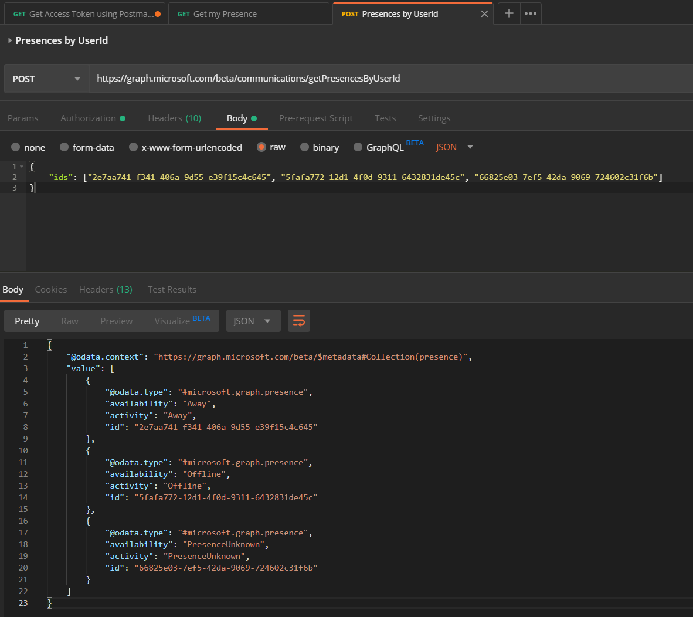
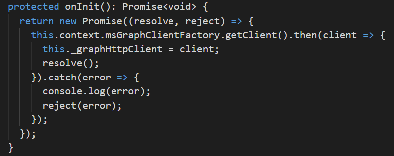
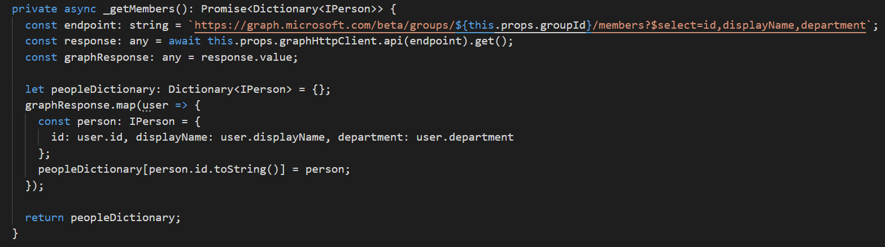
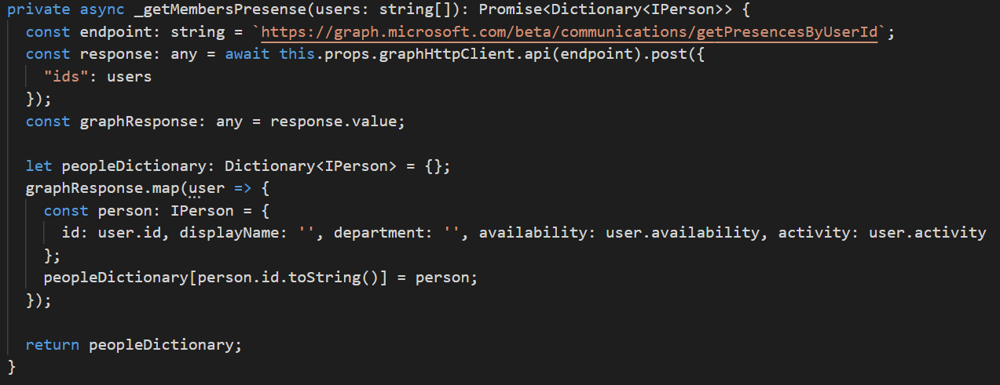
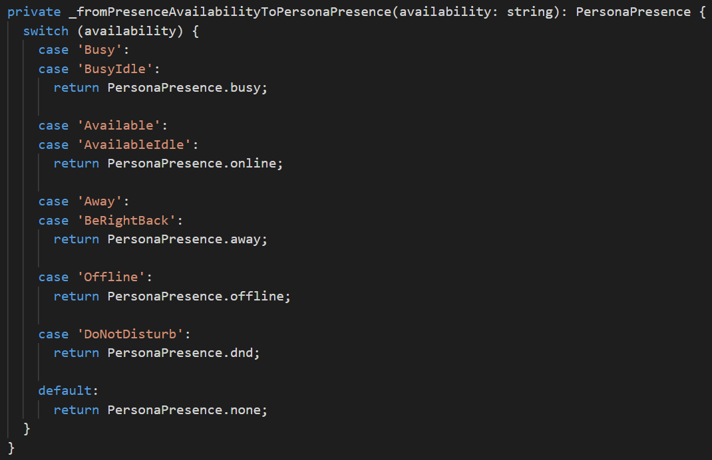

El pasado mes de diciembre, el equipo de Microsoft Graph, anunció la preview de un nuevo Endpoint de Presencia, que como podéis imaginar, nos va a proporcionar la información de Presencia de uno o varios usuarios. Podéis ver el anuncio en el siguiente vinculo:

[https://developer.microsoft.com/en-us/graph/blogs/microsoft-graph-presence-apis-are-now-available-in-public-preview/](https://developer.microsoft.com/en-us/graph/blogs/microsoft-graph-presence-apis-are-now-available-in-public-preview/)

Con este nuevo endpoint, podemos mostrar información de presencia en otras aplicaciones de negocio, o, como veremos en el ejemplo de este artículo, en un sitio de SharePoint, usando un WebPart desarrollado con el SharePoint framework (SPFx). Podéis ver el resultado de esto en la siguiente imagen:

**Llamando el Endpoint de Presencia desde Postman**

Antes de entrar en detalle con el código de nuestro WebPart, vamos a ver cómo tenemos que invocar el endpoint de presencia, y qué tipo de información nos va a retomar. Para ello, vamos a utilizar Postman.

Existen 2 endpoint de Presencia, el primero de ellos, nos va a dar la información de presencia de un usuario concreto, o nuestro propio usuario:

El segundo, seguramente el que más utilizaremos en nuestras aplicaciones, nos va a permitir sacar la información de presencia de un listado de usuarios.

Para usar Postman con la MS Graph API, os recomiendo que utilicéis la colección de postman que el equipo de producto mantiene en el siguiente repositorio de GitHub:

[https://github.com/microsoftgraph/microsoftgraph-postman-collections](https://github.com/microsoftgraph/microsoftgraph-postman-collections)

Una de las peticiones de dicha colección, nos permitirá sacar un AccessToken para poder llamar a los diferentes endpoints, en nuestro caso los de presencia. En el readme del proyecto, tenéis como podéis configurar el entorno de Postman, para poder obtener un AccessToken para vuestra Tenant de Office 365. Básicamente, necesitaréis registrar una App en vuestro Azure Active Directory, crear un Secret, y dar permisos a la app para el endpoint de presencia:

Una vez obtenido el AccessToken, ya podemos llamar al endpoint de presencia.

**Request / Response Información de Presencia del usuario logado**

Para obtener la información de presencia del usuario logado, haremos:​

Como podéis ver en la imagen anterior, la respuesta con la información de presencia consiste en el Identificador del usuario, y dos campos más:

- **Availability**: este es el típico: Away, Busy, etc. Según la documentación, los posibles valores a día de hoy son: Available, AvailableIdle, Away, BeRightBack, Busy, BusyIdle, DoNotDisturb, Offline, PresenceUnknown.
- **Activity**: Información adicional a la availability del usuario. Posibles valores: Available, Away, BeRightBack,Busy, DoNotDisturb, InACall, InAConferenceCall, Inactive,InAMeeting, Offline, OffWork,OutOfOffice, PresenceUnknown,Presenting, UrgentInterruptionsOnly.

**Request / Response Información de Presencia varios usuarios**

Para obtener la información de presencia de un listado de usuarios, debemos hacer un POST al endpoint /beta/communications/getPresencesByUserId, y enviar en el body la lista con los IDs de los usuarios.

Si nos fijamos en la respuesta, vemos que obtenemos la misma información que con el endpoint anterior, pero para cada uno de los usuarios solicitados.

Nota: si en el listado de usuarios incluimos algún usuario que no existe en el directorio, lo que obtenemos como información de presencia es la availability y activity con valor "PresenceUnknown".

**Invocando al endpoint getPresencesByUserId desde un WebPart SPFx**

Ahora que ya tenemos claro el tipo de petición que debemos hacer para obtener la presencia de varios usuarios, y el tipo de información devuelta que tendremos, ya podemos llamar al endpoint desde SPFx, y mostrar sus resultados.

Para ello, al ser endpoint de MS Graph API, haremos uso del propio MSGraphClient proporcionado por el framework SPFx. Como lo que queremos es sacar la presencia de todos los usuarios que forman parte de un site de SharePoint, primero necesitamos sacar los usuarios de dicho site, también llamando a Graph.

Antes de nada, en el OnInit del WebPart, utilizaremos el objeto msGraphClientFactory para obtener el MSGraphClient

Dicho cliente será pasado al componente de React, que hará todo el trabajo 😊.

Primero obtendremos los miembros del site con el siguiente método:

Básicamente llamamos a Graph, y el resultado lo metemos en un diccionario, para posteriormente, actualizar cada usuario del diccionario con su información de presencia.

Con cada usuario, componemos un array de IDs, y llamamos el endpoint para sacar su información de presencia:

Finalmente, en el render del componente React, utilizamos el control Persona del Office fabric UI ([https://developer.microsoft.com/en-us/fabric#/controls/web/persona](https://developer.microsoft.com/en-us/fabric#/controls/web/persona)), que nos permite renderizar detalle de usuarios, y que además ya tiene algo para poder sacar la típica bolita con la availability del usuario sobre su avatar:

Finalmente, la función *\_fromPresenceAvailabilityToPersonaPresence*, hace un simple mapeo entre la información de availability que viene de la API, y las opciones que ofrece el componente Persona (que a día de hoy no tienen un mapeo uno a uno)

Tenéis todo el ejemplo completo en el repositorio de GitHub del PnP

[https://github.com/SharePoint/sp-dev-fx-WebParts/tree/master/samples/react-members-with-presence](https://github.com/SharePoint/sp-dev-fx-webparts/tree/master/samples/react-members-with-presence)

¡Hasta el próximo artículo!

**Luis Mañez**  
Cloud Architect en ClearPeople LTD  
 @luismanez  
 [https://medium.com/inherits-cloud](https://medium.com/inherits-cloud) 
 
import LayoutNumber from '../../../components/layout-article'
export default LayoutNumber
