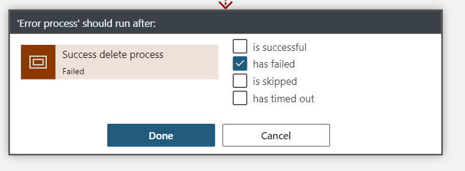

​Los procesos complejos basados en estados, podemos en un alto porcentaje de casos expresarlos como una máquina de estados o máquina de Moore. Si no recordamos mal una máquina de Moore es un autómata de estados, que nos indica que una salida depende de su estado, y que el siguiente estado depende del estado anterior y de la entrada producida.

¿Qué tipo de procesos podemos expresar con una máquina de Moore?, pues así de primeras podríamos pensar en Procesos de Aprobación que conlleven la interacción de varios usuarios y fases, el seguimiento de un pedido, un proceso de compra…, infinidad de casos que podemos pensar y plantear como una máquina de estados.

**¿Por qué Logic App? Definición de un proceso**

Logic App es un servicio que nos va a facilitar la vida para construir nuestros procesos basados en estados, ya que nos va a evitar realizar mucho trabajo y mucho código, si comparamos con elegir un desarrollo a medida con Azure Functions o un API de backend.

Dado que Logic App es un servicio pensado para diseñar e implementar procesos basados en "Eventos" y "Acciones", podemos empezar a revisar las herramientas y características que tenemos para poder definir nuestra máquina de estados, pero teniendo claro que vamos a hablar de un proceso con la siguiente pinta:

Nuestro proceso va a constar de "4" fases, por ejemplo, y se va a basar en un proceso de Aprobación genérico, que bien podemos por ejemplo usar para procesos de aprobación de documentos en SharePoint, para construir un proceso de aprobación de Vacaciones o la contratación de un servicio por un cliente en un CRM.

Debemos pensar que necesitamos:

- Poder controlar el inicio del proceso, y puesta de este en "Draft".
- Poder controlar la lógica de negocio a "ejecutar" en cada uno de los estados, y por tanto controlar de alguna forma cuando inicia y termina una fase.
- Controlar las entradas a una "fase" y las salidas, para saber solo si el resultado de esta fase es "OK", para poder pasar a la siguiente.
- Poder decidir cuándo concluir el proceso.
- Poder relanzar el proceso si se produjera algún error.

**¿Cómo lo podemos construir?, manos a la obra**

Lo primero tenemos que diseñar un proceso que simule nuestra máquina de estados y para ello necesitamos definir tres puntos:

- Arranque del proceso.
- Lógica de gestión de estados.
- Finalización del proceso.

**1. Inicio del proceso**

Podemos iniciar el proceso con varios tipos de Acciones de "desencadenamiento" en Logic App para este tipo de procesos:

- Http Action: Esta opción, es la más sencilla de implementar, ya que nuestra Logic App va a exponer un endpoint Http, al cual podemos hacer peticiones Post o Get, pasándole todo lo necesario para arrancar el proceso.
 Lo malo es que estamos "haciendo" una llamada punto a punto desde el origen del evento, y estamos metiendo una dependencia en origen, es decir si vamos a usar nuestro proceso desde Teams por ejemplo, ya debemos recoger la URL de nuestra Logic App y tener en cuenta una gestión de entornos (la URL va a cambiar), si cambiamos la Logic App a futuro debemos re-adaptar nuestra solución cliente…; demasiadas cosas a tener en cuenta, opción directa y efectiva pero que esconde oscuros mantenimientos, ya que además tendríamos que hacer llamadas async, y muy posiblemente llegar un control de la finalización del proceso con un patrón polling o con tablas en BBDD para controlar si se ha iniciado el proceso de forma correcta o no.

- Desencadenador por Webhook: En el artículo anterior hablamos de las ventajas de usar clientes Webhook y en concreto las acciones que nos aportan Logic App. Tiene la ventaja de que es un patrón por suscripción y evitamos los patrones polling y gestionar llamadas Async desde el cliente a nuestra Logic App.

Es una opción bajo mi punto de vista más limpia que la de Http Action, y con menos problemas, pero ¿Qué pasa si nuestro cliente no consigue enviar el evento Webhook de forma correcta? ¿Cómo nos aseguramos de que el proceso se ejecute de forma correcta?

Webhook es un patrón más efectivo y estable para este tipo de llamadas que igual pueden durar días o semanas, pero igualmente la aplicación cliente va a tener que llevar no uno sino dos endpoint, el de "envió del evento al cliente webhook", y el de "desuscripción al mismo".

- ​Trigger desde una Cola: Si hemos escogido una de las dos primeras opciones, tranquilo te va a funcionar, y si tenemos en cuenta los "**Warning**" que he ido relatando tendrás un control de arranque de tu proceso perfecto. Pero ¿Y si usamos una cola de procesos?, es decir si nuestro cliente por ejemplo cuando quiera iniciar el proceso, deja en una cola de peticiones una del tipo "inicio proceso", con un Identificador de este, podríamos controlar de forma directa con un pequeño **Trigger** o incluso añadiendo Event Grid si el volumen lo pidiera el inicio del proceso en Logic App.

Nuestro flujo va a evaluar una cola de procesos, y cuando entre uno nuevo se va a ejecutar y va a coger el mensaje. Si por un casual esta Logic App falla, podemos controlar que el mensaje persista en la cola, para que un proceso posterior se reinicie, e incluso como veremos un poco más adelante si llevamos los estados de nuestra Logic App por base de datos podemos relanzar el proceso por donde se haya quedado anteriormente.

**2. Control de los estados, y llamadas a procesos de lógica de negocio**

Una vez hemos aclarado como iniciar nuestro proceso con una de las tres opciones, tenemos que ver cómo vamos a controlar "los cambios de estados", y como "ejecutar la lógica de negocio" de cada uno de los estados de nuestro proceso.

- **Acciones de control: Switch, Until y Condition:**Para poder controlar el estado en el que nos encontramos "Draft" o "Approved", debemos hacer uso de las Acciones de Control que nos aporta Logic App y que vamos a ir viendo poco a poco como incorporarlas a nuestro proceso basado en una máquina de estados.

Con la Acción "**Until**", vamos a controlar que el proceso no se detenga hasta que el "estado o el paso" no llegue a un estado de fin de flujo, o lo que en nuestro ejemplo es el estado Approved.

Toda acción que insertemos dentro de una acción Until, se va a ejecutar "N veces" hasta que la condición del estado sea igual a Approved, tal y como vemos en la imagen anterior. Esta acción viene a simular una instrucción "While", tal y como hacemos en C#.

Dentro de la acción Until, deberemos incluir una acción "Switch", que va a venir a darnos esa forma de "árbol de decisión", y que nos va a permitir posicionar el proceso en el estado correcto, y pasar al estado siguiente cuando termine el estado en curso.

Para nuestro Switch podremos añadir tantas "opciones" como estados queramos definir, en este caso tres para "Draft", "Pending Approval" y "Pending of Review".

Como vemos en la imagen superior, debemos definir una variable "step" o paso que va a llevar el estado del proceso actual, y en función de este valor se va a ejecutar la lógica que definamos para cada uno de los estados.

Antes de pensar en "que meter en cada fase o paso", debemos pensar ¿Cómo finalizamos el proceso? ¿Cómo pasamos a un estado siguiente?

Si volvemos al "diseño" genérico del proceso vemos que cada estado da una salida booleana de "Ok o Ko", y en función de eso pasamos por ejemplo de Draft a Pending Of Review.

Para conseguir esto debemos por un lado "definir una variable" de salida de cada fase para controlar si el estado ha terminado de forma correcta o no, y por otro lado Añadir un control de condición para saber si debemos pasar a un estado siguiente, o bien reiniciar el proceso o finalizarlo si fuera necesario, en nuestro caso veremos que he decidido que, si el estado no da una salida de OK, siempre reinicio a un estado draft.

​Una acción de "Condición", viene a ser un "If – else", y que nos va a permitir ejecutar un bloque de proceso u otro, como vemos en la imagen anterior.

Si nos fijamos en la imagen, yo he optado por llevar una persistencia del proceso en Common Data Service, donde voy guardando el estado del proceso, una pequeña auditoría de por dónde va…; y he optado por esta opción porque mi aplicación cliente como veremos en la propuesta de solución es una solución en PowerApps, y Common Data Service es una solución muy limpia y que se integra con todas las partes de forma nativa mediante un conector.

- **Llamadas Webhook a "procesos del estado":**Cada paso del proceso tiene una lógica de negocio, que puede ir desde pedir una aprobación a un usuario vía Outlook, a integrar un API de Backend y ejecutar múltiples procesos ...; en este sentido la imaginación y el coste es el límite. Nosotros nos vamos a centrar en "como" vamos a orquestar estos "subprocesos" y esta lógica desde nuestra máquina de estados. En este caso sí o sí, yo optaría por escoger llamadas Webhook a los subprocesos, con la Acción Http Webhook.

Si nos centramos en “**revisar el estado Draft**”, podemos ver que tenemos una llamada a nuestro proceso de la fase con una llamada Webhook, y esta acción se va a quedar esperando hasta que nuestro subproceso haya finalizado.

Esta acción Webhook, debe pasarle al backend del proceso de la fase, un "Call back Url" para que cuando termine su trabajo avise a nuestra máquina de estados y pueda continuar con las siguientes fases.

Cuando termina cada llamada Webhook, y por lo tanto el subproceso le remite el estado del subproceso al proceso principal y por lo tanto podemos evaluar con las condiciones si ha sido correcta la fase o no (salida del estado).

En mi caso, mi subproceso se "inicia" con una llamada de Http Webhook a un Azure Functions, y este Azure Functions almacena en una cola el Callback Url para que cuando termine los subprocesos relacionados a esta fase (podría haber uno o varios), podamos indicarle a la Logic App que debe pasar a evaluar la fase.

Imaginemos qué, por cada Paso, queremos lanzar "N procesos", para ello, la llamada Webhook va a hacer una suscripción a nuestra Azure Functions, y esta va a encolar la petición en una cola de procesos, haciendo algo muy parecido a la estrategia de inicio de la máquina de estados.

Por cada entrada en la cola, podemos tener escuchando tantos procesos como queramos, y ejecutar en paralelo todo lo necesario.

Usaremos nuevamente el servicio de Common Data Service, para poder llevar un control del estado del subproceso(s), y al término de esta fase, se indicará a la máquina de estados vía el Call back Url con una petición post, que puede empezar a evaluar la fase en curso y plantear la ejecución de la siguiente fase.

Volviendo a la máquina de estados, y en concreto al Estado "Draft" de ejemplo, veremos que debemos almacenar en una variable el resultado de la ejecución de la fase que nos ha enviado el subproceso y debemos establecer la siguiente fase que en este caso sería "Pending Of review".

Recordemos que este "Set variable" que vemos en la imagen, es una tentativa de cambio de estado, pero que debe ser validada por la salida de la fase con la acción de condición que nombramos antes.

Si el resultado del subproceso, que hemos almacenado en la variable "**webhook-result**", no es "**Approved**", deberemos mandar el proceso a un estado Draft y por el contrario almacenamos en el Common Data Service que el proceso cambia de fase.

**3. Finalización del proceso, control de errores y reintentos**

La última cosa que debemos tener en cuenta para dotar de funcionalidad completa a nuestra máquina de estados es diseñar como controlar los errores del subproceso o del propio flujo de Logic App, y aplicar un control de reintentos.

Si nos fijamos en la siguiente imagen, podemos dividir el proceso en 3 bloques:

- ***Inicio del proceso***: Recogemos la petición de inicio desde la cola de procesos e inicializamos las variables para controlar las entradas a cada fase y las salidas **(webhook result).**
- ***Ejecución de la máquina de estados***: Esta combinación de **Switch + Until**, para ir lanzando las llamadas a los subprocesos vía llamada al cliente **Webhook** que escojamos.
- ***Evaluación de cambio de fase***: Acción de condición, para ver si la fase ha sido aprobada o no.

Todos estos bloques los hemos englobado dentro de una acción de control que nos aporta Logic App y que se llama **Ambito o Scope.**

Esta acción permite simular un bloque **"try – catch"**, y capturar toda excepción y actividad que se produzca en el Scope de ejecución.

A este Scope que le podemos definir bloque de **"Acierto o Try"**, le podemos vincular un ámbito de captura de errores.

El segundo "**Scope**" lo vamos a utilizar para poder recoger las posibles excepciones del primer Scope "**Success delete process**". Si seleccionamos en la configuración de este Scope, podemos seleccionar la opción "Run-after". Como vemos en la imagen, hemos seleccionado que siempre que falle el Scope anterior, debemos ejecutar este, y solo en este caso.

En mi ejemplo, simplemente capturo el error en el proceso, y como estamos guardando el estado de este en Common Data Service, nos costaría muy poco desde la aplicación cliente relanzar el proceso con una simple inserción en la cola de procesos de entrada.

**Análisis global del proceso y de la solución**

A más alto nivel, y haciendo un poco de resumen tenemos una solución parecida a la siguiente imagen:

Haciendo un poco de resumen, tenemos que:

- **Aplicación Cliente:**Podriamos pensar en una solución cliente cualquiera, yo en mi idea de solución he planteado que PowerApp es una buena opción, para que deje en CDS la persistencia de cada petición y de cada proceso.
- **Máquina de estados: Control de fases e inicio de procesos:**Desde CDS o la tabla que elijamos para persistir los procesos debemos conectar nuestra Cola de procesos, en mi caso una buena opción es conectar un Azure Functions con una suscripción Webhook a CDS, y volver como salida todos los datos del proceso en la cola. De esta cola de procesos configuramos un Trigger de salto en nuestra máquina de estados, y con esto tenemos conectado el cliente con la máquina de estado, y si lo hacemos con Colas y Webhook, podemos deducir que encima en tiempo real.
- **Subprocesos y control de estos:**Cada subproceso lo debemos conectar a nuestra máquina de estado en Logic App con una cola de procesos y una suscripción Webhook, que consolidaremos con Acciones Webhook entre Azure Functions y nuestra Logic App máquina de estados. Cada subproceso con otro Trigger, conseguimos que se ejecute mediante una cola de procesos en un Blob Storage, y que estos procesos actualicen los estados directamente en una tabla de CDS (Common data Service). Por último, es pensar que va a hacer cada subproceso, en la imagen yo he incluido Outlook porque es un buen conector de Logic App para poder lanzar aprobaciones vía mail, pero esto ya sí que es 100% libre, es la idea de este artículo que cada uno adapte el proceso a sus necesidades.

**Conclusiones, ¿Cómo seguimos?**

Bueno este artículo, es 100% subjetivo por mi parte, y es una idea, más bien un ejemplo de que con Logic App podemos construir procesos complejos, que van mucho más allá de un pequeño flujo de integración, y que podemos perfectamente construir procesos empresariales complejos basados en estados.

¿Cuánto nos puede llevar implementar esto desde cero y a medida?, yo creo que la orquestación de estados, la integración y la persistencia de los procesos con Logic App, un sistema de Colas y una BBDD a elegir lo tenemos, y lo podemos conectar en pocas jornadas todo y dejarlo diseñado sin pasar por una implementación costosa.

Luego ya hay que pensar que cada subproceso puede ser más o menos complejo, y ahí puede entrar nuestro código a medida si fuera necesario o más Logic App si se van a basar en procesos de integración.

En conclusión, podemos decir y asegurar que Logic App ha venido para quedarse. En el artículo anterior vimos que podemos hacer llamadas Async complejas y hoy que podemos definir procesos duraderos y orquestados, y que sin duda si sabemos diseñar de forma correcta nos puede hacer diferenciales respecto a procesos a medida que en ocasiones son difíciles de monitorizar y encajar en organizaciones complejas.

**Sergio Hernández**  
Azure MVP​

 
 
import LayoutNumber from '../../../components/layout-article'
export default LayoutNumber
