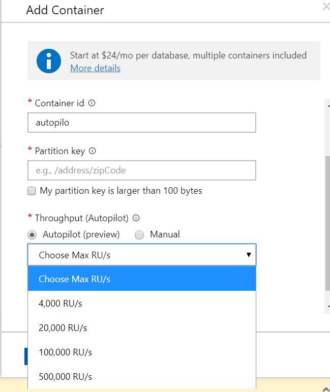

Cuando trabajamos con CosmosDB, una de las cosas que más cuesta ajustar es la cantidad de *throughput* que necesitamos. En muchas ocasiones te ves obligado a configurar las Requests Units per second (RU/s) por encima de lo que realmente necesitamos porque durante el 5% del tiempo necesitamos tener ese número de RU/s para dar servicio y el 95% de tiempo restante no lo necesitamos. Lógicamente esto hace que el coste de CosmosDB sea más alto de lo necesario por un 5%.

**CosmosDB Autopilot**

Para solucionar esta problemática, y no tener que hacer *workarrounds*, Microsoft anunció a finales del 2019 una nueva *feature* en CosmosDB llamada Autopilot. Autopilot escalará automáticamente de forma inmediata sin que nuestra aplicación se vea afectada y sin ningún tipo de interacción.

**¿Como funciona?**

Autopilot funciona con niveles. Se establece un nivel máximo, a nivel de *container* o base de datos el cuál no se quiere superar y Autopilot automáticamente escalará entre el 10%, valor mínimo asignado a CosmosDB con Autopilot, al valor máximo asignado. De momento hay algunos límites al seleccionar esta opción que son los siguientes:

- 4.000 RU/s – 50 Gb de Storage.
- 20.000 RU/s – 200 Gb de Storage.
- 100.00 RU/s – 1 TB de Storage.
- 500.00 RU/s – 5 TB de Storage.

**Ventajas**

Cuando usamos esta *feature*, una de las cosas que nos facilita es el no tener que gestionar la capacidad de nuestro CosmosDB de forma manual o tener aplicación que gestionen las RU/s. Aunque parezca mentira, una de las ventajas de Autopilot es su coste, ya que no pagas por las máximas RU/s seleccionadas sino solo por los recursos que la carga de trabajo necesite por hora, siempre teniendo en mente que el mínimo de carga es el 10% del máximo seleccionado.

Cuando un servicio escala automáticamente una de las características que necesitamos es que no haya caída del servicio cuando escala, otra de las ventajas de Autopilot es que escala sin problemas las RU/s que necesita sin que haya caída del servicio siendo totalmente transparente.

Con Autopilot se mantienen todas las características que ya trae CosmosDB por defecto.

**Casos de uso**

Cuando la carga que recibe tu CosmosDB es impredecible y muy variada, Autopilot te garantiza que dispondrá de los suficientes recursos para satisfacer la demanda de carga que se requiere. Otro caso de uso es cuando se pone una nueva aplicación en marcha, activando Autopilot puedes ver la cargar real de tu CosmosDB y ajustar las RU/s lo que realmente necesitas de una forma mucho más precisa.

**Habilitar Autopilot**

Cuando creas un nuevo container en CosmosDB tienes la posibilidad de seleccionar Autopilot:

**Cosas a tener en cuenta**

Al ser un servicio en *preview* tiene ciertas restricciones:

- Solo se puede habilitar vía portal, no se puede hacer todavía por API y por tanto no se puede añadir dentro de los pipelines de creación de infraestructura.
- Si seleccionas RU/s fijas, no puedes después cambiarlo a Autopilot, para hacerlo debes crear un nuevo *container* o *BBDD* y hacer una migración de datos. En cambio, si tienes RU/s fijas si puedes cambiarlo a Autopilot.
- La vinculación con *storage*, cada opción de Autopilot que existe va enlazada a un límite de *storage*, cuando pasas ese *storage* debes seleccionar la siguiente franja pagando más sin la necesidad quizás de tanto *storage*.

**Conclusiones**

Autopilot es una gran *feature* que a los que usamos CosmosDB como almacenamiento de datos nos va a simplificar mucho la vida y sobre todo la disponibilidad de nuestra BBDD. Pero aún está en *preview* y con algunas limitaciones importantes, por lo que habrá que esperar a la versión definitiva para poder explotar esta gran *feature*.

**Robert Bermejo**  
 Chapter Backend Lead in SCRM – Lidl Digital Hub| Microsoft Azure MVP  
bermejoblasco@live.com  
@robertbemejo  
www.robertbermejo.com  

