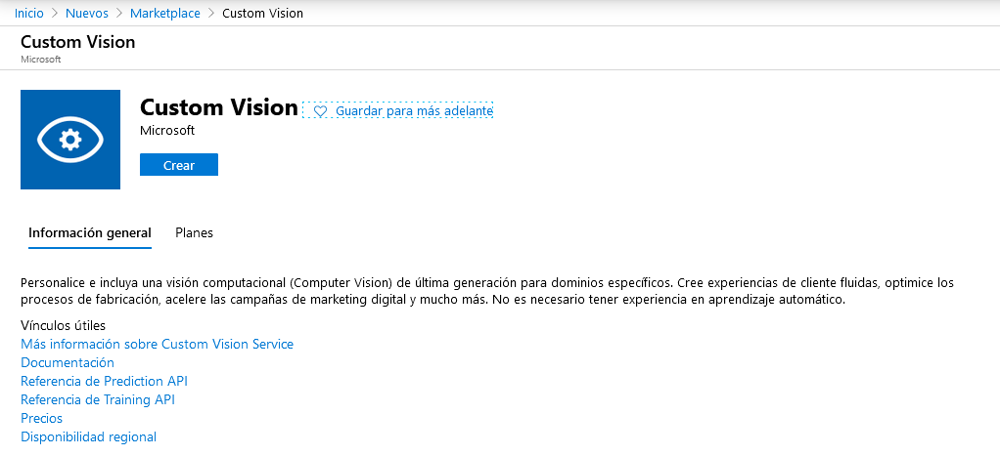
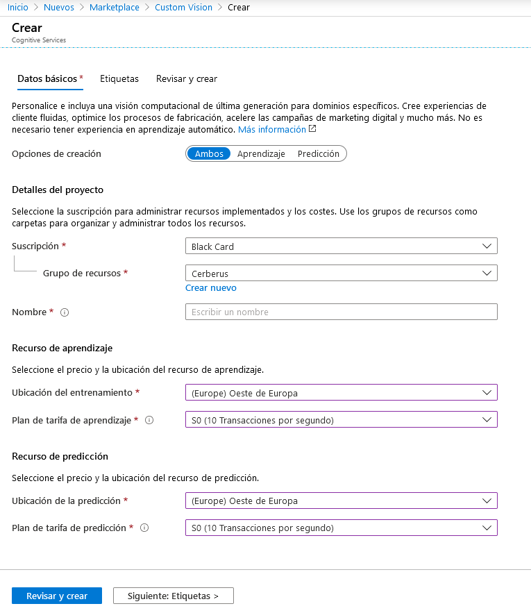
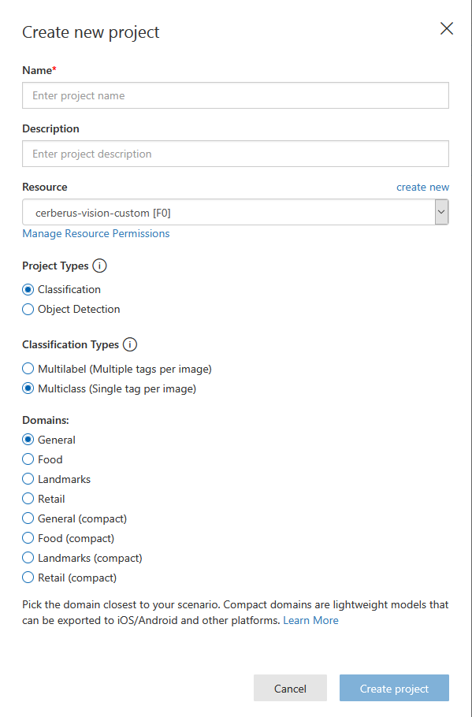
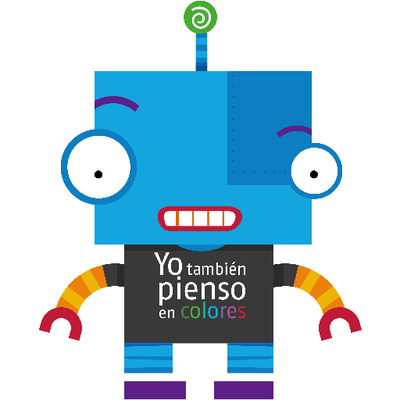
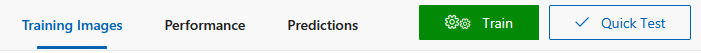
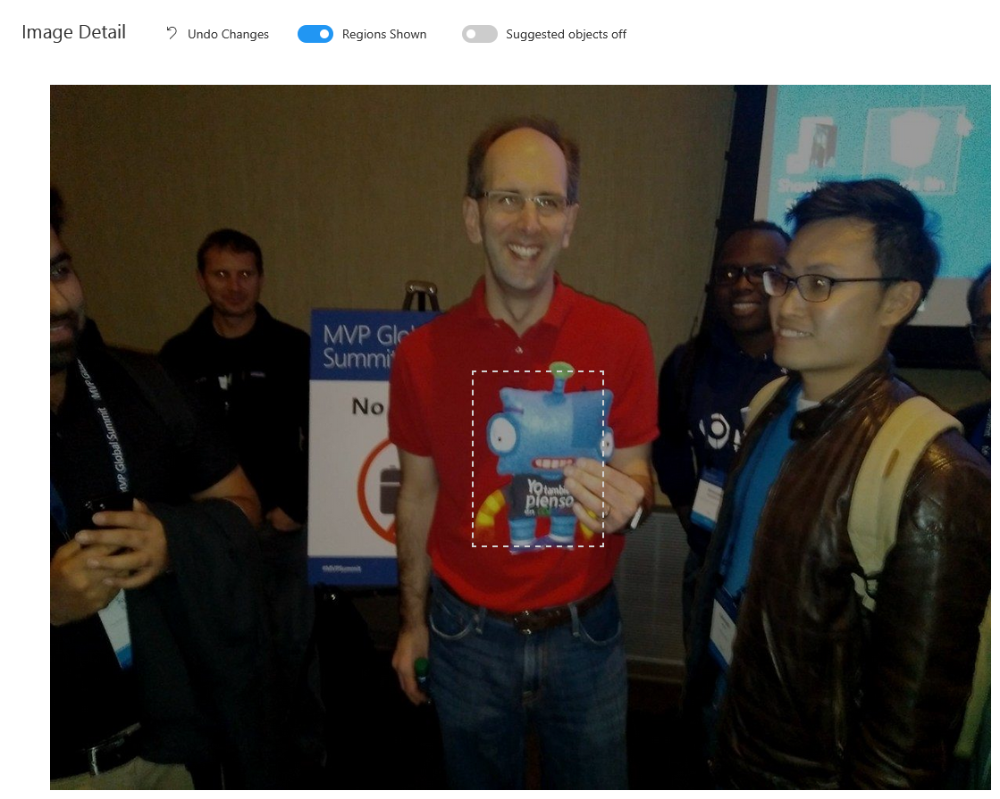
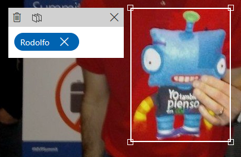
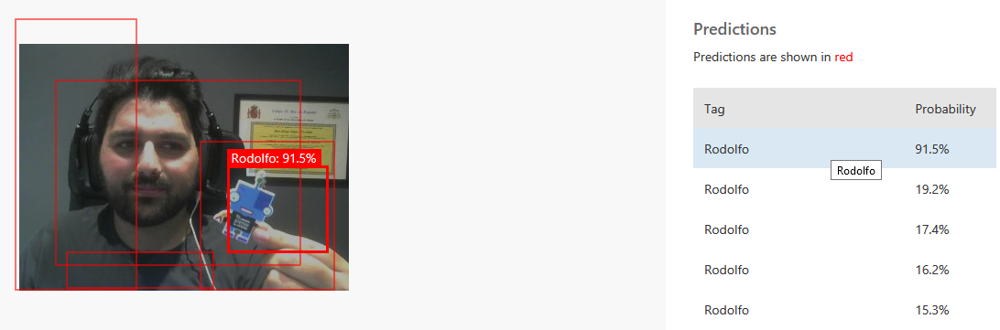
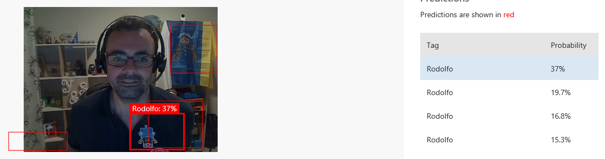
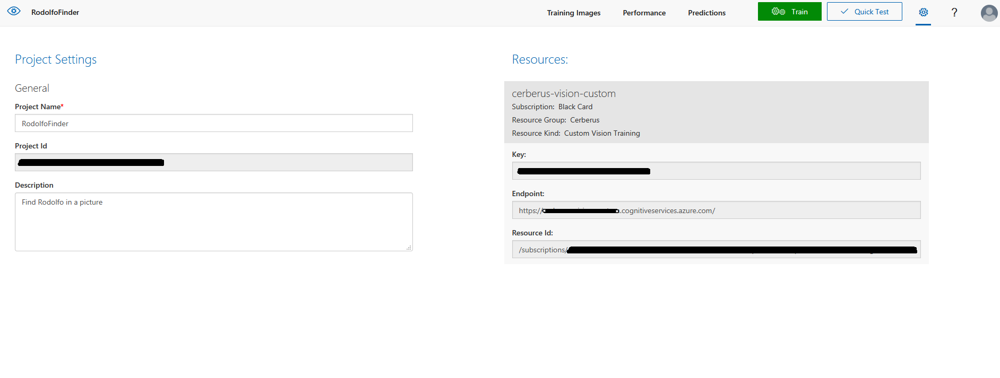

import ArticleHeader from '../../../components/article-header'

<ArticleHeader frontmatter={props.pageContext.frontmatter} />


​Dentro de los servicios cognitivos de Microsoft, en la categoría de visión podemos encontrar *Custom Vision*, sin duda un servicio muy interesante para reconocimiento de objetos dentro de una imagen. En los servicios cognitivos es posible reconocer objetos cotidianos como una bicicleta, un móvil o vehículos, pero para detectar un objeto concreto debemos entrenar un modelo. Primero debemos contar con una suscripción en Azure (recuerda que Azure ofrece unas cuentas trial para probar este servicio entre otros). Una vez en el portal de Azure crearemos un recurso *Custom Vision*, se puede localizar en el Marketplace a través del buscador o en el apartado *IA y Machine Learning*.



Le debemos indicar una suscripción, un grupo de recursos, el nombre que también será el dominio que aparecerá en el endpoint y planes y ubicación tanto del recurso de aprendizaje como de predicción. En la imagen aparecen planes S0 porque en mi caso ya tengo una cuenta en uso con el plan F0 (gratuito) y solo se permite una por suscripción.

Podríamos configurar el aprendizaje y la predicción en ubicaciones distintas, pero esta opción solo se me ocurre por motivos legales con los datos en los que el entrenamiento no debiese salir de una ubicación y la predicción debiese estar lo más cercana posible del usuario.



Una vez creado el recurso podemos trabajar con el a través de la API o de una manera más visual en [www.customvision.ai](http&#58;//www.customvision.ai/), en esta web usaremos el mismo usuario y contraseña que hemos empleado para el portal de Azure y nos reconocerá todos los recursos.  Es posible que se quede colgada refrescando sin parar con el mensaje de "Loading your accounts…", me ha pasado algunas veces dependiendo del navegador y puede ser debido a dos motivos:

- Un bloqueador de anuncios que este bloqueando alguna petición, mejor desactívalo para esta URL.
- Que no cargue correctamente los proyectos recientes, la URL intentará entrar a /projects?mostRecentDirectory simplemente dejándolo en /projects entrará sin problema y una vez dentro cargará los últimos proyectos.


Una vez dentro pulsaremos en *New Project* y nos aparecerá la siguiente ventana:



En ella indicaremos un nombre de proyecto, el recurso al que va asociado (el que creamos antes en el portal o podemos crear uno desde aquí) y el tipo del proyecto:

- Clasificación. Que etiquetará la imagen dentro de unas clasificaciones.
- Detección de objeto. Que buscará los objetos con el que lo hemos entrenado dentro de la imagen y sus ubicaciones.


En nuestro caso vamos a usar detección de objeto y por lo tanto no tendremos la opción *Classification Types*. El sistema nos proporciona unos dominios entrenados, como lo queremos para un objeto concreto personalizado elegimos la opción *General*. En nuestro caso vamos a entrenarlo para que detecte a Rodolfo, la mascota de ENCAMINA.



Y vamos a intentar que lo detecte en sus distintas modalidades de merchandising: muñeco plano, muñeco cuadrado, pegatina, llavero y ambientador. Una vez dentro del proyecto, en el menú nos encontraremos las siguientes opciones:



En ***Training Images*** veremos todas las imágenes con las que hemos entrenado el modelo, pinchando en ellas podemos ver los objetos localizados (en nuestro caso solo uno) y podremos usarlas de nuevo si queremos añadir nuevos objetos en el entrenamiento, nos da la opción de *Add images*.

Una vez subida la imagen de entrenamiento el sistema detectará algunos objetos dentro de ella, como se puede ver en este caso detectó que hay algo en la zona de Rodolfo.



Podemos emplear la selección que ha hecho la herramienta o hacer una nueva, en mi caso suelo hacer una nueva porque me parece importante que incluya la antena verde, creo que es un elemento común en todos los merchandising y muy característico.



Le daremos la etiqueta que hemos creado para Rodolfo. Un truco es que puedes usar la rueda del ratón para hacer zoom en el cuadro que has marcado para ampliarlo o reducirlo. La imagen pasa automáticamente a estar en el apartado de entrenamiento sin hacer nada más, si volvieses a subir la misma imagen te indicaría que es duplicada. En el apartado ***Performance*** entrenaremos las distintas iteraciones, podemos contar con 10 máximas tanto en el plan gratuito (F0) como en el de pago (S0). En este apartado contamos con dos variables:

- ***Probability Threshold*****.** Se trata de la probabilidad mínima para que una predicción sea válida al calcular la precisión.
- ***Overlap Threshold*****.** Porcentaje mínimo de solapamiento entre los cuadros delimitadores predichos y los declarados correctos para ser considerado una predicción correcta.


Podemos ir "jugando" con estas variables para obtener modelos más precisos, entiéndase que no es un tema de azar, si no que se trata de calcular cuál son los valores que necesitamos para nuestro modelo. En mi caso lo deje con los valores por defecto, *Probability Threshold* 50% y *Overlap Threshold* 30% por dos motivos: Primero, no llego a proporcionarle suficientes fotos para hacer un modelo serio (se trata de una demo) y segundo, que en mis demos suelo considerar que si se obtiene un valor superior al 50% lo considero correcto. Por lo general si lo detecta suele dar valores muy extremos y si no lo detecta valores muy similares normalmente cercanos al 40%, puede darse algún falso positivo cercano al 50-57%.

El último apartado en el menú es ***Predictions***, en este caso encontraremos peticiones de predicción realizadas contra la API y los valores que ha devuelto. Este apartado es muy interesante para obtener muestras de reentreno y ver con que tipo de objetos puede estar confundiendo al que nos interesa. En nuestro caso vimos que a veces confundía a Rodolfo con el reflejo de dos monitores en unas gafas y con la bandera de Canarias, imaginamos que por ser formas cuadradas azules con zonas amarillas. Hay que recordar que nuestro modelo solo esta entrenado con unas 22 fotografías y se recomienda no hacerlo con menos de 50, además de que no es siempre el mismo objeto, si no que se tratan de 5 formas distintas del mismo objeto lo que aporta más complejidad al reconocimiento. Se podría hacer que reconociese cada tipo de objeto por separado.

Una vez cargadas las fotos de entrenamiento solo tenemos que pulsar el botón ***Train*** del menú y seleccionar una de las dos opciones:

- ***Quick Training***, para un entrenamiento sencillo.
- ***Advanced Training***, para un entrenamiento más intensivo y completo. En esta modalidad se indica una **duración máxima** del entrenamiento entre 1 y 24 horas, se te facturará por el tiempo de entrenamiento.


Aquí puedes ver el resultado para un entrenamiento rápido de un caso de éxito y un fracaso.



**Código**

***Custom Vision*** proporciona un SDK para C#, Go (1.8+), Java (JDK 7 u 8), JS (NodeJs 8+) y Python (2.7+ o 3.5+), aunque hay que recordar que se trata de una API, por lo que puede ser usado por cualquier lenguaje. En este caso explicaré lo básico del SDK de C#.

*Custom Vision* tiene dos apartados, *Prediction* y *Training* que considero bastante descriptivos. En nuestro caso solicitamos al *Custom Vision* el cliente predictivo proporcionándole una *ApiKey* y un *Endpoint*. En el caso de la *ApiKey* la obtenemos en el apartado *Performance* pinchando sobre la iteración que queremos emplear (debe estar publicada) y en el botón *Prediction URL* nos proporciona la Key y otras particularidades de la petición. El *Endpoint* lo encontramos en el apartado de configuración (icono de rueda dentada a la derecha del menú).





A esta API podemos enviarle una URL de una imagen o la propia imagen. Una vez contamos con el cliente predictivo llamaremos al método ***DetectImagen*** que necesita *ProjectId* (en el apartado de configuración), un *publishedName,*que se trata del nombre de publicación de la iteración (podríamos tener varias con el mismo nombre, pero solo una publicada en cada momento de forma que no fuese necesario modificar el código y se podría cambiar el modelo) y la imagen o URL. Esto nos devolvería una colección de predicciones con todo lo detectado y sus probabilidades. De esta forma el código quedaría de la siguiente forma:

```
var customVisionClient = new CustomVisionPredictionClient()
            {
                ApiKey = predictionKey,
                Endpoint = endpoint
            };
var result = client.ClassifyImage(projectId, "{IterationName}", image);
foreach (var prediction in result.Predictions)
            {
                if (prediction.Probability > 0.5)
                {
                    return true;
                }
            }​
```

**Bola Extra**: Este cliente cuenta con otro método *ClassifyImageWithNoStore*, la diferencia es que no almacena la imagen dentro del apartado de *Predictions* y por lo tanto aporta mayor privacidad, su uso es igual que su versión con guardado.

**Diego Zapico** <br />
Consultor Informático