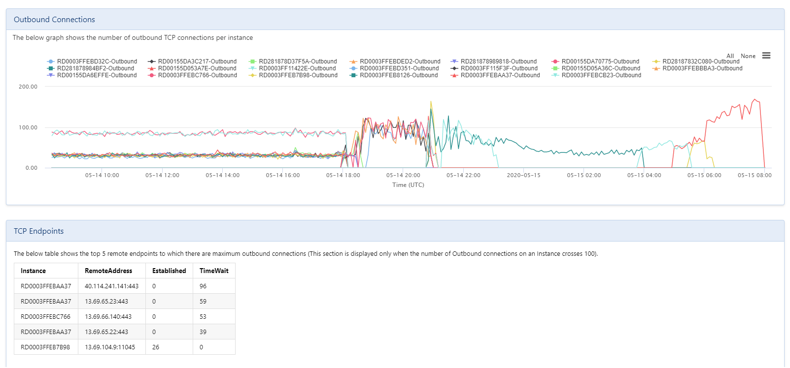

Todo empieza cuando te llaman porque han publicado [desescalapp.com](https&#58;//www.desescalapp.com/) en Azure y, de repente, aparecen **1000 usuarios concurrentes** usando las funcionalidades que has publicado.

*Esto no estaba previsto, no hemos podido dimensionar los servicios correctamente, ¿Qué hacemos? No podemos perder a los usuarios actuales, tenemos que seguir dando servicio y que todo funcione adecuadamente, pero no con los tiempos de respuestas que se estamos teniendo.*

Ante esta situación de éxito, lo más rápido e indoloro es que escales horizontalmente, o lo que es lo mismo, añade más nodos a tu aplicación para que pueda repartir la carga de trabajo entre todos los servidores que estén disponibles y así atender las peticiones de todos los usuarios.

A partir de este punto, tenemos los usuarios atendidos y podemos empezar a analizar la situación.

**Analizar el App Service**

Necesitamos ver los datos de uso, ver que CPU se está consumiendo, cuánta memoria RAM, cuántas peticiones por segundo, etc. Estos datos nos van a permitir elegir el dimensionamiento adecuado de la aplicación para los usuarios que están usando la misma.

Un [App Service](https&#58;//azure.microsoft.com/es-es/services/app-service/) es un servicio PaaS de Azure que nos permite publicar aplicaciones web decidiendo cuál es el escalado vertical (CPU y RAM) y el escalado horizontal (número de servidores).

La aplicación estaba configurada con servidores del tipo S1 y, analizando el uso de CPU, veíamos que era elevado para el número de usuarios que teníamos, unos 2.000, concurrentes.

La **memoria RAM** estaba por encima del 60%, no está mal, pero estábamos corriendo el riesgo de necesitar más nodos con el aumento de los usuarios que se estaba recibiendo.

Las peticiones eran bastantes elevadas, estábamos recibiendo 20.000 peticiones por segundo con una media de 2.000 usuarios, lo que implicaba un 10x con respecto a los usuarios.

**Optimizamos el App Service**

Teniendo en cuenta el modo de uso de la aplicación actual, fue necesario realizar algunos cambios necesarios porque el volumen de usuarios había aumentado considerablemente y no era factible tener 10 instancias (gracias a Espejo Público y a [Antena 3](https&#58;//www.antena3.com/noticias/tecnologia/desescalapp-la-aplicacion-que-te-ayuda-a-desescalar-durante-la-crisis-del-coronavirus_202005145ebd7717ee59440001be5ca9.html)) S1 de la aplicación, por dos motivos básicos, ya habíamos llegado al máximo de nodos y económicamente es un disparate para 3.000 o 4.000 usuarios.

La CPU es importante pero también el acceso a disco que es donde están todos los recursos web de la aplicación, hojas de estilos, imágenes, JavaScript, etc. Esto nos llevó a tener que escalar verticalmente a una instancia Premium que tiene mejor rendimiento de CPU y mejor rendimiento de lectura/escritura de recursos con discos SSD.

Los usuarios seguían aumentando y el cambio permitió llegar a picos de 20.000 usuarios concurrentes con cuatro instancias de P2V2. La CPU respondía correctamente, al igual que la RAM. ​

Cuando vez una gráfica de consumo como la anterior, es fácil identificar que exista un patrón de consumo, que no es necesario tener todas las instancias activas en momentos en los que desciende el número de usuarios. Para esto, lo ideal es configurar un escalado horizontal automático, es decir, que vaya aumentando o disminuyendo el número de instancias en función del consumo.

Con el ratio de peticiones por usuario que estábamos teniendo y analizando las dos gráficas, vemos una relación clara que nos llevó a configurar el autoescalado horizontal en base al uso de la CPU. El objetivo es que cuando la CPU se mantiene por encima del 85% durante un tiempo, añadimos una nueva instancia que permite atender al aumento de usuarios que se está produciendo, y al contrario cuando la CPU está por debajo del 60%.

**Configuraciones importantes en el App Service**

En el App Service tenemos ciertas configuraciones que nos permite adaptar el servidor web a la aplicación que estamos ejecutando. En este caso, configuramos lo siguiente:

- El stack tecnológico lo cambiamos de .NET para que se ejecute de forma nativa como aplicación .NET Core.
- La plataforma la cambiamos de 32 bit a 64 bit.
- La versión de HTTP la cambiamos a 2.0 que ofrece un mejor rendimiento que la versión 1.1.
- Deshabilitamos la afinidad de sesión de las cookies ya que no es necesario tener esta funcionalidad y mejora bastante el rendimiento para las aplicaciones sin estado como esta.
- Habilitamos la cache local de los recursos de la aplicación, esto es importante para que cuando tengamos más de una instancia de aplicación, no vaya a buscar los recursos al almacenamiento compartido y los encuentre en local en el servidor.

**Analizar la aplicación**

A partir de aquí, teníamos un sistema estable atiendo a muchos usuarios concurrentes, llegamos a tener unos 100.000 y el escalado que se configuró funcionaba correctamente, con algunos problemas de rendimiento en los momentos en los que estaba escalando, pero eso es normal y lo estuvimos ajustando unos días para no resentir mucho los tiempos de respuesta.​

Tocaba analizar la aplicación con el objetivo de optimizar el código y el uso de los recursos. Para eso, usamos el [servicio de diagnóstico](https&#58;//docs.microsoft.com/es-es/azure/app-service/overview-diagnostics) que está disponible en el App Service, analizando la disponibilidad y el rendimiento. Este servicio nos confirmó uno de los posibles problemas que estábamos teniendo con el número de peticiones y el uso de la CPU. Al parecer, teníamos un exceso de conexiones TCP que se podían reutilizar.

Los servidores tienen un [límite de conexiones TCP abiertas](https&#58;//azure.github.io/AppService/2018/03/01/Deep-Dive-into-TCP-Connections-in-App-Service-Diagnostics.html) y, aunque habíamos pasado de 1.920 a 3.968 conexiones con el cambio del S1 al P2, seguíamos con peticiones en cola y con la necesidad de tener más nodos (escalado horizontal) de los que deberían hacer falta para el número de usuarios concurrentes que teníamos.

Una buena oportunidad para mejorar el rendimiento, ¿qué conexiones se estaban haciendo desde la aplicación? La aplicación es una ASP.NET MVC Core que ofrece contenido al usuario en diferentes rutas con una única conexión a un SQL Server que tenía los datos donde se busca por código postal.

**Optimizamos la aplicación**

Si sólo teníamos conexiones TCP al SQL Server, estaba claro que se podía mejorar estas conexiones y reducir el uso de TCP usando un pool de conexiones, un patrón que permite reutilizar las conexiones TCP y no estar abriendo y cerrando conexiones por cada petición que se realice. Con Entity Framework es muy fácil hacer esta configuración, básicamente hay que configurar un DbContextPooling que se encarga de gestionar y reutilizar las conexiones al servidor.

Esta actualización nos permitió reducir el número de conexiones abiertas al SQL Server y mejorar entre un 10% y un 15% el consumo de CPU. Recordemos el tema de las peticiones, seguimos teniendo una ratio de 10x peticiones por usuario, un ratio bastante excesiva para la funcionalidad que la aplicación ofrece. ¿Cómo podemos optimizar y reducir estas peticiones? Más del 90% de las peticiones de la aplicación se realizan para obtener recursos web, básicamente para obtener las hojas de estilos, los JavaScript y las imágenes que acompañan al contenido.

Eso tiene fácil solución y [Azure tiene un servicio](https&#58;//azure.microsoft.com/es-es/services/cdn/) para esto que es usado por la mayoría de los sitios webs públicos, Content Delivery Network, CDN para los amigos. Este servicio nos va a permitir descargar de peticiones el servidor y que simplemente se realicen aquellas peticiones que son para cargar datos o nuevas páginas con datos, las imágenes, las hojas de estilos y los JavaScripts serán entregados a través de los servidores que los CDN tienen distribuidos por las redes globales, lo que, además, nos ayuda a mejorar el rendimiento en la carga de estos tipos de ficheros porque están cacheados en múltiples servidores cercanos a los usuarios. ​

La gráfica de peticiones ha cambiado drásticamente y, con el mismo número de usuarios concurrentes, refleja mejor el comportamiento de la aplicación. Es más, podemos ver en el siguiente gráfico como hemos conseguido también bajar el consumo de CPU, lo que nos va a permitir disminuir el escalado vertical con un tamaño de instancia más económico.

**Lecciones aprendidas**

No ha terminado el trabajo, sólo llevamos una semana monitorizando y optimizando los recursos para poder atender a la demanda de los usuarios. Parece que hemos identificado algún que otro patrón de consumo, pero en menos de una semana no es posible identificar todos estos patrones y vamos a tener que realizar alguna optimización más, aunque sea para dimensionar a la baja los servicios que estamos consumiendo. Tengamos en cuenta que estamos hablando de una aplicación que, apuesta por la labor social, no una empresa con buenos fondos económicos, por lo que la optimización del consumo de servicios es vital para no quedarnos sin presupuesto.

Lo habitual en este tipo de proyectos es realizar pruebas de carga para dimensionar correctamente los servicios y optimizar adecuadamente el código, pero es complicado conocer a priori el número de usuarios que van a usar tu aplicación por lo que cualquier prueba de carga que se hubiera realizado seguro que estaba fuera de la realidad y no íbamos a cumplir las posibles previsiones.

A nivel de código, hay que tener mucho cuidado con las conexiones TCP que realizamos, bien porque nos conectamos a servicios HTTP o, como en este caso, a servicios de base de datos como SQL Server. En la medida de lo posible, hay que implementar un patrón tipo pooling para estas conexiones, que nos ayude a reutilizar las conexiones abiertas y no intentar tener conexiones infinitas, ya que los servidores tienen sus límites.

Importante la utilización de servicios de CDN, además de mejorar el rendimiento en la descarga de los recursos estáticos, descargamos de peticiones al servidor web, lo que mejora el consumo de la CPU, lo que nos permite optimizar aún más el consumo de servicios, lo que supone bajar los costes.

Por último, no nos olvidemos de configurar adecuadamente el servicio donde hemos desplegado nuestra aplicación, un simple cambio de 32 bits a 64 bits, puede ser un buen ejemplo de mejora en el rendimiento.

**Alberto Diaz Martin**  
 MVP Azure  
 adiazcan@hotmail.com  
 @adiazcan  
[http://blogs.encamina.com/por-una-nube-sostenible/](http&#58;//blogs.encamina.com/por-una-nube-sostenible/)  

