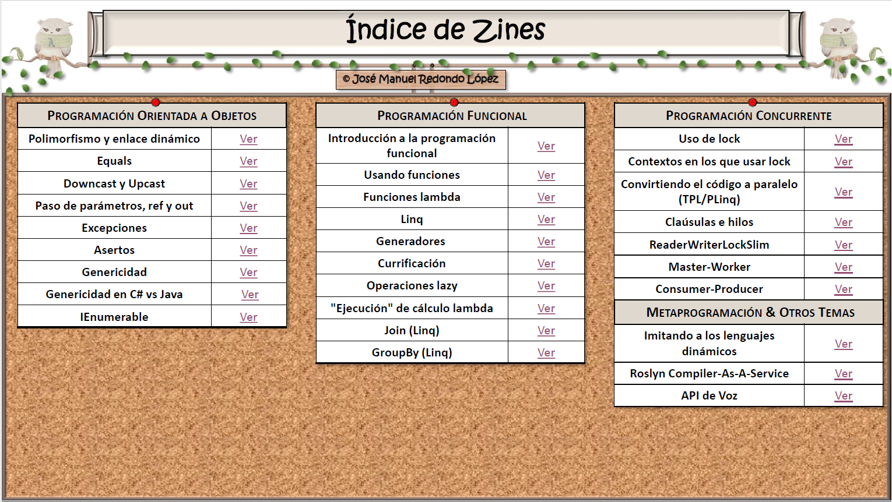
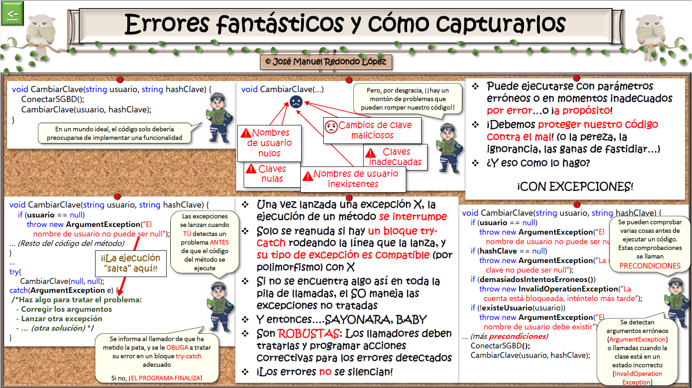
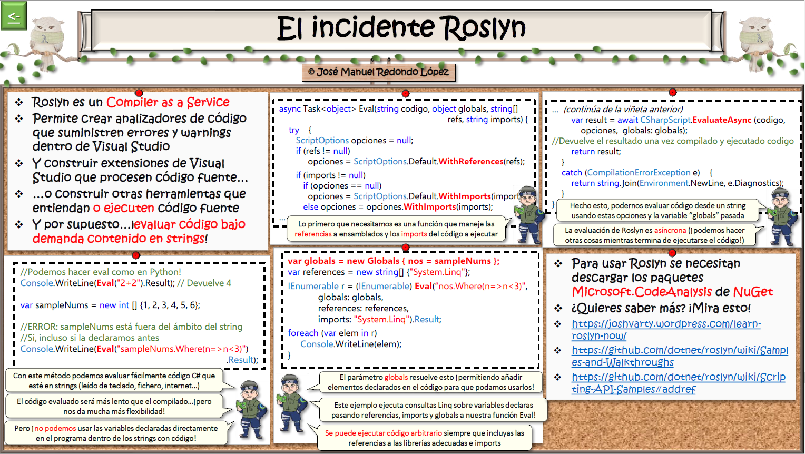
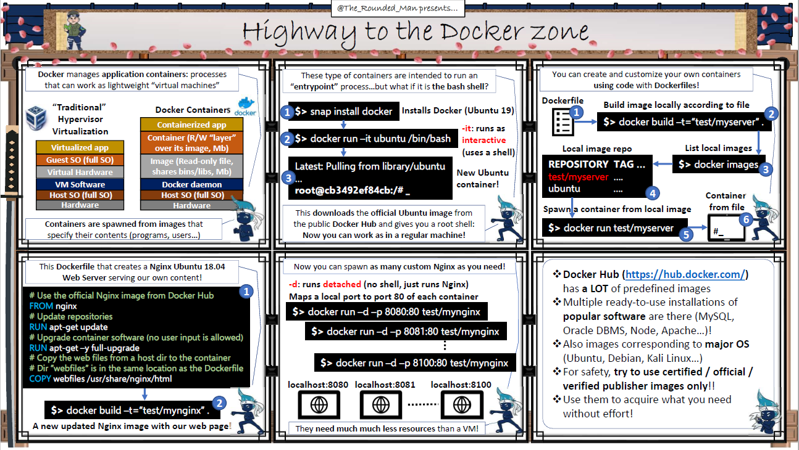

Probablemente la pregunta más repetida por parte de la gente que conoció esta iniciativa al principio de su andadura docente fue ¿y por qué un comic? Lo cierto es que puede resultar chocante introducir algo que en principio parece alejado del mundo docente, y además en un ámbito universitario. No obstante, el uso de comics para explicar temas técnicos no es algo novedoso, sino que se usa con notable éxito en iniciativas como las que llevan a cabo Julia Evans con *Wizard Zines*([https://wizardzines.com/](https&#58;//wizardzines.com/)) y Amy Wibowo con una similar llamada *BubbleSort Zines* ([https://shop.bubblesort.io/](https&#58;//shop.bubblesort.io/)). Estas iniciativas no solo demuestran que su uso para fines docentes es viable, sino que además prueban que son un vehículo adecuado para explicar conceptos de elevada complejidad. Por otro lado, un comic permite una representación muy visual de la información a transmitir y, por tanto, supone un complemento a los tradicionales apuntes más basados en texto que se usan en las clases habitualmente.

Con anterioridad a esta iniciativa, en la asignatura probamos aproximaciones más "clásicas", como la elaboración de FAQs de preguntas sobre diferentes aspectos de C# y el .Net Framework que los alumnos nos hacían, con una explicación detallada de los problemas y sus soluciones. No obstante, muchos de los alumnos no usaban este mecanismo todo lo que se esperaba, declarando que hacerlo les llevaba demasiado tiempo. El motivo es que usarlo les resultaba bastante denso y difícil de manejar; aunque las explicaciones eran muy detalladas, muchas veces su objetivo era solucionar un problema muy específico de un concepto y no tener que volver a repasar una explicación completa de algo que, en gran parte, ya dominaban.

Otra de las aproximaciones que probamos para intentar contrarrestar problemas conceptuales es darles pruebas prácticas de todos los conceptos clave de la asignatura (es decir, código fuente C# funcional, mediante proyectos independientes de Visual Studio, con ejemplos individualizados de cada concepto). El objetivo era que las dudas se despejasen mediante la experimentación, usando programas muy pequeños que usen cada uno de los conceptos explicados. Con ellos los alumnos podrían probar, modificar, desarrollar variantes o experimentar estos conceptos de cualquier forma que necesitasen, con el objetivo de afianzarlos. El problema que esta iniciativa tiene es el mismo que el anterior: los alumnos no la usaban como pretendíamos por requerir más tiempo del esperado, y muchas veces los problemas con el concepto eran significativos y el uso de código no lograba aclararlos. El alumno planteaba las mismas dudas, pero con el código suministrado como guion para hacer sus preguntas.

Por estos motivos, uno de los objetivos principales de los comics que desarrollamos es permitir que los conceptos se refuercen de forma rápida y muy "quirúrgica", es decir, que una persona leyendo uno de estos comics sea capaz de comprender una sola idea (la detectada previamente como realmente problemática), transmitida en una serie de pocos pasos que guíen al lector en una única dirección que "ataque" el problema detectado. Obviamente, el diseño de un material así requiere para ser realmente efectivo un conocimiento muy elevado de la materia, los problemas que los alumnos experimentan con las diferentes partes de esta, y cuáles son los puntos en los que la gente suele fallar cuando se tiene que usar o aplicar un concepto. Parte de esta información solo puede ser realmente suministrada por los propios alumnos, como veremos posteriormente.

Si bien la labor de síntesis que puede hacer un profesor en este sentido es de importancia capital para asegurar lecturas rápidas, tiene que ser acompañada de un formato de comic acorde a la misma. Por ese motivo, hemos decidido usar el formato de fanzine, que ya por definición suele ser una obra corta. Otras ventajas que plantea el uso de fanzines es que son de producción muy rápida, con muy pocos medios técnicos, y por tanto son un medio ágil que puede permitir responder a las necesidades de los alumnos a medida que las vayan planteando.

Una vez descritas las bases de la idea y cuál es su motivación, queda por hablar de cómo se ha explotado la misma para lograr un beneficio en nuestra asignatura. El primer paso ha sido ir recopilando las dudas conceptuales más frecuentes que íbamos recibiendo y desarrollar materiales de refuerzo en forma de fanzines en función de estas. Sin embargo, en una segunda fase creímos más oportuno poner la iniciativa a servicio de los alumnos, para que la elaboración de nuevos fanzines fuera también bajo petición expresa de aquellos que manifestasen problemas específicos. Con todo ello, se ha compuesto un catálogo de fanzines que cubren un amplio rango de conceptos, desde básicos a más avanzados (ver Imagen 1).

Y lo cierto es que, debido a ese amplio rango de conceptos problemáticos para los que se ha solicitado o identificado la necesidad de refuerzo, esta iniciativa nos ha permitido descubrir la existencia de no pocos alumnos que poseían problemas de base importantes, con conceptos como excepciones, polimorfismo, enlace dinámico y asertos que no se habían entendido correctamente y necesitaban un refuerzo específico para poder poner al alumno "al día" de los conceptos requeridos por la asignatura. En ese sentido, los fanzines han hecho una labor de "nivelación" que de otra forma hubiera sido muy difícil de realizar.

Obviamente, la labor de refuerzo no ha quedado relegada a conceptos básicos, sino que a medida que el curso iba avanzado, y aparecían conceptos nuevos, las dudas sobre los mismos no tardaron en aparecer y se desarrollaron nuevos fanzines relacionados. Estos fanzines cubren conceptos más avanzados de programación orientada a objetos como el uso efectivo de genericidad, de abstracciones IEnumerable, conceptos específicos de C# (como el paso de parámetros por referencia y de salida), etc. También se han desarrollado algunos dedicados a conceptos de programación funcional como funciones lambda, generadores y sobre todo el uso de Linq. Finalmente, algunos más cubren la última parte de la asignatura, dedicada a la programación concurrente, con explicaciones relativas a mecanismos de interbloqueo como lock, threads y problemas de concurrencia típicos. La imagen 1 también muestra la división de todos los fanzines desarrollados divididos por bloques.



Uno de los aspectos más curiosos que nos surgieron al final del curso es que unos pocos alumnos empezaron a hacer peticiones de fanzines para explicar conceptos que no tenían realmente relación con la asignatura, sino con lo que va más allá de lo que se explica en ella. El bloque de fanzines "*Metaprogramación & Otros temas*" de la imagen anterior recoge peticiones de información de temas avanzados como el API de *Text-to-Speech*, el uso de *Roslyn* para la ejecución dinámica de código y, en relación con esto, cómo pueden imitarse las características de los lenguajes dinámicos con las funciones disponibles en C#. En ese sentido, creemos que los fanzines han permitido también satisfacer las inquietudes de los alumnos que han querido ir "más allá" de los contenidos de la asignatura.

Los fanzines desarrollados tienen un aspecto visual coherente, con los mismos elementos gráficos, colores y disposición de elementos, para que se identifiquen con el curso y con el profesor que los propone, independientemente del tema que traten. Las imágenes 2 y 3 muestran dos ejemplos de temas de dificultad diametralmente opuesta para comprobar que, aunque la dificultad de los conceptos sea muy diferente, la forma de reforzarlos es la misma. ​





Algo que puede ayudar a ver cómo se pasa de una duda conceptual a un fanzine (en este caso el de la imagen 2), es describir como ocurrió un proceso real que derivó en uno de ellos. El fanzine de la imagen nº 2 empezó a gestarse cuando cuatro alumnos presentaron en el espacio de una semana una duda conceptual grave con el manejo de excepciones y precondiciones. Esta se manifestó con la solución a un problema de filtrar empleados de acuerdo con ciertos criterios, correspondiente a la segunda práctica del curso. Esto quiere decir que no se habían impartido todavía *Linq*, parámetros por omisión, ni otros elementos que simplificarían el código, que se incorporarían más tarde y con los que paulatinamente se mostrará cómo se podría ir mejorando el mismo desde esta implementación básica. La solución planteada por estos alumnos fue esta:

```
static Empleado[] Filtrar(Empleado[] empleados, string nombre, 
    string apellidos,
    string nifContiene) { 
    Debug.Assert(empleados == null, "Error: el array de personas es nulo");
    List<Empleado> temp = new List<Empleado>();
    foreach (var empleado in empleados) {
        if (empleado.Nombre.Equals(nombre))
            temp.Add(empleado);
        else 
            if (empleado.Apellidos.Equals(apellidos))
                temp.Add(empleado);
            else
                if (empleado.NIF.Contains(nifContiene))
                    temp.Add(empleado);
    }
    return temp.ToArray();
}​
```

Este código presenta errores de concepto evidentes. Las precondiciones del método no solo se comprueban con un mecanismo erróneo para esta implementación (que los empleados sean null no es un error de programación en este escenario, no tiene sentido usar un aserto). Al usar asertos en lugar de excepciones, se evita poder manejar el error y tratar de corregirlo por parte del llamador. Además, solo se comprueba uno de los parámetros y no el resto, con lo cual ni siquiera se detectan todos los posibles problemas. Tras hablar con los alumnos, se vio clara la necesidad de desarrollar un fanzine que explique claramente a los alumnos el propósito de las precondiciones: cómo se manejan mediante excepciones para poder tratar los errores detectados, cómo comprobar varias (si las hubiera) antes de implementar el método en sí, y cómo se tratan los errores notificados. La imagen 2 muestra así el fanzine creado para explicar el concepto de precondición y su aplicación práctica que esos alumnos no dominaban.

Como ya se comentó, no todos los fanzines responden a problemas de concepto, sino que hacía el final del curso algunos se crearon motivados por preguntas avanzadas de alumnos. Por ejemplo, el fanzine de la imagen 3 responde a una pregunta de un alumno que deseaba evaluar expresiones en código C# que leía de un fichero de texto para un proyecto personal. El alumno planteaba el problema de convertir texto a código ejecutable en tiempo de ejecución, (es decir, hacer algo similar a la función eval de Python), pensando inicialmente que en un lenguaje en el que fundamentalmente predomina la comprobación estática de tipos (salvo excepciones, como las variables de tipo dynamic) no era posible. El fanzine le dio las herramientas para hacer lo que quería a través del uso del compilador *Roslyn* como un servicio usable desde cualquier programa. Posteriormente, y fruto de preguntas similares, se desarrolló un material no evaluable que muestra de manera más completa cómo implementar características típicas de lenguajes dinámicos en C# ([https://www.researchgate.net/publication/338584100\_Caracteristicas\_Fantasticas\_y\_Donde\_Encontrarlas\_La\_Pythonizacion\_del\_C](https&#58;//www.researchgate.net/publication/338584100_Caracteristicas_Fantasticas_y_Donde_Encontrarlas_La_Pythonizacion_del_C)).

Finalmente, la pregunta más importante que queda por responder es ¿realmente han funcionado como se esperaba? Lo cierto es que el feedback de los alumnos, tanto verbal como por escrito en las encuestas de calidad realizadas, ha sido muy positivo, y gracias a él podemos decir que realmente han ayudado a disminuir el tiempo que los alumnos tardan en entender los conceptos que les resultan problemáticos. El éxito de esta iniciativa ha impulsado dos proyectos paralelos:

- La extensión del nº de fanzines desarrollados durante el siguiente curso académico: 5 de los fanzines que se ven en la imagen 1 han sido desarrollados bajo petición expresa de los alumnos del presente curso académico, complementando los que ya existían del curso anterior.
- Trasladar la idea a otras asignaturas de otros ámbitos: está en desarrollo la aplicación de esta idea a asignaturas de administración de servidores y de seguridad. La imagen 4 muestra un piloto de cómo se aplicaría esta idea para reforzar conceptos del software de contenedores *Docker*.




Finalmente, creemos también que los fanzines desarrollados pueden tener interés más allá de nuestro curso o de las aulas en sí, ya que pueden servir de ayuda a profesionales que tengan que repasar o reforzar conceptos que hayan olvidado por desuso y que, debido a comenzar en un nuevo proyecto o empresa, se vean forzados a recordar para desarrollar efectivamente su labor profesional. Por dicho motivo, todos los fanzines se han hecho públicos bajo licencia GNU en la siguiente dirección: [https://www.researchgate.net/publication/333104441\_FanCines\_Understand\_C\_Sharp\_concepts\_the\_easy\_way](https&#58;//www.researchgate.net/publication/333104441_FanCines_Understand_C_Sharp_concepts_the_easy_way)  para su consulta y/o descarga. El piloto de su aplicación a otras asignaturas también está disponible aquí: [https://www.researchgate.net/publication/335023411\_Admin-zines\_Understand\_Infrastructure\_Administration\_concepts\_the\_easy\_way](https&#58;//www.researchgate.net/publication/335023411_Admin-zines_Understand_Infrastructure_Administration_concepts_the_easy_way) . Un número de personas que trabajan en la empresa privada y exalumnos de la asignatura han transmitido que estos mecanismos de refuerzo también les han sido útiles.

**Conclusión**

Tras la aplicación de esta iniciativa durante dos cursos académicos, creemos que este mecanismo de refuerzo de contenidos problemáticos de forma muy rápida y visual puesto al servicio de los alumnos cumple con los objetivos planteados y funciona como un medio para disminuir las dudas conceptuales que los alumnos plantean durante el curso. Además, creemos que este mecanismo es adecuado para problemas de todo nivel de dificultad y de otros ámbitos no relacionados con la programación. No obstante, para ello es necesario un conocimiento profundo de la materia, y hacer un esfuerzo de síntesis elevado de los conceptos que permitan el desarrollo de fanzines de acuerdo con la filosofía con la que se han diseñado.


**José Manuel Redondo López** <br />
Doctor en Ingeniería Informática. Universidad de Oviedo <br />
[redondojose@uniovi.es](mailto&#58;redondojose@uniovi.es) <br />
@The\_Rounded\_Man <br /> 
[https://www.researchgate.net/profile/Jose\_Redondo8](https&#58;//www.researchgate.net/profile/Jose_Redondo8) <br />