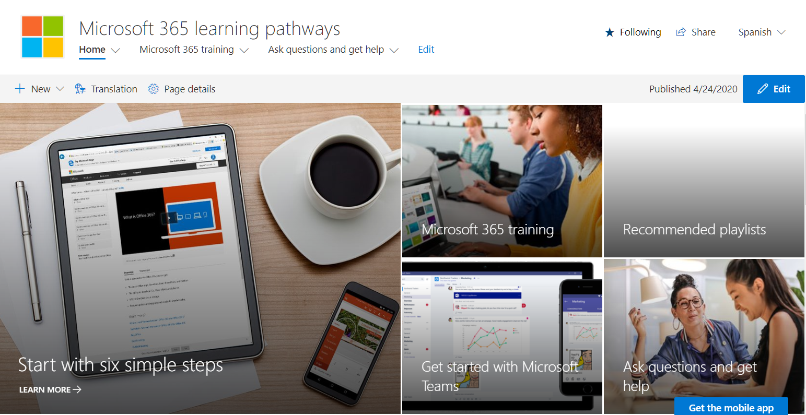
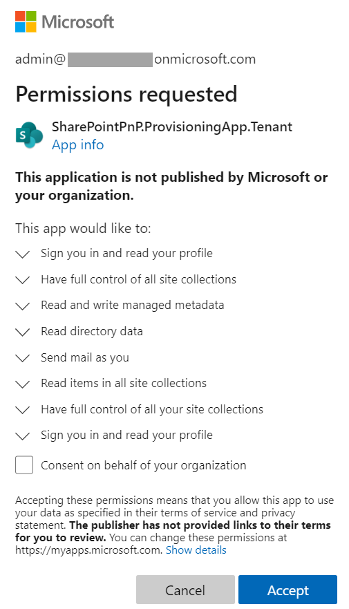
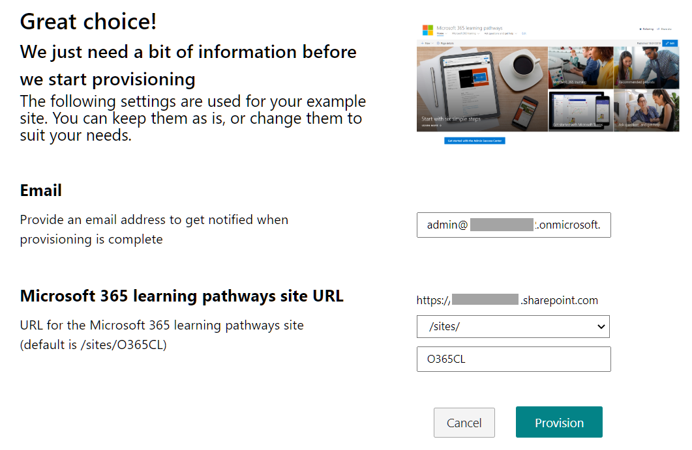
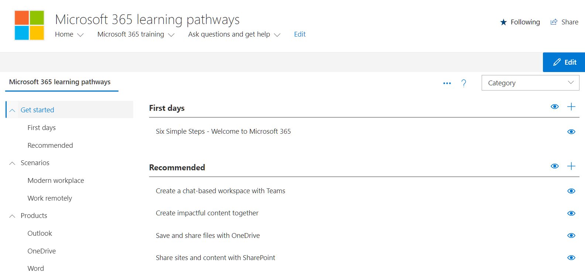
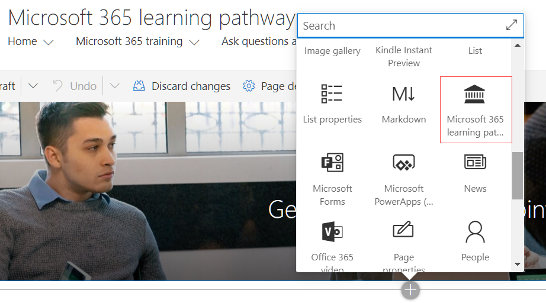
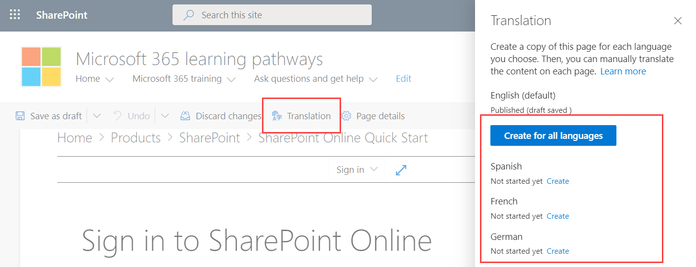
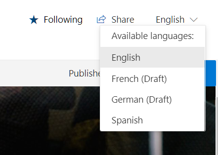
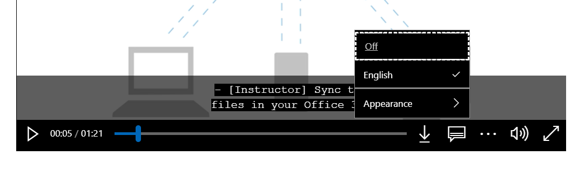
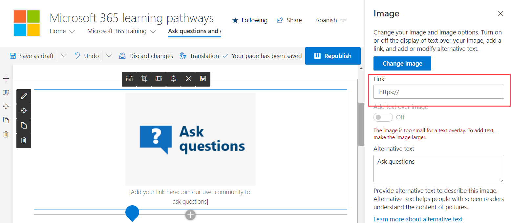

​El Microsoft 365 Learning Pathways es un Site Collection personalizada para SharePoint, creada por Microsoft, que reúne una gran cantidad de contenido educativo sobre todos los componentes de Office 365. La información es creada, seleccionada y mantenida (renovaciones cada tres meses) por Microsoft mismo. Todo el sistema es gratis y se puede instalar en cualquier tenant de SharePoint Online para crear un portal de aprendizaje sobre los componentes de Office 365.

El Microsoft 365 Learning Pathways consiste en una Colección de Sitios de SharePoint Online del tipo "Communication Site" y una WebPart especialmente creada para el sistema por Microsoft. La información en la WebPart está formada principalmente de vínculos a información creada por Microsoft que se pueden ver directamente desde el sitio. El control sobre la Colección de Sitios permanece totalmente en manos de los administradores del tenant, no de Microsoft, por lo que también es posible agregar contenido propio y aplicar cualquier tipo de modificación que la empresa requiera (logos, colores, layouts, ayuda, etc.).

El Learning Pathways es gratis y Open Source, y por lo tanto no está cubierto por ningún programa de garantía, mantenimiento o soporte de Microsoft. El código fuente se puede encontrar en GitHub ([https://github.com/pnp/custom-learning-office-365](https://github.com/pnp/custom-learning-office-365)).

**Instalación**

Hay dos formas para instalar el Learning Pathways: por medio del sistema de provisionamiento de Office, o descargando la WebPart e instalándola manualmente. La forma recomendada es la primera por ser la más fácil, segura y rápida. Microsoft proporciona instrucciones completas si desea seguir el segundo camino ([https://docs.microsoft.com/en-us/office365/customlearning/custom\_manualsetup](https://docs.microsoft.com/en-us/office365/customlearning/custom_manualsetup)).

El sistema de provisionamiento de Office se basa en PnP (Office Patterns and Practices) y, para utilizarlo, se necesita cumplir tres requisitos:

- La cuenta que va a instalar el Learning Pathways debe ser un administrador del tenant de Office 365.
- El Catálogo de Aplicaciones del Tenant debe estar disponible (desde el centro de Administración de SharePoint, vaya a "More Features" - "Apps" (Open) - "App Catalog" - "Create a new app catalog site"), y haber sido creado por lo menos dos horas antes de la instalación del Learning Pathways.
- La cuenta de instalación debe tener derechos de propietario (Admin) del Catálogo de Aplicaciones del Tenant.

Para iniciar la instalación, abra el URL [https://provisioning.sharepointpnp.com/details/3df8bd55-b872-4c9d-88e3-6b2f05344239](https://provisioning.sharepointpnp.com/details/3df8bd55-b872-4c9d-88e3-6b2f05344239) en un browser y utilice el botón "Add to your tenant". Si la cuenta no tiene una sesión abierta en el navegador, la ventana de login de Office aparece para insertar las credenciales.

El servicio de provisionamiento requiere permisos para instalar la aplicación en el catálogo de aplicaciones y crear la Colección de Sitio. Los permisos se usan explícita y únicamente para la instalación de la solución y tienen que ser aceptados obligatoriamente para poder continuar con la instalación.

En la siguiente página de la instalación se puede configurar la dirección de email a utilizar cuando el sitio esté listo, y el URL del sitio para el Learning Pathways.​

Haga clic sobre el botón de "Provision" para iniciar el proceso (una ventana de "Confirmación" abre y debe ser aceptada). El sitio demora aproximadamente 15 minutos para ser creado y configurado, y un email será enviado a la cuenta configurada cuando esté finalizado (**Nota**: el email no siempre llega correctamente). El administrador debe ir al sitio para comprobar que todo funciona sin problemas y abrir la página "../SitePages/CustomLearningAdmin.aspx", desde donde se pueden configurar los temas a mostrar.

El Administrator también debe configurar directamente los usuarios que van a ser los dueños del sitio (la asignación de derechos se hace como en cualquier otro sitio de SharePoint).

**El Learning Pathways**

El sitio de SharePoint es un sitio de comunicación normal, usando la plantilla de "Topics", con una serie de páginas creadas por defecto para el contenido. Cada página contiene la WebPart "Microsoft 365 Learning Pathways" para mostrar el contenido de cada uno de los temas tratados.

Nuevas paginas pueden ser creadas si es necesario, o las existentes se pueden modificar siguiendo las líneas indicadas por Microsoft para personalizar a SharePoint.

Como todo sitio Moderno de SharePoint del tipo Communication, el sitio del Learning Pathways es multilenguaje, pero no está activado por defecto. Para activarlo, haga clic sobre el botón de configuración del sitio en la página principal (el icono de engranaje), haga clic sobre "Site Information" y luego use el vínculo de "View all site settings". En la sección de "Site administration" use el vínculo de "Language settings" y en la página que abre, active el sistema de multilenguaje y configure los idiomas a utilizar. Cada idioma permite también asignarle uno o varios traductores, o grupo de traductores. Después de guardar los cambios, abra cualquier página, use el botón de Editar, y luego el botón de "Translation" en el menú horizontal. En la ventana de configuración se puede indicar que idiomas van a estar activados en la página.​

Los traductores (si han sido configurados) reciben un email indicando que paginas tienen que ser traducidas. Después de que las paginas terminadas han sido republicadas, el botón de idiomas de la página permite que los usuarios vean la información en su propio lenguaje.​

Los videos en el sitio no tienen soporte multiidioma, sino que muestran subtítulos en los idiomas elegidos. El botón de "Closed captions" en cada video permite seleccionar el idioma de los subtítulos, su tipo de letra, etc.:

En el momento de escribir este artículo la mayoría de los videos no han sido traducidos todavía por Microsoft, pero dentro de poco tiempo todos los idiomas ofrecidos estarán disponible (chino simplificado, francés, alemán, italiano, japones, portugués, ruso y español).

**Página de Ayuda y preguntas**

El Learning Pathways dispone por defecto de una página para ayuda y preguntas de los usuarios ("As questions and get help"). La página dispone de cuatro vínculos para que los usuarios puedan acceder a ayuda y resolver dudas sobre Office 365. Tres de los vínculos no están configurados por defecto ("Ask questions", "Contact Helpdesk" y "Get more training") y deben ser modificados antes de entrar en producción para redirigir a los usuarios a los sitios específicos dentro de la empresa. El cuarto vinculo ("Join the Community") está configurada por defecto redirigiendo al sitio de comunidad de Office 365 de Microsoft ([https://aka.ms/O365Champions](https://aka.ms/O365Champions)). Para configurar los URLs, abra la página en forma de edición, seleccione el vínculo y cambie su propiedad "Link":

**Conclusiones**

El Learning Pathways es un sistema creado y mantenido por Microsoft que ofrece gratuitamente multitud de recursos informativos sobre los componentes de Office 365. El sistema puede ser utilizado para entrenar a los usuarios de Office 365, ayudarles si tienen algún tipo de problema y guiarlos en su utilización. El Learning Pathways se instala como una Colección de Sitios en cualquier tenant de Office 365, y puede ser personalizado según los requerimientos de la empresa si es necesario.

**Gustavo Velez**  
MVP Office Apps & Services  
gustavo@gavd.net  

