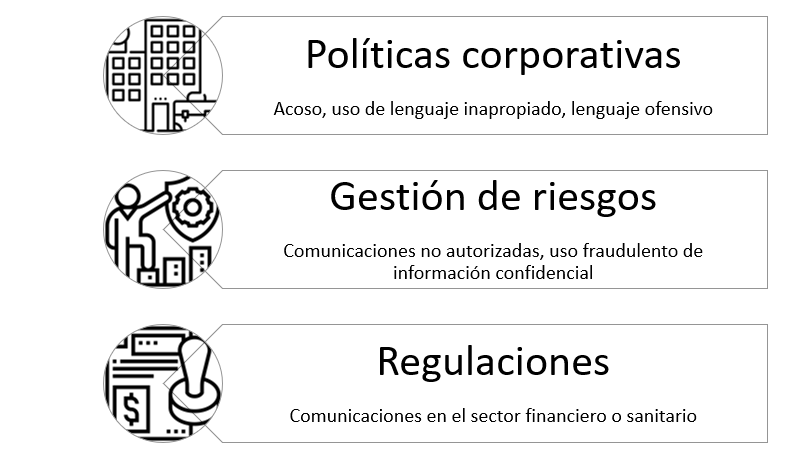
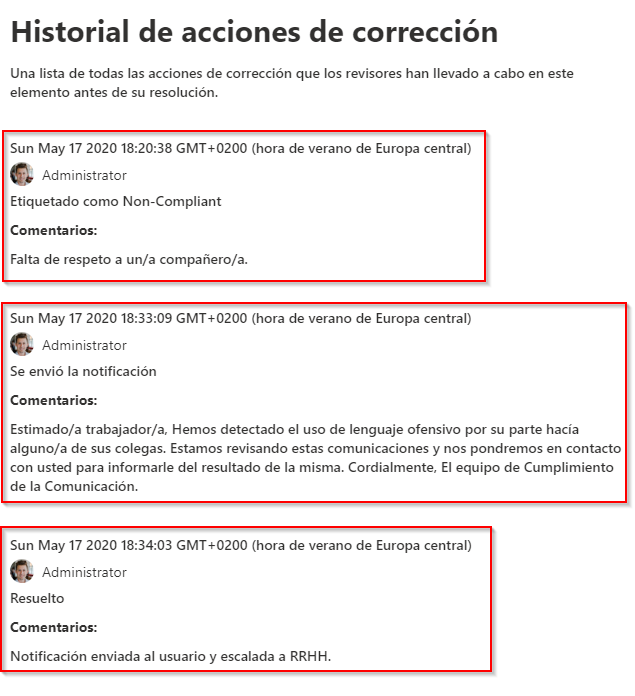

​Pese a que siempre han existido riesgos en la gestión de la información en las organizaciones, el creciente uso de servicios en la nube y la accesibilidad desde cualquier lugar y dispositivo ha hecho que la gestión de éstos empiece a tomar cierta relevancia dentro las mismas. *Insider Risk Management* surge como una nueva solución en Microsoft 365 para detectar actividades involuntarias y/o intencionadas que pongan en riesgo a la organización: Violaciones de confidencialidad, fugas y robo de información o fraude.

Actualmente ya existen algunas soluciones como *Data Loss Prevention* o *eDiscovery*, pero *Insider Risk Management* nos da funcionalidad añadida, ya que permite analizar datos almacenados en otras aplicaciones mediante conectores, usar algoritmos de *Machine Learning* para detectar y analizar ciertos patrones, y, en definitiva, usar plantillas preconfiguradas y adaptables a nuestras necesidades.

Como ya hemos indicado anteriormente, *Communication Compliance*forma parte de la solución *Insider Risk Management*, y puede resultarnos útil en diversos escenarios:​

Así, vemos como la monitorización de las comunicaciones en ciertos entornos puede convertirse en una actividad esencial más para poder cumplir, por ejemplo, con la ley.

¿Y qué canales de comunicación podemos monitorizar? Ahora mismo los canales que se pueden examinar son los siguientes:

Cabe indicar que también se monitoriza la actividad en *Skype for Business*, y que, en la parte de los correos electrónicos, se tienen en cuenta aquellos que son entrantes y también salientes.

En conclusión, podemos monitorizar distintos canales de comunicación en nuestra organización para detectar lenguaje ofensivo, incumplimiento de leyes o uso fraudulento de información confidencial mediante el uso del servicio, definiendo unas políticas, reglas y flujos que veremos cómo configurar en la siguiente sección.

**Caso práctico: Uso de lenguaje ofensivo en Microsoft Teams y correo electrónico**

La mejor manera de ver cómo nos puede ayudar *Communication Compliance* es verlo en acción en un caso práctico. Imaginemos que queremos detectar el uso de lenguaje ofensivo tanto en los chats como en las publicaciones en Microsoft Teams y en los correos electrónicos dentro de una organización.

**Prerrequisitos**

Para poder utilizar la solución necesitaremos uno de estos tres tipos de licencias:

- Microsoft 365 E5.
- Microsoft 365 E3 + complemento Microsoft 365 E5 Compliance.
- Microsoft 365 E3 + complemento Microsoft 365 E5 Insider Risk Management.

Estas licencias serán necesarias tanto para los administradores de cumplimiento como para los usuarios que tengamos que monitorizar. Este último punto es realmente importante, pues significa que prácticamente todos los usuarios de la organización deberían tener asignadas una de estos tres tipos de licencias, con el coste que esto puede suponer.

Adicionalmente es necesario activar los registros de auditoría en el *tenant*.

**Creación de la directiva**

Antes de crear nuestra política de detección de lenguaje ofensivo deberemos asignar permisos a aquellos grupos o personas que definirán y revisarán las mismas (administradores de cumplimiento). Para ello, desde el Centro de Cumplimiento en Microsoft 365 deberemos crear un nuevo permiso, asignando los roles existentes *Supervisory Review Administrator*, *Case Management* y *Compliance Administrator* y asignarlo a las personas correspondientes.

Cabe mencionar que, por defecto, el administrador global del *tenant* no tiene permisos para crear y revisar políticas de cumplimiento de la comunicación, con lo que este paso es inevitable.

Seguidamente, desde el centro de administración de cumplimiento aparecerá una plantilla para supervisar las comunicaciones en busca de lenguaje ofensivo, donde podremos indicar qué usuarios queremos supervisar y qué usuarios deben poder revisar las comunicaciones generadas por la directiva.

La directiva puede tardar hasta una hora en activarse, y la captura de comunicaciones puede tardar hasta 24 horas en mostrar los primeros resultados. También es importante mencionar que, aunque hemos seleccionado una plantilla ya existente, podemos crear directivas personalizadas, donde podemos elegir qué canales queremos monitorizar, y además añadir condiciones concretas y el porcentaje del contenido que se va a revisar de forma aleatoria:

En nuestro caso, hemos preferido crear una directiva personalizada, llamada *lenguaje*ofensivo, donde solo hemos elegido Microsoft Teams y el correo electrónico como canales de comunicación a examinar, así como un porcentaje de revisión del 100% de los mensajes.

**Alertas e informes**

Desde el centro de cumplimiento de la comunicación nos aparecerán aquellos elementos de comunicación que pudieran coincidir con nuestras directivas, tal y como se puede ver en la siguiente figura:​

En la figura aparecen diversos mensajes (hemos ocultado los remitentes y destinatarios), así como el canal de comunicación (cuatro correos electrónicos y una publicación en Teams). Cabe destacar que hemos hecho pruebas en inglés y castellano, y que, en ambos casos, la detección de lenguaje ofensivo ha funcionado perfectamente bien.

Para cada uno de los mensajes disponemos de la vista original, además de poder realizar anotaciones sobre la misma (anotar en la vista) y ver el historial de usuarios que han participado en la comunicación.

A partir de aquí podremos llevar a cabo diversas acciones sobre cada uno de los elementos:

- *Notificar al usuario*: Mediante un correo electrónico se pude notificar a los usuarios que se ha revisado un mensaje escrito por los mismos y que se ha detectado el uso de lenguaje ofensivo por su parte. Estas notificaciones se envían mediante un correo electrónico que se puede parametrizar gracias al uso de plantillas de comunicación.

- *Escalar*: Notificar a otras personas de la organización sobre el incidente para que sean éstas las que decidan qué acciones emprender.
- *Etiquetar*: De esta manera podemos asignar una etiqueta al incidente, que puede tomar los valores *Compliant, Non-Compliant y Questionable*, junto a unos comentarios. De esta manera, esa información se guarda junto al incidente para su posterior revisión histórica si fuera necesario.
- *Remitir para investigar:* Se crea un caso de *eDiscovery* avanzado, mediante el cual se crea un nuevo caso de investigación, analizando el contexto del mensaje junto a otras comunicaciones que se hayan sucedido en un periodo concreto de tiempo.
- *Falso positivo:* En este caso podemos indicar que el mensaje cumple con las directivas de la organización, y, en definitiva, que no es correcto que el sistema lo haya detectado como un mensaje con uso de lenguaje ofensivo.
- *Resolver:* Esta última acción sirve para resolver el caso, donde opcionalmente podremos indicar mediante comentarios las acciones emprendidas. Cuando un caso queda resuelto, siempre se puede ver el histórico de acciones de corrección.

De esta manera, podemos analizar todas y cada una de las comunicaciones que han generado una alerta, y tomar decisiones respecto a las mismas de forma muy intuitiva y ordenada. Finalmente, indicar que, aunque no disponemos de algunas automatizaciones que podrían sernos útiles (por ejemplo, publicar un mensaje en Teams), éstas se podrían realizar mediante el uso combinado del correo electrónico junto con Power Automate.

**Conclusión**

En este artículo hemos introducido al lector en el uso del servicio de *Communication Compliance* para detectar el uso de lenguaje ofensivo en nuestra organización mediante los distintos canales de comunicación de los que disponemos, como son principalmente el correo electrónico, el chat y las publicaciones en Microsoft Teams. Ya sea mediante el uso de plantillas de directivas definidas, o bien creándolas desde cero, hemos visto como monitorizar las comunicaciones y actuar ante situaciones graves de falta de respeto y mal uso del lenguaje.

Este es un ejemplo más sobre como Microsoft está innovando en toda la parte de gestión de la información y los riesgos asociados a ésta mediante un conjunto de servicios y soluciones que se integran muy fácilmente dentro de todo el ecosistema Microsoft 365.

¿Qué nos faltaría para que las organizaciones implanten este tipo de soluciones, independientemente de los aspectos legales ligados a la misma? Seguramente que el coste económico de estas soluciones pueda ser asumido por las organizaciones, o bien que Microsoft las vaya integrando en el futuro como un elemento más independientemente del tipo de licencia que tengan asignada los usuarios.

**Ferran Chopo Garcia**  
*Microsoft 365 Consultant & Trainer*  
[ferran@ferranchopo.com](mailto:ferran@ferranchopo.com)  
@fchopo