​En este mundo hiperconectado el almacenar datos es de suma importancia para las empresas, escuelas, instituciones, etc., ya que con ello se realizan investigaciones o toma de decisiones, por ello cada día se busca la manera de encontrar recursos en los cuales la información quede almacenada y segura.

El objetivo de este artículo es hablar del servicio cognitivo de búsqueda "Azure Cognitive Search", específicamente del almacén de conocimiento, una característica que permite almacenar la salida de una indexación + el enriquecimiento de los documentos hecho con servicios cognitivos de Azure para realizar análisis independientes de los datos.

Para ello es importante comenzar mencionando que es un documento enriquecido. Se le llama así a la salida de un proceso de indexación creado a partir del contenido que se ha extraído de una fuente de datos, estructurado y analizado mediante procesos de inteligencia artificial, pero estos documentos enriquecidos son transitorios, solo se usan durante la indexación y para aplicaciones que necesitan la característica de búsqueda, pero después se descartan, sin embargo, con el almacén de conocimientos estos documentos enriquecidos se conservan para su posterior análisis.

Por otro lado, si ha usado habilidades cognitivas (skills) anteriormente, ya sabe que los conjuntos de habilidades (skillset) se usan para mover un documento extraído de una fuente de datos por una secuencia de enriquecimientos, el resultado puede ser un índice de búsqueda enriquecido o proyecciones en un almacén de conocimientos. Estas dos salidas, son productos del mismo enriquecimiento con habilidades. Aunque se obtienen de las mismas entradas, se genera una salida estructurada y almacenada, que se emplea de maneras muy distintas; la primera salida es el índice que puede ser utilizado en aplicaciones de búsqueda utilizando sintaxis de búsqueda estándar, la segunda salida son las proyecciones que pueden ser utilizadas desde Power BI o utilizar aprendizaje de máquina para analizar los datos y realizar predicciones sobre estos datos.

En consecuencia, un almacén de conocimiento es un concepto lógico para describir datos enriquecidos para su posterior análisis, pero físicamente un almacén de conocimiento no es más que una cuenta de Almacenamiento de Azure (Storage Account), esta puede ser almacenamiento tipo tabla, almacenamiento tipo blob o ambos, la ventaja de esto es que cualquier herramienta que pueda conectarse a estos servicios de Azure puede consumir los contenidos de un almacén de conocimiento y construir aplicaciones o funcionalidades antes no posibles.

El proceso lógico en el cual se incluye un almacén de conocimiento es:

1. Se obtienen documentos no estructurados o datos estructurados de una fuente de datos las cuales pueden ser Azure SQL, Cosmos DB, Archivos Blob, etc.
2. El servicio de búsqueda de Azure descifra los documentos.
3. Con servicios cognitivos de Azure se realiza enriquecimiento a los documentos descifrados.
4. Se agregan estos documentos a un índice para posterior consumo por aplicaciones de búsqueda.
5. Al mismo tiempo estos documentos enriquecidos se agregan como proyecciones a un almacén de conocimientos.
6. Por último, se pueden consumir estos datos desde Power BI, procesos de aprendizaje de máquina, etc.

Este proceso lógico puede observarse de mejor manera en la Figura 1, en donde se ve el flujo de información a través de los componentes ya mencionados:

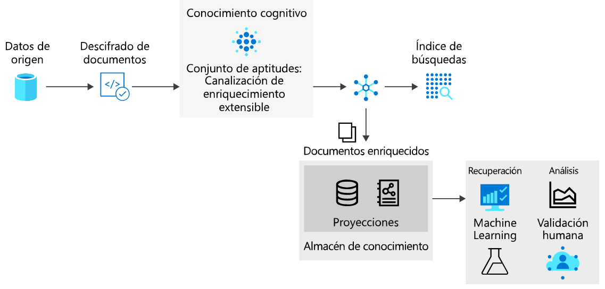

**Referencia:** [https://docs.microsoft.com/es-es/azure/search/introducción-al-almacen-de-conocimiento-knowledge-store-concept-intro](https://docs.microsoft.com/es-es/azure/search/introducción-al-almacen-de-conocimiento-knowledge-store-concept-intro)

**Ventajas de un almacén de datos**

De acuerdo con la información expedida por Microsoft, un almacén de conocimiento les da estructura, contexto y contenido real a los documentos indexados obtenidos de archivos de datos no estructurados y semiestructurados como blobs, archivos de imágenes (que han sido objeto de análisis), o incluso datos estructurados, remodelados en nuevas formas; el poder ver paso a paso los datos como se van enriqueciendo es una ventaja del almacén de conocimiento; se puede ver de primera mano cómo un documento JSON complejo se puede dividir en subestructuras, se reconstruye en nuevas formas, y se hace disponible para procesos posteriores como el aprendizaje automático y procesos relacionados con las ciencias de los datos.

Es útil ver lo que puede producir un enriquecimiento de IA, el potencial real de un almacén de conocimiento es la capacidad de remodelar los datos y se puede comenzar con un conjunto de habilidades básicas (skillsets), para así, iterar sobre él y añadir niveles adicionales de estructura e información, que luego se puede combinar en nuevas formas, consumibles en otras aplicaciones además de la búsqueda cognitiva de Azure.

Entre los beneficios del almacén de conocimientos, se incluye:

- Consumir documentos enriquecidos en herramientas de análisis e información distintas de la búsqueda. Power BI con Power Query es una opción convincente, pero cualquier herramienta o aplicación que pueda conectarse a Azure Storage puede extraer de un almacén de conocimientos.
- Refinar una indexación de IA al depurar pasos y definiciones de conjuntos de habilidades (skillsets), un almacén de conocimiento le muestra el producto de una definición de conjunto de habilidades en una indexación de IA. Se pueden utilizar esos resultados para diseñar un mejor conjunto de habilidades, ya que se puede ver exactamente los resultados de los enriquecimientos utilizando el explorador de almacenamiento de Azure para ver el contenido de los enriquecimientos durante su proceso.
- Dar forma a los datos en nuevas maneras antes imposibles, porque la remodelación de los datos está codificada en conjuntos de habilidades, Microsoft ha proporcionado una nueva habilidad llamada "Shaper" la cual permite la remodelación de los datos, preservando al mismo tiempo las relaciones, esta habilidad permite por ejemplo obtener datos de varias fuentes y luego juntarlos, transformarlos, etc.; para construir un solo documento json enriquecido con información de ambas fuentes y al mismo tiempo como se dijo anteriormente preservando sus relaciones.

**Almacenamiento Físico**

El almacenamiento físico de un almacén de conocimiento se articula a través del elemento de proyecciones en un conjunto de habilidades, esta proyección define una estructura de salida para que coincida con el uso previsto, las proyecciones pueden articularse como tablas, objetos o archivos, un conjunto de habilidades puede tener una o más proyecciones y en cada proyección la salida del enriquecimiento por IA se puede guardar en tablas de Azure o en almacenamiento tipo Blob. La definición de un almacén de conocimiento tiene la siguiente estructura JSON (figura 2):

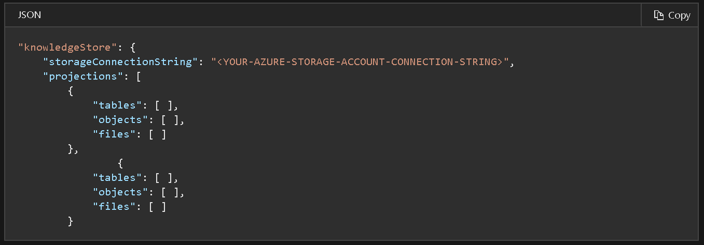

El tipo de proyección que especifique el usuario en esta estructura determina el tipo de almacenamiento utilizado por el almacén de conocimiento.

Se define una proyección de tabla cuando necesite estructuras de informes tabulares para entradas a herramientas analíticas, o se exporte como marcos de datos a otros almacenes de datos. Puede especificar varias tablas para obtener un subconjunto o una sección transversal de documentos enriquecidos, dentro del mismo grupo de proyección, las relaciones de tabla se conservan para que pueda trabajar con todas ellas. El almacenamiento de blobs se usa cuando define objetos o archivos, la representación física de un objeto es una estructura JSON jerárquica que representa un documento enriquecido. Un archivo es una imagen extraída de un documento, transferida intacta al almacenamiento Blob.

Un solo objeto de proyección contiene un conjunto de tablas, objetos, archivos y, para muchos escenarios, crear una proyección podría ser suficiente. Sin embargo, es posible crear múltiples conjuntos de proyecciones de tabla-objeto-archivo, y puede hacerlo si desea diferentes relaciones de datos, todo esto dependerá de los requerimientos de la solución a implementar.

**Como crear un almacén de datos con el portal.**

Después de la descripción de los conceptos y las ventajas, y junto con los enriquecimientos de IA, se muestra un ejemplo de cómo crear y consumir un almacén de datos, para este ejemplo, previamente se ha creado una cuenta de almacenamiento Blob y he subido algunas imágenes, archivos de texto, archivos de office y PDFs.

1. Clic en Importar Datos.

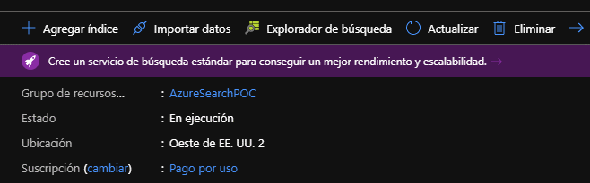

2. Seleccionar Almacenamiento Blob y buscar la cuenta de almacenamiento creada anteriormente.​

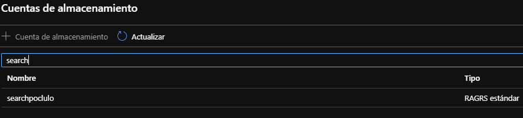

3. Seleccionar el contenedor de la cuenta de almacenamiento.​

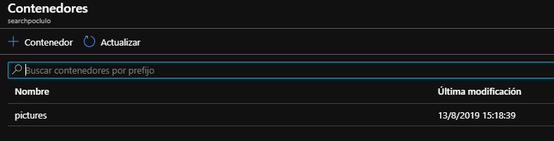

4. Dar un nombre al origen de datos.

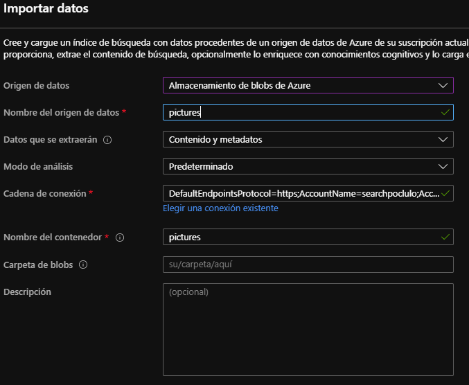

5. Clic en siguiente para agregar habilidades cognitivas, en este paso hay 3 etapas:

a) La primera etapa es adjuntar un servicio cognitivo de Azure, en cuentas gratis de Azure, se puede adjuntar una versión limitada de este servicio, en las cuentas gratis pueden realizar hasta 20 transacciones de enriquecimiento, lo cual es suficiente para nuestro ejemplo. Pero si esto no es suficiente en esta misma pantalla se puede crear un recurso nuevo de servicios cognitivos sin límites de transacciones.

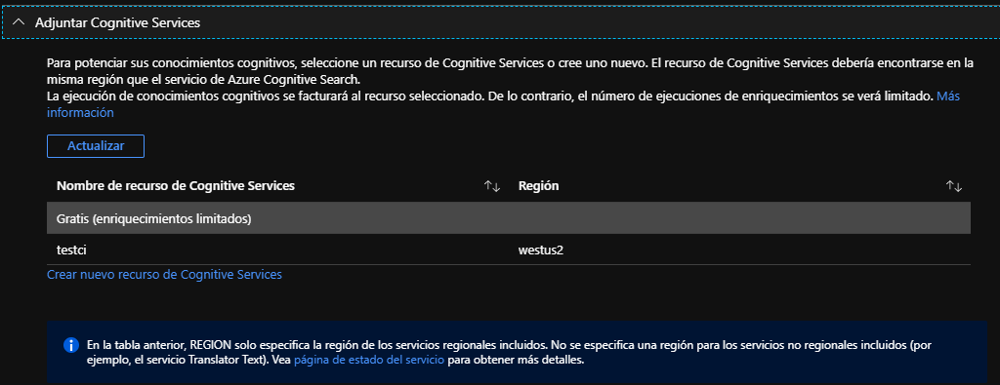

b) En la segunda etapa debemos agregar los enriquecimientos:

1. Le ponemos un nombre a nuestro conjunto de habilidades.
        2. Habilitamos OCR.
        3. Le ponemos un nombre al campo de datos de origen, por defecto es "merged\_content".

Lo que pasara durante el enriquecimiento es que los servicios de búsqueda de Azure se comunicarán con los servicios cognitivos de visión de Azure para detectar el texto en imágenes y PDFs, este texto será guardado en el campo merged\_content para su posterior análisis por otras habilidades de IA.​

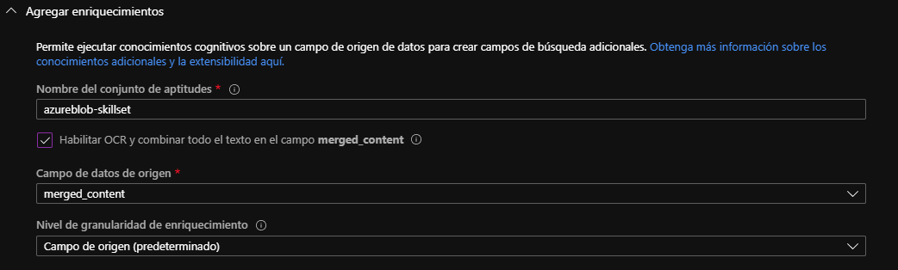

c) La tercera etapa se seleccionan los conocimientos cognitivos de texto que sean necesarios, en este paso y después de haber realizado el proceso de OCR, los servicios cognitivos de búsqueda de Azure se conectarán a los servicios cognitivos de texto y este nos permitirá enriquecer el índice con datos como nombres de personas, de organizaciones, ubicaciones, detectar el idioma, entre otros.

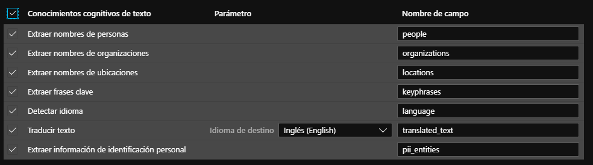

Después seleccionamos los enriquecimientos de imagen deseados, en estos servicios cognitivos de búsqueda de Azure se conectará de nuevo a los servicios cognitivos de Visión para extraer etiquetas de imágenes, leyendas e identificar personas famosas.

Después de configurar el enriquecimiento se cuenta con los elementos para terminar de configurar el almacén de conocimiento, que no es más que una simple cuenta de almacenamiento con todos los datos enriquecidos de los pasos anteriores.

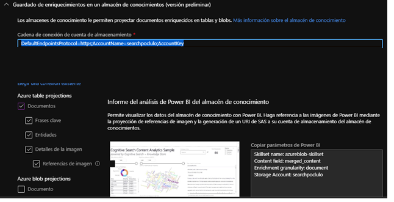

En la imagen se puede observar que se puede descargar una plantilla de Power BI y obtener los parámetros de conexión, estos nos servirán en un paso posterior del proceso.

6. El siguiente paso es personalizar el índice, en este paso se cambian nombres de campos, el nombre del índice, y otras configuraciones adicionales, como por ejemplo si el campo se puede ordenar, se puede utilizar en búsquedas, etc.​

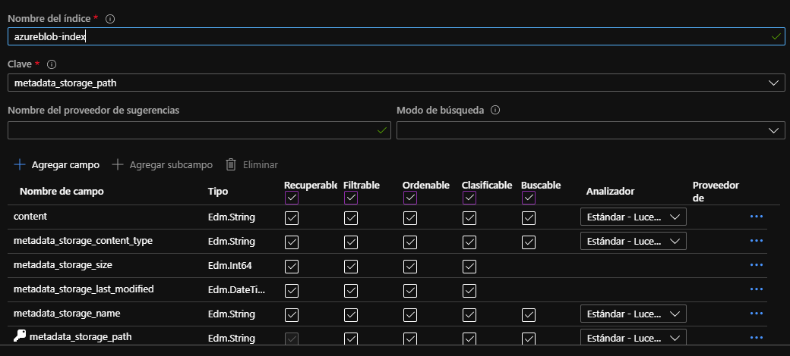

7. Finalmente se configura la recurrencia de la indización y se termina el proceso dando clic en enviar.​

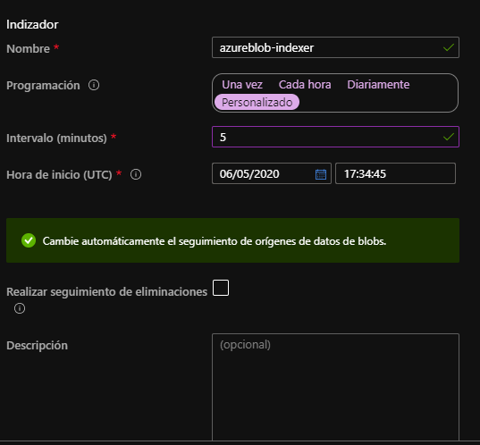

Una vez se ha realizado este proceso, esperamos que se termine la indización revisando el tablero en la sección de indizadores

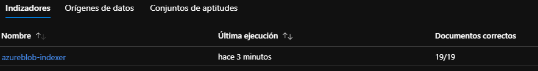

Una de las partes fuertes de este proceso es verificar que nuestros datos enriquecidos puedan ser consultados desde otras herramientas, para esto solo debemos ir a nuestra cuenta de almacenamiento y seleccionar tablas, como pueden ver hay nuevas tablas en el almacenamiento.

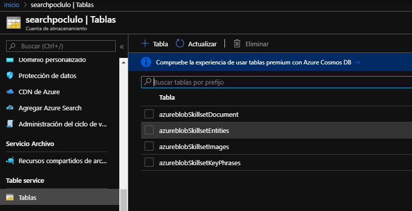

Si se quiere ver el contenido de las tablas, se puede usar el explorador de almacenamiento de Azure para tablas.

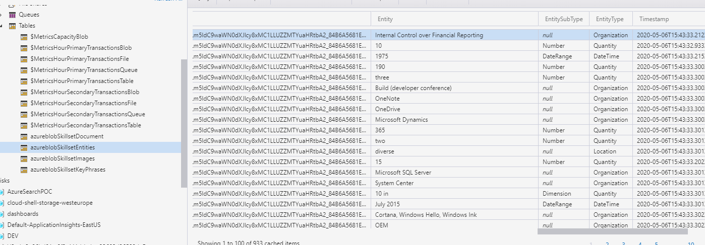

Y para hacer este ejercicio completo, podemos abrir la plantilla de Power BI descargada en pasos anteriores y llenar los datos correspondientes:

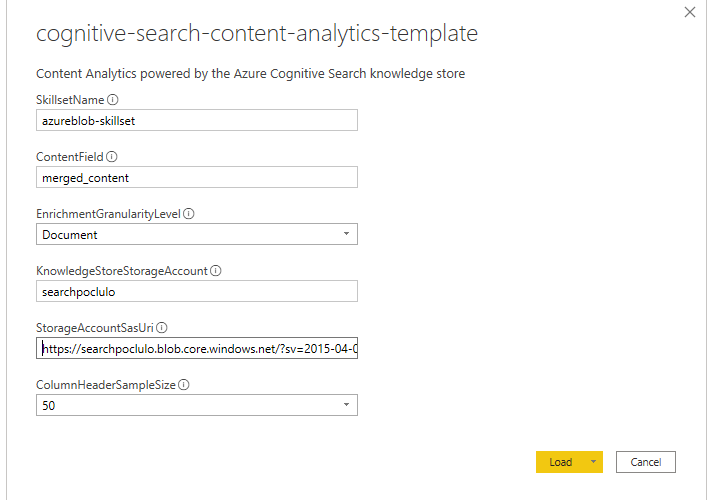

Luego cargamos los datos:

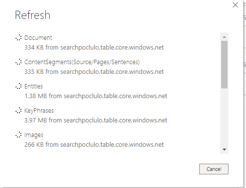

Y finalmente podemos analizar nuestros datos con el reporte de Power BI, la plantilla de Power BI viene con 3 pestanas diferentes para análisis de los datos, se deja como ejercicio al lector explorar las posibilidades de esta plantilla.

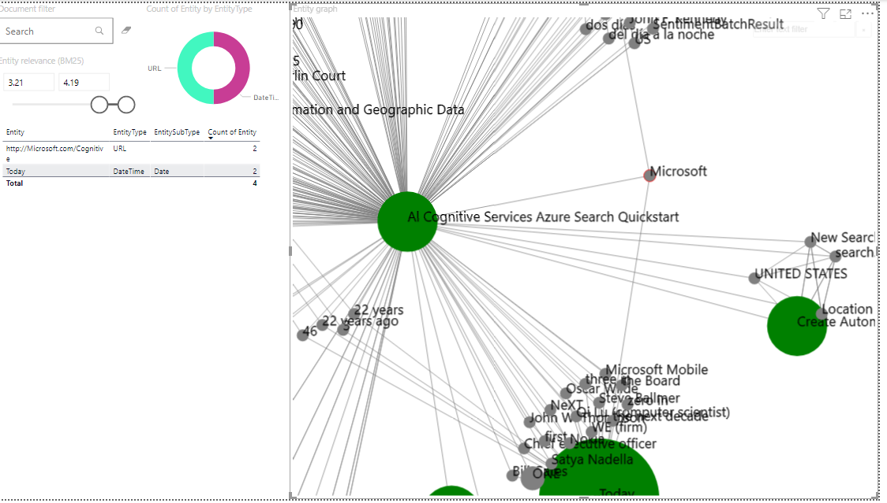

**Conclusiones**

En este articulo hemos visto la definición de un almacén de datos, su representación física en cuentas de almacenamiento y sus beneficios, a su vez importamos datos de una cuenta de almacenamiento que contiene imágenes en un nuevo índice y adjuntamos enriquecimientos de IA para visión y análisis de texto. Después guardamos estos datos enriquecidos en un almacén de conocimiento, para finalizar y por simplicidad utilizamos la plantilla de Power BI descargada del portal de Azure, con esta plantilla nos conectamos al almacenamiento de tabla con la información de conexión entregada por el portal para luego poder desplegar los reportes en Power BI y analizar visualmente los datos enriquecidos con inteligencia artificial.

**Luis Valencia**  
Office Development MVP

 
 
import LayoutNumber from '../../../components/layout-article'
export default LayoutNumber
