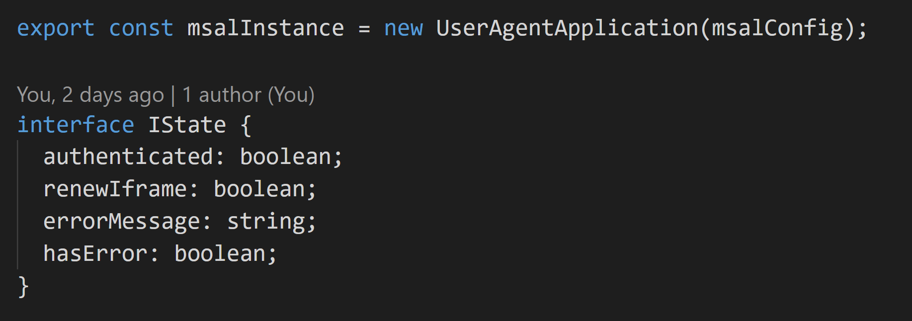
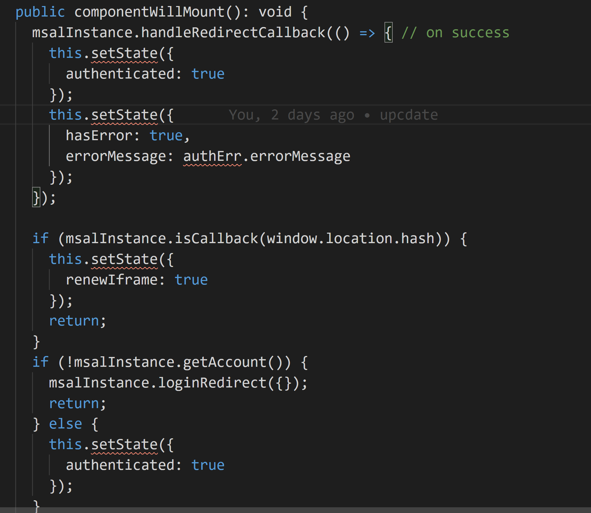
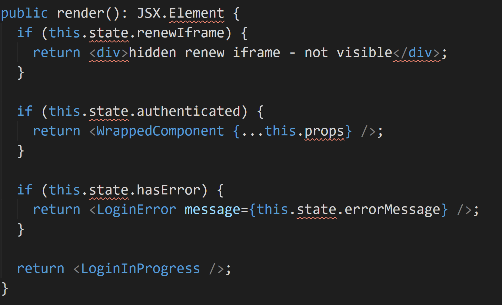
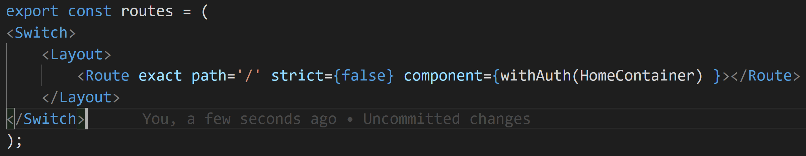
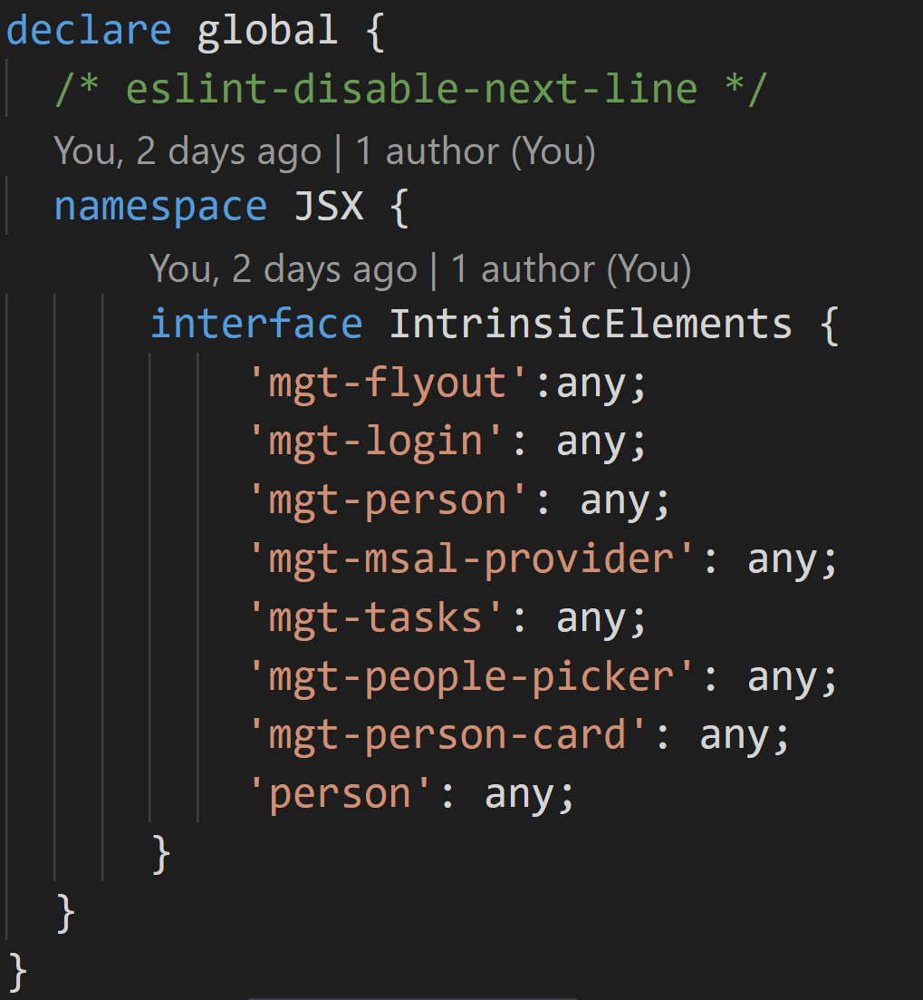
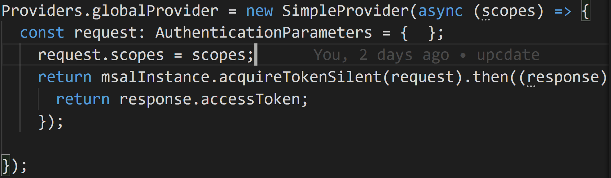
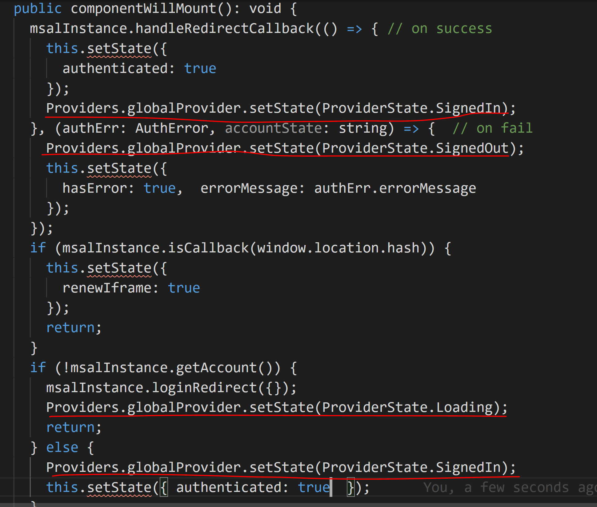
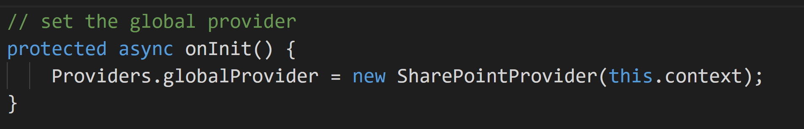
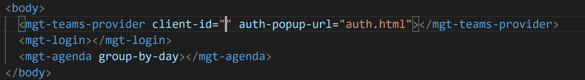
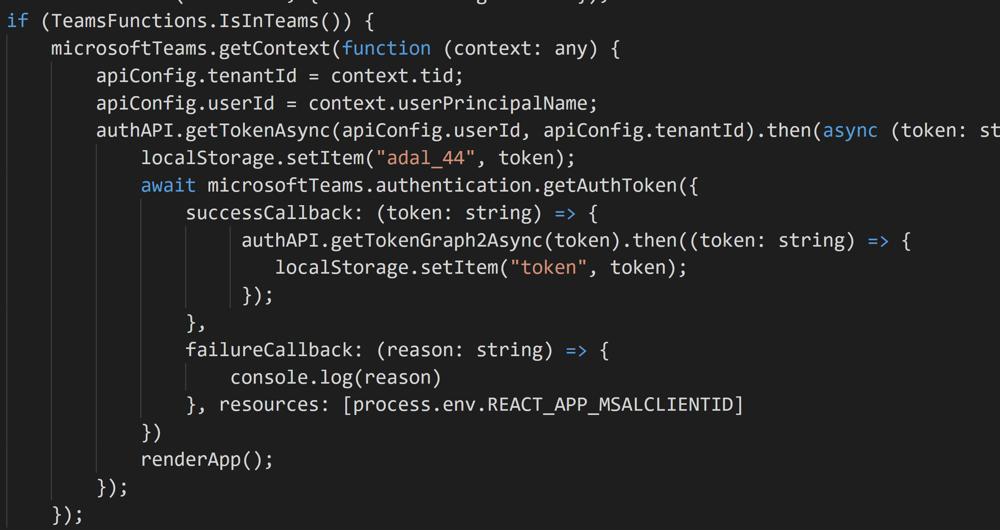

import ArticleHeader from '../../../components/article-header'

<ArticleHeader frontmatter={props.pageContext.frontmatter} />

En el [número 41 Rubén Ramos](/revistas/numero-41/un-vistazo-a-microsoft-graph-toolkit-web-components-con-graph) nos explicó que era Graph Toolkit y como empezar a utilizarlo y todos los componentes que lo forman en aquel momento que estaba en su versión 1.0. Ahora bien, una cosa es ver la herramienta y que posibilidades tiene y otra muy distinta es como la podemos incorporar en nuestros desarrollos, y este es el punto de partida de este artículo.

Antes de empezar a usar Graph Toolkit lo primero que debemos de tener claro es cual es el sistema que se va a utilizar en nuestra aplicación para la autenticación. Sin el tema de la autenticación Graph Toolkit no tiene sentido utilizar ninguno de los componentes que existen en el mismo. La gracia de hacer uso de Graph Toolkit por un lado es que tenemos un componente con un diseño que sigue todos los patrones de cualquier aplicación desarrollada por Microsoft y la segunda y para mi importante es que nos abstrae de las peticiones que se tiene que realizar a Graph y muestra la información que se requiere.

Está claro que para el componente que nosotros queramos se debe de crear una aplicación en el Azure Active Directory que tenga los permisos necesarios para poder hacer estas consultas. Pero claro ahora bien el tema de esta autenticación contra el AAD dependerá del contexto donde se esté ejecutando nuestra aplicación, dependiendo de dicho contexto se tendrán que realizar algunas acciones u otras.

Este contexto del que estoy hablando dentro de GraphToolkit es el Proveedor de Autenticación, como se citó en el artículo anterior disponemos de diversos proveedores: MSAL, Simple, Teams o SharePoint. Imaginar que tenemos una aplicación personalizada implementada y que tiene ya una autenticación utilizando MSAL. ¿Qué tipo de Proveedor utilizarías para este caso? Es obvio que la pregunta tiene trampa y la respuesta no es la trivial. Se utilizaría un SimpleProvider y el motivo es que cuando tu utilizas el proveedor que hay para MSAL dentro de un desarrollo previo no va a obtener la misma instancia de MSAL por lo que a efectos de Graph Toolkit ninguno de los componentes que se estén utilizando tiene un token de autenticación y está esperando que el usuario se autentique en tu aplicación. Por lo que para que funcione con un MSAL Provider se debe de autenticar además de en tu aplicación en Graph Toolkit por lo que la experiencia de usuario no es tan optima como estábamos esperando. Ahora veremos cómo se soluciona dicho inconveniente, pero primero separemos los escenarios que disponemos y como debemos de afrontarlos:

- Escenario desarrollo personalizado custom, por ejemplo, alojado en una App en NodeJS o .NET Core.
- SharePoint Framework (SPFx).
- Microsoft Teams.

**Escenario Desarrollo Custom**

**Escenario:**Disponemos de una Aplicación React en la que tenemos implementada una Autenticación usando MSAL. En nuestro caso lo que hacemos es implementar un High Order Component en React que es el que se encarga de autenticar a nuestra aplicación. Para ello tenemos este código que implementa el HoC:

Tenemos la instancia de MSAL en esa instancia, esa instancia es la que se encarga de ver si el usuario esta autenticado o no para ello en el momento que el componente se va a crear vemos que acción debemos de realizar si mostrar el login, bien dejar pasar al componente, bien pedir un refresh del token, etc… para ello usaremos el siguiente código:

Ahora en el render de nuestro HoC tendremos un código similar al siguiente:​

Como podéis ver lo que hace el render es en caso de que el login este en progreso o renovando el token, sale un mensaje por pantalla, si se produce un error muestra que no se ha podido autenticar y en caso de que la autenticación haya sido un éxito pues muestra el componente que nosotros queremos. En nuestro caso si queremos mostrar cualquier componente que tenga autenticación bastaría con esto:

Como podemos usar un componente de Graph Toolkit en nuestra aplicación. Para ello en primer lugar tendremos que añadir las referencias de Graph Toolkit para que no de error al compilar, dentro de estos elementos tendremos que añadir tantos elementos como componentes vayamos a usar, con añadirlos antes de cargar la aplicación sería suficiente:

Una vez definidos el siguiente paso es configurar el SimpleProvider. Cuando creamos un SimpleProvider tenemos tres posibilidades pasarle el método de obtener el Token, el login y el logout. En nuestro caso como gestionamos el login y logout a través del HoC no se lo indicaremos y solo le indicaremos como obtener el token.​

Como observáis obtenemos el msalInstance que tenemos declarado en el HoC de esta forma aprovechamos la misma autenticación para ambos casos y se evita realizar dos autenticaciones al cliente. Pero no todo iba a resultar tan sencillo, sino que al gestionar el proveedor tenemos que indicar el estado en el que esta la autenticación, para ello en primer lugar cuando arranca la aplicación tendremos que indicar que la autenticación está en proceso.

Y para finalizar este estado lo tendremos que ir cambiando, dependiendo el estado de nuestra aplicación para ello en el componente HoC citado anteriormente tendremos que establecer su estado dependiendo en el estado en el que se encuentre. Quedando el código de la siguiente forma:

Como podéis observar en los subrayados en rojo, en nuestra autenticación estamos gestionando que muestre la información en el estado en el que se encuentra nuestra autenticación junto con el estado de Graph Toolkit. Como curiosidad y para entender el ciclo de vida de los componentes de GraphToolkit podéis añadir un punto de parada en la obtención del token y ver todas las llamadas que realiza (pero eso lo dejo a la curiosidad del lector)

**Escenario SharePoint SPFx**

El escenario de SharePoint es el más fácil de utilizar ya que el tema de la autenticación con Graph ya lo tenía gestionado a través de permisos en el propio manifiesto de SPFx. Este tipo de autenticación lo vimos en el [número 42](/revistas/numero-42/como-consumir-apis-securizadas-con-el-azure-active-directory-en-nuestros-desarrollos-de-spfx).

Una vez obtenidos los permisos de Graph el siguiente paso que hay que realizar es inicializar el Proveedor con el contexto de SharePoint para ello eso algo tan sencillo como el siguiente:

**Escenario Microsoft Teams**

El escenario de Teams es el más difícil tanto de entender como de implementar y creo que en posteriores versiones sufrirá a cabo una modificación.  En primer lugar, tenemos que tener claro cómo se autentica Teams. Para autenticar tu aplicación con Teams lo que debes de hacerlo es a través de una autenticación en modo PopUp (fuera del contexto de Teams) y con esa autenticación regresar a la pantalla y una vez en tu aplicación que cargue con las necesidades que se requieran. Ahora bien, en el caso de Graph Toolkit y Teams nos encontraríamos en el mismo caso que con un escenario personalizado, tendríamos que por un lado autenticar nuestra aplicación con su login (si lo requiere) y luego con el login de Teams. Para ello nos valdría con poner el siguiente código:

Ahora bien, este escenario no es el ideal para nuestra aplicación ya que la experiencia de usuario no es la mejor. Hace menos de un mes el equipo de Teams indico como podemos implementar un Single Sign On contra Azure AD en Teams. Para ello Wictor Willen lo escribe perfectamente en el siguiente articulo [http://www.wictorwilen.se/microsoft-teams-tabs-sso-and-microsoft-graph-the-on-behalf-of-blog-post](http&#58;//www.wictorwilen.se/microsoft-teams-tabs-sso-and-microsoft-graph-the-on-behalf-of-blog-post)

Vale eso está muy bien, pero ¿cómo podemos hacer uso de ese SSO con Graph Toolkit? Pues la solución sería haciendo uso del SimpleProvider, tendríamos que configurar la obtención del token por un lado obteniendo el token que nos da Teams, con este Teams hacer una llamada a nuestro servidor que realice la llamada a Graph para que dé un Token valido y con este token ya nuestro Graph Toolkit puede realizar las llamadas a Graph. Ahora bien, en el contexto de la aplicación de Teams en el mayor de las veces es un contexto muy similar al caso 1, tenemos una aplicación que además de poder acceder vía web se puede acceder desde dentro del contexto de Teams. Para estos contextos tendríamos un SimpleProvider similar al siguiente:

El tema del SSO desde mi punto de vista aun no le han dado la funcionalidad que estaba esperando, el tener dos tokens uno solicitándoselo a Teams y otro solicitándoselo a una API que hemos puesto en servidor, no es la mejor opción. Para mí se debería de obtener una autenticación similar a la que tenemos en SharePoint en la que todas las peticiones a SharePoint están incluidas en la propia autenticación que estamos puestos. Sin embargo, este paso de SSO para mi es un gran avance y que puede facilitar mucho la vida a la hora de poner una aplicación en producción, sin embargo se debería de facilitar algunos aspectos a la hora de desarrollar, porque para que el SSO funcione correctamente lo primero debes de tener un certificado de dicho dominio, y el dominio no puede contener el azurewebsites.net.

**Conclusiones**

Graph Toolkit para mi es un gran proyecto Open Source que está creciendo, añadiendo cada vez más componentes, que además son los que se están usando en varias aplicaciones propias de Microsoft. Es un proyecto que está abierto para poder personalizarlo y adaptarlo a las nuevas funcionalidades que tiene Microsoft Graph, si vemos las dos últimas actualizaciones ha salido la funcionalidad de buscar sobre todos los Canales de un Teams … y por si fuera poco hay un componente en el que puedes realizar cualquier petición a Graph. De esta forma por ejemplo si queremos usar la API de presencia o se puede usar el Componente Get.

Tener claro que Graph Toolkit no es algo que sea incompatible con otros frameworks de diseño que está apostando Microsoft como pueda ser Fluent UI. Graph Toolkit son componentes que ya tienen mucha funcionalidad y que nos permite extenderlos de una forma muy fácil. La principal funcionalidad de Graph Toolkit es el uso de Graph en los desarrollos.

Happy Codding

**Adrián Diaz Cervera**  
Architect Software Lead at Encamina  
MVP Office Development  
[http://blogs.encamina.com/desarrollandosobresharepoint](http&#58;//blogs.encamina.com/desarrollandosobresharepoint)  
adiaz@encamina.com @AdrianDiaz81  

