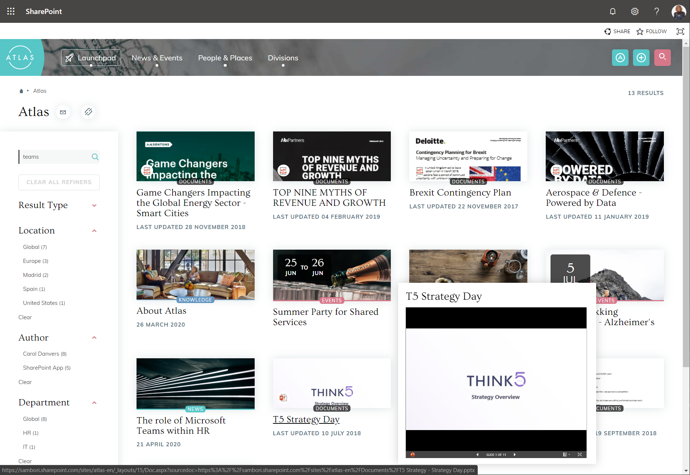
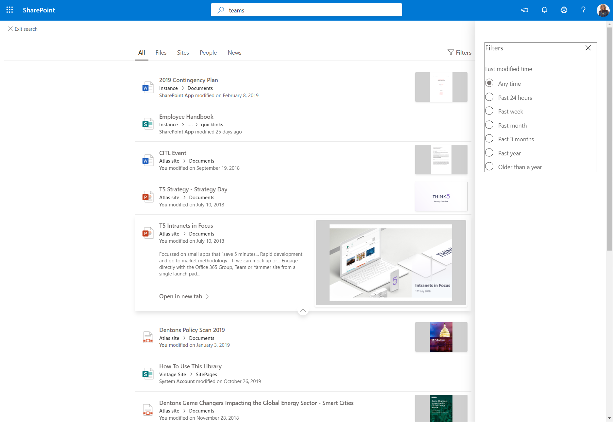
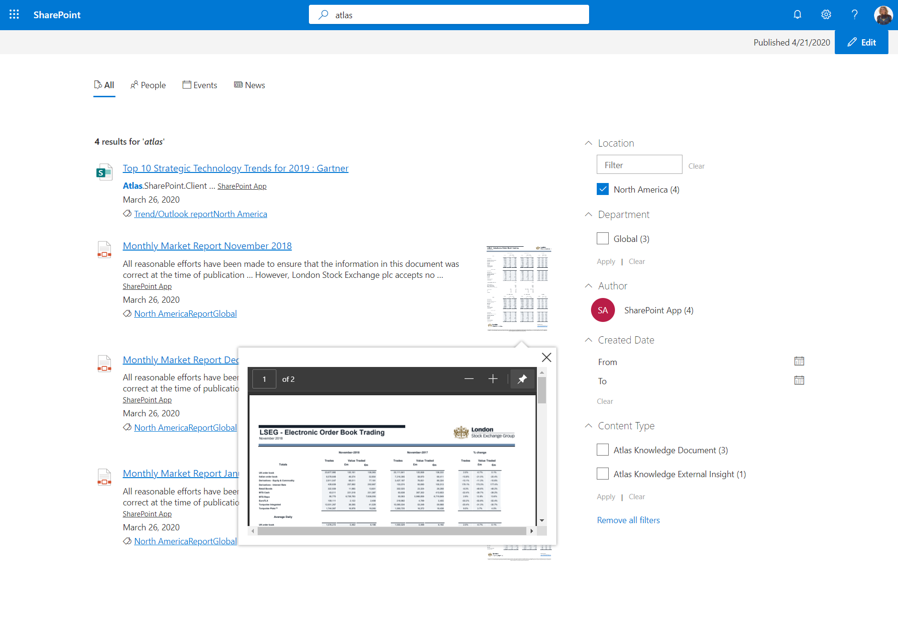
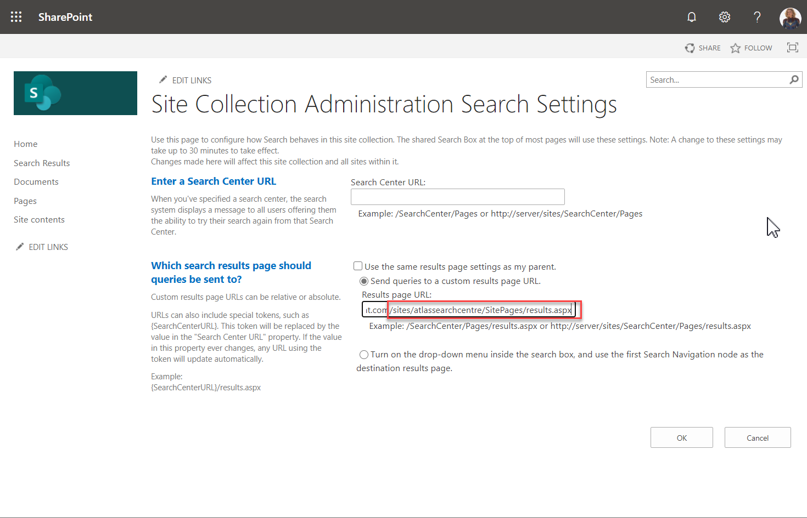
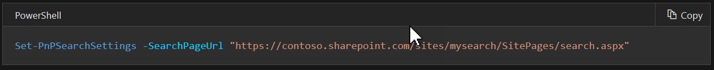
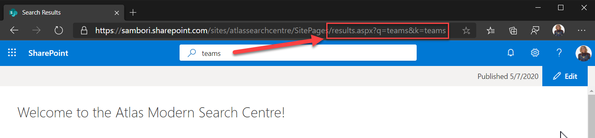
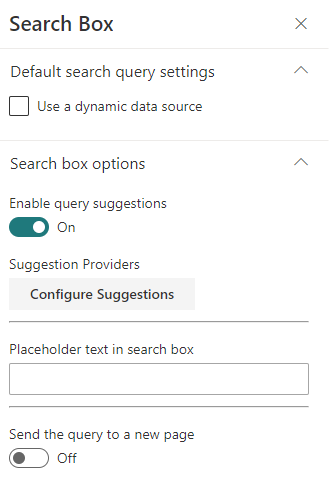
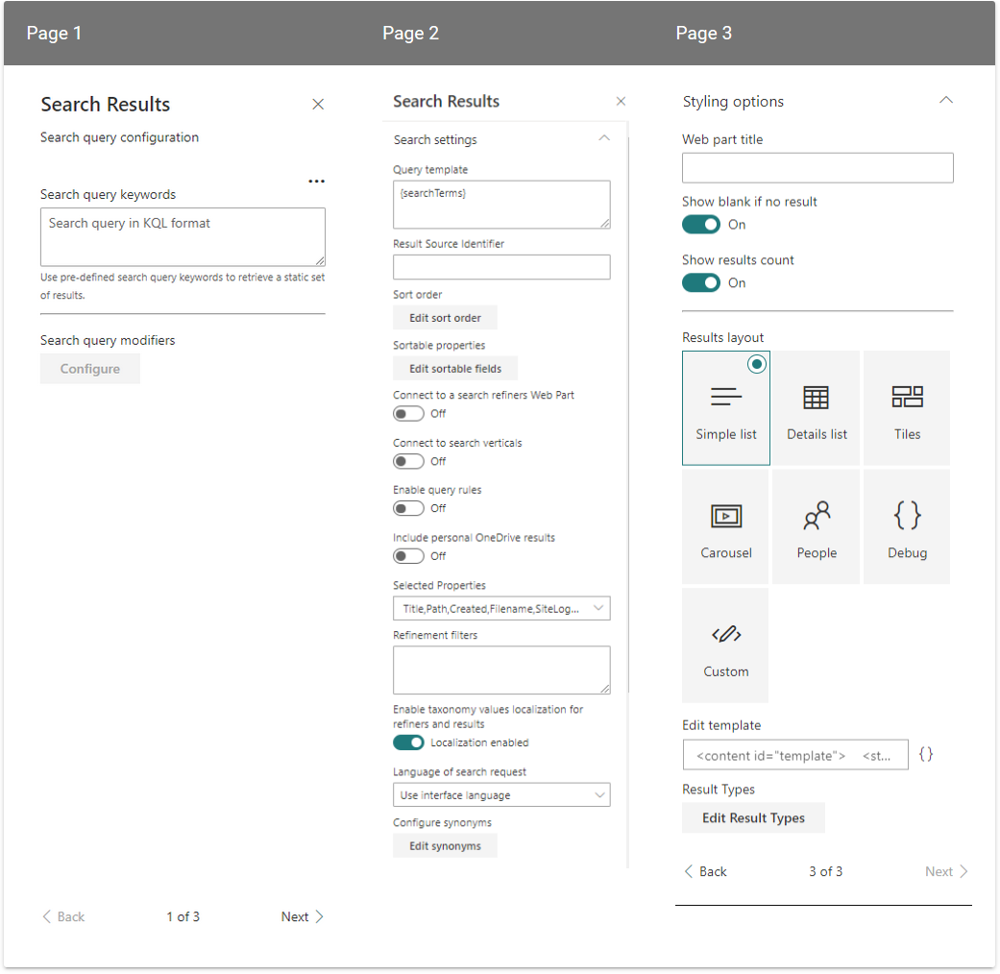
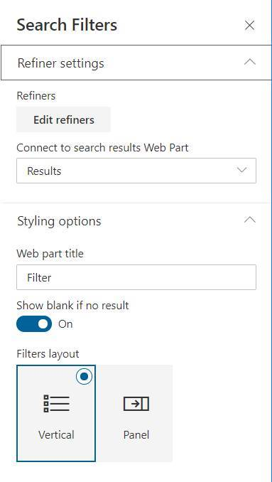
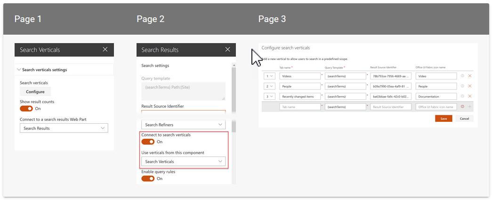

​En este artículo vamos a revisar que opciones de personalización tenemos a la hora de trabajar con Search y Modern, y veremos qué nos ofrece la solución OpenSource del PnP "PnP Modern Search".

**¿Qué tenemos de Search en Modern, Out of the box?**

Admitámoslo, *Modern* tiene muchas cosas buenas, pero, hoy en día, la búsqueda no es una de ellas. De hecho, si comparamos toda la potencia de personalización y configuración que tenemos en *classic*, donde podemos hacer cosas tan potentes y, por qué no decirlo, bonitas, como esto:

Y vamos ahora a la experiencia *Modern*, con algo como lo siguiente:

Pues, para qué negarlo, *Modern* está lejos de lo que podemos hacer en *Classic*. Seguramente estés pensando: "*vale, pero es que en Classic, para tener algo como la imagen anterior, ha habido que personalizar cosas, y hacer algo de development*" … Totalmente en lo cierto. Y ahí es a donde voy, que en *Classic*, podemos hacer toda esa personalización, y en Modern, no. Por ejemplo, respondamos las siguientes preguntas sobre Modern search:

- ¿Podemos añadir diferentes Filtros/Refiners?... NO. (sólo tenemos el Filtro por fecha de modificación).
- ¿Puedo mover el panel de filtros para que esté siempre presente, por ejemplo, a mano izquierda de la página?... NO.
- ¿Podemos añadir nuevos Verticales, por ejemplo "Videos"?... NO.
- ¿Puedo hacer que un documento de un tipo concreto se muestre con una presentación diferente al resto? NO.
- ¿Puedo cambiar la presentación de los resultados?... NO.
- ¿Puedo hacer que la caja de búsqueda del *header*, que es Out of the box, redirija la *query* de búsqueda a una página personalizada mía? … anda mira, esto SÍ!

Y es que es este último punto, unido a los WebParts search modern que nos ofrece la comunidad PnP, lo que nos va a permitir mejorar muchísimo la experiencia Modern Search, pudiendo llegar a algo parecido a la siguiente imagen:

**Redirigiendo la Query de búsqueda a nuestra propia página**

Recientemente tenemos la opción de poder redirigir la query de búsqueda desde la caja out of the box de SharePoint, a una de nuestras páginas. Esto lo podemos configurar usando la misma UI de SharePoint, desde la opción de "Search Settings".

También podemos hacer uso de los comandos PowerShell del PnP:

**Nota**: Esta configuración va a nivel de Site Collection. Esto tiene la pega de que, si estamos en otra site collection, o bien lo configuramos de nuevo sobre nuestra página (la página personalizada puede estar en cualquier otra site collection), o la query terminará en la página de resultados de búsqueda Out of the box. Es decir, que, si ya tienes, pongamos, 100 site collections, vas a tener que configurarlo 100 veces, cosa que, obviamente, podemos hacer con un script de PowerShell… pero entonces, ¿cada vez que se crea una nueva site collection, debemos lanzar el script?... es una opción, pero también podemos hacer uso de Site Scripts, y configurar un Site Script para que se ejecute siempre que se crea una site collection basadas en las plantillas out of the box de SharePoint (Team y Communication sites). Ese Site Script, deberá disparar un Flow, y ya con código, configurar la página de Search. No es algo trivial, pero solucionaría el problema. En este enlace podéis ver como configurar un Site Script a una template existente: [https://docs.microsoft.com/en-us/sharepoint/dev/declarative-customization/customize-default-site-design](https://docs.microsoft.com/en-us/sharepoint/dev/declarative-customization/customize-default-site-design)

Una vez configurado el Site para redirigir la query a nuestra página custom, tenemos que al buscar desde la search box del header, llegamos a nuestra página con esa misma query de búsqueda:​

**Search Layout page "Headerless"**

Como bien sabes, una página Modern, tiene una serie de cabeceras, que quizá no son muy apropiadas cuando lo que quieres es simplemente una página de resultados de búsqueda. Microsoft era consciente de ello, así que ahora tenemos disponible una plantilla de página que simplemente tiene la propia cabecera de Office 365 y poco más. Esta template solo es configurable por el momento usando PowerShell, y de nuevo tenemos un comando del PnP que lo pone fácil:

**Nota**: Para poder aplicar dicha template, es imprescindible que la página esté ya configurada como página de resultados de búsqueda en alguna site collection. De no ser así, el comando fallará.

**PnP Search WebParts – ¿Qué tenemos por aquí?**

Vale, ya hemos llegado a nuestra página, y ya no tenemos la página de resultados out of the box que tan poca funcionalidad nos ofrece… ¿y ahora qué?... pues bien, ahora, al ser nuestra página, podemos desarrollar una solución SPFx, y hacer llamadas a la REST API de búsqueda, y pintar los resultados como queramos, es decir, podemos hacer prácticamente lo que queramos… sin embargo, hacerlo todo de cero, puede suponer muchos días de trabajo, y es aquí donde, una vez más, el PnP entra al rescate, con una solución SPFx que ofrece WebParts de búsqueda con una funcionalidad muy potente. Podéis empezar descargando la solución desde la página: [https://microsoft-search.github.io/pnp-modern-search/search-parts/getting-started/](https://microsoft-search.github.io/pnp-modern-search/search-parts/getting-started/)

**Nota**: Ahora mismo, Microsoft no ofrece ningún WebPart de búsqueda, ni si quiera con mínima funcionalidad. Si no vas a la página de resultados out of the box, en tu página, no vas a poder hacer nada con WebParts propios de Microsoft. De hecho, el propio Microsoft lo reconoce en su documentación oficial, y te anima a usar los WebParts de búsqueda del PnP [https://techcommunity.microsoft.com/t5/microsoft-search-blog/creating-custom-search-results-pages-in-sharepoint-online/ba-p/1141515](https://techcommunity.microsoft.com/t5/microsoft-search-blog/creating-custom-search-results-pages-in-sharepoint-online/ba-p/1141515)

Para acabar el artículo, vamos a ver una rápida introducción a qué WebParts tenemos disponibles en la solución PnP, y en futuros artículos hablaremos de cada WebPart con más detalle.

**Search box**

Si no queremos reutilizar la caja de búsqueda de la cabecera, podemos utilizar este WebPart de caja de búsqueda. La ventaja es que tenemos la opción de configurar Query Suggestions (el típico Autocomplete de las cajas de búsqueda), y hacer esas Suggestions totalmente personalizadas (para ello hace falta desarrollo)

**Search results**

Aquí tenemos el WebPart estrella de la solución, y el que nos va a permitir mostrar los resultados de la búsqueda. Es tremendamente configurable y nos va a dar prácticamente control total a la hora de presentar los resultados.

El Sistema para la presentación de los resultados se basa en plantillas de Handlebars ([https://handlebarsjs.com/](https://handlebarsjs.com/)), este es un framework de plantillas muy extendido y con muchas posibilidades. Además, la solución nos va a permitir poder añadir nuestros propios componentes de ReactJS, y usar dichos componentes en las propias plantillas, por lo que tenemos casi opciones infinitas a la hora de presentar los resultados.

**Search filters**

Aquí tenemos nuestro panel de Refiners "de toda la vida" Es también muy configurable. Por el momento, no tenemos las mismas opciones de "templating" que nos ofrece el Search results WebPart, pero las que trae el propio WebPart son bastante amplias y van a cubrir la mayoría (si no todas) de nuestras necesidades.

**Search Verticals**

Este WebPart nos va a permitir configurar verticales de búsqueda (Scopes). La idea es muy sencilla, simplemente defines tu Result Source (por ejemplo, quiero un scope de búsqueda sobre todos mis Eventos, que al final no deja de ser un tipo de contenido). Este WebPart nos permite configurar dichos Scopes y los renderiza como Tabs.

Y hasta aquí nuestro artículo. Como veis, las posibilidades de personalización en modern search son tremendamente ampliadas gracias a los WebParts del PnP, pudiendo llegar a configurar auténticos Search Centres al más puro estilo classic. En próximos artículos veremos con más detalle algunos de estos WebParts, así como la manera de extender su funcionalidad.

¡Hasta el próximo artículo!

**Luis Mañez**  
Cloud Architect en ClearPeople LTD  
 @luismanez  
 [https://github.com/luismanez](https://github.com/luismanez)  