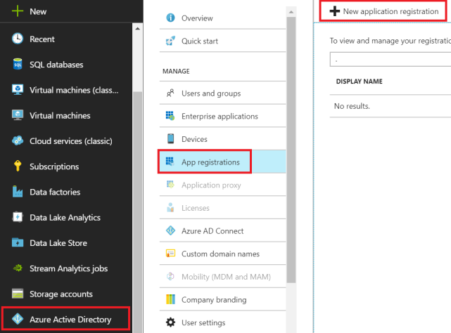
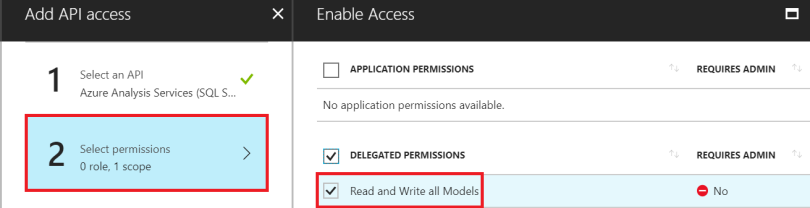

En el presente artículo nos centraremos en formas de procesamiento sobre modelos tabulares. Desde un tiempo atrás y en diversos proyectos me he encontrado con casos en los que nuestra capa semántica esta diferenciada de nuestra capa de reportabilidad.

Es por ello por lo que se me ocurrió compartir la experiencia, para que otros colegas y entusiastas de las diversas plataformas de datos puedan contar con cierto material de apoyo, y de ciertos trabajos de investigación que tuve que realizar para poder implementar en mis últimos proyectos.

A continuación, una de las arquitecturas de referencia, para que podamos conversar acerca de los componentes y servicios utilizados:

Una de las ventajas de la arquitectura presentada arriba es el hecho de automatizar totalmente el proceso de refresco de nuestro modelo de datos. Pasemos a contar los pasos que debemos realizar para la automatización del proceso.

**Creación de nuestro Registro de Aplicaciones**

****

****

****

El objetivo principal de crear un registro de aplicación es el de delegar a una cuenta (aplicación de servicio) los permisos necesarios para el procesamiento de nuestro modelos de Azure Analysis Services (AAS).

En el paso anterior lo que implementamos, una vez generada nuestra Aplicación, la delegación de permisos necesarios para que dicha App pueda leer y escribir sobre nuestros modelos de datos en AAS. Nuevamente, y a continuación lo que tenemos que hacer es generar una clave (Key) para que nuestra aplicación tenga acceso de manera segura. De dichos settings será necesario contar con nuestro App ID, Tenant ID, y valor de nuestra clave:

En este procedimiento, deberemos agregar nuestra App para que sea posible procesar modelos. Por lo tanto, debemos acceder a SQL Server Management Studio, conectarnos a nuestra instancia de Azure Analysis Services y en las propiedades de nuestra instancia, acceder a Seguridad y agregar nuestra App, en el formato de App ID y AAD ID (tenant).

La sintaxis tendrá el siguiente formato: ***app:&lt;app guid&gt;@&lt;tenant guid&gt;***

******

**Creando nuestra Logic App para el Procesamiento**

En nuestro portal de Azure buscamos Logic Apps y creamos nuestra aplicación comenzando con un disparador (Trigger) que ejecutara cada vez que un Request HTTP es recibido:

**Configuración de Logic Apps**

En nuestro siguiente paso, y luego de agregar un objeto HTTP a nuestra Logic Apps, configuramos dicha acción, utilizando un Método POST, y definiendo como URI:

**URI:*****https://&lt;region&gt;.as azure.windows.net/servers/&lt;servername&gt;/models/&lt;modelname&gt;refreshes***

En el Body, desde la documentación de la REST API de AAS accedemos a */Refreshes*que nos permitirá refrescar nuestro modelo, con varias opciones de procesamiento. Podemos procesar todo el modelo (database), una tabla específica, o incluso una partición.

En las propiedades de autenticación definimos los siguientes parámetros:

- *Tenant:* Utilizamos el AAD ID desde el registro de aplicaciones que anteriormente anotamos
- *Audiencia:* *https://\*.as azure.windows.net*
- *Client ID:* Usamos el App ID de nuestro registro de aplicación
- *Secret:* Nuestra clave de aplicación (Key)​

**Testing de nuestra Logic Apps**

Desde el diseñador de nuestra Lógic Apps, le damos clic a Run, y abrimos la acción HTTP para ver la respuesta de la REST API y el código del mensaje recibido. Luego que la Logic Apps ejecuta y está lista para ser utilizada en Azure Data Factory podremos abrir la acción de "When a HTTP request is received" y copiarnos la HTTP POST URL

**Creación de Instancia de Azure Data Factory**

En el portal de Azure nos creamos una nueva instancia de Azure Data Factory definiendo nombre, versión, suscripción, localización, y podemos hasta vincularla a un repositorio GIT.​

**Diseño de Pipeline en Azure Data Factory**

Al crear nuestra instancia de Azure Data Factory debemos dirigirnos luego a la sección de Author & Monitor para crear nuestro primer pipeline. En la pantalla de diseño vamos a crear nuestro pipeline, y simplemente arrastraremos al canvas un componente de Actividad Web.

Luego configuramos la Actividad Web:

- URL: usamos el HTTP POST URL de nuestra Logic App
- Method: POST
- Body (obligatorio): \{"message":"test"\}

Ejecutamos un Test Run para chequear el resultado:

**Definiendo Trigger en Azure Data Factory**

Si queremos que nuestro proceso corra a determinada hora, o cada cierto minuto para procesar el modelo de AAS, podemos crear un Trigger. Vamos a la opción Triggers (sección inferior izquierda de nuestra pantalla). Definimos el nombre, y descripción del trigger. Configuramos una fecha de comienzo de ejecución, y la recurrencia (minutos, horas, días, semanas, o meses).

**Conclusión**

Mediante el procedimiento que explicamos en este articulo podemos lograr automatizar totalmente el proceso de refresco de nuestros modelos tabulares. Y no solo eso, sino que además podemos agregar un repositorio y automatizar el proceso para diferentes entornos (Azure DevOps) que explicaremos en próximos artículos.

**Gastón Cruz**  
Data Platform MVP | @GastoFCruz

