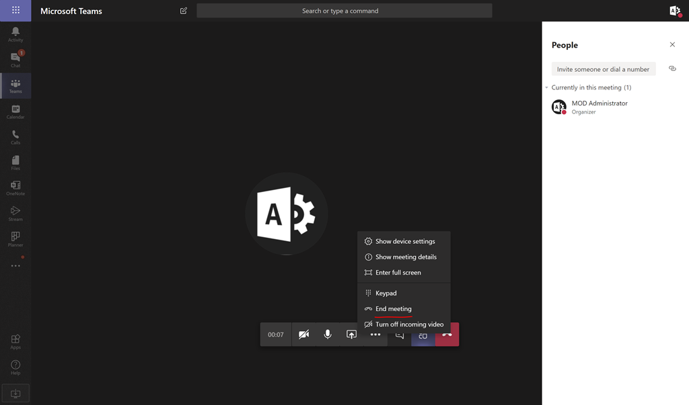
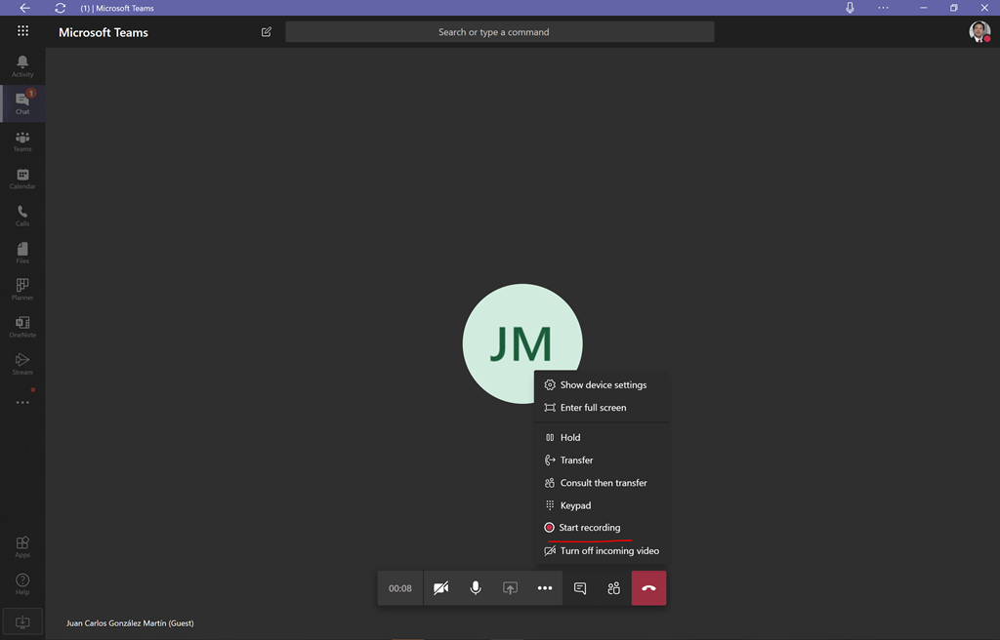
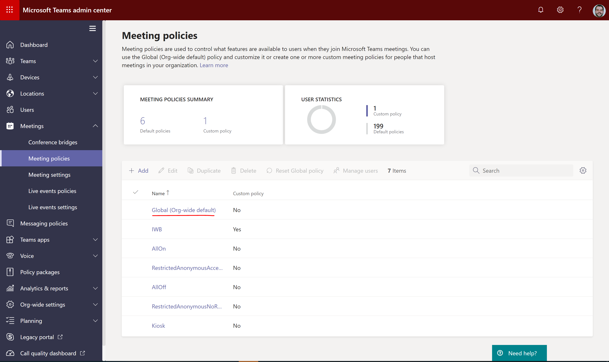
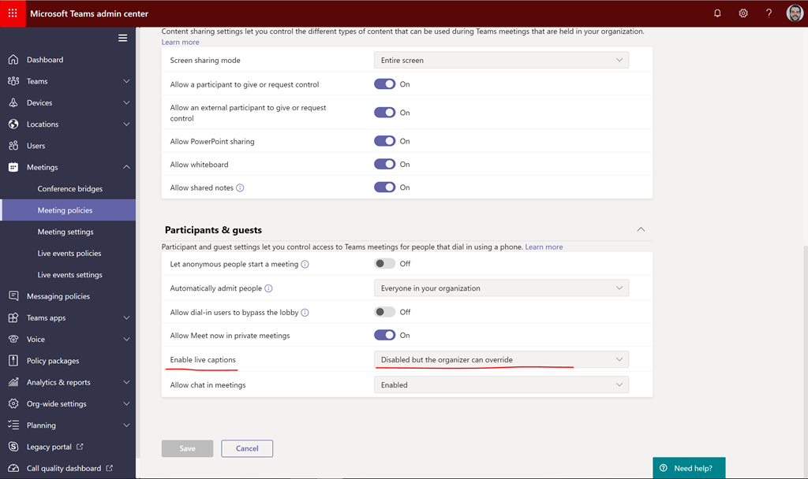
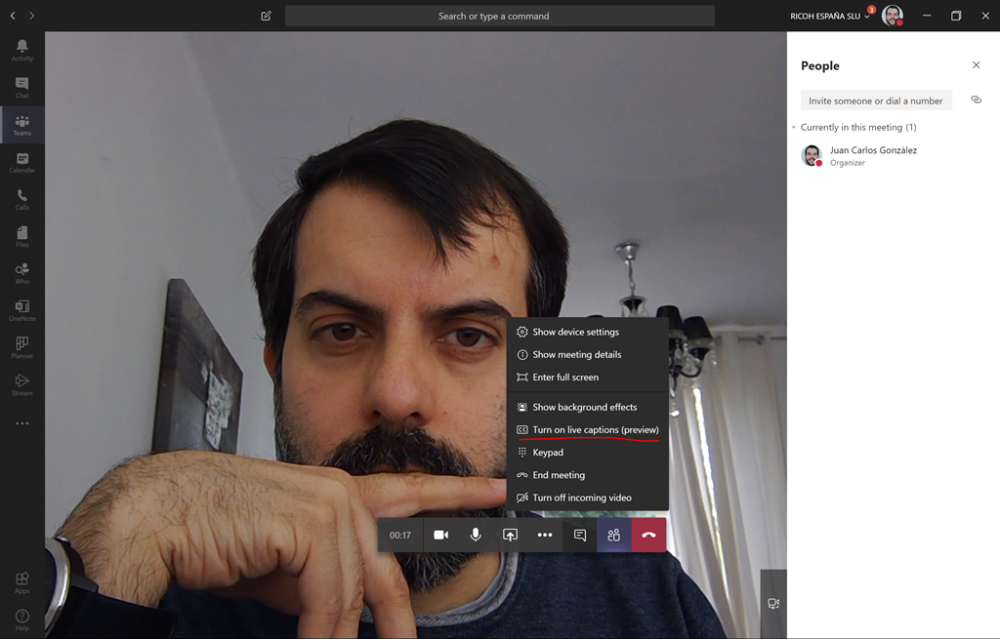
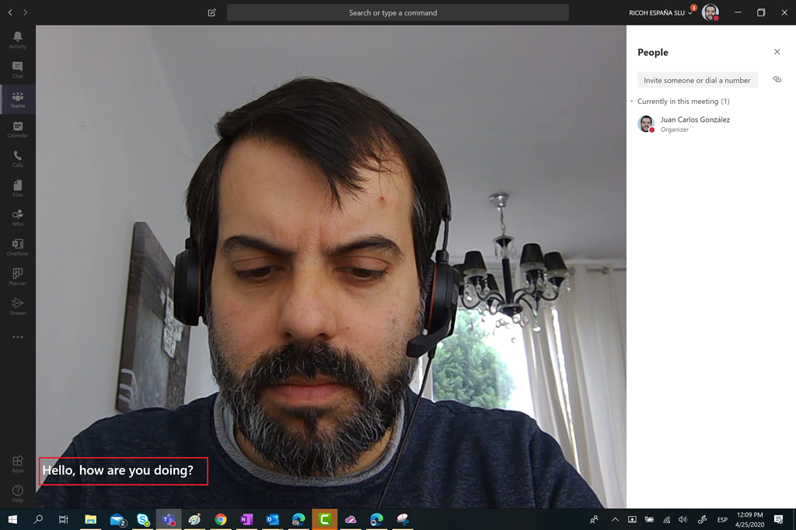
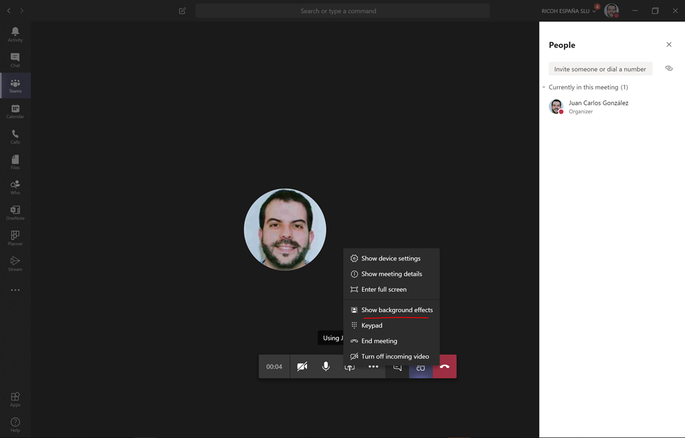
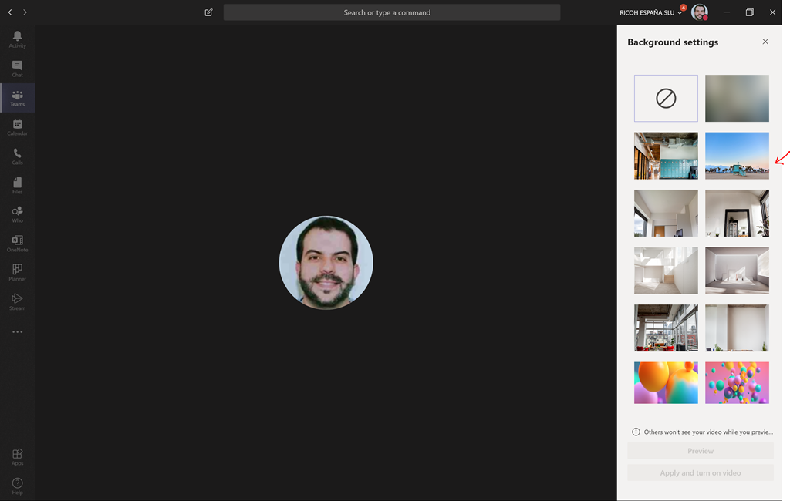
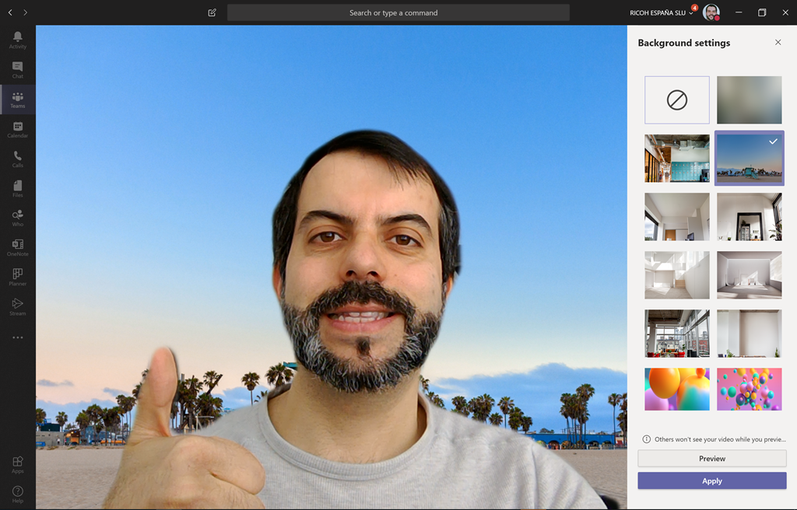
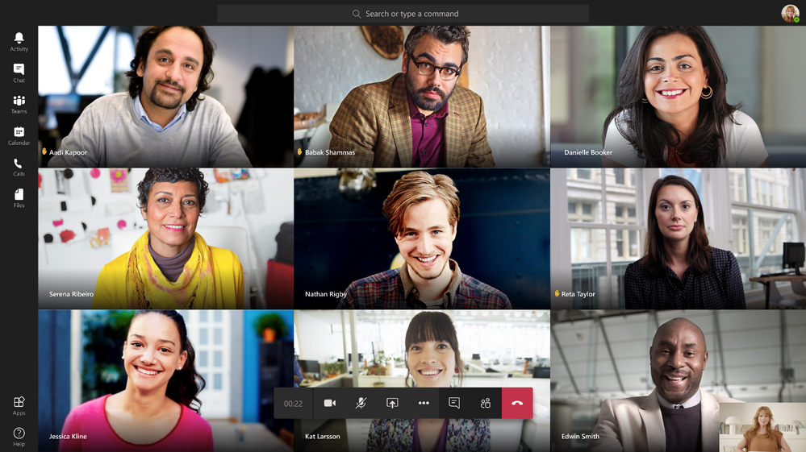

Con la irrupción de la pandemia del COVID-19 en todo el mundo, durante los últimos 2-3 meses hemos visto como muchas personas de sectores diferentes de la economía han tenido que adaptarse a la situación y pasar a trabajar de forma totalmente remota. En este escenario de trabajo en remoto o teletrabajo, Microsoft Teams está jugando un papel fundamental y también el esfuerzo realizado por Microsoft para ir liberando nuevas características de productividad en la plataforma. En este artículo haremos un repaso a algunas de las últimas novedades incorporadas por Microsoft en reuniones, llamadas y videollamadas en Microsoft Teams.

**Finalizar una reunión para todos los participantes**

Por increíble que parezca, esta funcionalidad no estaba disponible en reuniones de Teams de manera que bastaba con que una persona participando en la reunión no la abandonase para que la reunión no finalizase por horas y lo que es peor, si la reunión se estaba grabando, la grabación continuase hasta un máximo de 4 horas. Afortunadamente, Microsoft ha incorporado a la barra de opciones de reuniones de Teams la opción de "End meeting" que permite finalizar la llamada para todas las personas participantes.

**Grabación de llamadas y video-llamadas en Chats privados 1:1**

Cuando se realizaba una llamada o video-llamada en un Chat privado 1:1 no era posible realizar su grabación. Microsoft solo permitía grabar llamadas y video-llamadas de Chats privados 1:N.  Por suerte contamos desde ya con esta funcionalidad en llamadas y video-llamadas en Chats privados 1:1 de manera que la grabación será guardada en el servicio de Microsoft Stream.

**Live Captions en reuniones, llamadas y vídeo-llamadas**

Sin duda, otra característica super útil en estos tiempos en los que gran parte del trabajo se realiza de forma remota. Live Captions no es una característica nueva de Teams, sino que lleva ya un tiempo en preview y lo que permite es mostrar en pantalla el texto de la persona que habla. Actualmente Live Captions solo soporta el idioma inglés y para comenzar a probarla, tenemos que habilitar esta funcionalidad en el Teams Admin Center o por medio de PowerShell. Para habilitar Live Captions en el Teams Admin Center:

- Accedemos al Teams Admin Center y a continuación en la sección de Meetings hacemos clic en Meetings policies. En mi caso lo que he hecho es configurar la directiva de reuniones global.

- En la página de detalle de la directiva de reunión, localizamos la sección de Participants & guests y cambiamos el setting de Enable live captions de su valor por defecto al valor "Disabled but the organizar can override".

Una vez que hemos habilitado Live Captions en el Teams Admin Center, solo nos queda probarlo en una reunión, llamada o vídeo-llamada de Teams:

- Cuando estamos en la reunión, llamada o vídeo-llamada veremos que aparece una nueva opción "Turn on live captions (Preview)":

- Una vez que hemos hecho clic en la opción indicada, cuando empecemos a hablar veremos los subtítulos. Obviamente, para que Teams nos entienda, tendremos que hablar en inglés.

**Fondos personalizados en reuniones y vídeo-llamadas de Teams**

He dejado casi para el final del artículo una de las nuevas características en reuniones y vídeo-llamadas de Teams que más "furor" ha causado desde que fue liberada por Microsoft durante el mes de abril: la posibilidad de añadir imágenes de fondo personalizadas cuando realizamos una vídeo-llamada o participamos en una reunión en la que tenemos habilitada la cámara de nuestro dispositivo. Respeto a esta característica:

- Sólo está disponible por el momento en el cliente de escritorio de Teams para Windows 10 y en el cliente para MAC, es decir, no está soportado ni en el cliente web ni en los clientes móviles para iOS y Android. Tampoco está soportado si Teams se ejecuta en entornos VDI.
- Se tienen que cumplir ciertos pre-requisitos:
    - El equipo en el que utilizamos Teams soporte para "Background Blur" y además a nivel de hardware es necesario disponer de una CPU con soporte para AVX2 (Advanced Vector Extensions 2). Para más detalles de los requerimientos hardware de Microsoft Teams, os recomiendo este artículo de la documentación de Microsoft: [https://docs.microsoft.com/en-us/microsoftteams/hardware-requirements-for-the-teams-app](https&#58;//docs.microsoft.com/en-us/microsoftteams/hardware-requirements-for-the-teams-app)
    - El cliente de Teams esté actualizado (**Nota**: Si no lo está, puedes forzar la actualización desde tu perfil de usuario en Teams) a la versión 1.3.00.8863 o superior.
    - A nivel de tenant de Microsoft 365 tenemos la actualización relativa esta característica.

Si cumplimos con todos los requerimientos para disponer esta característica, estamos listos para su uso:

- En una Vídeo-Llamada o reunión de Teams con vídeo habilitado, tendremos la opción "Show background effects".

- A continuación, se abre un panel en el que podremos ver la galería de imágenes pre-cargadas por Microsoft para utilizar de fondo o bien las que hayamos cargado para usar en Teams (Más adelante se explica cómo cargar nuestras propias imágenes de fondo):

- Seleccionamos una imagen a utilizar de fondo y hacemos clic en "Apply and turn on video" de manera que la imagen de fondo se aplique ocultando el fondo real de la habitación en la que nos encontremos.

Para hacer uso de nuestras propias imágenes personalizadas de fondo (Por ejemplo, si somos fans de Star wars podemos utilizar los fondos oficiales disponibles en el siguiente enlace: [https://www.starwars.com/news/star-wars-backgrounds](https&#58;//www.starwars.com/news/star-wars-backgrounds)) sólo tenemos que cargar los mismos en las siguientes rutas:

- Equipos Windows 10: *%AppData%\Microsoft\Teams\Backgrounds\Uploads*
- Equipos MAC: */users/&lt;username&gt;/Library/Application Support/Microsoft/Teams/Backgrounds/Uploads*

**Lo que está por venir (o ya tendremos disponible cuando este artículo esté publicado)**

En el momento de redacción de este artículo (3 de mayo), Microsoft ha anunciado nuevas funcionalidades para reuniones de Teams que a lo largo del mes irán apareciendo en nuestro tenants. En concreto:

- Visualización de forma simultánea de hasta 9 participantes en reuniones de Teams frente a los 4 actuales:

- Levantar la mano para solicitar el turno de palabra: la barra de opciones de reuniones de Teams incorpora la opción de solicitar el turno de palabra de forma que en el listado de participantes y también en la reunión se verán identificadas las personas que solicitan el turno de palabra.

- Difuminar la imagen de fondo cuando participamos en reuniones utilizando un dispositivo iOS.
- Soporte para Live captions en dispositivos iOS y Android.

**Conclusiones**

En este artículo se ha realizado un repaso a las últimas novedades incorporadas por Microsoft a reuniones, llamadas y vídeo-llamadas en Teams que facilitan enormemente la productividad en escenarios de trabajo en remoto y teletrabajo como los que ha ocasionado la crisis del COVID-19.

**Juan Carlos González**  
Office Apps & Services MVP | Microsoft 365 SME  
@jcgm1978