import ArticleHeader from '../../../components/article-header'

<ArticleHeader frontmatter={props.pageContext.frontmatter} />

El pasado mes de noviembre se presentó el que será el mayor lanzamiento de Microsoft 365 desde que, hace tres años, se lanzara Microsoft Teams. Project Cortex permitirá distribuir y mejorar el conocimiento y la experiencia de los usuarios en los servicios más populares que utilizan a diario, dando a SharePoint, a Microsoft Teams y a Office capacidades de IA que permitan generar redes de conocimiento.

**¿Qué es Project Cortex?**

Project Cortex será un nuevo servicio de Microsoft 365 que permitirá aprovechar mucho mejor el conocimiento almacenado en la plataforma y el conocimiento que tienen los usuarios de una organización gracias a sus capacidades de IA. El nuevo servicio permitirá diseñar una knowledge network distribuida a lo largo de Microsoft 365 y de todos sus servicios.

Project Cortex utiliza tres piezas clave que son fundamentales:

- **Microsoft Graph**: proporcionará información y contenido almacenado en Microsoft 365, así como datos centrados en las personas, su trabajo, relaciones y experiencia (Imagen 1).
- **SharePoint**: será el almacén del contenido, la información y documentación que Project Cortex utilizará como base del conocimiento. Además, será el motor de portales en los que se mostrará la información de las knowledge centers (Imagen 2).
- **Microsoft AI**: permitirá automatizar la captura, categorización y administración del contenido de Microsoft 365 gracias a herramientas que se integrarán en el servicio como AI Builder.

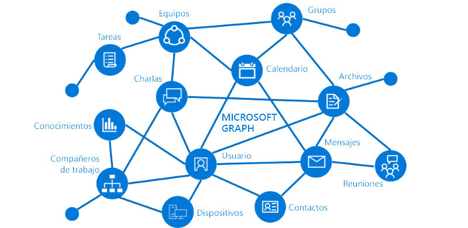

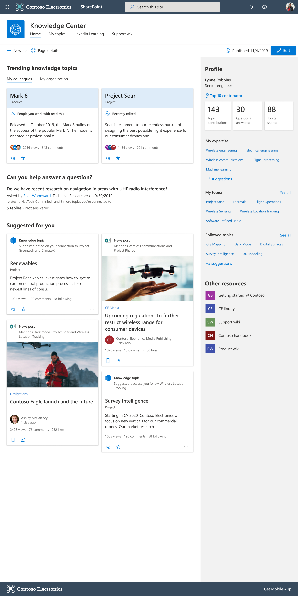

**Las piezas clave de Project Cortex**

Organizar el contenido de forma inteligente puede ser todo un reto. Los usuarios pueden almacenar en Microsoft 365 contenido tanto estructurado como desestructurado. Project Cortex aplica la IA para organizar automáticamente el contenido almacenado utilizando distintos mecanismos y modelos que pueden ser automáticos o configurados por los usuarios.

La unidad básica de Project Cortex es el topic (o tema). El servicio permitirá reconocer tipos de contenido, extraer información importante y organizar el contenido en topics.

Microsoft ha anunciado que, de momento, estos topics podrán consumirse desde Outlook, las aplicaciones de Office, SharePoint, Microsoft Teams y Microsoft Search (Imagen 3).​

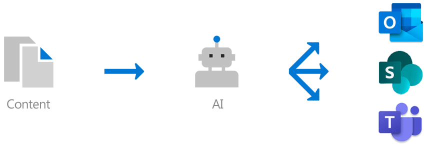

Los topics aparecerán destacados en los distintos servicios de la plataforma. Cuando un usuario haga clic en ellos, podrá visualizar información inteligente generada a partir de la información que se tiene sobre el topic (Imágenes 4 y 5).

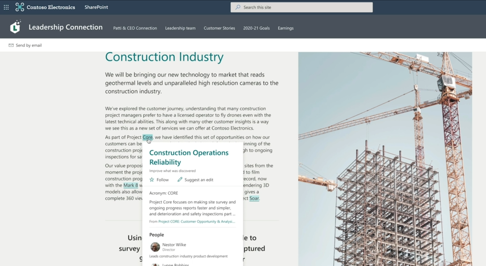

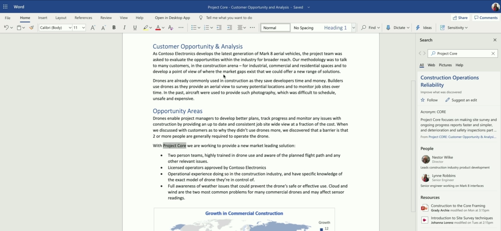

**¿Cómo se extrae el contenido inteligente?**

El contenido que Project Cortex utiliza para crear los topics y toda la información asociada a éstos se extrae de tres formas distintas:

- **Automáticamente**: el servicio podrá escanear repositorios y categorizar la información de manera automática.
- **Mediante modelos de AI Builder**: Microsoft integrará AI Builder en la interfaz de las bibliotecas de SharePoint para que los usuarios o los administradores creen modelos con los que categorizar la información.
- **Manualmente**: los usuarios podrán crear sus propios topics desde algunos servicios para añadir información de forma manual (para mostrar información por ejemplo de un proyecto, de un evento, una iniciativa…).

Para entender el funcionamiento de estas clasificaciones, Microsoft ha mostrado algunos ejemplos de categorización utilizando AI Builder. Este servicio forma parte de la Power Platform y permite diseñar modelos inteligentes a partir de datos estructurados o desestructurados para localizar información de forma inteligente.

Para más información sobre AI Builder, recomiendo el artículo de Ferrán Chopo en CompartiMOSS nº 43.

Durante el anuncio oficial de Project Cortex, Microsoft mostró cómo el servicio de AI Builder quedará integrado en la interfaz de las bibliotecas de SharePoint. La ubicación es la misma que la de otros servicios como Power Automate o Power Apps, en la cinta de opciones de la biblioteca (Imagen 6).

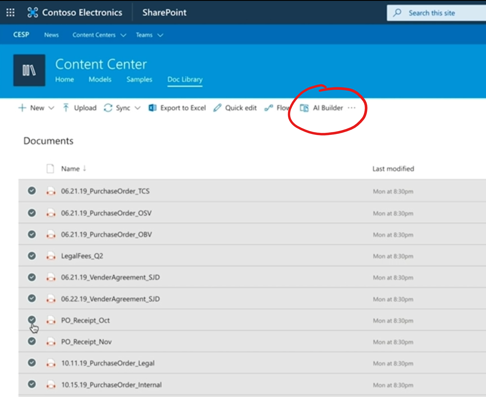

Utilizando AI Builder desde una biblioteca de SharePoint, podremos diseñar modelos que utilicen servicios cognitivos sobre nuestros documentos para hacer cosas como capturar contenido, extraer información y clasificar o taggear automáticamente. Esta información quedará almacenada en campos de la biblioteca. De momento sabemos que podremos contar con:

- **Image and text recognition** para identificar objetos o textos en documentos escaneados o en imágenes que se hayan cargado en una biblioteca.
- **Forms Processing** que permite diseñar un modelo a partir de documentos que sean similares, extrayendo información de campos clave para ser alimentadas en la biblioteca de documentos como metadatos.
- **Machine Teaching** que es muy útil para reconocer información de forma inteligente en documentos con contenido desestructurado como contratos, propuestas o recursos de formación. Estos documentos tienen variedades de formatos y distribución. Del mismo modo que se puede enseñar a una persona a rastrear contenido en documentos y etiquetarlos, ahora se puede enseñar a la IA, creando un modelo reutilizable basado en un pequeño subconjunto de documentos de muestra.

Cuando se seleccione una serie de documentos y se pulse en el botón de AI Builder, se lanzará la interfaz del servicio de AI Builder integrada en SharePoint. Durante la presentación del servicio, Microsoft mostró una demostración de Forms Processing.

Imaginemos que tenemos una biblioteca llena de facturas que siguen la misma estructura. Al tratarse de contenido estructurado, podemos suponer que el mismo tipo de información se encontrará en las mismas ubicaciones del documento. Aprovechando esto, el servicio encontrará datos de forma inteligente que se podrán mapear con campos de la biblioteca. Esto hará que podamos popular la biblioteca con metadatos de forma automática (Imagen 7).​

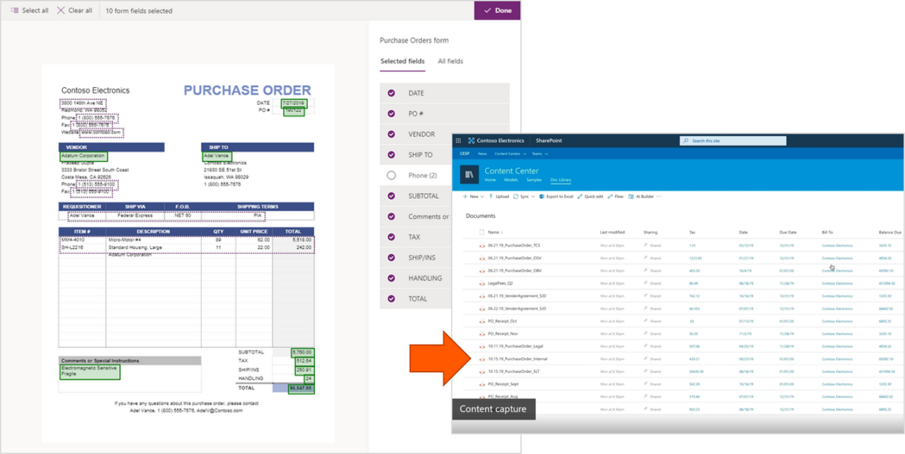

Del mismo modo que Forms Processing es útil para contenido estructurado, podremos utilizar Machine Teaching para entrenar a la inteligencia y obtener datos en documentos con contenido desestructurado.

Estos campos o metadatos de las bibliotecas ayudarán a Project Cortex a categorizar la información y a detectar y generar nuevos topics y todo su contenido relacionado.

**Visualizando el contenido**

Ahora que hemos repasado el concepto del topic y que hemos aprendido los distintos mecanismos automáticos, inteligentes y manuales que lo pueden generar, es el momento de conocer las distintas formas de visualizar la información relativa a estos topics.

El primer mecanismo de visualización son los topic cards, que aparecerán automáticamente en los distintos servicios de Office 365 cuando se detecte un topic.

Si el usuario está leyendo un mail en Outlook, un documento en Word, una página en SharePoint o una conversación en Teams... verá palabras destacadas cuando coincidan con un topic.

Al desplegar esa palabra, aparecerá el topic card (Imagen 8) en el que Cortex mostrará contenido sobre el topic, una descripción, relaciones, personas que trabajan o relacionadas con el topic, documentos asociados, vídeos, etc.

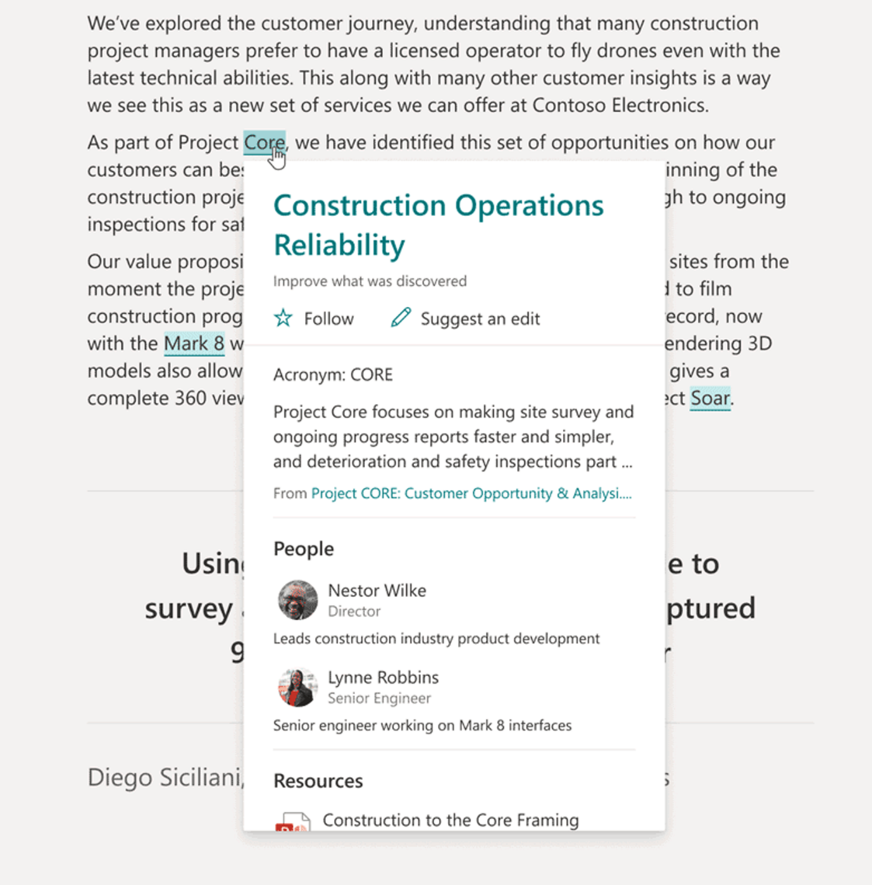

La información que muestra Project Cortex puede estar relacionada con las personas gracias al uso de Microsoft Graph. El segundo mecanismo de visualización consiste en una integración de topics dentro de las people cards que ya existen en muchos servicios de Microsoft 365.

Los people cards ayudarán a identificar fácilmente quién está trabajando en qué dentro de la organización. Project Cortex pedirá automáticamente a los usuarios que añadan topics basándose en el trabajo que hacen, ayudándoles a mantener un perfil actualizado (Imagen 9).

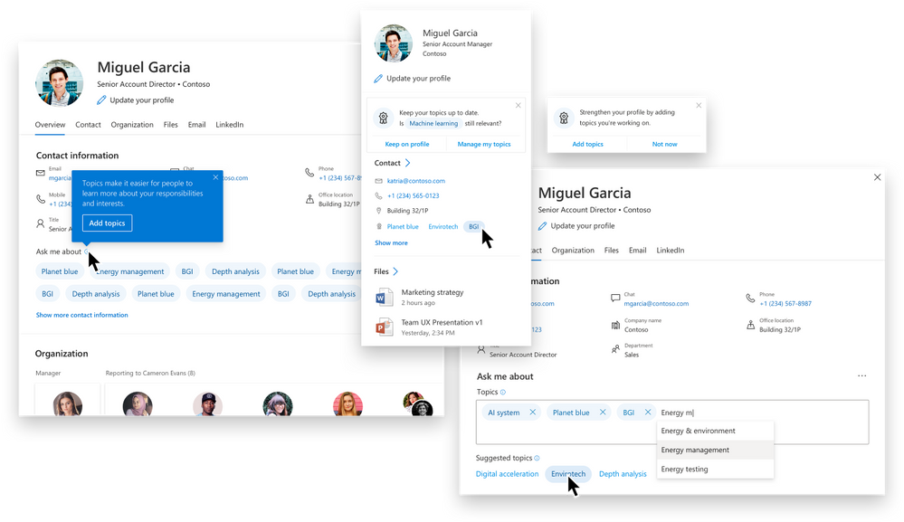

El siguiente mecanismo de visualización son las topic pages, que son páginas de SharePoint en las que Project Cortex muestra información ampliada sobre un topic.

Project Cortex genera automáticamente topic pages a partir del contenido relacionado con un topic gracias al uso de la AI. Además de la auto generación, se permitirá a los usuarios que editen las páginas existentes para completarlas y que generen nuevas páginas para añadir topics, tal y como se hace en una wiki. De esta forma, se podrá ir incorporando conocimiento desde distintas fuentes.

Las topic pages serán totalmente editables, incluyendo webparts creadas especialmente para ampliar la base de datos de conocimiento (Imagen 10).​

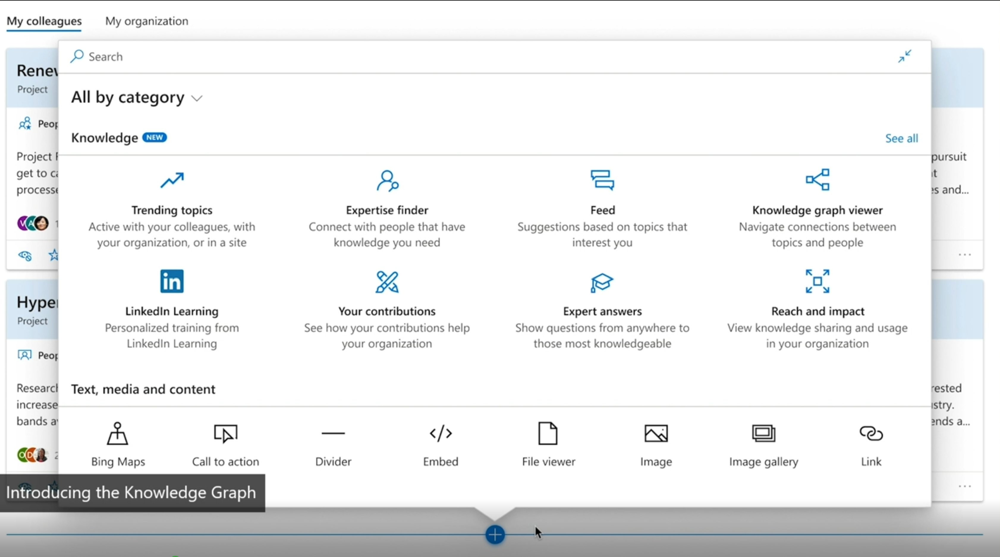

Finalmente, las topic pages se agruparán en los knowledge center, eje central de Project Cortex. Los knowledge center serán sitios de SharePoint que proporcionarán una visualización del contenido relevante para toda la organización (Imagen 11).

Se podrá crear un knowledge center principal y, adicionalmente, crear knowledge centers orientados en topics concretos. Los knowledge center se podrán integrar en el resto de los portales de SharePoint.

​

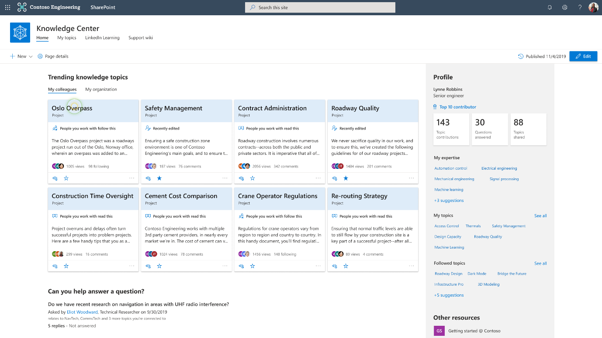

**El nuevo servicio de metadatos de SharePoint Online**

Para soportar todos los metadatos que se generan automática o manualmente, Microsoft ha diseñado un nuevo servicio de Metadatos Administrados (Managed Metadata Service), que proporciona metadatos a todos los servicios de Microsoft 365 y no sólo a SharePoint (Imagen 12).

Este nuevo servicio soporta la creación de términos, sinónimos y traducciones multi lenguaje. Además, soporta hasta 1 millón de términos por tenant y cuenta con galerías de tipos de contenido y con métricas y analíticas que ayudarán a comprender mejor el uso que se está haciendo de los metadatos.

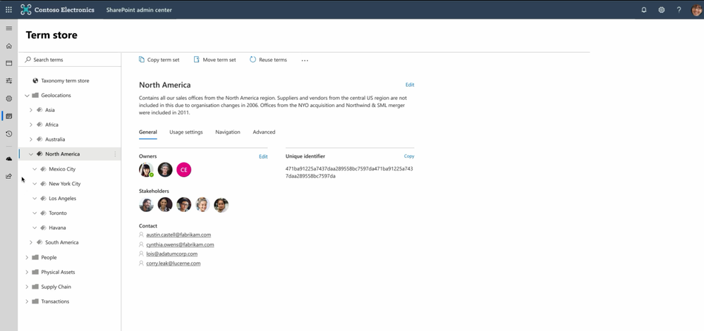

El nuevo servicio de metadatos se ha empezado a desplegar en los tenants en Targeted Release desde el pasado mes de abril. Puedes consultar más detalle en [https://techcommunity.microsoft.com/t5/microsoft-sharepoint-blog/modernizing-sharepoint-managed-metadata-services-mms/ba-p/1277450](https&#58;//techcommunity.microsoft.com/t5/microsoft-sharepoint-blog/modernizing-sharepoint-managed-metadata-services-mms/ba-p/1277450)

**Demostraciones**

Aunque el servicio de Project Cortex no está disponible, Microsoft quiere que nos empecemos a familiarizar con algunos conceptos. Para ello, han publicado dos demos interactivas sobre alguna de las características que hemos tratado en este artículo. Recomendamos probarlas:

**Primera experiencia con Project Cortex**: [https://demobuilderwebcpptxz.blob.core.windows.net/demo-v2/startdemo.html](https&#58;//demobuilderwebcpptxz.blob.core.windows.net/demo-v2/startdemo.html)

**Organize knowledge**: [https://demobuilderwebcpptxz.blob.core.windows.net/automatically-connect-and-organize-knowledge/startdemo.html](https&#58;//demobuilderwebcpptxz.blob.core.windows.net/automatically-connect-and-organize-knowledge/startdemo.html)

**Content capture**: [https://demobuilderwebcpptxz.blob.core.windows.net/machine-teaching-with-project-cortex-un-microsoft-365-mucho-mas-inteligente/startdemo.html](https&#58;//demobuilderwebcpptxz.blob.core.windows.net/machine-teaching-with-project-cortex-un-microsoft-365-mucho-mas-inteligente/startdemo.html)

**Referencias y material adicional**

Para la elaboración de este artículo he utilizado toda la información pública que Microsoft mostró en el pasado Ignite 2019, celebrado en noviembre. Si quieres conocer más detalle, no puedes perderte estos dos enlaces del evento:

- Innovaciones en SharePoint, OneDrive y Office. Keynote de Jeff Teper en Ignite: [https://myignite.techcommunity.microsoft.com/sessions/81522](https&#58;//myignite.techcommunity.microsoft.com/sessions/81522)
- Introducing Project Cortex: [https://techcommunity.microsoft.com/t5/microsoft-365-blog/introducing-project-cortex-un-microsoft-365-mucho-mas-inteligente/ba-p/966091](https&#58;//techcommunity.microsoft.com/t5/microsoft-365-blog/introducing-project-cortex-un-microsoft-365-mucho-mas-inteligente/ba-p/966091)

Además del material de Ignite 2019, me han sido de mucha utilidad la web y el blog oficiales de Project Cortex, donde puedes encontrar enlaces a multitud de recursos online:

- Web oficial: [http://aka.ms/ProjectCortex](http&#58;//aka.ms/ProjectCortex)
- Project Cortex blog: [https://techcommunity.microsoft.com/t5/project-cortex-un-microsoft-365-mucho-mas-inteligente-blog/bg-p/ProjectCortexBlog](https&#58;//techcommunity.microsoft.com/t5/project-cortex-un-microsoft-365-mucho-mas-inteligente-blog/bg-p/ProjectCortexBlog)

Si has llegado hasta aquí, espero que este artículo te haya sido de utilidad. Nos espera un periodo muy emocionante a todos los profesionales y amantes de Microsoft 365 y de SharePoint. La IA llega a la plataforma para quedarse.

**MIGUEL TABERA PACHECO**  
 Modern Workplace offering lead en Avanade Iberia  
 MVP de Office Apps & Services  
 [@migueltabera](https&#58;//twitter.com/migueltabera)  
 [linkedin.com/in/miguel-tabera](https&#58;//www.linkedin.com/in/miguel-tabera/)  

