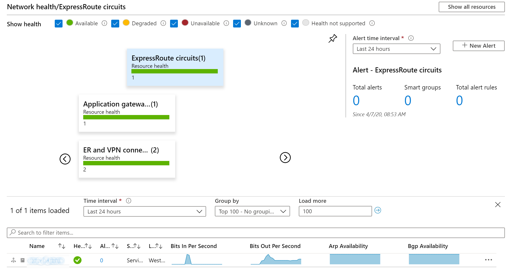
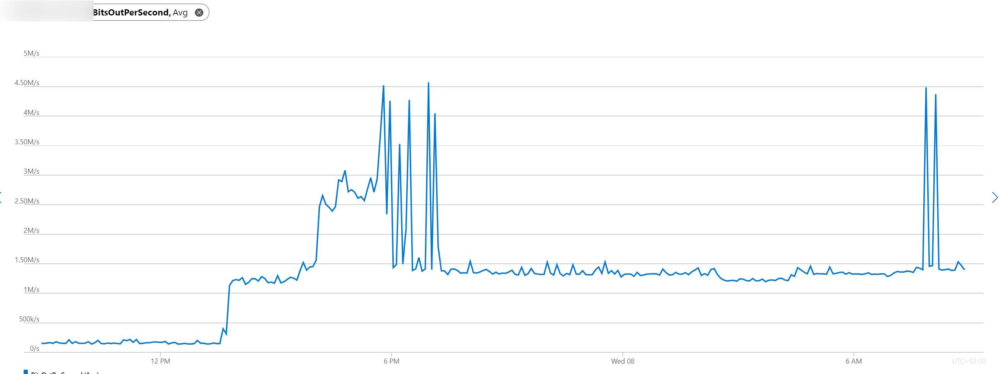
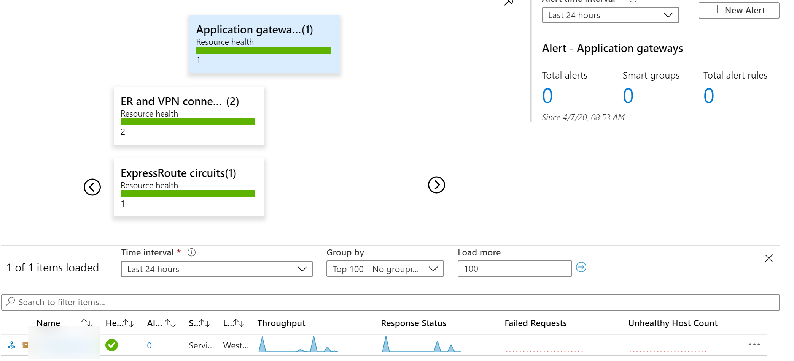
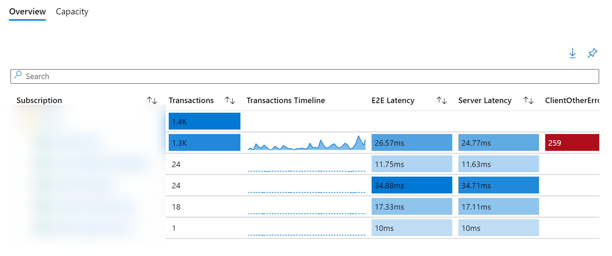
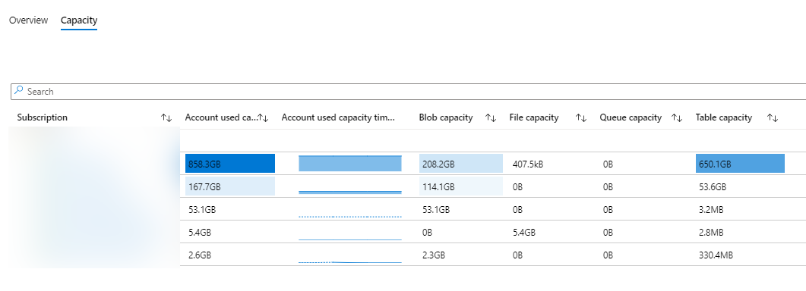

En este artículo vamos a repasar un par de características que se suelen pasar por alto en las suscripciones de Azure, estas dos características están incluidas dentro del Azure Monitor, y pese a que están actualmente en Preview, nos serán muy útiles para conocer de primera mano toda la información referente a nuestra suscripción.

**Azure Monitor – Networks**

En todos los proyectos, como norma general y buena práctica, deberíamos de implementar dashboards de monitorización, con ello, lo que nos permite es hacer monitorización a través de todas las suscripciones del estado de salud de nuestras redes. Y desde este punto de partida, empezar a navegar por cada parte de nuestro NW e investigar si hay algún fallo, exceso de tráfico o simplemente, observar el tráfico y si lo debemos de mejorar de alguna forma.

Algo que suelo utiliza mucho para ello, es el apartado de Networks incluido dentro de Azure Monitor, por ejemplo, podemos ver qué información nos da de primeras:

Y si hacemos clic en cada una de las gráficas, podemos observar sus datos sin problema

De la misma forma, podemos ver el estado de cada uno de los recursos que tenemos implementados en el portal, o bien de un solo vistazo ver si tenemos alguna alerta asociada al recurso en cuestión:

**Azure Monitor - Storage Accounts**

Por otro lado, pero no menos importante, es la ventaja que nos ofrece Azure Monitor para poder ver la información de las storage accounts y la información que se puede extraer de sus métricas. Lo primero que podemos observar, es que nos permite ver un overview:

Donde nos permite ver de un solo vistazo información esencial de las storage account, como puede ser la latencia, transacciones. De manera que, en función de esta info, tomemos decisiones al respecto. Y la capacidad de estas:

Donde obviamente, podemos ver la capacidad y sobre todo por cada tipo de almacenamiento, cuanto estamos ocupando. Algo muy útil, ya que estamos pagando por almacenamiento ocupado 😉

Con estas dos pequeñas gemas que tenemos en el portal, podremos tener más información de lo que está pasando en nuestras suscripciones.

**Alberto Andrés**  
Cloud Solutions Architect  
@albandrod  