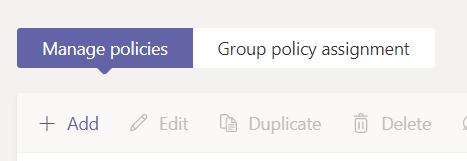
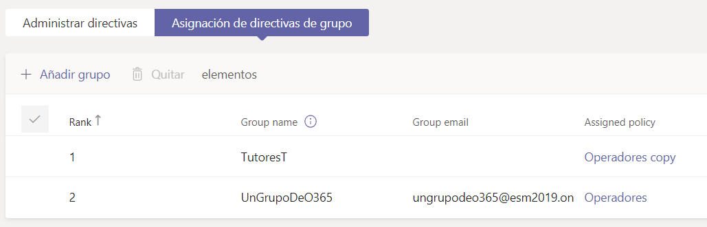
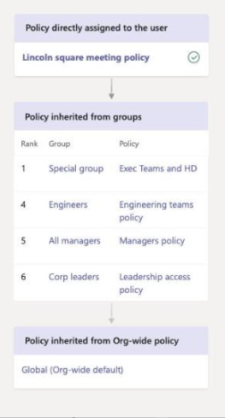

Hace poco he tenido que preparar un tenant para el correcto despliegue
de Teams en una compañía con más de 800 usuarios. Su idea era activar o
desactivar ciertas funcionalidades de Microsoft Teams en función del
perfil del usuario. Como tenían tres perfiles diferentes, lo que hicimos
es crear tres políticas diferentes en cada uno de los apartados del
centro de administración de Teams y establecer en cada política las
funcionalidades a las que podría acceder el usuario.

Para facilitar la administración de estas políticas, se crearon tres
grupos en el Directorio Activo (DA) de la compañía que contenían los
usuarios de cada uno de los tres perfiles.

Actualmente dentro de Teams hay una serie de políticas que se pueden
asignar directamente a un grupo de Microsoft 365. Cuando accedamos a
ellas, se mostrará la opción de 'Group policy assignment' (o
'*Asignación de directivas de grupo*' si lo visualizas en español):




Al acceder a esa pestaña, lo único que hay que hacer es añadir el grupo
y asignarle la política. Se establece también un orden (*rank*) que
indica qué política actuará primero en caso de que el usuario
perteneciese a varios grupos.




Hay que tener en cuenta que las políticas se aplican a los usuarios
siguiendo una jerarquía. Prevalecen las que se apliquen a un usuario de
forma directa (Direct) y posteriormente las que se asignen a través de
grupos (en el orden del ranking). Si el usuario no tiene ninguna
política asignada de estos dos tipos, se le aplicará la política Global
de la compañía (Org-wide default). Se puede ver en el siguiente esquema:




El problema que me encontré es que, actualmente, hay una serie de
políticas en Teams que no se pueden asignar a través de grupos, sino que
hay que hacerlo de forma directa. Os pongo un listado de las políticas y
si es posible asignarlas a través de grupos, bien sea a través del
Centro de Administración de Teams, o con PowerShell:

  | POLÍTICA                                                            | CENTRO ADMIN TEAMS   | POWERSHELL
  | ------------------------------------------------------------------- | -------------------- | ------------
  | Meeting policy (CsTeamsMeetingPolicy)                               | SI                   | SI
  | Messaging policy (CsTeamsMessagingPolicy)                           | SI                   | SI
  | Live events policy (CsTeamsMeetingBroadcastPolicy)                  | SI                   | SI
  | App permission policy (CsTeamsAppPermissionPolicy)                  | NO                   | NO
  | App setup policy (CsTeamsAppSetupPolicy)                            | NO                   | SI
  | Call park policy (CsTeamsCallParkPolicy)                            | SI                   | SI
  | Calling policy (CsTeamsCallingPolicy)                               | SI                   | SI
  | Caller ID policy (CsCallingLineIdentity)                            | NO                   | NO
  | Teams policy (CsTeamsChannelsPolicy)                                | SI                   | SI
  | Emergency calling policy (CsTeamsEmergencyCallingPolicy)            | NO                   | NO
  | Emergency call routing policy (CsTeamsEmergencyCallRoutingPolicy)   | NO                   | NO
  | Dial plan (CsTenantDialPlan)                                        | NO                   | NO
  | Voice routing policy (CsVoiceRoutingPolicy)                         | NO                   | NO

Para poder hacer la asignación de forma masiva en el caso de las
políticas que no se asignan mediante grupos (a través del Centro de
Administración), programé un script de PowerShell que me facilitase esa
labor. Se trata de sacar los usuarios de uno de esos grupos del M365 y
recorrer los usuarios para ir asignándoles las políticas de forma
directa.

Os pongo alguna de las líneas para que podáis utilizarlas si os veis en
la misma problemática que yo:

-   En primer lugar, cargamos los módulos necesarios:

```
#Instalación del módulo de Teams y Skype

Install-Module -Name MicrosoftTeams

Import-Module SkypeOnlineConnector
```

-   En un Array guardamos todas las políticas que se asignan a nivel de
    Usuario (en mi caso, sólo necesitaba asignar 4 porque en las otras
    se utilizan las Globales):

```
$DirectPoliciesTypes = @('TeamsAppPermissionPolicy',
'TeamsAppSetupPolicy', 'CallingLineIdentity',
'TeamsEmergencyCallingPolicy' )
```

-   En otra variable guardo el nombre de la política a aplicar (en mi
    caso llamé igual a todas):

```
$namePolicy = "NAMEPOLICY"
```

-   Ahora hacemos la conexión (en la variable adminUser ha de estar un
    usuario con permisos de administrador de Microsoft Teams):

```
$creds= Get-Credential -UserName $adminUser -Message "Credenciales
del usuario."

$connAz = Connect-AzureAD -Credential $creds

$connTeams = Connect-MicrosoftTeams -Credential $creds

$sfbSession = New-CsOnlineSession -Credential $creds

Import-PSSession $sfbSession
```

-   Obtenemos los usuarios (miembros) del grupo que queramos (variable
    grupoAD):

```
$myGr=Get-AzureADGroup -Filter "DisplayName eq '$($grupoAD)'"

$members= Get-AzureADGroupMember -ObjectId $myGr.ObjectId -All 1
```

**NOTA**: Se incluye -All 1 para que nos devuelva todos los miembros del
grupo. Si no se incluye este parámetro, sólo nos devolverá los 100
primeros.

-   Ahora recorremos todos los miembros que tenemos en members y le
    asociamos la política de forma directa. Esto sólo lo haremos si no
    la tenía ya aplicada, por eso primero obtendremos qué política tiene
    y, si no es igual, se la asociamos:

```
$n=0 #Se utilizará para ir contando los miembros del grupo

foreach($m in $members)

{

$n++

#Recorremos las políticas que queremos aplicar a cada usuario

#Políticas de Usuario (Direct)

Write-Host "POLÍTICAS QUE SE ASIGNAN DIRECTAMENTE AL USUARIO (DIRECT)"
-ForegroundColor Cyan

$nup=0

foreach($up in $DirectPoliciesTypes)

{

$nup++

Write-Host "$($nup): Política Direct '$($up)':" -ForegroundColor
Gray

#Vemos qué política tiene el usuario. Si el Get devuelve null, es que
el usuario no está en Teams. Si el PolicyName es null, es que tiene
asociada la política Global.

$userPolicies2=Get-CsUserPolicyAssignment -Identity
$m.UserPrincipalName -PolicyType $up

if ($userPolicies -ne $null)

{

$polname="Global"

if ($userPolicies2.PolicyName -ne $null)

{

$polname = $userPolicies2.PolicyName

}

Write-Host "$($nup): El usuario $($m.GivenName) tiene asignada la
política '$($polname)'." -ForegroundColor Gray

if ($userPolicies2.PolicyName -eq $namePolicy)

{

Write-Host
"$($n)|MIEMBRO|$($m.GivenName)|$($m.UserPrincipalName)|DIRECT|El
usuario ya tiene la política '$($polname)' en el tipo '$($up)'"
-ForegroundColor DarkYellow

}else

{

Write-Host
"$($n)|MIEMBRO|$($m.GivenName)|$($m.UserPrincipalName)|DIRECT|Se
asigna la política '$($namePolicy)' en el tipo '$($up)' al
usuario." -ForegroundColor White

try{

switch($up)

{

'TeamsAppPermissionPolicy' {Grant-CsTeamsAppPermissionPolicy -Identity
$m.UserPrincipalName -PolicyName $namePolicy}

'TeamsAppSetupPolicy' {Grant-CsTeamsAppSetupPolicy -Identity
$m.UserPrincipalName -PolicyName $namePolicy}

'CallingLineIdentity' {Grant-CsCallingLineIdentity -Identity
$m.UserPrincipalName -PolicyName $namePolicy}

'TeamsEmergencyCallingPolicy' {Grant-CsTeamsEmergencyCallingPolicy
-Identity $m.UserPrincipalName -PolicyName $nameEmergencyPolicy}

}

Write-Host
"$($n)|MIEMBRO|$($m.GivenName)|$($m.UserPrincipalName)|DIRECT|Política
asociada correctamente" -ForegroundColor Green

}catch

{

Write-Host
"$($n)|MIEMBRO|$($m.GivenName)|$($m.UserPrincipalName)|DIRECT|ERROR:'$($_.Exception.Message)':
$($_.ScriptStackTrace)" -ForegroundColor "Red"

}

}

}else{

Write-Host
"$($n)|MIEMBRO|$($m.GivenName)|$($m.UserPrincipalName)|DIRECT|NO
SE HAN ENCONTRADO POLITICAS. EL USUARIO NO ESTÁ EN TEAMS"
-ForegroundColor Magenta

break

}

}

}
```

Con este script conseguiréis asociar las políticas Direct a los usuarios
de un Grupo de M365.

Yo tuve algún problema con la conexión del PowerShell ya que al cabo de
un tiempo se perdían las credenciales. Lo que hice es meter una
validación al principio del foreach de los usuarios para poder continuar
a partir del número de usuario en el que se me desconectó (por ejemplo,
en el usuario número 284):

```
if ($n -lt 284)

{

continue

}
```

**NOTA**: Si lo que queréis es quitar alguna política directa a un
usuario para que le aplique la que le correspondiese por Grupo ,o la
Global, debéis usar esta instrucción:

```
Grant-CsTeams<nombre política> -Identity $m.UserPrincipalName
-PolicyName $null
```

Por ejemplo:

```
Grant-CsTeamsMeetingPolicy -Identity $m.UserPrincipalName -PolicyName
$null
```

Pues nada más, espero que os haya resultado interesante y os sirva de
ayuda si en algún momento tenéis una problemática similar a la que yo me
encontré en este cliente.

**Enrique Sánchez Moreno** <br />
Cloud Services Manager en ILUNION IT SERVICES <br />