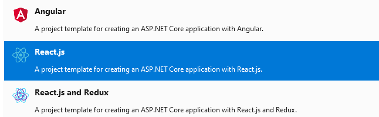
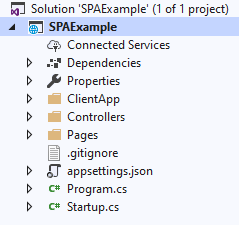
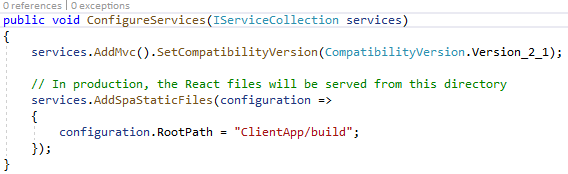
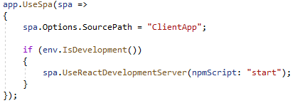

.Net Core: un nuevo framework escrito desde cero, gratuito, de código
abierto y sucesor multiplataforma de .Net Framework.

No cabe a duda, que hoy ReactJS es una de las librerías más usadas para
desarrollo de aplicaciones web de una sola página y que ASP.Net Core es
también un framework que día a día gana más mercado, principalmente en
el desarrollo de REST APIs. Por tanto, la combinación de ReactJS con
ASP.Net Core Web API es algo que Microsoft ha pensado muy bien, de modo
que podamos crear de forma muy simple, desde la comodidad del Visual
Studio, un proyecto de ASP.Net Core que nos brinde una REST API y que
sirva como frontend un proyecto React.

**Pasos a seguir**

1.  Lo primero que haríamos sería crear un nuevo proyecto de Aplicación
    > Web con ASP.Net Core.

2.  Una vez que nos muestra las plantillas a seleccionar para nuestro
    > proyecto seleccionamos React.Js.

3.  Una vez creado el proyecto podemos observar en el Explorador de
    > soluciones nuestro proyecto.

> En la carpeta *ClientApp*, tendremos nuestro proyecto ReactJS ya
> creado. Al ejecutar nuestro proyecto el Visual Studio por sí solo,
> descargará las dependencias de NodeJS para nuestro proyecto ReactJS.
>
> 
>
> 

Entonces, un análisis rápido del archivo *Startup.cs*, nos permitirá
distinguir el código especifico que garantiza la integración con
ReactJS.

Acá podemos observar cómo se añade la carpeta donde una vez hecho
***publish*** estarán los archivos para producción. Por defecto, ReactJS
crea los archivos para producción en la subcarpeta */build* dentro de la
raíz del proyecto. Los archivos dentro de esta carpeta se usarán
solamente si el proyecto ASP.Net Core esta publicado en producción.

A continuación, podemos ver como establecemos que la ruta del código
fuente de nuestro proyecto. Y establecemos, además que, si el proyecto
ASP.Net Core está corriendo en desarrollo, usa el proyecto React como
desarrollo también.

Cabe destacar que como nuestra REST API y nuestro frontend web estarán
corriendo sobre la misma dirección IP y el mismo puerto de escucha. De
modo que cuando queramos acceder a una ruta de nuestra API REST desde
nuestro proyecto ReactJS basta usar la ruta *"/api/controller/value"*
(por ejemplo).

A partir de ahora, podemos modificar nuestra aplicación ReactJS o
ASP.Net Core sin problemas.

Happy coding!!!

**Arael David (Paco) Espinosa Pérez**  
cl8dep@outlook.com  
@cl8dep