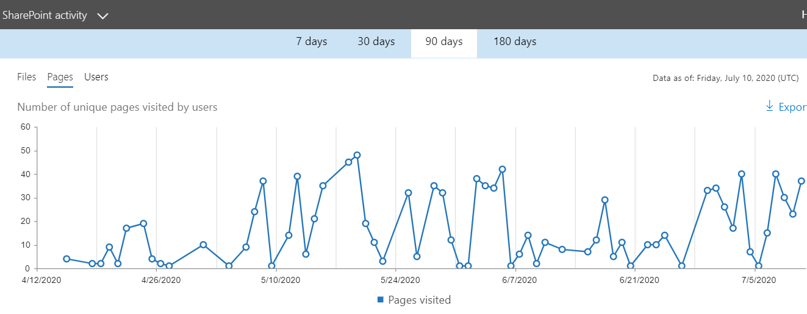
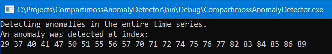
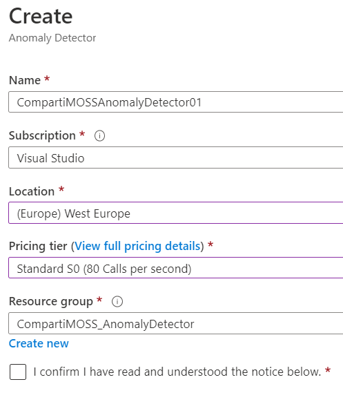
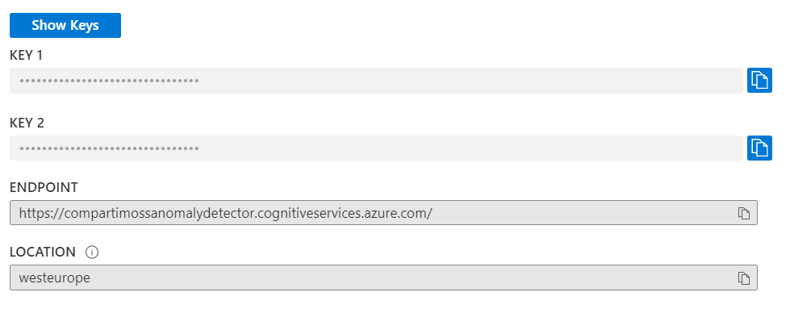
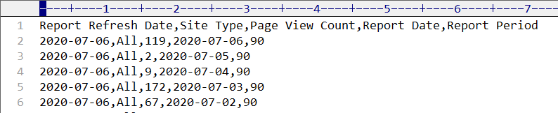
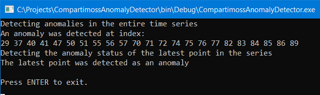

import ArticleHeader from '../../../components/article-header'

<ArticleHeader frontmatter={props.pageContext.frontmatter} />


El Anomaly Detector es un servicio de Azure que permite monitorear
series de datos en el tiempo para detectar incoherencias utilizando
Inteligencia Artificial. El Detector aplica automáticamente algoritmos
de análisis de datos, independientemente de su tipo, escenario o
volumen. Con los datos de series distribuidos en el tiempo, el Detector
determina los límites para la localización de anomalías, los valores
esperados y qué puntos se apartan de lo esperado. El uso del Anomaly
Detector no requiere ningún conocimiento especial o experiencia con
Inteligencia Artificial y dispone de dos APIs, uno utilizando REST y el
otro usando clases nativas de DotNet, que permiten manejarlo
programáticamente.

El servicio se puede utilizar en dos formas:

-   Analizando datos en batch. Usa una serie temporal de datos para
    detectar cualquier anomalía que pueda existir a lo largo de la
    serie. Esta operación genera un modelo utilizando todos los datos de
    la serie, y analiza cada punto con el modelo.

-   Analizando datos en tiempo-real. Detecta anomalías en los datos
    enviados en tiempo real utilizando puntos de datos enviados
    anteriormente para determinar si el último es una anomalía. Esto
    permite analizar datos a medida que se van creando.

Hay varios escenarios en donde el Detector de Anomalías se puede
utilizar en Office 365, el más aparente de ellos es para detectar
cambios en el uso de los servicios de Office. Microsoft 365 ofrece
estadísticas de utilización de la mayoría de sus servicios, tales como
el uso de SharePoint, Teams, Exchange o OneDrive For Business. Cuando
uno de estos servicios recibe un ataque externo, o hay un crecimiento
abrupto por algún tipo de evento, el Detector de Anomalías puede señalar
los cambios y avisar a los administradores del sistema.

Por ejemplo, el registro de páginas únicas visitadas en SharePoint por
90 días en un tenant de Office 365 puede aparecer como el que muestra la
siguiente imagen.



Note que la serie se puede descargar en formato .csv utilizando el botón
de "Export" en la esquina superior derecha.

El archivo .csv se le puede ofrecer al Anomaly Detector para que lo
analice, e indique cuales puntos merecen atención. El resultado en una
aplicación de consola seria como indica la siguiente imagen:



Indicando que el pico de bajada en los días 70 a 77 y 82 a 86 se debe
analizar con cuidado.

**Creación del servicio en Azure**

Para utilizar el Detector de Anomalías es necesario crear primero el
servicio en Azure. Para acceder a la página de administración de Azure
(<https://portal.azure.com>) necesita credenciales con suficientes
derechos (es posible obtener una cuenta temporal de prueba de Azure
desde la página de Microsoft
<https://azure.microsoft.com/en-us/try/cognitive-services/>).

Para crear una instancia del servicio en Azure:

1.  Entre al portal de manejo de Azure (<https://portal.azure.com>)
    utilizando sus credenciales.

2.  Vaya a la sección de "Resource Groups" y cree un nuevo Grupo de
    Recursos (también es posible reutilizar un grupo ya existente).

3.  Cree un servicio de "Computer Vision API":

    a.  En el Resource Group, utilice el botón de "+Add" para crear un
        recurso, busque por "anomaly detector" en la casilla de
        búsqueda y seleccione "Anomaly Detector" en los resultados. En
        el momento de escribir este artículo, el servicio se encontraba
        todavía en "Preview".

    b.  Asígnele un nombre al servicio y utilice el Grupo de Recursos
        deseado. En la casilla de "Pricing tier" seleccione un nivel
        dependiendo de la cantidad de consultas a esperar por segundo,
        lo que determina el precio del servicio (por llamadas por
        segundo). El nivel "F0" es gratis y ofrece un máximo de 10
        llamadas por segundo y 20.000 transacciones por mes.



4.  Una vez creado el servicio, haga clic sobre su nombre en la lista de
    recursos del Resource Group, vaya a "Keys and Endpoints" y copie
    el valor de "Key 1" y "Endpoint".



**Usando el Detector de Anomalías**

Azure ofrece dos API para trabajar con el Detector de anomalías: un REST
API, y una librería de clientes para C\#, JavaScript y Python. El
siguiente ejemplo utiliza una aplicación de consola de .NET Framework
programada en C\#.

5.  Después de crear la solución en Visual Studio, instale el paquete de
    NuGet llamado "Microsoft.Azure.CognitiveServices.AnomalyDetector".
    El paquete instala todas las referencias necesarias. El código para
    el método Main es como se indica a continuación.

```
static void Main(string\[\] args)

{

string myEndpoint =
"https://compartimossanomalydetector.cognitiveservices.azure.com/";

string myKey = "bf7c186c66484cce9c676aacc966af77";

string csvFilePath = @"C:\\Projects\\CompartimossAnomalyDetector\\" +

"SharePointSiteUsagePages7_12_2020 12_59_55 PM.csv";

IAnomalyDetectorClient myClient = new AnomalyDetectorClient(new

ApiKeyServiceClientCredentials(myKey))

{

Endpoint = myEndpoint

};

Request myRequest = GetPointsFromCsv(csvFilePath);

EntireDetectSample(myClient, myRequest);

LastDetectSample(myClient, myRequest);

Console.WriteLine("\\nPress ENTER to exit");

Console.ReadLine();

}
```

Configure en las dos primeras variables los valores del servicio de
Azure obtenidos en el punto 4. La tercera variable indica la
localización del archivo .csv con la serie de datos históricos a
analizar, en este caso los datos de uso de páginas en sitios de
SharePoint obtenido exportando el reporte respectivo desde la
administración central de Office 365 (Imagen 1).

6.  Utilizando el punto de entrada del servicio de Azure se crea un
    cliente de acceso utilizando la clase IAnomalyDetectorClient. La
    rutina GetPointsFromCsv convierte los valores del archivo .csv en un
    objeto del tipo "Request".

> La rutina GetPointsFromCsv utiliza una librería para leer archivos
> .csv llamada "CsvHelper" (<https://joshclose.github.io/CsvHelper/>),
> que se puede instalar en la solución de Visual Studio por medio del
> paquete de NuGet del mismo nombre. El código de la rutina es:

```
static Request GetPointsFromCsv(string csvPath)

{

List\<Point\> myPointsList = new List\<Point\>();

using (StreamReader myReader = new StreamReader(csvPath, Encoding.UTF8))

using (CsvReader myCsv = new CsvReader(myReader,
CultureInfo.InvariantCulture))

{

myCsv.Read();

myCsv.ReadHeader();

while (myCsv.Read())

{

Point onePoint = new Point

{

Timestamp = myCsv.GetField\<DateTime\>("Report Date"),

Value = myCsv.GetField\<Double\>("Page View Count")

};

myPointsList.Add(onePoint);

}

}

// List MUST be ordered by date

List\<Point\> myPointsListOrdered = myPointsList.OrderBy(o =\>
o.Timestamp).ToList();

return new Request(myPointsListOrdered, Granularity.Daily);

}
```

El archivo .csv exportado por Office 365 contiene las siguientes
columnas:



La definición de la clase "Request" requiere una Lista genérica con
valores del tipo "Point" que contiene solo dos valores: la fecha de
cada punto, y su valor numérico. Además, la clase exige que los valores
deben ser organizados de mas antiguo a más reciente, mientras que los
valores exportados desde Office tienen el orden contrario. El servicio
de Detector de Anomalías de Azure requiere un mínimo de 12 puntos para
analizar, y acepta un máximo de 8.640 puntos.

La rutina GetPointsFromCsv primero carga el archivo en un StreamReader,
y luego extrae solamente los valores de las columnas "Report Date" y
"Page View Count" para crear la Lista genérica. Después de leer todos
los valores del archivo csv, el orden de los valores se invierte
utilizando una expresión Linq para que queden en el orden requerido por
el servicio. El valor del objeto "Request" requiere también que se
indique el tipo de valores de la serie, y en este caso se indica que los
valores son diarios por medio de la enumeración "Granularity".

7.  La rutina "EntireDetectSample" analiza la serie de datos completos
    en un Batch, y retorna todos los valores sospechosos. La rutina es
    de la forma:

```
static void EntireDetectSample(IAnomalyDetectorClient AnomalyClient,
Request AnomalyRequest)

{

Console.WriteLine("Detecting anomalies in the entire time series");

EntireDetectResponse result =
AnomalyClient.EntireDetectAsync(AnomalyRequest).Result;

if (result.IsAnomaly.Contains(true))

{

Console.WriteLine("An anomaly was detected at index:");

for (int idx = 0; idx \< AnomalyRequest.Series.Count; ++idx)

{

if (result.IsAnomaly\[idx\])

{

Console.Write(idx);

Console.Write(" ");

}

}

Console.WriteLine();

}

else

{

Console.WriteLine(" No anomalies detected in the series");

}

}
```

El método "EntireDetectAsync" del cliente se encarga de enviar los
datos al servicio de Azure y retornar los puntos sospechosos.
Finalmente, la aplicación de consola renderiza los valores retornados.

8.  La rutina "LastDetectSample" es muy similar a la rutina anterior,
    pero utiliza el método "LastDetectAsync" para indicar si el ultimo
    valor de la serie histórica es sospechoso o no:

```
static void LastDetectSample(IAnomalyDetectorClient AnomalyClient,
Request AnomalyRequest)

{

Console.WriteLine("Detecting the anomaly status of the latest point in
the series");

LastDetectResponse result =
AnomalyClient.LastDetectAsync(AnomalyRequest).Result;

if (result.IsAnomaly)

{

Console.WriteLine("The latest point was detected as an anomaly");

}

else

{

Console.WriteLine("The latest point was not detected as an anomaly");

}

}
```

9.  El resultado que presentan las dos rutinas de análisis combinadas es
    como indica la siguiente figura.




**Conclusión**

El Detector de Anomalías de Azure es un servicio que permite detectar
valores que sospechosos en una serie de datos en el tiempo. El servicio
utiliza Inteligencia Artificial para crear sus propios modelos de
análisis, pero no requiere que los usuarios tengan ningún conocimiento
sobre como crear estos modelos matemáticos. La implementación
programática es muy sencilla, y dispone de dos APIs, uno por medio de
REST y el otro utilizando clases nativas.

**Referencias**
<https://docs.microsoft.com/en-us/azure/cognitive-services/anomaly-detector/overview>

CsvHelper

<https://joshclose.github.io/CsvHelper/>

**Gustavo Velez** <br />
MVP Office Apps and Services <br />
<gustavo@gavd.net> <br />
<http://www.gavd.net> <br />