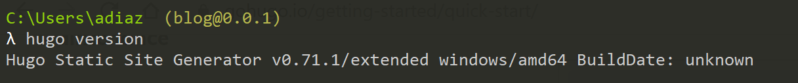
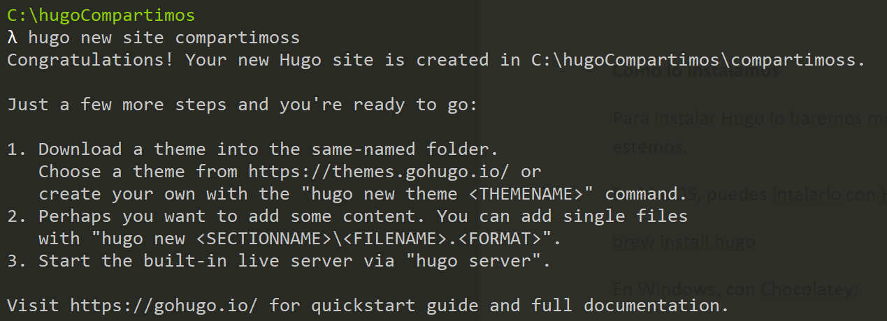
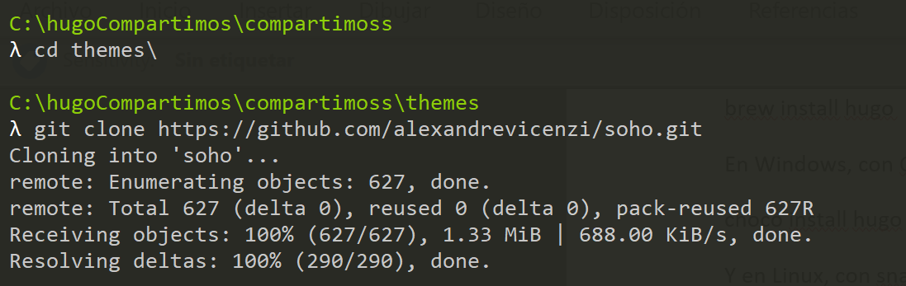
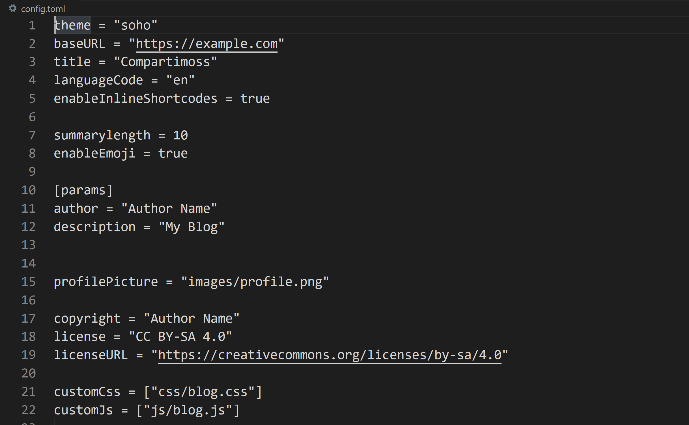
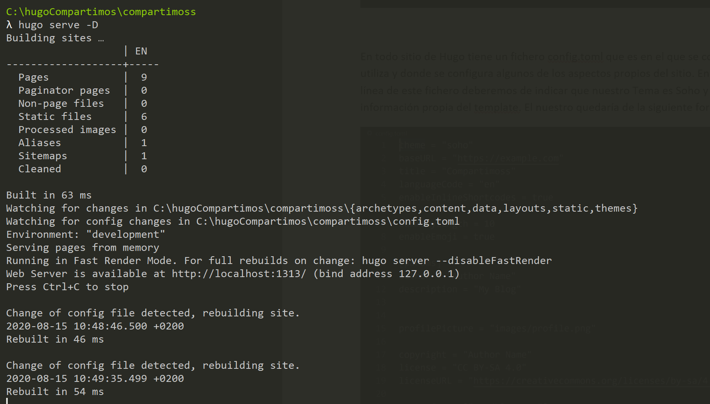
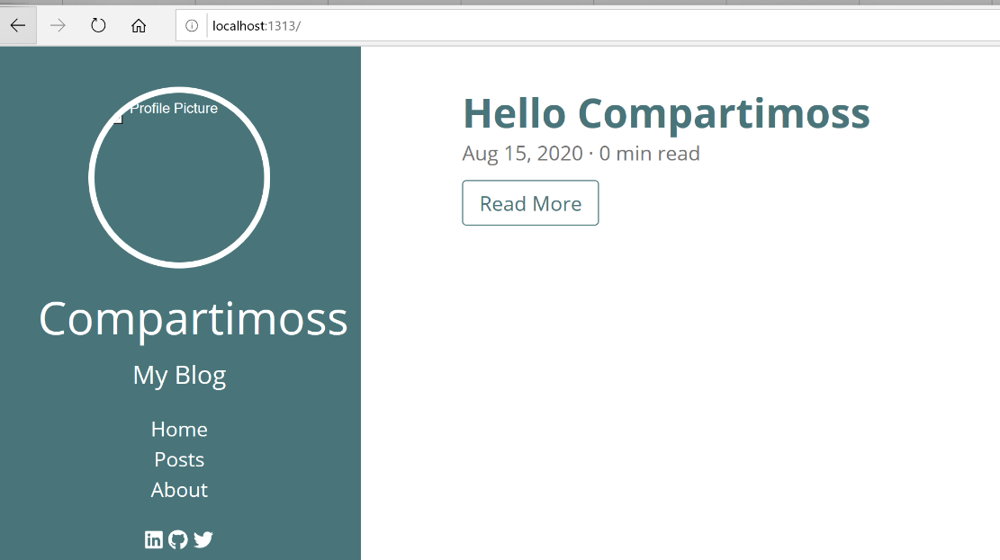
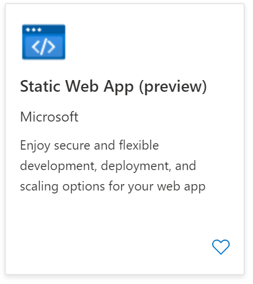
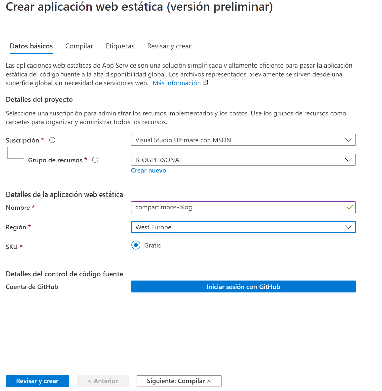
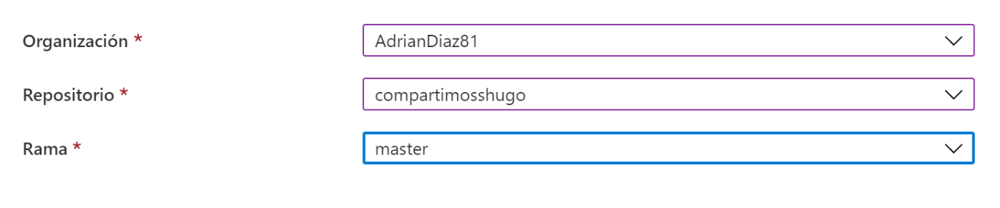
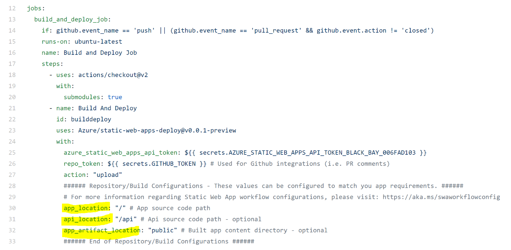

Muchas veces cuando vamos a alojar una aplicación en Azure tenemos como principales servicios PaaS el uso de las Web App. Este servicio nos proporciona un recurso en algún servidor donde nosotros almacenamos nuestro código y se ejecuta con las especificaciones requeridas. Sin embargo, en algunas ocasiones estas necesidades son muy superiores a las necesidades que realmente se desean. En muchas veces solamente queremos mostrar contenido estático que se ejecuta en el FrontEnd y no tenemos ninguna necesidad de hacer ninguna llamada a nuestro BackEnd. Con esta finalidad sale este nuevo servicio Azure Static Web Apps que hoy aún está en Preview, con lo cual es posible que alguna de las opciones que se comenta en el artículo es posible que se modifiquen cuando estén en GA (disponibilidad general). 

**Introducción**

Azure Static Web Apps es un servicio que compila e implementa automáticamente aplicaciones web en Azure desde un repositorio de GitHub. 

¿Qué es una Static Web Apps? Son aplicaciones creadas con un Frameworks JavaScript como pueda ser React, Angular o Vue por ejemplo y cuya compilación es un conjunto de HTML, CSS y JavaScript. Cuando esto lo hacemos desde un Web App o un servidor tradicional esto recursos estáticos se sirven desde un único punto y van unidos al resto de procesos de la aplicación. Cuando hacemos uso de este nuevo servicio estos recursos no están centralizados en un único sitio, sino que están distribuidos geográficamente en todo el mundo (de una forma similar a un Common Delivery Network). Esta distribución permite ofrecer archivos de forma más rápida ya que se encuentran más cerca de los usuarios.

Este servicio está pensando desde el punto de vista de un desarrollador y es en el momento en el que se realice algún cambio en la aplicación este automáticamente se despliegue. Por este motivo en el momento en el que se crea un commit sobre nuestro repositorio de GitHub se lanza un proceso (GitHub Actions) que publica el código en Azure. Más adelante veremos que son las GitHub Actions y el proceso que llevamos.

Que tipos de aplicaciones podemos implementar con este servicio: 
- Crear Apps modernas con JavaScript usando Frameworks como Angular, React, Vue y un backend con Azure Functions. 
- Publicar sitios web estáticos con Frameworks como Gatsby, Hugo o VuePress.
- Implementar Aplicaciones web con Frameworks como Next.js y Nuxt.Js.

El éxito de este servicio radica principalmente en que este tipo de aplicaciones son las que más se desarrollan, casi toda aplicación tiene un frontal web haciendo uso de JavaScript. Y en ese punto tenemos dos escenarios:
- Frontales Web.
- Plataformas de Blogs en creciente auge debido a que muchos creadores de contenido buscan una plataforma mucho más ligera.

**¿Qué características tiene?**

- Hospedaje web para contenido estático como HTML, CSS, JavaScript e imágenes.
- Compatibilidad con la API integrada proporcionada por Azure Functions.
- Integración propia de GitHub, en la que los cambios en el repositorio desencadenan compilaciones e implementaciones. Actualmente no tiene integración con Azure DevOps aunque se puede hacer un pipeline para integrarlo.
- Contenido estático distribuido globalmente, lo que permite que el contenido esté más cerca de los usuarios.
- Certificados SSL gratuitos, que se renuevan automáticamente.
- Dominios personalizados* para proporcionar personalizaciones de marca a la aplicación.
- Modelo de seguridad ágil con un proxy inverso al llamar a las API, lo que no requiere ninguna configuración de CORS.
- Integraciones del proveedor de autenticación con Azure Active Directory, Facebook, Google, GitHub y Twitter.
- Definición de roles de autorización personalizables y asignaciones.
- Reglas de enrutamiento de back-end que permiten tener control total sobre el contenido y las rutas que atiende.
- Versiones de almacenamiento provisional generadas que se basan en las solicitudes de incorporación de cambios y permiten obtener versiones preliminares del sitio antes de su publicación.

**Creación de una Static Web App con Hugo**

Todo esto suena muy bien, pero vamos a ver un caso practico y real. En este caso vamos a como poder montarnos un Blog haciendo uso de Hugo. 

**¿Qué es Hugo?**

Hugo es un generador estático de páginas web HTML y CSS escrito en Go. Está optimizado para la velocidad, la facilidad de uso y la configurabilidad. Hugo toma un directorio con contenido y plantillas y las convierte en un sitio web HTML completo.
Hugo se basa en archivos Markdown con materia prima para metadatos, y puedes ejecutar Hugo desde cualquier directorio. está diseñado para funcionar bien en cualquier tipo de sitio web.

**Como lo instalamos**

Para instalar Hugo lo haremos mediante un gestor de paquete del sistema operativo en el que estemos.  
- En MacOS, puedes instalarlo con Homebrew: brew install hugo
- En Windows, con Chocolatey: choco install hugo -confirm
- Y en Linux, con snap: snap install hugo
En mi caso al trabajar en un entorno Windows he utilizado Chocolatey. Una vez ya está instalado en nuestro equipo verificamos que la instalación ha ido correctamente para ello tendremos que poner el siguiente comando: 

Con Hugo instalado el siguiente paso es crearnos un sitio estático para ello tendremos que poner el siguiente comando:

Como bien indica cuando hemos creado el sitio el siguiente paso es elegir el tema que va a tener nuestro sitio para ello ir a la página https://themes.gohugo.io y elegimos uno entre todas las opciones que hay, en mi caso voy a seleccionar el template Soho. Para instalar un template en primer lugar lo que deberemos es descargarlo desde el GitHub donde esta y tenerlo ubicado en la carpeta de Themes

En todo sitio de Hugo tiene un fichero config.toml que es en el que se configura cual es el tema que utiliza y donde se configura algunos de los aspectos propios del sitio. En nuestro caso en la primera línea de este fichero deberemos de indicar que nuestro Tema es Soho y añadir la siguiente información propia del template. El nuestro quedaría de la siguiente forma:

Para ver si el tema se ha aplicado correctamente pondremos en la línea de comando la siguiente instrucción: 

Cuando hagamos cualquier modificación en el sitio automáticamente se compilará y se visualizará de nuevo. Si en el navegador arrancamos la url http://localhost:1313 veremos que se abre un sitio con el theme que hemos seleccionado, en caso de que no se vea correctamente deberemos de revisar el fichero de configuración que algo hemos configurado de forma errónea.
Una vez ya tenemos creado el sitio el siguiente paso es añadir cualquier contenido para ello ponemos el siguiente comando: 
hugo new posts/hello-compartimoss.md
Luego en el fichero md y con el editor de texto que queramos escribimos el articulo o el contenido que queramos (esta libertada para elegir el editor que se requiera es una de las grandes ventajas que tiene Hugo) y arrancamos el servidor y se debería de visualizar algo como el siguiente:

Hugo está muy bien y nos da muchos beneficios, pero en este articulo hemos venido a hablar sobre el servicio de Azure Static Web Apps, para ello en primer lugar nos tendremos que crear un repositorio en GitHub y alojar el contenido donde esta esta carpeta.  En mi caso podéis ver el ejemplo en el siguiente repositorio.  https://github.com/AdrianDiaz81/compartimosshugo
GitHub nos proporciona 5 repositorios privados donde podemos alojar nuestro blog sin que todo el mundo pueda visualizar nuestro contenido. En dicho ejemplo lo he dejado público para que los lectores puedan ver el flujo de aprobación el contenido de este.
Una vez tenemos el repositorio GitHub creado vamos a nuestra subscripción de Azure y creamos un servicio Azure Static Web Apps. 

Cuando le damos a crear este servicio, al igual que en muchos servicios de Azure nos pedirá la región donde inicialmente estará este servicio, el grupo de recursos donde va a estar alojado y nos pedirá que introduzcamos nuestras credenciales de GitHub, tal y como se muestra en la siguiente imagen:

Una vez iniciamos la sesión con GitHub y autorizamos a que el portal de Azure pueda leer el código de los repositorios. Tendremos que indicar cual es la Organización, el repositorio y la rama en la que vamos a obtener el código en nuestro caso el ejemplo sería el siguiente:

Con esta información le damos a crear al Servicio. Una vez el servicio se ha creado automáticamente se crea una GitHub Acctions. Para los que no estén familiarizados con este servicio de GitHub, podemos decir que es como una Build de compilación de Azure DevOps.  Una Actions lo que nos sirve es para automatizar los flujos de trabajo para poder compilar, empaquetar o implementar nuestro desarrollo. En este caso queremos que cada vez que se añade cualquier modificación en nuestra rama master automáticamente se lance este proceso y se actualice el código de nuestra aplicación. 
Nada más que se crea el servicio, automáticamente se lanza esta GitHub Actions. Para ello dentro de nuestro repositorio de GitHub en la pestaña Actions podemos ver que se ha lanzado una. Esta Actions es un fichero con extensión .yml que se ha creado en nuestro repositorio. Este fichero tiene una única tarea que es compilar y ejecutar la aplicación. La primera que se lanza se produce un error debido a que falta por configurar la ubicación donde se encuentra el resultado de la compilación. Otro de los errores que se producen es donde está la ubicación de nuestro servidor Hugo. Si veis el fichero yml tiene unos parámetros en los que se indica dónde está la API si la hubiera (en este caso no hace falta), la ruta del código fuente y la ubicación de los artefactos. En mi caso los parámetros de configuración los he dejado de esta forma: 

**Conclusión**

Azure Static Web Apps es de esos servicios que los desarrolladores estamos esperando que salga en alta disponibilidad, da un abanico de posibilidades muy fácil y sencillo, viene a cubrir una parte que ahora mismo estaba sobre dimensionada dentro del catálogo de servicios PaaS que nos proporciona Azure. Sin embargo, para que este servicio tenga un mayor abanico de usuarios faltaría una integración con Azure DevOps, y no solo con GitHub. También queda pendiente ver los planes que nos ofrece y los precios de estos. 
Desde el punto de vista de posibilidades que nos da este servicio, me parece una gran alternativa para alojar un blog y tener el contexto de todo lo que en él te hace falta. En mi caso, hice la prueba para alojar mi blog personal y además de conocer Hugo como una plataforma nueva, este servicio te da la opción de integrarte en el mundo de las GitHub Actions y su integración con Azure. 

**Adrián Diaz Cervera**   
Architect Software Lead at Encamina  
MVP Office Development  
http://blogs.encamina.com/desarrollandosobresharepoint  
adiaz@encamina.com @AdrianDiaz81   
 
import LayoutNumber from '../../../components/layout-article'
export default LayoutNumber
