Si actualmente estás trabajando con Azure, probablemente hayas escuchado
hablar de las Policies de Azure. Digamos que son elementos clave para
gobernar toda la infraestructura y servicios desplegados sobre Azure,
que los podamos auditar y en cierta manera, forzarnos a cumplir el
compliance que algunos estándares nos "obligan" a hacer.

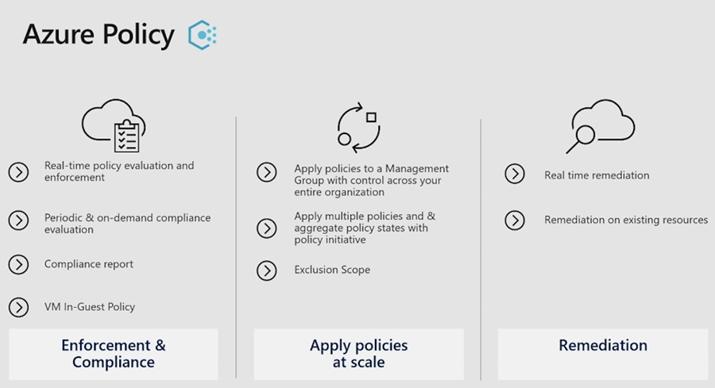

Por ejemplo, el hecho de solo permitir la creación de VMs en ciertas
regiones, o bien que solo se pueda utilizar un SKU determinado (muy útil
para entornos de desarrollo donde no queremos disparar costes),
restringir la creación de IPs Públicas, forzar la aplicación de valores,
y un largo etc.

En este artículo no vamos a cubrir los básicos de Azure Policy, ya que
hay infinidad de contenido por Internet que lo explicarán mejor que yo.

Dentro del portal de Azure, hay algunas policies que nos permiten que
automáticamente las VM's desplegadas en nuestra suscripción, se les
implemente el agente de monitorización, de manera que tengamos el
entorno automatizado y totalmente controlado (os suena a CI/CD, ¿no?),
pues bien, lo que vamos a hacer en este artículo es que mediante el uso
de las Policies de Azure y [Azure
Arc](https://docs.microsoft.com/en-us/azure/azure-arc/servers/overview)
vamos a mostrar la capacidad que tenemos de monitorizar no solamente las
máquinas que tengamos en nuestras suscripciones de Azure, sino también
las de otros proveedores Cloud.

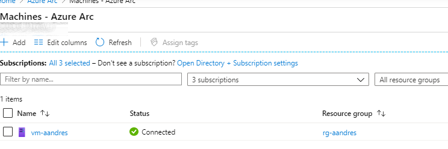

El uso de las Guest Policy, nos brindará la posibilidad de monitorizar
los sistemas y las políticas de seguridad en todas las VM's. Teniendo de
esta forma un plan de gobierno completo, tanto para sistemas Azure como
externos (AWS, GCloud, Alibaba, etc...)

**Configuración de la gestión de servidores "invitados"**

Para poder empezar con ello, debemos de habilitar el provider de
"Microsoft.GuestConfiguration" en la subscripción que pertoque. Este es
el endpoint que permite la gestión de los servidores "invitados":

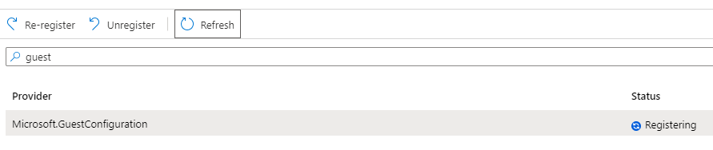

**Creación de la iniciativa**

Siguiente paso es ir a las policies de Azure y buscar las definiciones
que tenemos disponibles, en este caso, buscamos una iniciativa (lo que
viene siendo un conjunto de definiciones de policies), en este caso
buscamos la siguiente:

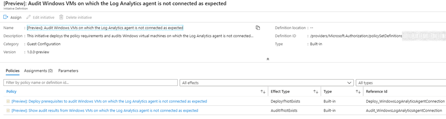

Vemos que hay dos definiciones dentro de la iniciativa que tienen
efectos diferentes, por lo que vamos a darle un vistazo con más detalle
a cada una de ellas. Lo primero que podemos observar, es que este tipo
de implementaciones utilizan los workspaces de LogAnalytics, por lo que
estaremos enviando telemetría de las VMs a los WS, que a posteriori nos
servirán para pintar la información que queramos de una forma muy
intuitiva, permitiendo la lectura de la información a cualquier persona
(aunque no sea techie).

LogAnalytics da una flexibilidad brutal dentro de Azure, este post no lo
trataremos, pero veremos que lo mencionaremos en algún que otro momento,
sobre todo para esa monitorización esencial en Azure (otro pilar
fundamental del gobierno de Azure). La primera de ellas, podemos
observar que su target de VM's son aquellas que tenemos o bien dentro de
la suscripción de Azure, o bien aquellas que estén en otras plataformas
Cloud y estén gestionadas por Azure Arc:

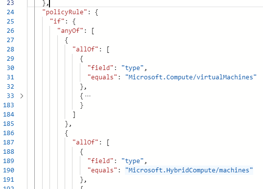

Si vamos un poco más allá en la definición del JSON, podemos ver que:

-   Se realiza una asignación para la configuración del agente Guest.

-   Se crea una identidad administrada para la VM en cuestión.

-   Se añade una extensión llamada "Guest Configuration".

Aquí no debemos de confundirnos, estas configuraciones solo se
implementan a nivel de Azure, no a nivel de la VM como tal. Realmente,
esto lo que implementa es una plantilla ARM a Azure

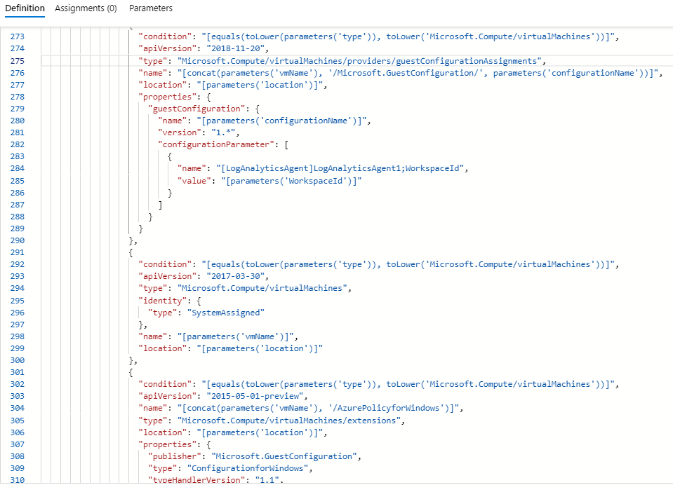

Mientras que para aquellos servidores que están gestionados mediante
Azure ARC, solo se implementa un recurso en Azure:

-   Asignación de la configuración de "invitado".

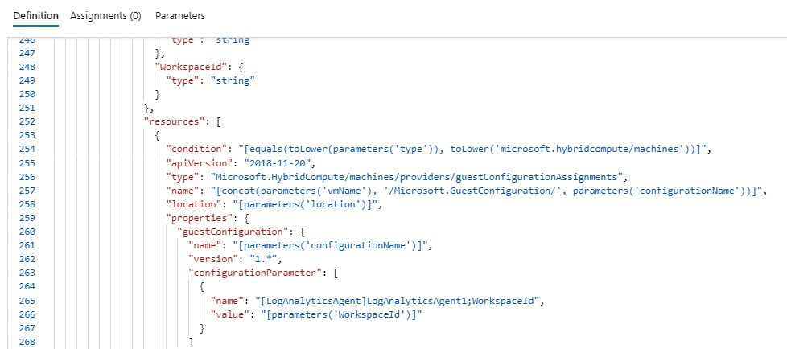

Estas son las partes fundamentales de la policy que forma parte del 50%
de la iniciativa, la otra policy que tenemos incluida en la iniciativa,
es mucho más sencilla, ya que únicamente se dedica a pintar la
información extraída por la otra policy.

**Implementación de la policy**

Una vez explicados los básicos, podemos implementar la policy, para
ello, como he comentado al principio del artículo, vamos a necesitar el
ID de un workspace de LogAnalytics, ya que ahí, vamos a ingestar toda la
telemetría, y será nuestra fuente de datos, para su uso posterior.

En este caso, no voy a entrar en detalle en como configurar una
iniciativa/Policy en Azure, pero lo que, sí que quiero remarcar, es un
punto importante de esta iniciativa en concreto (y muchas de Azure), y
es el apartado de remediación:

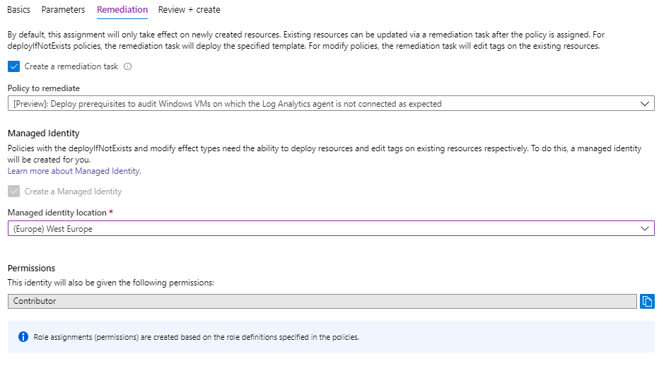

Hay que tener en cuenta que estas policies, solo aplicarán a los
recursos nuevos que se creen una vez que la Policy esté implementada y
funcionando, pero no así para los recursos ya existentes, por lo que
este apartado, cobra un especial interés.

Como anteriormente hemos visto en la definición, esta implementa todo
por nosotros, por lo que recomiendo implementar una tarea de
remediación, que nos permitirá implementar todos los recursos que sean
necesarios para aquellos recursos existentes y que también nos interesa
que entren dentro del alcance de la Policy. Recordad el parámetro
"DeployIfNotExists" que teníamos en la definición que irá ligado al
Managed Identity, para aquellos recursos que sean necesario
modificarlos.

Una vez implementada en el ámbito deseado, veremos el estado de esta en
el portal de Azure y como irá cambiando el estado a medida que se vaya
implementado y generando información sobre los recursos implementados en
nuestra suscripción u otras plataformas Cloud.

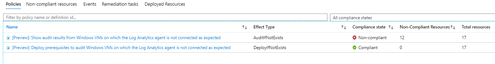

Gracias al uso de las tareas de remediación podremos relanzar nuestra
policy y que se implementan los recursos necesarios para que cumpla la
política y así podamos tener el entorno cohesionado y bajo los
parámetros que nosotros necesitamos, tal y como podemos ver a
continuación:

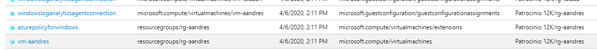

Para cada tipo de definición que hemos visto anteriormente en el JSON,
implementa una serie de recursos, por lo que nos permite visualizar que
es lo que ha pasado y cuando ha pasado como tal.

**¿Y qué hay de las máquinas incluidas en el ámbito?**

En este caso, el primer punto que debemos tener en cuenta es que se
utiliza un servicio llamado "Guest Configuration Service", que es el
responsable de las configuraciones:

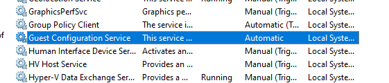

Por lo que una vez los servidores estén conectados, se descargaran las
configuraciones pertinentes desde Azure. Estas las podemos encontrar en
c:\\ProgramData\\GuestConfig\\configuration

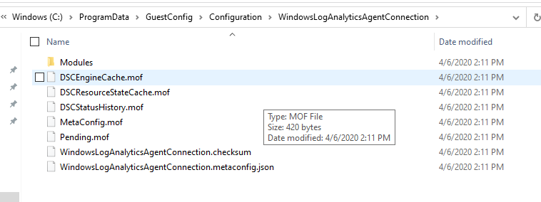

Así mismo, podemos ver definiciones DSC, que será evaluadas
continuamente, y que a posteriori, serán mostradas en el portal de
Azure. En estos casos el reportar información contra el WS de Log
Analytics, tarda cierto tiempo, hay que tener en cuenta que analiza y
luego reporta todo, por lo que esto pueden ser minuto o incluso horas.

Con todo este procedimiento, hemos aprendido que las policy no solamente
nos pueden ayudar a mantener la cohesión de los recursos que tenemos en
Azure, sino que, con la ayuda de Azure Arc, podemos extender el gobierno
que hayamos establecido en tu estrategia en el Cloud.

**Alberto Andrés**  
Cloud Solutions Architect  
@albandrod  