import ArticleHeader from '../../../components/article-header'

<ArticleHeader frontmatter={props.pageContext.frontmatter} />

Como parte de su estrategia de facilitar la transición a Microsoft 365 y
sus servicios principales entre los que se encuentran SharePoint Online
(SPO) y OneDrive for Business (ODFB), Microsoft proporciona un juego de
herramientas de migración diseñadas para simplificar al máximo la carga
de información desde orígenes On-Premises y Cloud a sitios de SPO y
ODFB. En este artículo haremos un repaso al juego de herramientas de
migración provistas por Microsoft sin coste.

**Juego de Herramientas de Migración**

Migración dispone de un juego de herramientas de migración que se
compone de:

-   La SharePoint Migration Tool o SPMT, primera herramienta de
    migración de Microsoft disponible desde 2017 y que permite migrar
    contenidos desde servidores de archivos o bien desde Granjas de
    SharePoint (versiones 2010, 2013 y 2016) a sitios de SPO y ODFB

-   Migration Manager, un servicio de migración integrado en el
    SharePoint Admin Center que facilita migrar contenidos desde
    servidores de archivos a sitios de SPO y ODFB a partir de crear
    tareas de migración que son gobernadas y orquestadas por Migration
    Manager.

-   Mover, un servicio cloud de migración adquirido por Microsoft en
    2019 y que facilita la migración desde servicios de almacenamiento
    cloud (Como DropBox o Box) y/o On-Premises a Sitios de SPO y ODFB.

**SharePoint Migration Tool**

La SPMT fue la primera herramienta de migración desarrollada por
Microsoft y que ha ido evolucionando en los últimos años incorporando
nuevas funcionalidades. La PMT permite migrar contenidos desde
servidores de archivos On-Premises o bien desde Granjas de SharePoint
2010/2013/2020 a Sitios de SPO y ODFB:

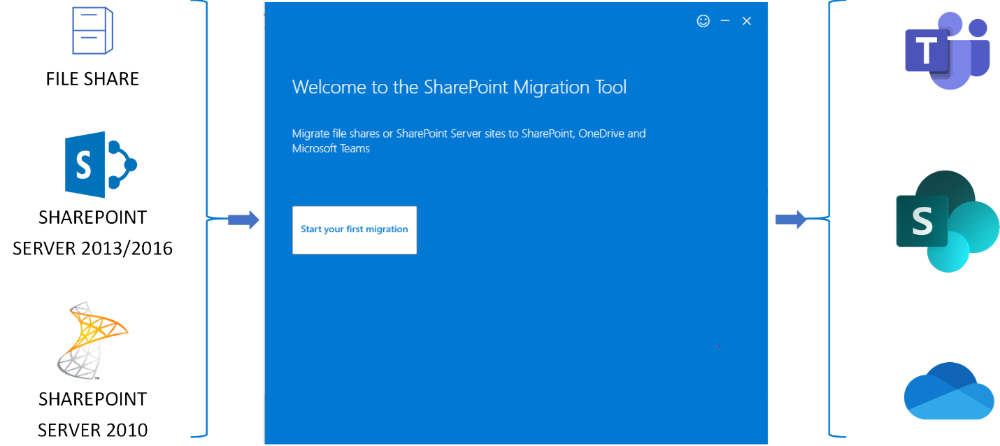

El resumen de las capacidades de la SPMT es el siguiente:

-   Soporte para migraciones de tipo masivo a través de definir archivos
    de migración en formato JSON o CSV en el que se establecen los
    orígenes de migración y por cada origen los destinos
    correspondientes en SPO y ODFB.

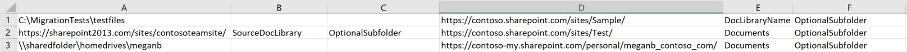

-   Granularidad en la configuración de la migración que nos permite
    realizar parametrizaciones como omitir ciertos contenidos en base a
    una condición de tipo fecha, establecer un mapeo de usuarios entre
    origen de migración y destino, etc.

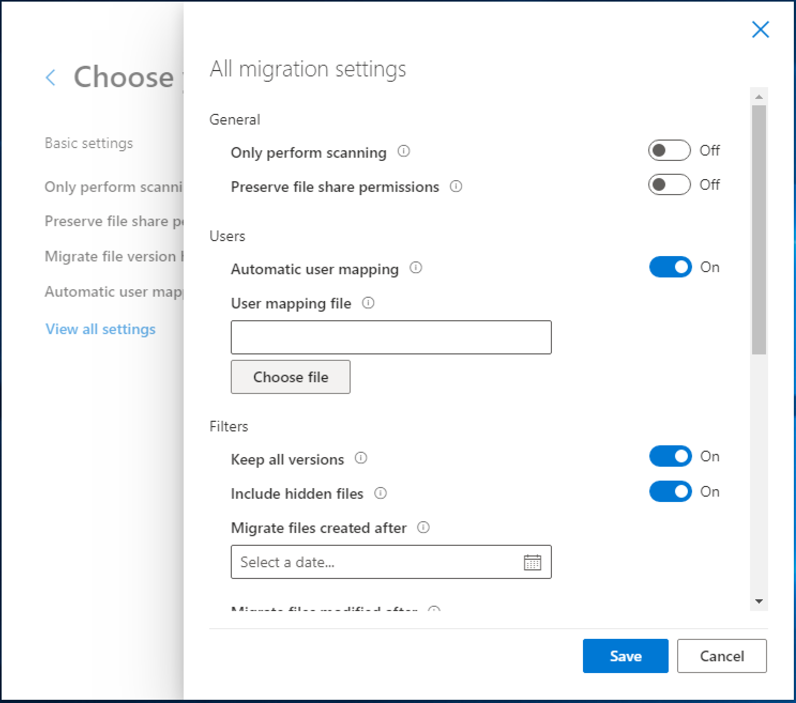

-   Informes detallados en formato CSV de cómo ha transcurrido una
    migración concreta

-   Realizar un assesment previo de migración en el caso en el que
    vayamos a migrar desde SharePoint 2010/2013 a SPO a través de
    utilizar el SharePoint Migration Assesment Tool (SMAT). SMAT es una
    herramienta de línea de comandos que nos permite analizar una Granja
    de SharePoint 2010/2013 para identificar qué elementos no se podrán
    migrar.

-   Soporte de PowerShell a través de 8 comandos provistos para realizar
    la migración por línea de comandos en lugar de con la UI de la SPMT.

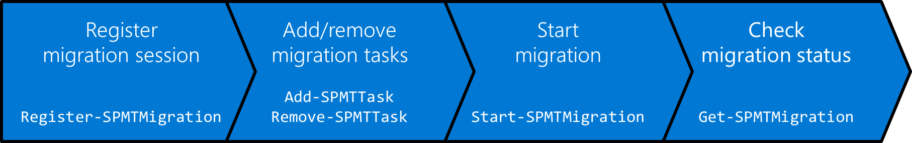

Aunque no se ha mencionado, la SPMT requiere ser instalada en un equipo
que por un lado tenga "visibilidad" del origen de información a migrar y
por otro disponga de la conexión a Internet necesaria para poder migrar
a SPO y ODFB. Los requerimientos mínimos y recomendados (en verde) para
el equipo en el que se instale la SPMT son:

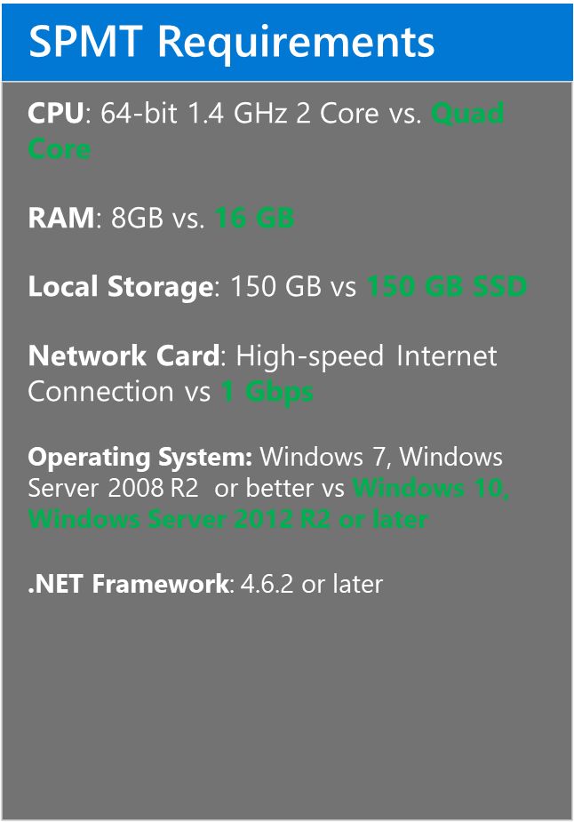

Una pregunta que seguro que os estaréis haciendo es la relativa a qué
puede migrar la SPMT y sobre todo qué velocidad de migración puedo
esperar. Responder a la primera pregunta es sencillo ya que Microsoft
tiene muy bien documentado que soporta y que no soporta al migrar con la
SPMT a SPO y ODFB (+ Información:
<https://docs.microsoft.com/en-us/sharepointmigration/what-is-supported-spmt>):

-   A nivel de migración de contenidos en servidor de archivos, se
    soporta tanto la migración de archivos en rutas locales del equipo
    donde se ha instalado la SPMT como rutas de red compartidas.

-   A nivel de migración desde SharePoint 2010/2013/2016, se soporta la
    migración:

    -   Sitios completos.

    -   Navegación, Icono y Descripción del Sitio.

    -   Listas y Bibliotecas de Documentos.

    -   Archivos, Carpetas, Elementos de Lista y Versiones

    -   Permisos.

    -   Metadatos Administrados y Taxonomía.

    -   Características y Web Parts

    -   Páginas.

En cuanto a qué no se soporta, como os podéis imaginar se trata sobre
todo de elementos de SharePoint On-Premises que la SPMT no puede migrar.
En concreto:

-   No se soportan todos los tipos de listas: [+
    Información](https://docs.microsoft.com/en-us/sharepointmigration/sharepoint-migration-supported-list-templates).

-   Nos es soportan todos los Web Parts: [+
    Información](https://docs.microsoft.com/en-us/sharepointmigration/sharepoint-migration-supported-list-templates).

-   No todas las características de Sitio están soportadas: [+
    Información](https://docs.microsoft.com/en-us/sharepointmigration/spmt-supported-site-features).

-   Sólo migra sitios out of the box, es decir sin código personalizado
    o con herramientas de terceros.

-   Sólo migra la navegación por defecto de Sitios.

En lo que a velocidad de migración que podemos esperar, la respuesta es
que va a depender del escenario de migración que nos encontremos:

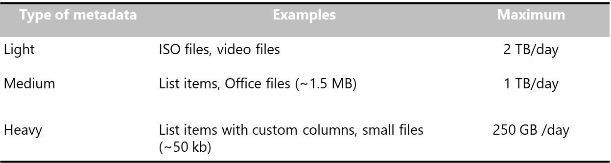

Aunque Microsoft ha documentado el rendimiento esperado en función del
escenario de migración, mi experiencia en migraciones de datos
On-Premises a SPO usando herramientas de migración en general (Al final
todas usan las mismas APIs) es la siguiente:

-   La tasa de migración por hora puede ser variable dependiendo del
    momento en el que estemos migrando. Por ejemplo, si estamos migrando
    por la mañana en horario europeo tendremos una tasa de migración más
    baja comparado con la que se puede conseguir por las tardes o
    durante los fines de semana. Esto se debe al mecanismo de bloqueo
    (Throttling) que Microsoft tiene implementado en SPO y ODFB.

-   La velocidad de migración típica al migrar desde servidor de
    ficheros a SPO y ODFB suele oscilar entre 20 y 30 GB/H por instancia
    de migración.

-   La velocidad de migración se reduce mucho en el caso en el que el
    número de archivos a migrar es muy grande y el tamaño de los
    archivos es pequeño.

Si habéis llegado hasta este punto, seguro que alguno se preguntará:
¿Cómo incremento el volumen de información migrado por hora? La
respuesta es que diseñando una arquitectura de migración que nos permita
paralelizar la migración a través de disponer de varias instancias de
migración. De esta forma, podremos incrementar la tasa de migración
tantas veces como instancias tengamos.

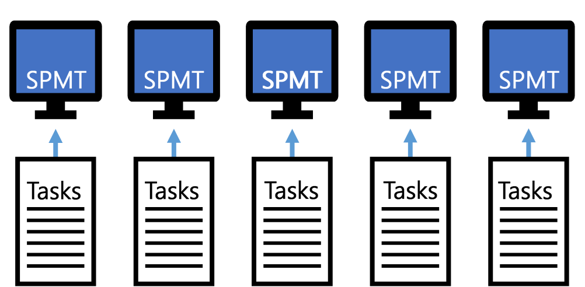

Ahora bien, una arquitectura de migración como la representada en la
Imagen 7 tiene varias problemáticas asociadas:

-   Recursos necesarios (Hardware y Software) para el despliegue de la
    arquitectura de migración.

-   Tiempo necesario para el setup de la arquitectura de migración.

-   Ineficiencias debido a la carencia de capacidades de orquestación:
    cada instancia de migración se comporta de forma independiente en
    base a como se haya parametrizado la migración.

-   Más susceptible a errores.

Precisamente, para dar respuesta a estos inconvenientes es donde el
servicio de Migration Manager emerge como alternativa para realizar
migraciones a escala.

**Microsoft Migration Manager**

Migration Manager es un servicio diseñado para realizar migraciones en
las que se requiere capacidades de orquestación de tareas de migración,
así como autoescalado y balanceo de estas. Migration Manager está
pensado para escenarios de migración complejos en los que se requiere
disponer de capacidades como:

-   Gestión centralizada de tareas de migración.

-   Balanceo de carga automático.

-   Soporte para migraciones de tipo masivo.

-   Reporting y monitorización.

Migration Manager habilita escenarios de migración que se fundamentan en
la siguiente aproximación alto nivel:

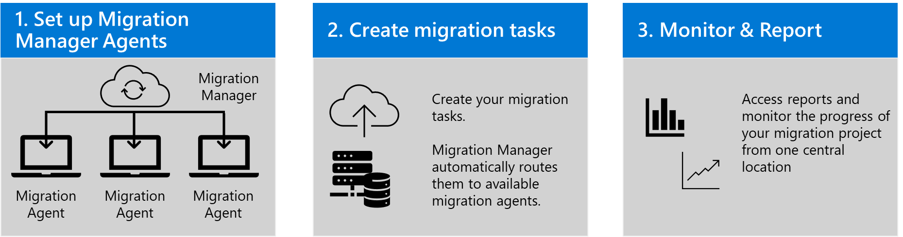

Como vemos, el proceso de migración consiste en:

-   Puesta en marcha de la arquitectura de migración diseñada para la
    migración a realizar. Esta puesta en marcha consiste en descargar e
    instalar el agente de migración en cada una de las máquinas desde la
    que se realizará la migración (**[Nota:]{.ul}** Los requerimientos
    Hardware y Software para el agente de migración son los mismos que
    ya vimos para la SPMT). El proceso de instalación del agente es
    realmente sencillo:

    -   Descargar el paquete de instalación del agente.

    -   Seguir el asistente de instalación del agente en el que
        especificaremos por un lado la cuenta de acceso a SharePoint
        Online y por otro la cuenta de acceso al origen de migración.

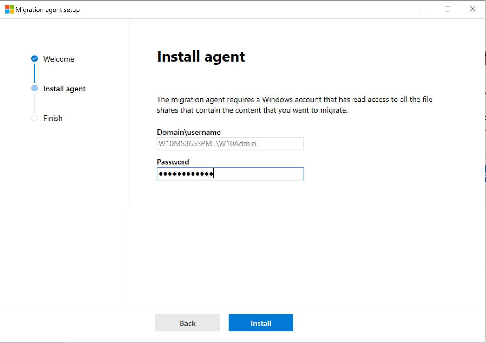

-   Verificar que el agente se ha instalado de forma correcta y aparece
    como un servicio de Windows que se inicia de forma automática.

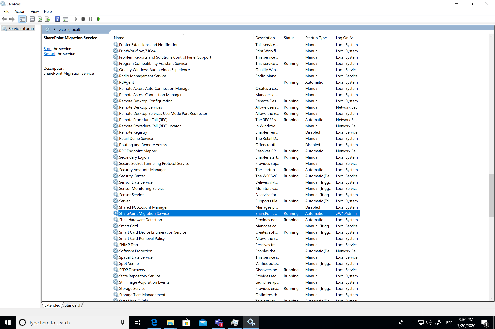

-   Definir las tareas de migración necesarias para migrar información a
    SharePoint Online. Estas tareas de migración las definiremos en la
    Administración de SharePoint Online a través del correspondiente
    asistente que nos va guiando en su creación:

    -   Definir el método de migración de los archivos (**[Nota]{.ul}**:
        A la fecha de redacción de este artículo, Migration Manager solo
        permite migrar archivos accesibles en una ruta compartida),
        donde podemos elegir entre una migración simple (un único origen
        y destino) o masiva (varios orígenes y destinos definidos en un
        archivo en formato CSV o JSON).

    -   En el caso de una migración simple, establecer el origen de
        migración de los datos que será una carpeta compartida a la que
        tiene acceso el servicio de migración.

    -   En el caso de una migración simple, establecer el destino de
        migración de los datos que será una ubicación de SharePoint en
        la que podremos elegir una biblioteca y un nivel de carpetas en
        la misma en el que realizar la copia de los archivos.

    -   Al igual que sucede con la SPMT, los ajustes finos de
        configuración de la migración que podamos requerir. Estos
        ajustes por defecto son comunes para toda tarea que se cree,
        pero luego a nivel particular de una tarea se pueden cambiar.

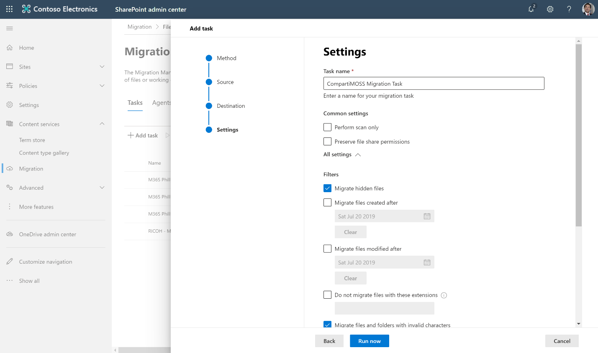

A partir de que la tarea esté creada, es cuando la migración queda en
manos de Migration Manager que se encarga de orquestar y autobalancear
las tareas de migración en un escenario en el que tengamos varios
agentes de migración instalado.

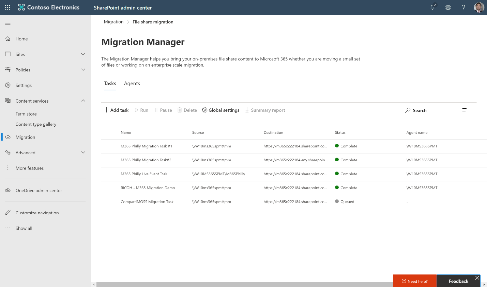

-   Monitorización y revisión: Por cada tarea tenemos la posibilidad
    siempre de ver el detalle de la misma lo que nos permite ir viendo
    su progreso e ir accediendo a informes parciales de la migración de
    manera que podemos ir controlando el proceso.

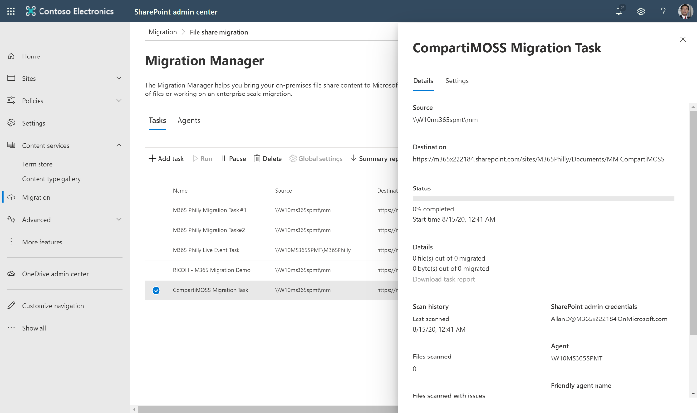

> Además, dada una Tarea, podemos seleccionarla en el listado de tareas
> de Migration Manager y realizar las siguientes acciones:

-   Run: Volver a ejecutar la tarea si esta se ha completado de forma
    que lanzaremos la migración de nuevo y proporcionando soporte de
    migraciones de tipo incremental.

-   Pause: Pausar la tarea seleccionada en el caso en el que se esté
    ejecutando.

-   Delete: Borrar la tarea seleccionada.

-   Summary report: acceder a un informe resumen de las acciones de
    migración realizadas por la tarea. Este informe es un archivo .csv.

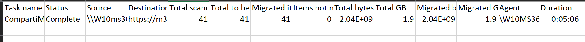

**Mover**

Mover es un servicio de migración ofrecido como una aplicación 100 nube
que Microsoft adquirió en octubre 2019 y que puede ser utilizado por
cualquier cliente de Microsoft 365 sin coste alguno. Mover está pensado
para migrar contenidos entre servicios cloud (Aunque también permite
migrar contenidos On-Premises) gracias al juego de conectores de
migración de que dispone:

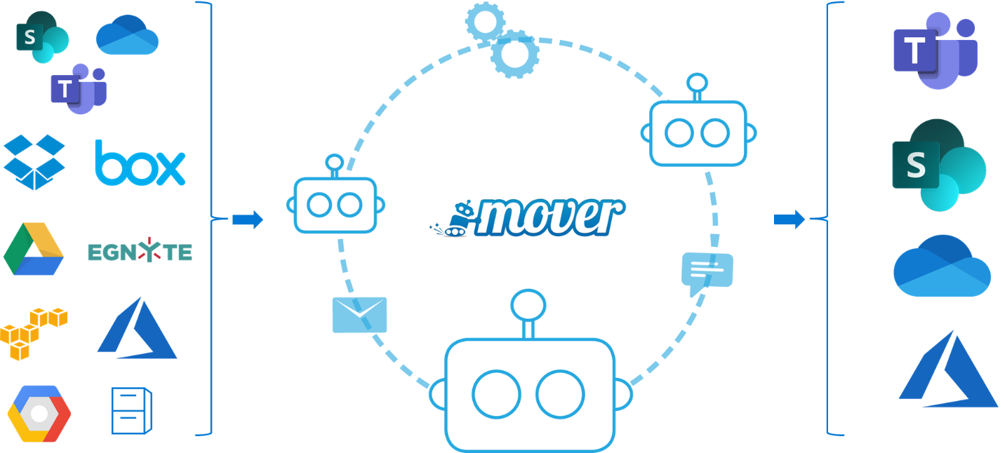

El resumen de las principales características de Mover (Para más
información, os recomiendo revisar la documentación oficial de Mover:
<https://docs.microsoft.com/en-us/sharepointmigration/mover-plan-migration>):

-   No se requiere instalación alguna (Nota: Salvo en el caso en el que
    migremos contenidos de un servidor de ficheros): Todas las tareas
    relativas a configurar y lanzar una migración se realizan desde el
    navegador).

-   Al igual que en el caso de la SPMT y de Migration Manager, podemos
    elegir entre realizar una migración simple o bien realizar una
    migración de tipo masivo.

-   Planificación y orquestación de migraciones a través de definir
    cuando se tienen que lanzar las tareas de migración de forma similar
    a como funciona Migration Manager.

-   Logging en tiempo real de la migración, lo que nos permite
    monitorizar como se va realizando la migración.

Configurar Mover para realizar una migración Cloud To Cloud no es una
tarea excesivamente compleja, aunque depende del origen y destino de
migración. Por ejemplo, para realizar una migración de contenidos desde
un Sitio de SharePoint en un tenant de Microsoft 365 a otro Sitio de
SharePoint en otro tenant (Tenant to Tenant migration):

-   Iniciamos sesión en Mover (https://mover.io) con nuestra cuenta de
    Microsoft 365.

-   Definiremos en primer lugar el conector al origen de información. En
    este caso concreto, tendremos que elegir el conector de Office 365 y
    además darle los permisos necesarios en Azure AD. Este punto de los
    permisos os llevará seguramente a cometer errores, ya que tendréis
    que acceder a Azure AD para darle consentimiento de administrador a
    la App Office 365 Mover.

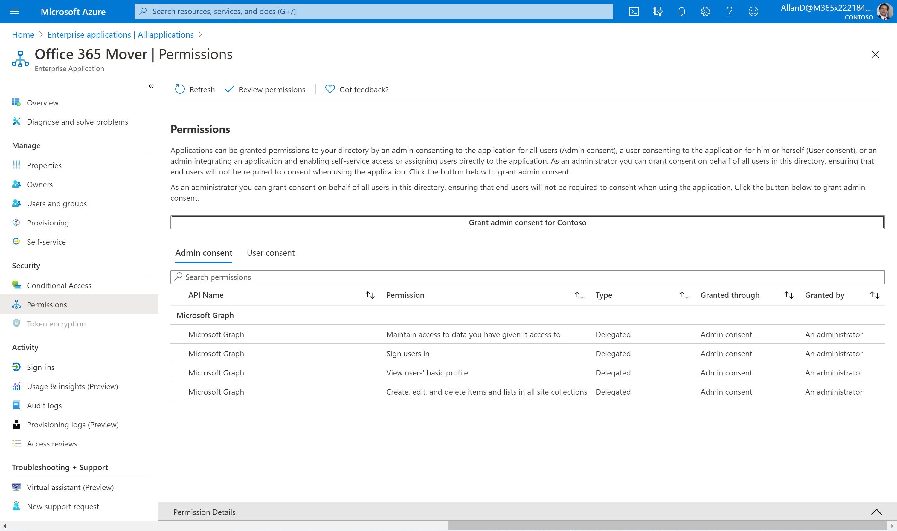

-   De la misma forma, definiremos el conector al destino de migración.
    De nuevo, elegiremos el conector de Office 365 y realizaremos el
    consentimiento de los permisos correspondientes.

-   Una vez que las conexiones están realizadas, podremos acceder al
    entorno de migración de Mover para crear tareas de migración:

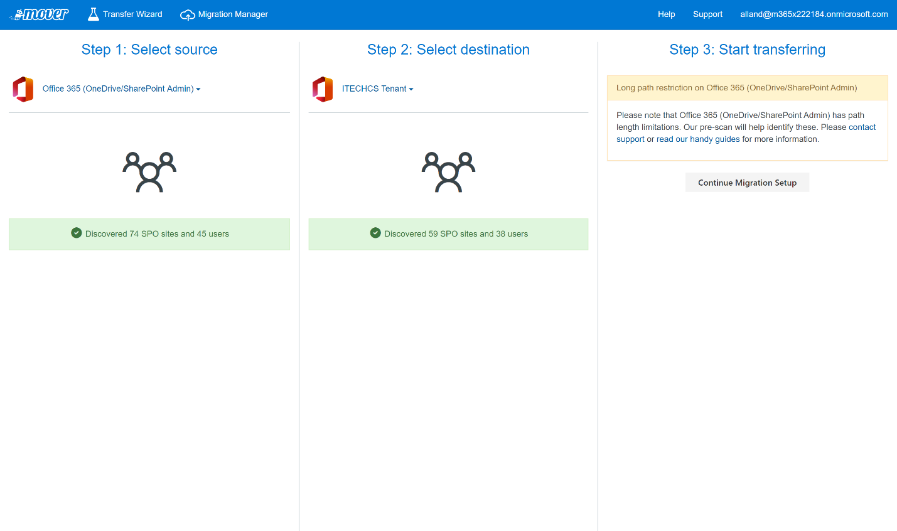

-   En el entorno de migración podremos:

    -   Visualizar tareas de migración previas en el caso en el que se
        haya configurado para el origen y destino definidos. Para cada
        tarea definida podremos ver los detalles de esta y acceder a los
        informes disponibles.

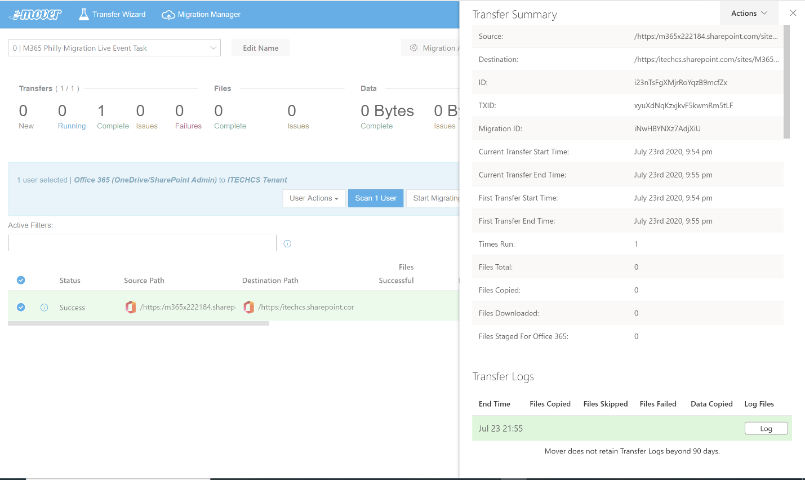

-   Crear nuevas tareas de migración. Para cada tarea de migración
    tendremos la posibilidad de definirla de forma manual o bien
    realizar un escaneo automático en el que Mover establece los mapeos
    entre estructuras de origen y de destino. Este escaneo automático
    tiene sentido cuando migramos por ejemplo los OneDrive For Business
    entre dos tenants y contamos con la correspondencia necesaria entre
    usuarios en origen y en destino.

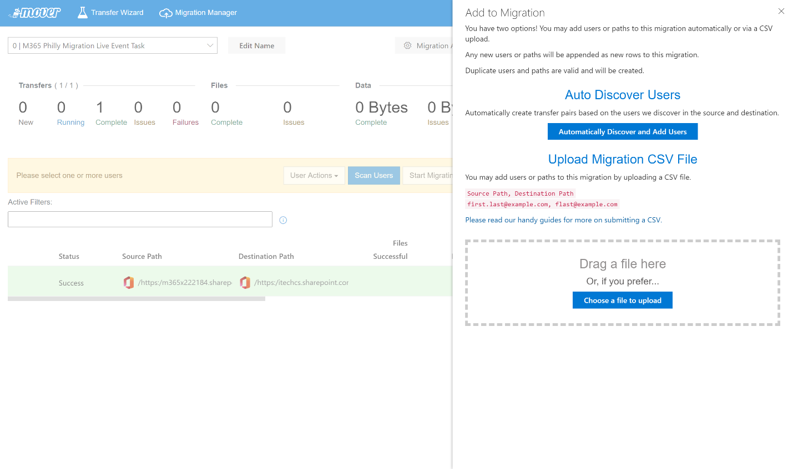

Además, dada una tarea de migración tendremos la posibilidad de tunearla
antes de comenzar la migración. Por ejemplo, podremos hacer un ajuste
fino de los contenidos de origen que vamos a migrar y también un ajuste
fino del destino concreto donde vamos a mover la información como por
ejemplo una carpeta concreta en la ruta de destino.

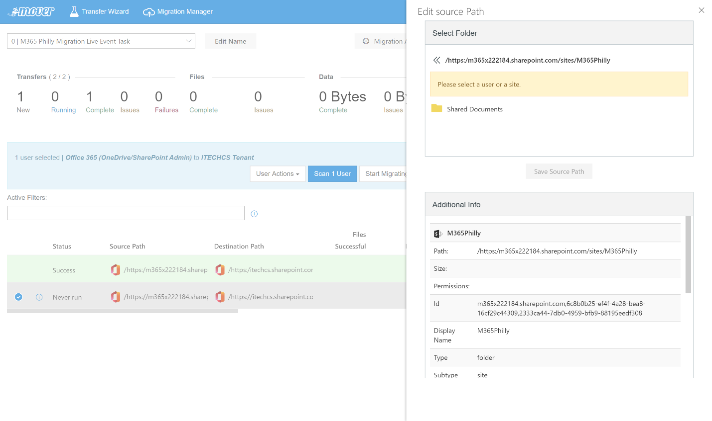

-   Lanzar la migración en el momento o bien planificar la misma:

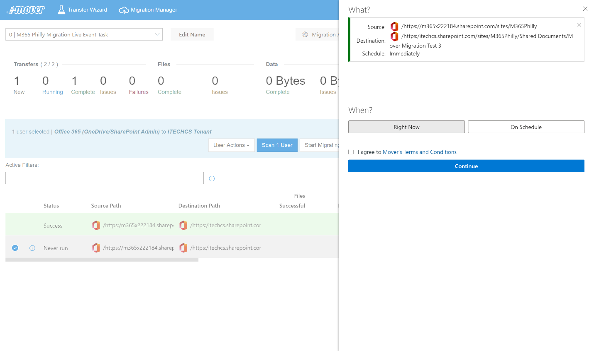

-   Acceder a reporting relativo a como se ha realizado la migración
    tanto en tiempo real como posteriormente descargando los
    correspondientes archivos csv.

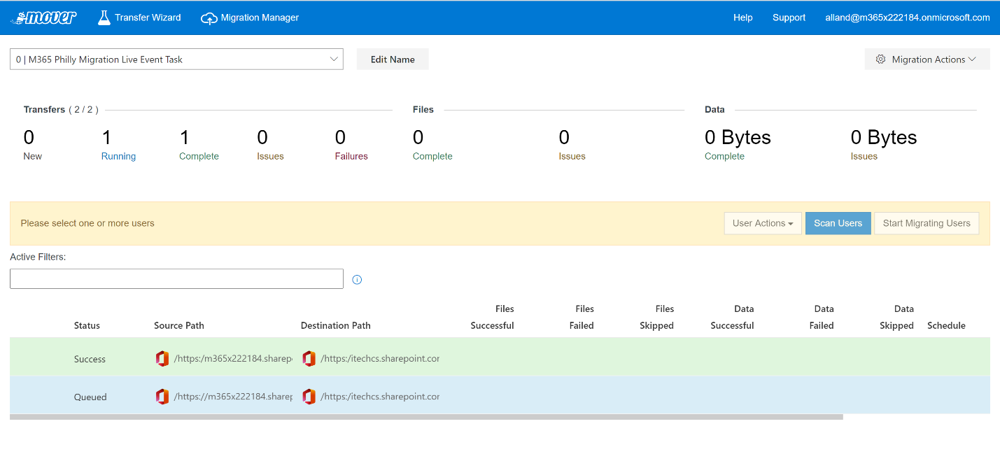

**Conclusiones**

A lo largo del artículo hemos revisado el juego de herramientas de
migración de Microsoft que habilitan escenarios simples o complejos de
migración sin coste adicional de licenciamiento, lo que permite acelerar
la migración de contenidos On-Premises y Cloud a SharePoint Online y
OneDrive For Business en Microsoft 365.

**Juan Carlos González**  
Office Apps & Services MVP | M365 SME  
@jcgm1978  