En este articulo hablaremos sobre esta nueva funcionalidad de la
plataforma Power BI, que nos abre las puertas al mundo de datos a nivel
Enterprise. Dicha funcionalidad nos permite separar nuestro modelo de
datos de la capa visual y de reportes, con lo que ganamos no solo en
prestaciones, sino en gobernabilidad y trabajo en equipo.

Desde hace un tiempo hay empresas que cuentan con modelos de datos, ya
sea en SSAS (SQL Server Analysis Services on Premises) o AAS (Azure
Analysis Services). Esta funcionalidad les permitirá trabajar con el
mismo formato, pero directamente desplegar sus modelos a Power BI.

**Conceptos**

Comencemos con conceptos básicos de nuestra plataforma Power BI. Por
ejemplo, cada vez que comenzamos a desarrollar un nuevo reporte en Power
BI Desktop, notamos al abrir nuestro administrador de tareas, que toda
sesión de Power BI Desktop maneja un motor tabular de SQL Analysis
Services como podemos ver a continuación:

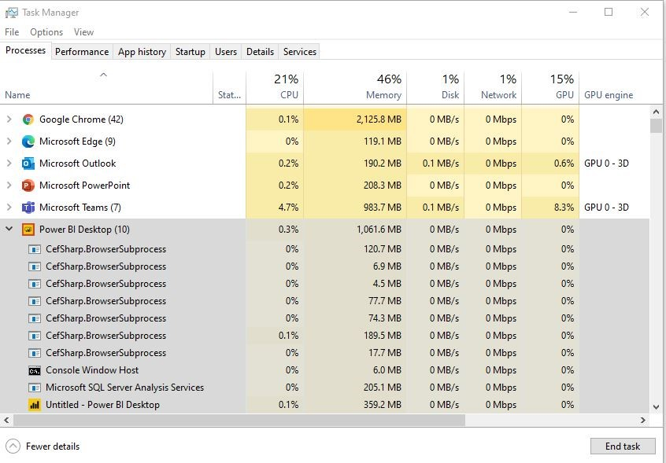

Por otro lado, cada vez que generamos un reporte en Power BI, y dado el
ciclo de vida de este, lo publicamos en nuestro Servicio de Power BI, a
través de este, y en un área de trabajo (workspace) se genera un nuevo
conjunto de datos (o dataset):

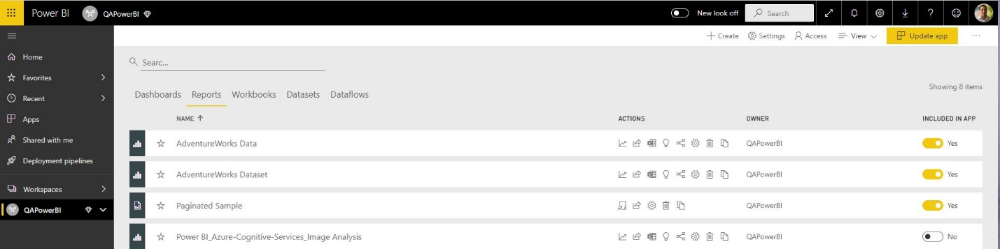

Al trabajar en equipo, una vez el equipo que publica el modelo de datos
al servicio de Power BI (lo que se divulga hoy en día como una buena
práctica) generar un dataset que puede ser promovido, y luego
certificado para que a nivel organizacional se identifique como una
fuente confiable de datos. De esta manera, el/los equipos que construyan
reportes comienzan su trabajo en Power BI obteniendo datos desde Power
BI Dataset (conjunto de datos) conectándose al modelo de datos
construido y certificado:

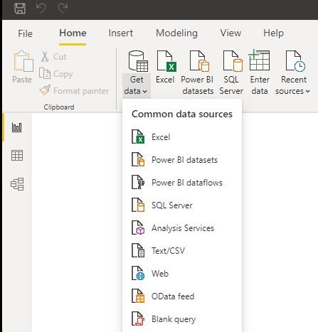

Por otro lado, y ahora ya centrándonos en el foco de nuestro articulo el
Administrador de Power BI puede habilitar a nivel de nuestro tenant la
capacidad de Escritura/Lectura sobre nuestros XMLA Endpoints como
podemos ver en la siguiente imagen en el Portal de Administración de
Power BI:

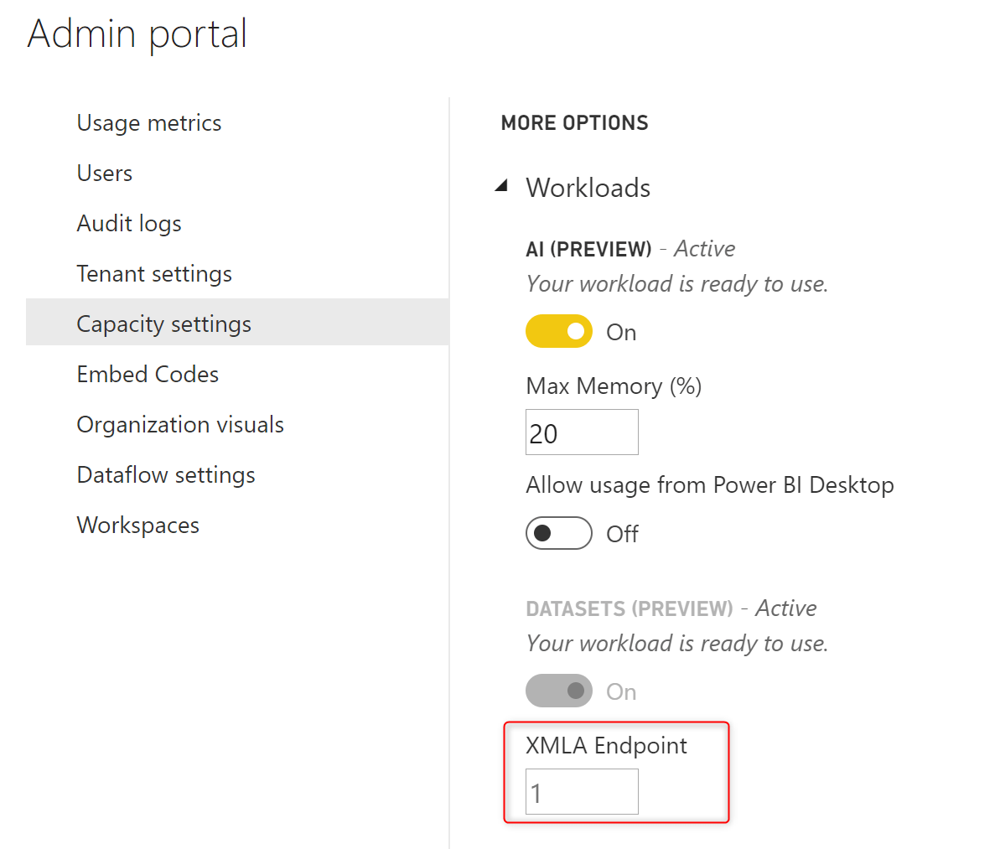

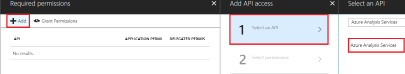

A su vez, cuando habilitamos esta funcionalidad sobre los XMLA Endpoints
podremos ver en cada Workspace (o área de trabajo) de Power BI la URL de
conexión a nuestro Endpoint que utilizaremos desde varias herramientas:

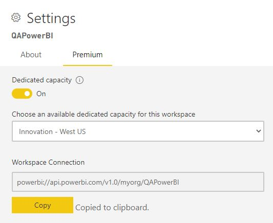

**Conexión a XMLA Endpoint desde SSMS (SQL Server Management Studio)**

Así como podemos conectarnos a motores de bases de datos en SSMS,
también podremos conectarnos a modelos semánticos (Analysis Services).
Anteriormente SSMS nos permitía conectarnos a SSAS/AAS, ahora también
podemos conectarnos a nuestros modelos de datos (dataset) publicados en
Power BI:

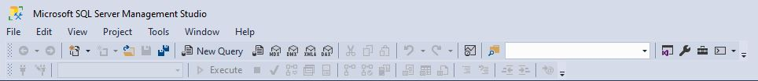

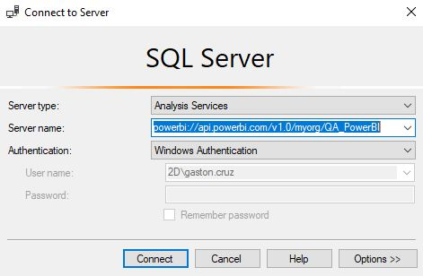

Una vez conectados podemos ver todos nuestros modelos datos, y
visualizar conexiones, tablas, particiones, roles.

También contamos con la capacidad de ejecutar consultas tanto en
lenguaje XMLA, como MDX. A continuación, podemos ver un ejemplo de una
DMV ejecutando una consultar para poder monitorear sesiones conectadas a
nuestro modelo semántico:

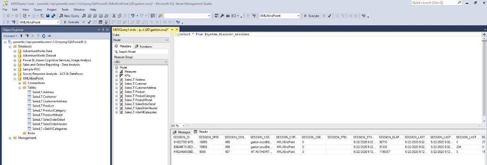

**Implementando Modelos con Visual Studio Data Tools**

Esta funcionalidad nos permite desarrollar modelos de datos a través de
SSDT (SQL Server Data Tools), lo que nos abre un abanico de opciones a
nivel Enterprise muy importante, como por ejemplo vincular nuestra
solución a un repositorio de código como Azure DevOps, y generar toda
una solución de automatización en materia de despliegues de nuestro
modelo a diferentes entornos.

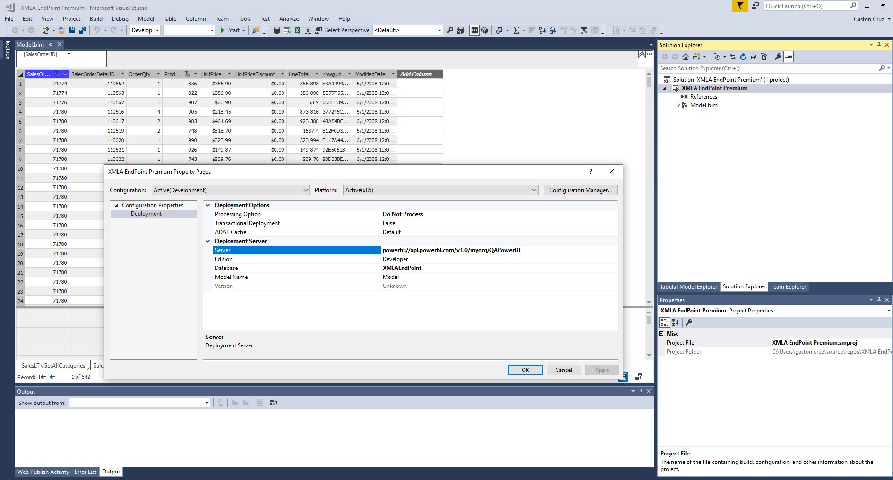

Como podemos ver en la imagen anterior, desde SSDT podemos indicar
nuestro endpoint (como servidor) y con esta opción nuestro despliegue
nos generara un conjunto de datos en dicho XMLA endpoint.

Una vez realizado el despliegue, podremos refrescar nuestro dataset, e
incluso aprovechar las capacidades de Power BI como agendamiento, como
también refrescos incrementales.

**Conclusión**

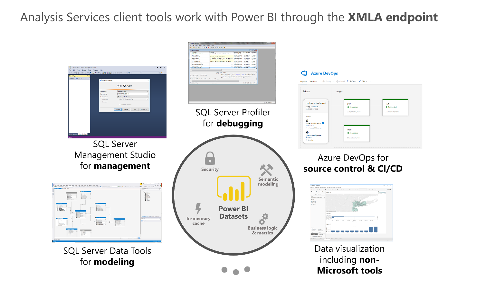

Con esta visión Power BI toma protagonismo
como herramienta de Plataforma de Datos para el manejo de Modelos
Semánticos lo cual nos permite entre otras ventajas: Conectarnos desde
SSMS (como vimos anteriormente), tener trazabilidad de consultas a
través de SQL Profiler, Desarrollo de Modelos en un equipo integrado de
trabajo a través de SSDT, contar con un repositorio de modelos, con
versionado, y automatización de procesos con Azure DevOps. Y, por
último, los modelos generados podrán ser utilizados desde múltiples
plataformas, y no solo desde Power BI

**Gastón Cruz**  
Data Platform MVP | Solution Principal en Slalom USA   
 
import LayoutNumber from '../../../components/layout-article'
export default LayoutNumber
